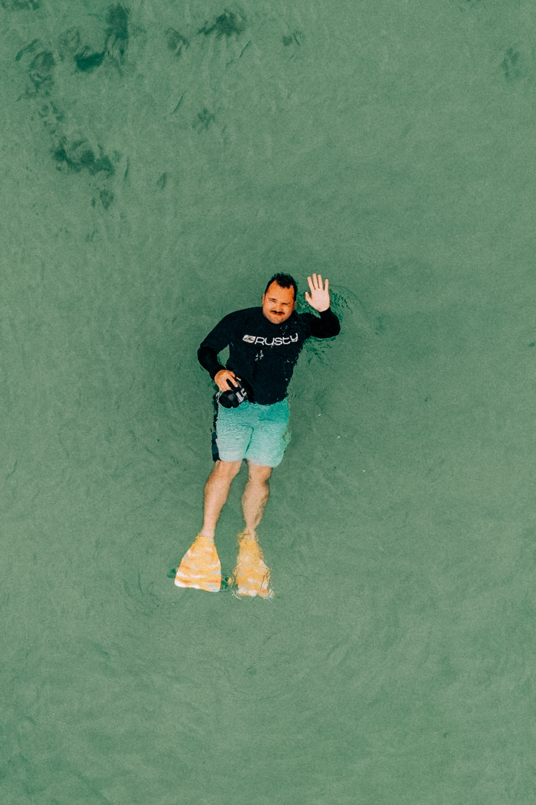


Hello.

Moi c’est Jeremy, passionné d’outdoor, de voyages et de belles images, basé à Lille. Je suis le co-fondateur de <a href="https://captainyvon.fr" target="blank">Captain Yvon Studio</a> & <a href="https://slowisbeautiful.cool" target="blank">Slow is Beautiful</a> et j’ai aussi un projet de couture de matériel outdoor / sacoches de vélo en parallèle appelé <a href="https://www.instagram.com/fieldpacks/" target="blank">FIELDPACKS</a>. Amoureux de la nature, de sport et d’histoires authentiques à documenter, vous me trouverez le plus souvent derrière mon appareil photo, argentique ou numérique, sur mon vélo, derrière ma machine à coudre ou parfois sous ma tente en bivouac.

Pendant plus de 10 ans, j'ai tenu le blog djisupertramp.com mais je ne me retrouvais plus dans ce pseudo, c'est donc début 2021 que j'ai décidé de le transférer dans sa version actuelle qui porte simplement mon nom. Ce site est mon espace personnel où je partage mes <a href="https://jeremyjanin.com/reflexions/">reflexions</a> mes <a href="https://jeremyjanin.com/aventures/">aventures</a>, mon expérience avec du <a href="https://jeremyjanin.com/materiel/">materiel photo / outdoor</a> et les <a href="https://jeremyjanin.com/MYOG/">mes activités MYOG (Make Your Own Gear)</a>.

→ <a href="mailto="hello@jeremyjanin.com">hello@jeremyjanin.com</a> 
→ Suivez-moi sur <a href="https://www.instagram.com/jeremy.janin/" target="blank">Instagram</a>, <a href="https://twitter.com/jeremyjanin" target="blank">Twitter</a>, <a href="https://piaille.fr/@jeremy" target="blank">Mastodon</a> et le <a href="https://jeremyjanin.com/posts/index.xml" target="blank">flux RSS</a> de ce blog. 
→ En savoir plus sur <a href="https://jeremyjanin.com/equipement/">mon équipement</a> 
→ Crédit photo : <a href="https://gregorymignard.com/" target="blank">Grégory Mignard</a>



hello2

    

Hello 3.

    
Moi c’est Jeremy, passionné d’outdoor, de voyages et de belles images, basé à Lille. Je suis le co-fondateur de <a href="https://captainyvon.fr" target="blank">Captain Yvon Studio</a> & <a href="https://slowisbeautiful.cool" target="blank">Slow is Beautiful</a> et j’ai aussi un projet de couture de matériel outdoor / sacoches de vélo en parallèle appelé <a href="https://www.instagram.com/fieldpacks/" target="blank">FIELDPACKS</a>. Amoureux de la nature, de sport et d’histoires authentiques à documenter, vous me trouverez le plus souvent derrière mon appareil photo, argentique ou numérique, sur mon vélo, derrière ma machine à coudre ou parfois sous ma tente en bivouac.

    
Pendant plus de 10 ans, j'ai tenu le blog djisupertramp.com mais je ne me retrouvais plus dans ce pseudo, c'est donc début 2021 que j'ai décidé de le transférer dans sa version actuelle qui porte simplement mon nom. Ce site est mon espace personnel où je partage mes <a href="https://jeremyjanin.com/reflexions/">reflexions</a> mes <a href="https://jeremyjanin.com/aventures/">aventures</a>, mon expérience avec du <a href="https://jeremyjanin.com/materiel/">materiel photo / outdoor</a> et les <a href="https://jeremyjanin.com/MYOG/">mes activités MYOG (Make Your Own Gear)</a>.

    
→ <a href="mailto="hello@jeremyjanin.com">hello@jeremyjanin.com</a> 
    → Suivez-moi sur <a href="https://www.instagram.com/jeremy.janin/" target="blank">Instagram</a>, <a href="https://twitter.com/jeremyjanin" target="blank">Twitter</a>, <a href="https://piaille.fr/@jeremy" target="blank">Mastodon</a> et le <a href="https://jeremyjanin.com/posts/index.xml" target="blank">flux RSS</a> de ce blog. 
    → En savoir plus sur <a href="https://jeremyjanin.com/equipement/">mon équipement</a> 
    → Crédit photo : <a href="https://gregorymignard.com/" target="blank">Grégory Mignard</a>

    

