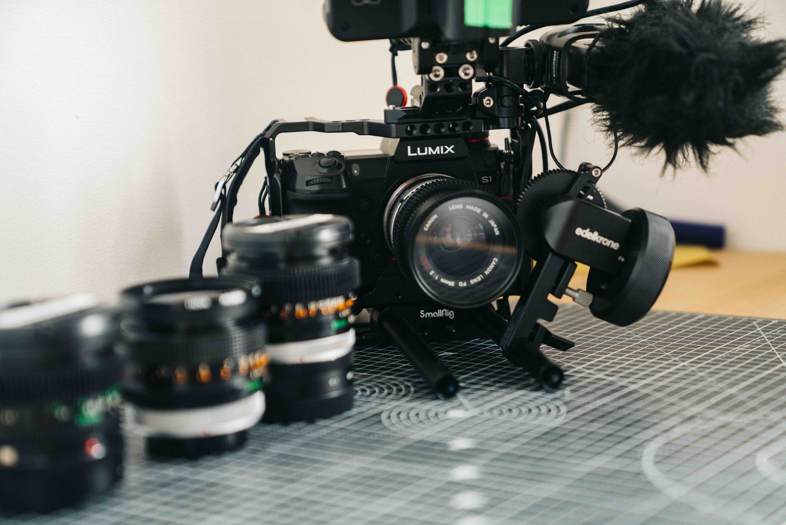
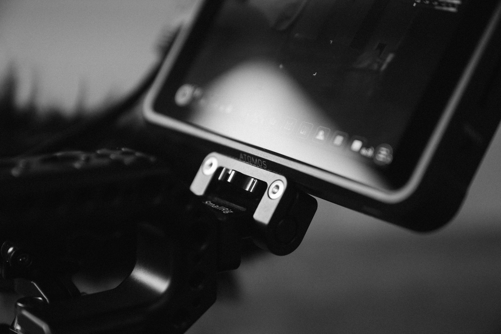
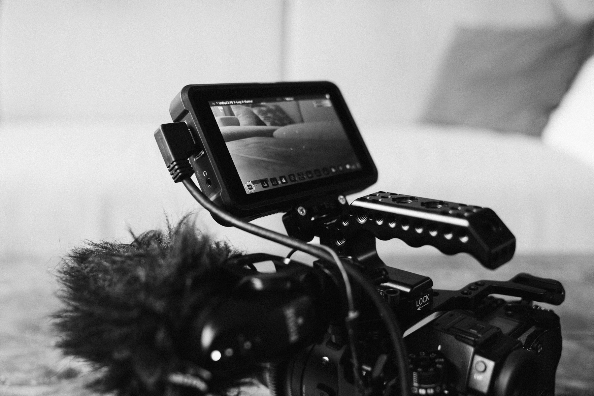
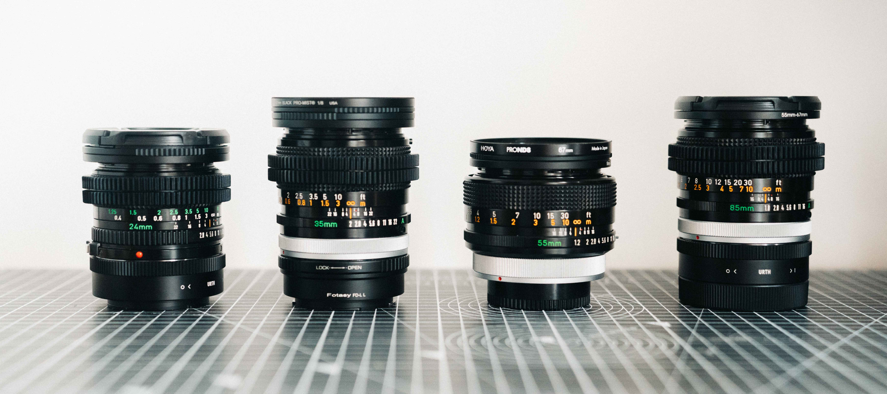
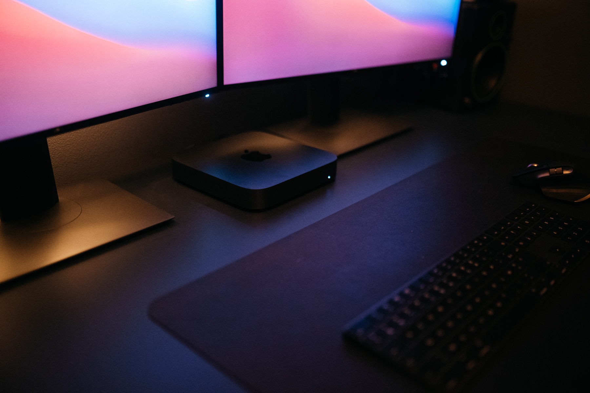
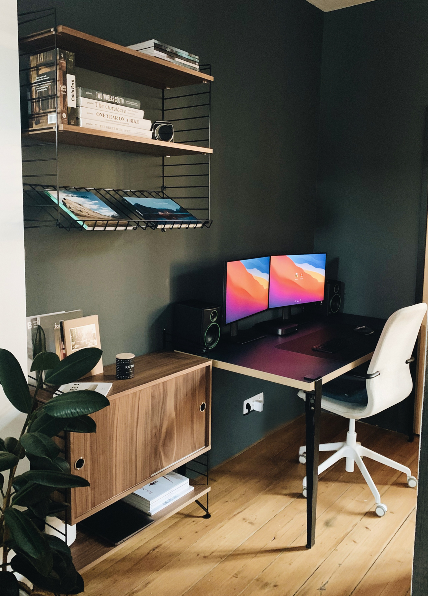

Voici mon matériel photo et vidéo, pour filmer mes projets [Captain Yvon](http://captainyvon.fr), comme mes projets perso. Du voyage, du documentaire comme de l'outdoor, c'est le setup qui me convient.

### MATERIEL VIDEO

Après 6 ans sur la gamme Sony Alpha, [j'ai quitté Sony pour le Panasonic S1,](http://jeremyjanin.com/matos-photo-video-pourquoi-jai-quitte-sony-pour-le-panasonic-s1/) et je n'ai aucun regret. Je n'ai jamais autant pris de plaisir qu'avec cette config lors de mes tournages. Certes le poids est non négligeable mais on l'oublie vite compte tenu de toutes les qualités que ce setup comporte. Au contraire, j'ai même volontairement alourdi ma rig avec une batterie v-mount et d'autres accessoires pour un rendu encore organique et naturel à main levée. C'est le setup que j'utilise pour toutes mes réalisation vidéos et qui m'a aussi suivi pour le tournage de notre documentaire Captain Yvon "IMMERSION, 7 vies inspirées par la mer"

Voici à quoi ma rig vidéo ressemble plus en détail :

- [Panasonic S1](https://www.digit-photo.com/PANASONIC-Lumix-S1-Boitier-Nu-rPANASONICDCS1EK.html?dpa_id=21) + mise à jour V-LOG
- [Cage Smallrig pour Panasonic S1](https://amzn.to/2SW4U6J)
- [Base plate Smallrig](https://amzn.to/3xNmzvY) + [tiges Smallrig](https://amzn.to/2UyMJEN)
- [Top handle Nitze](https://amzn.to/3d7PanZ)
- Follow Focus Edelkrone
- Moniteur [Atomos Shinobi](https://www.digit-photo.com/ATOMOS-Shinobi-Moniteur-5-4k-HDMI-HDR-rATOMOSATOMSHBH01.html?dpa_id=21) + batteries Sony NPF
- Batterie v-mount [Baxxtar Pro II V95 compact](https://amzn.to/3gNau4k)
- Support batterie [v-mount Tilta](https://amzn.to/3xOTuR9)
- 2x [Batteries Patona](https://www.digit-photo.com/PATONA-Batterie-Panasonic-DMW-BLJ31-rPATONA1319.html?dpa_id=21) pour Panasonic S1
- Cartes [CF Express B Integral Ultima 128Go](https://www.digit-photo.com/INTEGRAL-Carte-Cfexpress-Type-B-2-0-128Gb-1600-1700MB-s-rINTEGRALINCFE128.html?dpa_id=21)

**OBJECTIFS**

- [Sigma ART 35mm f/1.4](https://www.digit-photo.com/SIGMA-35mm-f-1-4-DG-HSM-Art-Monture-L-rSIGMA340969.html?dpa_id=21)
- Canon FD 24mm f/2.8
- Canon FD 35mm f/2 SSC
- Canon FD 50mm f/3.5 macro SSC
- Canon FD 55mm f/1.2 SSC
- Canon FD 85mm f/1.8 SSC

**FILTRES**

- [XUME Manfrotto](https://www.digit-photo.com/MANFROTTO-XUME-Adaptateur-pour-Objectif-a-Fixation-Rapide-67mm-rMANMFXLA67.html?dpa_id=21) pour aimanter ses filtres au lieu de les visser
- Filtres [ND8](https://www.digit-photo.com/HOYA-Filtre-Gris-Neutre-Pro-ND8-D67mm-rHOYAPROND867.html?dpa_id=21) et [ND64 HOYA PRO](https://www.digit-photo.com/HOYA-Filtre-Gris-Neutre-Pro-ND64-D67mm-rHOYAPROND6467.html?dpa_id=21)
- [Filtre Tiffen Black Pro Mist 1/8](https://amzn.to/2TRjAEi) [(lire mon test ici)](http://jeremyjanin.com/filtre-tiffen-black-pro-mist-lequel-choisir/)

**AUDIO**

- [Rode VideoMic Pro](http://amzn.to/2eUJUGG)
- [Rode NTG4+](https://amzn.to/2OscJi1)
- [Rode Blimp](https://amzn.to/3sRdm3s)
- [ZOOM H4N Pro](https://amzn.to/2OrgGTY)
- [ZOOM H1n](https://amzn.to/3c4TEdF)

**ACCESSOIRES**

- Sac photo [F-Stop Lotus](https://www.digit-photo.com/F-STOP-Sac-a-Dos-Lotus-32L-Anthracite-rFSTOPFSTM13570.html?dpa_id=21) + insert [F-Stop Medium Shallow ICU](https://www.digit-photo.com/F-STOP-Fourre-Tout-Insert-Shallow-Icu-Medium-rFSTOPFSTM226.html?dpa_id=21)
- [Zhiyun Weebill-S](https://amzn.to/2SNybfV)
- [DJI Mavic 2 Pro](http://amzn.to/2o7zV2G)

 

### ARGENTIQUE

**SUPER 8**
- Camera Super 8 Beaulieu 4008 ZMII
- [Kodak Vision 3 50D](https://www.digit-photo.com/KODAK-Film-Vision3-50D-8mm-pour-Camera-Super-8-rKODAKKS850D.html?dpa_id=21)

**ARGENTIQUE**
- Olympus XA - _compact 35mm de poche_
- Canon A1 - _35mm utilisé avec les objectifs cités dans la section vidéo au dessus_
- Fuji GW690III - _Moyen format 6x9_

**PELLICULES**
- [Kodak Portra 400](https://www.digit-photo.com/KODAK-Portra-400-135-36-Poses-X5-rKFILM386.html?dpa_id=21)
- [Kodak Portra 800](https://www.digit-photo.com/KODAK-Portra-800asa-135-36Poses-rFPNK1451855.html?dpa_id=21)
- [Kodak Ektar 100](https://www.digit-photo.com/KODAK-Ektar-100-Professionnel-135-36-poses-rKODAK1500277.html?dpa_id=21)
- [Kodak Tri-X 400](https://www.digit-photo.com/KODAK-Tri-X-Pan135-400asa-36-Poses-rFNBK3872728.html?dpa_id=21)
- [Kodak T-Max 400](https://www.digit-photo.com/KODAK-T-Max-135-400asa-36-Poses-rFNBK3841038.html?dpa_id=21)

Je fais développer mes photos chez [Mori Film Lab](https://morifilmlab.com/) à Bruxelles et ma super 8, chez [Color Films Archives](https://colorfilmsarchives.com/) en France.

### POST PRODUCTION

Là où je passe mon temps à éditer tous mes films. Bureau basé autour d'une config de Mac Mini pour le montage vidéo avec un eGPU et un setup à deux écrans. Pour en lire d'avantage à ce sujet, je vous invite à lire mon article détaillé ici.

