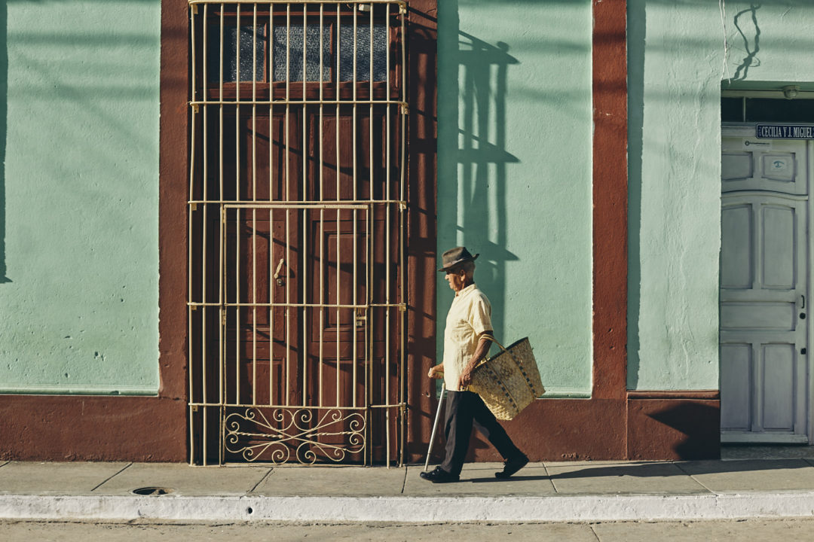
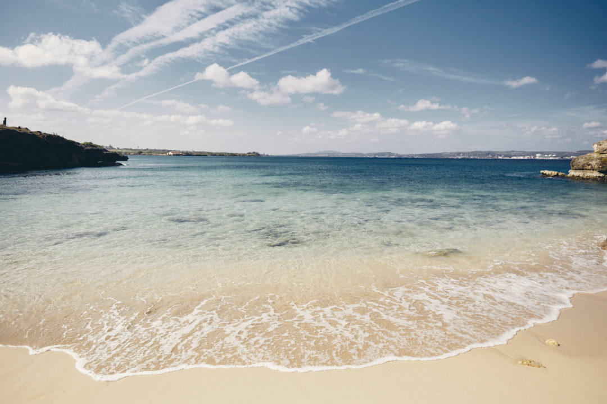

_Je rattrape enfin mon retard dans mes récits de voyage, cette fois c'est parti pour 1 semaine à [**Cuba**](http://jeremyjanin.com/vinales-le-paradis-cubain)._

La tempête fait rage à Montréal, le thermomètre flirte avec les -30°c et même si je savoure chaque instant de mon premier hiver canadien, je ne cracherais pas sur un petit peu de soleil. Et ça tombe bien; de la chaleur, on va aller en chercher. Nos bagages cabines sont plein à craquer, direction Cuba avec l'excuse du Nouvel An pour justifier notre départ.



3 mois plus tôt, en plein petit dej' dans notre colloc' Montréalaise, on s'est dit qu'un petit voyage tous les 3 au soleil pendant l'hiver ça serait pas mal quand même. Quitte à passer une année outre Atlantique, autant aussi en profiter pour découvrir de nouveaux endroits dans ce coin du monde. Sam et moi ne parlons pas un mot d'espagnol mais Mardjane, oui ! (Et ça, ça fera toute la différence.) On a réservé le vol le moins cher pour Varadero mais avions déjà en tête de ne pas rester dans cette station balnéaire. On voulait voir du pays. Seulement avec 1 semaine devant nous, on était lucides sur le fait qu'on ne verrait pas tout; on décide donc de se concentrer sur la moitié ouest de l'île. On a gardé nos bonnes habitudes : partir léger et ne pas trop s'encombrer, on regarde un peu sur internet en amont pour réserver des chambres dans des casas locales et hasta la vista. On voulait aller à la rencontre des cubains et à force de recherches sur internet, on comprendra très vite qu'il est facile de dormir chez l'habitant. C'est ce que nous ferons pendant une bonne partie de notre séjour. Moyennant quelques pesos en plus, ils cuisinent même pour nous et les échanges sont souvent inoubliables (en plus de leur donner un coup de pouce financier). Pour aller plus loin et découvrir Cuba hors des sentiers battus, l'agence [Puraventura](https://www.puraventura.fr/circuit/cuba) est spécialiste de voyages authentiques et responsables dans la région de Cuba, des Caraïbes et l'Amérique Centrale.

## \- B I E N V E N I D O S -

À peine l'avion posé, le décor est planté. On est comme dans un film : les photos de Fidel Castro un peu partout, les souvenirs à la gloire du _Che_, les champs de tabac, les vieilles voitures et les airs de musiques cubaines et des télés qui hurlent par les portes ouvertes sur la rue. _¡Bienvenidos a Cuba!_

La première journée est agréable, on se délecte de la chaleur à proximité de l'équateur. On interpelle une vielle Chevrolet des années 1950. _La Habana por favor._ Le moteur est chaud, la voiture est lancée, on taille la route à travers la campagne de la région de _Matanzas._ Le crucifix pendu au rétroviseur de cette vieille américaine, va et viens au gré des coups de volants de notre pilote du jour. Les kilomètres s'avalent et on s'assoupis quelques minutes, bercés par la monotonie de la route et la douceur de cette belle journée de Décembre. Je garde un oeil ouvert et ne manque pas notre arrêt après une demie heure de route; une bonne vieille histoire de corruption de la police locale. L'histoire est réglée en quelques mots et 2 billets échangés lors d'une tape amicale, main dans la main. Les vîtres grandes ouvertes on fonce à travers les paysages de l'ouest, Varadero dans le rétroviseur et les yeux rivés vers les montagnes de Vinales. En route, je fais comprendre au chauffeur de notre bolide d'un demi siècle que je souhaite qu'il nous dépose sur une plage non loin de la route pour quelques heures... J'avais prévu mon coup, j'avais une [**demande un peu spéciale**](http://jeremyjanin.com/from-cuba-with-love) à faire en cette date si importante. On troque vite les shorts pour les maillots et on pique notre première tête du séjour dans une eau couleur _50 shades of blue_.

## \- L A  H A V A N E -

La Havane nous accueille et déjà, on remonte de quelques dizaines d'années en arrière. Le temps s'est arrêté et on plonge tête baissée dans cette ambiance atypique. On passe de _calle_ en _calle,_ guidés par les airs latinos et les couleurs des façades dépravées. Le soir venu, on rejoint notre casa pour faire la rencontre de cette famille qui nous accueille pour la nuit, lui était médecin et nous contera sa fierté d'avoir pu rencontrer Fidel Castro. La photo argentique aux bords ratatinés témoignent de cette époque pas si lointaine et du culte que notre hôte, et bon nombre d'anciens de l'île vouent au dirigeant du gouvernement.

C'est ici que l'on mangera notre premier plat local "_moros y cristianos_" à base de riz et d'haricots noirs. Le ton est donné et il nous tarde d'aller nous balader, dès le lendemain.

On appréhende cette culture et ce mode de vie, on étrenne nos appareils photos et nos baskets dans les ruelles de La Havane. On ne sait plus où donner de la tête entre ces couleurs, ces odeurs et ces saveurs. On s'ébahit comme des gosses face à ces vieilles américaines rutilantes, ces façades hautes en couleurs; le charme opère dès les premières heures. C'est non sans surprise que notre première nuit à Cuba sera perturbée par l'explosion de plusieurs générateurs électriques, on comprendra plus facilement pourquoi le lendemain en voyant la qualité du système électrique de la ville. On avance au gré de nos envies et de notre inspiration, on passe tantôt d'un quartier très touristique à des quartiers plus populaires. Ces balades à travers la capitale nous montrent la réalité de la vie de ces cubains qui semblent passer une grande partie de leur vie dans la rue, autour d'un barbecue, les mains dans le moteur d'une voiture à réparer, une adossé au fauteuil du salon sorti en pleine rue, la télé qui hurle depuis l'intérieur de la casa. Le temps s'est arrêté.

Le coup de coeur est instantané lorsqu'on pose nos sacs dans la _Casa Melvis_ avec sa vue imprenable sur la vieille Habana. Je crois qu'on aurait pu facilement passer une semaine à Cuba, rien que dans cet appartement de part sa vue et sa situation géographique. On se balade aux quatre coins de la ville, de plaza en plaza, de monument en monument et surtout pour s'offrir un coucher de soleil de rêve depuis le _Malecon_. La proximité avec la mer, les couleurs des façades souvent délabrées et l'animation de la vie cubaine nous en mettent plein les yeux et nous font tomber un peu plus sous le charme de cet endroit unique.

 

## \- V I N A L E S -

Cette région montagneuse de l'ouest de l'île a été un énorme coup de coeur. On y a croisé peu de touristes lors de notre semaine à Cuba et vraiment pris plein les yeux entre les couleurs au coucher du soleil, le dépaysement total que nous offrait cette nature luxuriante entre champs de tabac, montagnes aux formes arrondies et végétation luxuriante. On décidait d'y faire un tour à cheval pour explorer les environs avec un guide, on passe dans les petites ruelles de Vinales avant de nous enfoncer dans la pampa locale au milieu d'un paysage somptueux et sous une chaleur écrasante. Je n'ai jamais été agile quand il est question de monter à cheval et cette fois-ci n'a pas dérogé à la règle, enjambant ma monture et déchirant mon pantalon à l'entrejambe d'un trou béant du genou gauche ou genou droit. (Je vous laisse imaginer le fou rire).

Vinales fut cette parenthèse de quelques jours de déconnexion totale à se sentir au bout du monde dans un endroit irréel. Je vous raconte notre [**coup de coeur pour Vinales**](http://jeremyjanin.com/vinales-le-paradis-cubain) déjà dans un article, n'hésitez pas à le lire si vous voulez en savoir plus.

 

## \- T R I N I D A D -

Trinidad est l'une des villes les plus touristiques de l'île et on comprend pourquoi tant ces couleurs, ces scènes de vie nous ont marqué. On aurait aimé un peu moins de touristes, mais finalement nous n'étions ni plus ni moins que trois touristes de plus. On a vraiment apprécié déambuler dans les rues pavées et colorées de Trinidad après un trajet en bus un peu chaotique. Je ne saurais recommandé plus un endroit qu'un autre, je vous recommande simplement de vous perdre dans les ruelles et de déambuler où bon vous semble, en rentrant dans les petites boutiques d'artisanat local, ou pour prendre un jugo de pina (jus d'ananas) et découvrir la vie qui se cache derrière ces portes et dans ces ruelles. Coup de coeur pour les cubains assis sur des chaises en pleine rue pour jouer aux dominos : un vrai moment marquant pour nous que de les voir autant passionnés et pris par le jeu. Sacré moment et fous rires avec ces trois joueurs. À Trinidad, les bâtiments sont hauts en couleurs et tout droits sortis de l'époque coloniale, impossible de ne pas craquer face au charme de cette petite ville.

En fin de journée, on a décidé de grimper sur les hauteurs de la ville, tout près d'une antenne pour apprécier la vue qui surplombe la ville entourée d'une nature sauvage, piquante et cactée. Une sacrée claque de là haut où il a fait bon prendre son temps et laisser les derniers rayons de soleil embraser la vallée avant de nous plonger dans la pénombre.

Trinidad est la dernière étape avant notre vol retour, une grosse frayeur financière (toujours voyager avec une MasterCard ET une Visa). La leçon est retenue Cuba, on ne nous y reprendra pas. La MasterCard était acceptée quasiment nulle part comparé à une Visa et ça a créé une situation plus que délicate un vendredi à Trinidad.

On savoure ces dernières heures sur l'île du Che pour piquer une dernière tête sur une petite plage à l'eau turquoise et à la plage de sable blanc, avant d'être pris en stop par une Bel Air décapotable jusqu'à l'aéroport. Clap de fin sur cette semaine à Cuba, une sacrée expérience, haute en couleur, plus belle que nous l'avions imaginé.

## \- I N F O S  P R A T I Q U E S -

**CUBA EN BREF**

**Aéroports principaux :** La Havane, Varadero

**Durée d'un vol Paris - La Havane** : 10h env.

**Visa / passeport :** un passeport valable 6 mois après la date de retour, et un visa de 30 jours est à demander au consulat de France à Paris ou en agence de voyages.

**Meilleure saison pour voyager à Cuba** : de novembre à mai, pendant la saison sèche, avec des températures autour de 25/30°c, et peu de précipitations.

**Quelle eau boire à Cuba ?** On trouve de l'eau dans les grandes villes mais je vous recommande de privilégier l'eau en bouteille, surtout dans les villages.

**Où manger à Cuba ?** Vous trouverez de nombreux restaurant et petits bouis bouis surtout dans les grandes villes comme La Havane ou les villes les plus touristiques comme Trinidad par exemple. Dans les plus petits villages, vous trouverez des petits restaurants ou a minima des supérettes pour vous ravitailler.

**MONNAIE**

Cuba possède deux monnaies : le **Peso Cubain** et le **CUC.** Le peso cubain (CUP) est uniquement utilisé par les cubains eux même, les CUC sont pour les touristes (vous verrez d'ailleurs des différences de tarif affiché).

1 CUC = 1,22€ env à l'heure où j'écris ces lignes (février 2018)

_Attention à ne pas confondre les prix locaux en CUP qui sont environ 24 fois moins chers que les prix en CUC._

Retirer de l'argent se fait relativement bien en ville en allant dans un hotel ou dans une banque locale (ou à l'aéroport) mais peut être plus compliqué dans des petits villages, donc pensez à anticiper vos frais pour avoir assez. Nous avons aussi souvent retirés dans les _Cadeca_ (casa de cambio / bureau de change).

**TRANSPORT**

Voyager en bus peut s'avérer un peu chaotique à Cuba, le système de réservation était relativement old school, en revanche c'est très peu cher et relativement fiable et sécurisé. La compagnie nationale s'appelle Viazul et d'après le site, on peut désormais réserver ces trajets en ligne : [viazul.com](https://www.viazul.com/index.php)

Nous avons aussi opter pour prendre un chauffeur de taxi sur place, les prix varient selon le trajet mais pensez à négocier votre tarif AVANT de monter dans le taxi pour éviter les mauvaises surprises à l'arrivée.

Pour trouver des taxis, je vous conseille de le faire proche d'une gare par exemple pour trouver d'autres voyageurs avec qui partager le taxi, ça vous fera en prime une belle rencontre.

**DORMIR CHEZ L'HABITANT À CUBA**

Pour ce voyage, nous avons opté pour dormir autant que possible en casa chez l'habitant. Depuis quelques années, les choses ont beaucoup bougé et c'est de plus en plus facile de trouver via AirBnb notamment ou via des sites dédiés comme [Casa Particular](http://www.casaparticular.com) par exemple. Vous pouvez aussi tout faire sur place. Ce sigle au dessus d'une porte d'entrée signifie qu'ils hébergent des voyageurs, vous n'avez alors qu'à frapper à la porte.

**CASA EL ALMENDRO (Vinales)**

_Notre coup de coeur en terme de rencontre reste chez Maritza à Vinales à la [Casa El Almendro](https://www.airbnb.fr/rooms/21446105). Une femme adorable et le coeur sur la main. Je sais que vous êtes plusieurs à avoir lu mes articles et vous y être rendus depuis et tous les échos ont été très positifs. Comptez 18€ par nuit pour 3 voyageurs. (C'est le même tarif que vous soyez 1 ou 3 personnes)._

_N'hésitez pas à y aller de ma part, je sais qu'elle se souvient de nous :)_

**CASA MELVIS (La Havane)**

_Pas vraiment chez l'habitant, la [Casa Melvis](https://www.airbnb.fr/rooms/5837101) à La Havane s'apparente plus comme un AirBnb, le tarif est d'ailleurs plus cher mais vous êtes aussi au coeur de la Havane, mais la vue et le confort furent une excellente surprise. On y retournerait les yeux fermer (ne prenez pas peur en arrivant au pied de l'immeuble qui paraissaitt délabré quand nous y étions.). Comptez 50€ par nuit. Notez, qu'il y-a clairement moins cher, vous trouverez des casas pour moins de 30€ par nuit, on s'est juste fait plaisir sur cette nuitée là._

J'ai sûrement oublié certaines choses dans mes recommandations, n'hésitez pas à les partager dans les commentaires si vous avez d'autres conseils pour voyager à Cuba pour que d'autres voyageurs puissent en bénéficier.

MUCHAS GRACIAS CUBA!

🇨🇺

**\- POUR CONTINUER LE VOYAGE A CUBA -**

**FROM CUBA WITH LOVE**

_[Lire l'article](http://jeremyjanin.com/from-cuba-with-love)_

**VINALES, LE PARADIS CUBAIN**

_[Lire l'article](http://jeremyjanin.com/vinales-le-paradis-cubain)_

**NOTRE VOYAGE A CUBA VU PAR SAMANTHA**

_[Voir les articles sur son blog](http://paris-tu-paris.fr/category/vagabonde/cuba/)_
