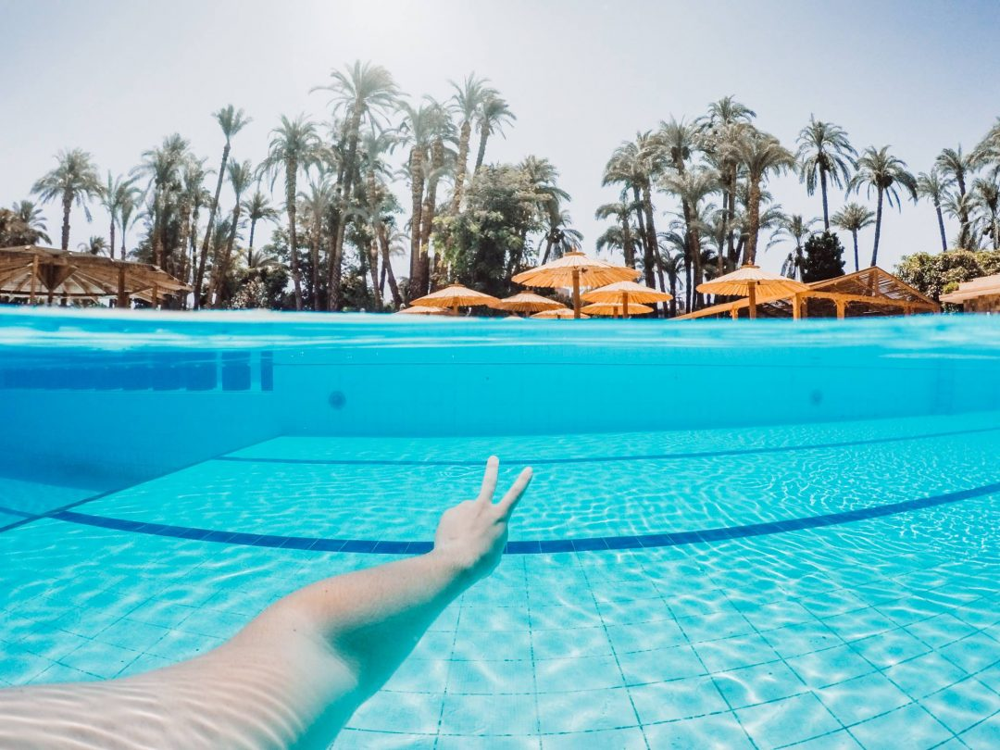
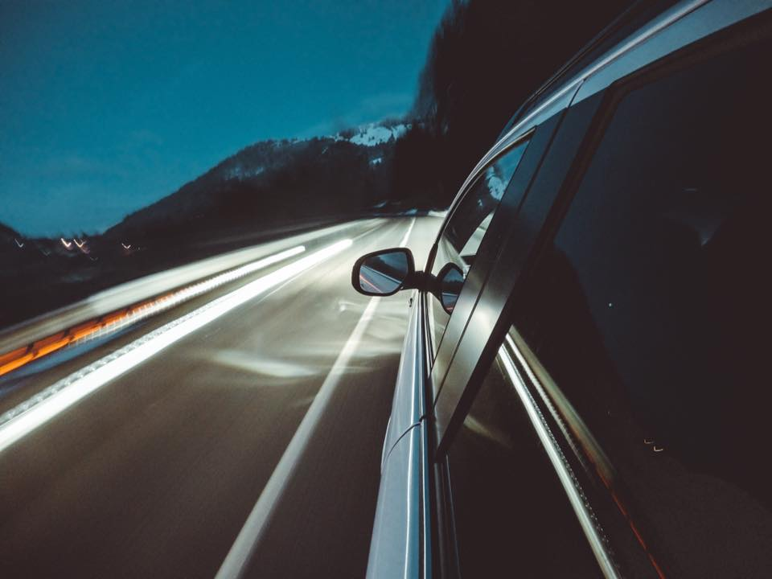
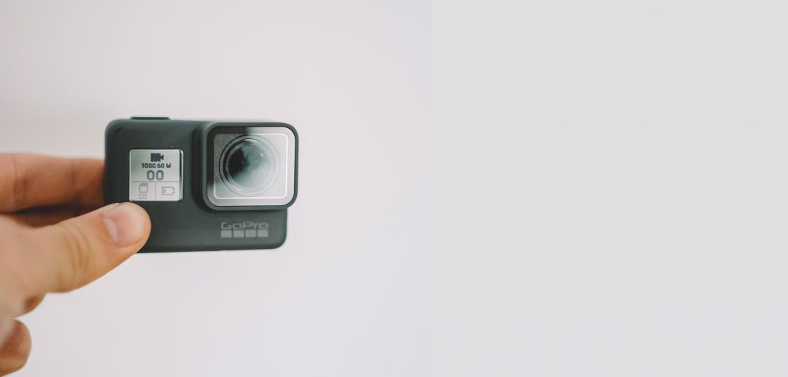

10 conseils pour filmer avec une GoPro, même si vous débutez. Le discours de **GoPro** au lancement de leur première caméra était "Be a hero", ce slogan affiché aux 4 coins de la planète et d'internet a peut-être su vous conquérir. On est pas toujours plusieurs lors d'une sortie surf, vtt, ski... ou même d'un voyage mais ça serait dommage de ne pas utiliser votre camera pour rapporter quelques images de cette sortie ou de ce voyage. L'angle de view est de 170°, le fish-eye fonctionne très bien, et on peut quasiment toujours entrer dans le cadre. Tout est simple d'utilisation, avec 2 boutons et un écran tactile on arrive à changer de mode, peaufiner quelques réglages et déclencher et tout ça prend une fraction de secondes... en revanche tout n'est pas aussi simple. Voici 10 astuces que l'on ne voit pas de prime à bord et qui pourtant font la différence au moment de tourner et monter votre vidéo.

# **10 conseils pour filmer avec une GoPro... Prêt ? Action !**

**1 - Chargez vos batteries et emmenez-en de rechanges !** C'est bête mais partez avec des [batteries de rechange](https://amzn.to/3y3TNYq) (surtout l'hiver, le froid fait perdre de l'autonomie à vos batteries et quand vous skiez, au lieu de les laisser dans le sac à dos, mettez les plutot dans la poche intérieur de votre veste pour que la chaleur de votre corps (humm!) les tiennent à température (presque) ambiante). N'oubliez pas de prévoir une carte mémoire assez grande, préférez une carte [Micro SD SanDisk 64Go](https://amzn.to/3jpE69W) comme celle là, qui est la référence pour les GoPro. Optez pour deux cartes de 64Go plutôt qu'une de [128Go](https://amzn.to/36dRDcV). Si vous perdez les images d'une carte, il vous reste au moins l'autre carte et son contenu, comparé à tout perdre d'un coup sur une seule et même carte.

**2 - Adieu la buée dans le caisson étanche de la GoPro !**

Sur la plage par exemple lorsque le soleil vous tape sur le front pour vous tatouer d'une belle teinte rouge pour les 2 semaines qui suivent, il tape aussi sur votre caisson. Sauf que la chaleur et l'humidité, ça créé de la condensation et elle s'incruste dans votre [**caisson étanche de GoPro**](https://amzn.to/2HNSF51) si vous en utilisez un. Vous pouvez opter pour des inserts anti-buée pas chers [**comme ceux-ci**](https://amzn.to/2HNTevF) pour empêcher la condensation de s'installer.

**3- Remplir le cadre**

Avec un angle de vue de 170°, la [**GoPro**](https://amzn.to/2HTte2b) a l'énorme avantage d'écarter les murs dans les endroits les plus étriqués. Néanmoins, je suis sûr qu'il vous est déjà arrivé de vous dire "Pourquoi on ne peut pas zoomer ?" quand vous suivez l'un de vos amis sur une piste de ski ou en vtt par exemple. Le moindre plan où le sujet est un peu trop éloigné de la camera rend le rush presque obsolète, la leçon à retenir, c'est de TOUJOURS remplir le cadre.

Il faut toujours être à quelques centimètres du sujet, ça prend un peu de temps de s'habituer à skier sur les talons de votre compagnon de sortie, de lui courir après en lui marchant sur les chaussures, mais vraiment c'est très important. Si on ne remplit le cadre avec le sujet, l'image devient ennuyante à regarder car rien ne se détache vraiment et surtout vous ne mettez pas en valeur votre héro puisqu'il est noyé au coeur de la scène. On prend vite le coup de main, c'est une affaire de confiance, mais quand vous décidez de filmer avec une GoPro : collez-vous.

**4 - Stabiliser les plans**

Que vous soyez en voyage, au ski, en vtt, en skate ou n'importe où, vous aurez a priori toujours la possibilité d'avoir un sac avec vous (ou un ami pour porter). Profitez en pour glisser un mini-trépied comme ce Gorillapod pour GoPro dans ce sac, il vous sauvera la mise plus d'une fois. Il ne tient pas beaucoup de place, ne pèse pas lourd et se pose à peu près partout : pour un timelapse, dans un virage de la piste de ski ou encore en haut de la bosse que vous allez sauter (si, si !).

Les GoPro les plus récentes sont dotées d'une stabilisation électronique interne qui permet d'annuler les micro-tremblements et le rendu est bluffant sur la [HERO9](https://amzn.to/3ds6ap4) ou la [HERO8](https://amzn.to/3jnjzCP). Depuis la [**HERO7 Black,**](https://amzn.to/2HTte2b) les caméras GoPro embarquent une stabilisation bluffante appelée HyperSmooth digne d'un vrai stabilisateur motorisé comme le [**GoPro Karma Grip**](https://amzn.to/2OxPb7e) ou le [**Feiyu G6**](https://amzn.to/2CKwWqi). Les [**HERO5**](https://amzn.to/2HO6Nvg) et [**HERO6**](https://amzn.to/2OBo8aZ) sont elles aussi stabilisées mais un peu moins bluffantes que la HERO7 et suivantes.

**5 - Toujours garder la lentille propre !**

C'est une habitude à prendre : TOUJOURS nettoyer votre lentille. Elle parait propre et vous filmez toute la journée et puis le soir vous regardez vos rushes et là vous vous rendez compte qu'une poussière et une trace de doigt ont ruiné tous vos clips de la journée. Oui ça énerve. Pour éviter ça, pensez à nettoyer avec un chiffon doux la lentille extérieure du caisson étanche. Pensez dans la journée à la sortir du boîtier pour nettoyer la lentille en verre directement sur le boitier, et n'oubliez pas de nettoyer l'intérieur de la lentille plastique du caisson. Surtout ne les frottez jamais contre vos gants ou vos vêtements : ils créent des micro rayures.

Ce conseil est d'autant plus valable dans l'eau car les gouttes ont tendance à stagner sur l'objectif. Un conseil dans l'eau : léchez la lentille plastique (ok c'est pas glamour, mais tant pis) au moins votre photo ne sera pas ruinée par une goutte qui floutte votre image.

Si vous rayez la lentille, sachez qu'on peut remplacer la [**lentille d'une GoPro**](https://amzn.to/2HNBlxa) très simplement donc votre GoPro n'est pas foutue en cas de rayure.

**6 - Varier les points de vues !**

Une vidéo de 5 minutes avec la camera toujours fixée sur le casque ou au guidon, qu'on se le dise : c'est long ! Variez les angles de vues, dépliez, étendez, tournez, levez, baissez... ! Faites quelques plans fixés sur le casque, puis fixez là sur le harnais pour donner un angle différent, puis attachez là au bout d'une perche. Fixez un "pad" autocollant sur votre spatule de ski, attachez là à votre poignet ou à votre chaussure de ski avec [**The Strap**](http://amzn.to/2hjeacg), sur votre bâton, sur le cadre de votre vélo, sur la tige de selle avec [**la fixation tube**](https://amzn.to/2Un8oha), sur votre sac à dos...  Il y-a aussi la fameuse perche comme le [**3-way**](http://amzn.to/2imfMU6) ce type de perche c'est que vous pouvez vous filmer vous même en faisant pointer la camera vers vous, mais si vous la retournez, vous pourrez filmer vos amis, la tenir à l'envers pour qu'elle vous filme de derrière, l'utiliser pour des mouvements verticaux.

Ma fixation GoPro préférée est le [**Mouth Mount**](https://amzn.to/2HKH6M5) qui permet de tenir la GoPro avec la bouche pour capturer un angle très immersif à la première personne.

En plus de la perche, il y a le **[harnais](https://amzn.to/2CVg9RR)** pour capturer des images immersives entre vos bras pour toutes les activités où vous ne pouvez pas avoir les mains libres. Pensez aussi à la fixation GoPro **[360 pour les timelapses](http://amzn.to/2hjf3S8)**, les gyro mount à 360 à fixer sur le casque ... A vous d'innover maintenant :)

**7 - Réfléchir à une histoire**

Pas besoin d'inventer le prochain carton du box office, mais un film qui raconte une histoire, c'est toujours mieux ! Vous partez en voyage ? L'histoire ça peut tout simplement être "moi en Italie", mais écrivez-le ou au moins, refléchissez-y. Comme ça on se dit "oui ça coule de source, je pars en Italie, donc forcément l'histoire c'est moi en Italie" Oui, mais non. Si vous vous mettez en tête que vous voulez montrer ce que vous aurez vécu pendant ce voyage en Italie, vous pourrez aussi réfléchir à quelques idées de plans. Vous en train de planter votre cuillère dans le meilleur tiramisu du monde, filmer le hublot au dessus de l'aile de l'avion, mais aussi vous à vélo dans les rues de Rome avec la GoPro fixée sur le guidon, ou alors sur la proue de la gondole à Venise... les possibilités sont infinies. Et si vous alliez plus loin que "mon week-end à Rome" ? Pourquoi ne pas décider d'avance d'une thématique à reprendre pendant votre périple : Rome en slow-motion, Venise filmée à la première personne (GoPro sur le front, avec un point de vue subjectif), ou encore plus loin sur une thématique particulière : gastronomie, vos pieds, etc... la seule limite c'est votre créativité : lâchez-vous !



_(Voici l'une de mes dernières vidéos à la GoPro lors d'un roadtrip en Vespa au Portugal.)_

**8 - Choisir le style de musique**

Si possible essayez d'avoir plus ou moins en tête, le rythme que vous voudrez donner à votre vidéo. Une film où vous sautez des passerelles de 4m cet été aux Gets, je pense que vous pouvez ranger tout de suite Angus et Julia Stone. Plus sérieusement, cernez au moins si le rythme de la chanson sera rapide ou lent. Si vous prenez une musique plus électro et donc rythmée vous aurez besoin de varier très souvent vos plans pour ne pas créer d'ennui, contrairement à une musique plus lente sur lequel vous pouvez prendre le parti de mettre beaucoup de slow motion par exemple. Tout dépend de ce que vous filmerez, mais je pars toujours avec dans l'idée de monter une vidéo très rythmée pour tourner énormément de rushes et de transitions et même si finalement je monte une vidéo sur une musique douce, ils pourront toujours servir ça et là. Tout dépend de ce que vous filmez. Pour vos musiques je vous conseille soit la librairie de musiques YouTube dont certaines chansons sont libres de droit sinon, vous pouvez utiliser la [**plateforme Artlist**](https://artlist.io/artlist-70446/?artlist_aid=CaptainYvon_315&utm_source=affiliate_p&utm_medium=CaptainYvon_315&utm_campaign=CaptainYvon_315), que j'utilise pour toutes mes vidéos.

**9 - Penser aux transitions**

Plutôt que systématiquement couper les rushes sans forcément donner une vraie fluidité à votre montage, réfléchissez à des transitions en aval. Terminez vos rushes en "tapant" avec votre main sur l'objectif, ou alors donnez une "claque" à la gopro pour la faire tourner, terminez la séquence dans le t-shirt de votre ami et commencez la suivante depuis le sac à dos de votre copine, en étant très près de ces sujets, l'image sera complètement noire et au montage vous n'aurez qu'à mettre les 2 bout à bout et les séquences s'enchaineront de manière beaucoup plus fluides.

**10 - Enfin : shootez, shootez et shootez toujours plus.**

En plus de varier les plans, shootez beaucoup, beaucoup de rushes, plus vous en aurez, plus vous pourrez être intransigeant au moment du dé-rushage et plus vous pourrez avoir de la liberté au montage. Lors de ma dernière sortie ski, j'ai rapporté 48Go de rushes vidéos pour au final une vidéo qui va durer 2 minutes, mais au moins j'ai pu sélectionner ceux que je voulais (et encore je n'ai pas exactement ce que je souhaitais faire).

Enfin, pensez à bien vous entrainer chez vous avant le départ, même si le sujet n'est pas interessant, vous apprendrez beaucoup sur telle ou telle fixation si vous la testez quelques minutes chez vous et regardez vos rush dans la foulée, c'est comme ça que vous verrez si oui ou non vous avez assez déplié la perche pour avoir le recul que vous souhaitez, de voir si la GoPro n'est pas trop basse et qu'on ne vous voit plus la tête...

Ca fait beaucoup ? Oui complètement, mais avec le temps ça vient et surtout : pensez à vous amusez avant tout, ça reste le plus important ! Je vous invite aussi à lire mes articles pour [**prendre en main votre GoPro**](http://jeremyjanin.com/comment-regler-et-utiliser-la-gopro-hero5) et pour [**choisir les bons modes et paramètres pour filmer avec une GoPro**](http://jeremyjanin.com/gopro-choisir-les-bons-modes-et-parametres-pour-filmer-slow-motion-protune/) !
