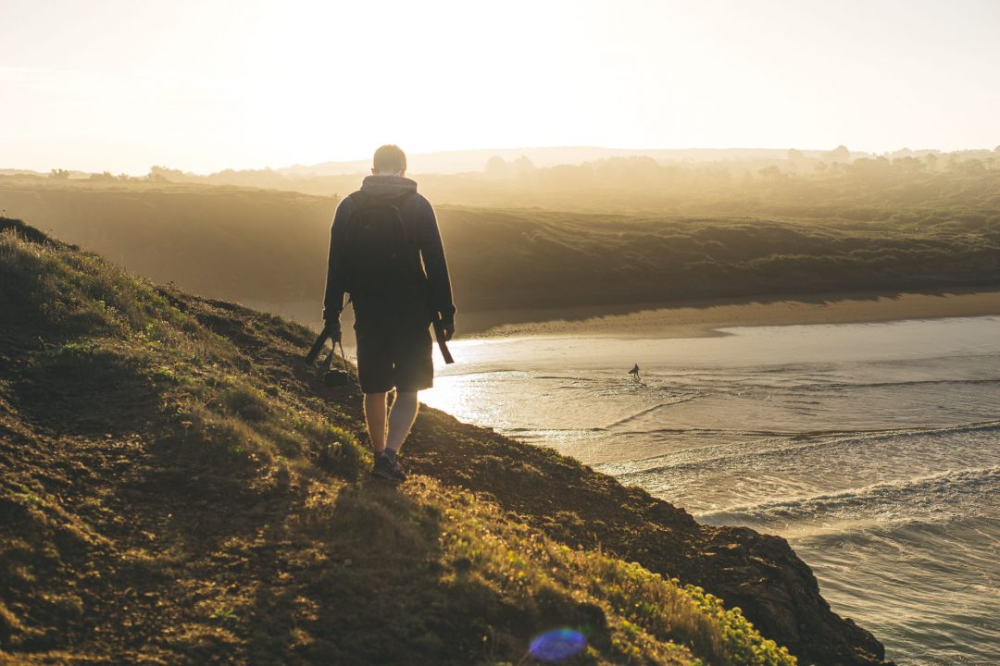
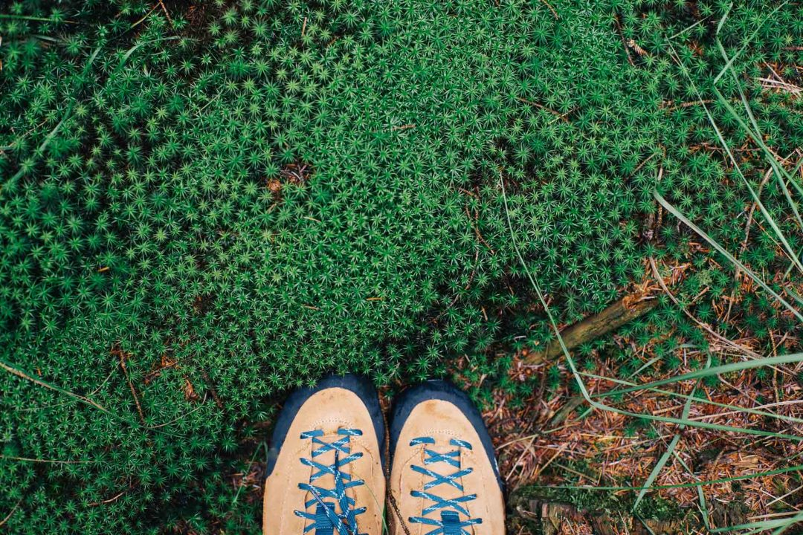

Il y-a quelques semaines, je suis parti du côté de Brest chez mes amis [Gregory](http://gregorymignard.com) et Marion pour une semaine à découvrir la Bretagne. J'avais reçu mon nouveau boitier peu de temps avant et c'était l'occasion aussi de le tester vraiment pendant une semaine intense. Cette semaine c'était l'occasion de les retrouver alors que nous ne nous étions pas revu depuis mon retour du Canada mais aussi de partir chaque jour quand j'avais fini ma journée de travail pour explorer la région bretonne.

    

Avec Greg, on partage la même vision de l'aventure, la même passion pour l'image et l'outdoor. On a essayé d'en parler via feu Captain Yvon, mais finalement, on se retrouve plus dans le partage pur, des retrouvailles pour vivre des micro-aventures brutes, sauvages. Profiter des plaisirs oubliés de se lever au petit matin et profiter d'une nature vierge de toute âme, voir les premiers rayons du soleil brosser les herbes jaunes de la côte sauvage de la presqu'île de Crozon, escalader des blocs pour découvrir un point de vue au dessus de Brest et tout simplement partir explorer sans carte, appareils photos en main et trouver une cabane abandonnée au détour d'une route, s'enfoncer dans des marécages, profiter pour découvrir ou redécouvrir des paysages de chez nous, parfois inconnus, parfois devenu quotidien mais qu'il est toujours bon de voir à travers le regard de quelqu'un d'autres.

                

Alors pendant cette semaine bretonne, on a embarqué nos boitiers, le drone et quelques GoPro pour filmer et faire des photos. On a crapahuté sur les chemins côtiers, on a crié de joie à la vue de la voie lactée ce soir de nuit claire sur la côte, on s'est assis à flan de falaise les pieds dans le vide et surtout, on a déconnecté. Partagé des purs moments simples, bruts, entre passionnés, comme des bons amis.

Chère Bretagne, tu es magnifique. Merci pour le spectacle.

Suivez-nous aussi sur Instagram pour plus d'aventure : [**@gregmignard**](http://instagram.com/gregmignard) et [**@jeremy.janin**](http://instagram.com/jeremy.janin)
