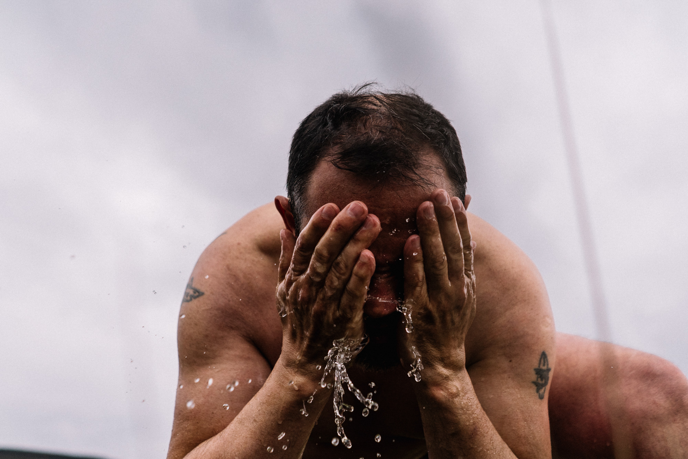
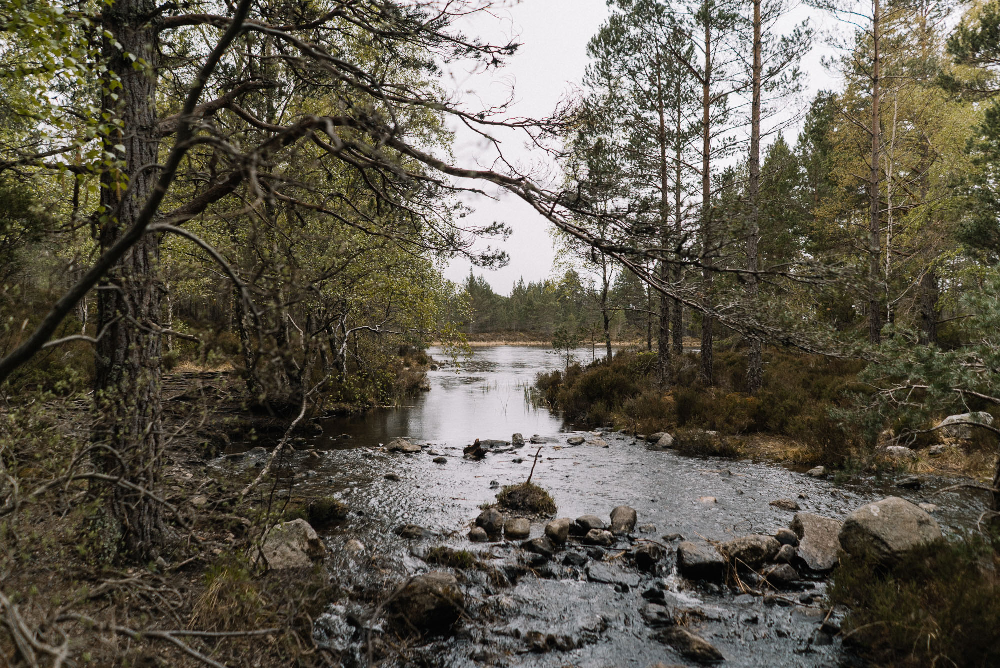

Plus tôt cette année, je suis parti pour une aventure très spéciale : 5 jours de bikepacking fatbike en Écosse avec mon père. L'idée avait germé quelques mois plus tôt comme idée de cadeau pour célébrer son anniversaire. Quelques mois, un paquet d'heures au téléphone et de recherches sur internet plus tard, ça y-est le jour J était enfin arrivé. On s'est retrouvé à l'aéroport direction Inverness au nord de l'Ecosse pour une aventure de 5 jours sur nos fatbikes dans le parc national de Cairngorms dans les Higlands pour 130km en autonomie complète à dormir dans des bothies, des sortes d'abris au confort spartiate disseminés à pas mal d'endroits en Ecosse. Avant de vous raconter tout ça en détail, voici la vidéo de cette aventure.



**Matériel**

Fatbikes : Bergamont Deer Hunter 6.0 / Scott Big Ed custom
Sacoches : [Ortlieb Gravel Pack](https://www.amazon.fr/Ortlieb-Alforjas-Dobles-Gravel-Litros/dp/B075ZCM12H/ref=as_li_ss_tl?__mk_fr_FR=%C3%85M%C3%85%C5%BD%C3%95%C3%91&dchild=1&keywords=ortlieb+gravel+pack&qid=1569772564&sr=8-1&linkCode=sl1&tag=djisupe-21&linkId=b80e6e2a751fd0ece2a9e5f47748ad43&language=fr_FR) / [Ortlieb Accessory Pack](https://www.amazon.fr/Ortlieb-F9951-Accessory-Pack-Dark-grey/dp/B01FWZOYMC/ref=as_li_ss_tl?__mk_fr_FR=%C3%85M%C3%85%C5%BD%C3%95%C3%91&dchild=1&keywords=ortlieb+accessory&qid=1569772649&sr=8-1&linkCode=sl1&tag=djisupe-21&linkId=5c872b0b7e0589f7f44540f8452d9120&language=fr_FR) / Alpamayo Designs top tube bag (plus fabriqué) / Dry bag 25L Décathlon
Couchage : Sac de couchage Cumulus / [Matelas Thermarest](https://amzn.to/3gTcmJb)
Navigation : iPhone + Gaia GPS
Autres : [Gourde Klean Kanteen](https://www.amazon.fr/Klean-Kanteen-Bouteille-Inoxydable-Edelstahlflasche/dp/B01GFPZGSO/ref=as_li_ss_tl?__mk_fr_FR=%C3%85M%C3%85%C5%BD%C3%95%C3%91&dchild=1&keywords=gourde+klean+kanteen&qid=1569772477&sr=8-6&linkCode=sl1&tag=djisupe-21&linkId=1bcbf03b9c86704ef4e998341d4ccbe3&language=fr_FR)
Kit réparation + soins

**Photo & vidéo**

[Sony a7sII](http://amzn.to/2pbwsRF)[Sony 28mm f/2](http://amzn.to/2AHW65J)
[Sony 55mm f/1.8](https://amzn.to/2r6Kypc)
[GoPro HERO7 Black](https://amzn.to/2mIzz72)
[DJI Mavic Pro](https://amzn.to/2lDuPj4)

**Le récit**

Les bothies sont parfois 4 planches de bois, un simple abri ou une énorme ancienne ferme en pierre pouvant accueillir une trentaine de personnes, avec de quoi poser un matelas, se protéger des intempéries et passer la nuit à l'abris. Parfois ils ont un poële, parfois ils n'en ont pas. Ils sont gratuits et ouverts à tous, situés dans des endroits assez reculés pour pouvoir permettre aux randonneurs, bikepackers et autres de trouver refuge pour une nuit ou pour attendre que la tempête soit passée.

Le choix de la destination s'est vite fait. Après avoir déjà découvert l'[île de Skye](http://jeremyjanin.com/ecosse-ouvrir-le-carnet-de-voyage-de-lile-de-skye) et être parti dans les Highlands écossaises en [tournage pour GoPro](http://jeremyjanin.com/jour-jai-filme-production-gopro-ecosse), je savais que question dépaysement on serait servi. C'est en trouvant la trace et les photos de la [Cairngorms Loop](https://bikepacking.com/routes/cairngorms-loop/) que mon choix était acté. Il allait encore falloir tout organiser au niveau de la logistique transport (vol + train), le matériel à emporter, rentrer dans les clous au niveau poids de bagages et pouvoir passer ces 5 jours en autonomie... Mais quoi de plus excitant que préparer de A à Z une nouvelle aventure ?

Très vite dans mes recherches, j'ai compris que transporter les vélos allait nous coûter cher. J'ai finalement découvert que s'ils tiennent dans les dimensions données par la compagnie et qu'on a pas d'autre bagage en soute, British Airways ne facture pas leur transport. Contrairement à des compagnies comme Air France ou EasyJet. Bingo ! Une fois sur place, on a pris un train d'Inverness vers Aviemore, la ville située à l'entrée du parc national. On passera la nuit dans une auberge de jeunesse, rentrant les fatbikes en douce dans la chambre pour les remonter jusqu'à 2h du mat' avant une bonne nuit bien méritée. Le lendemain, on allait rendre visite à [Andy](https://backcountry.scot/), l'un des pionniers du bikepacking dans la région, que j'aime suivre depuis un moment sur les réseaux sociaux et qui je savais, allait être de bons conseils pour notre séjour.

Le temps de bien discuter avec lui, lui acheter des cartouches de gaz pour le réchaud et 2-3 accessoires et nous repartions, motivés comme jamais, avec un sourire grand comme ça. Bien boostés par cette rencontre avec Andy et surtout excités par cette aventure qui nous attendait. Un petit arrêt au Tesco du coin pour grignotter le repas de midi avant de partir et on réalise que mon père a oublié son pantalon de vtt à la maison. Mission trouvaille de pantalon activée. L'avantage à Aviemore, c'est que les boutiques sont toutes côte à côte. J'y étais déjà passé avec GoPro donc je savais où aller. Le temps de rentrer dans 2 ou 3 magasins et finalement on en trouve un top et pas très cher sans avoir perdu trop temps. Les premiers coups de pédales se font sur le bitume, un dernier message Whatsapp aux proches et c'était parti pour s'enfoncer dans les bois et la montagne écossaise. Très vite, on se retrouve à rouler sur les singletracks dans une forêt calédonienne vraiment sublime. L'objectif du jour est de rallier notre premier bothy à une vingtaine de kilomètre de notre point de départ. Tout se passait pour le mieux quand le déluge s'est abattu sur nous pour ne plus nous quitter. En même temps, si on voulait de la chaleur et du temps sec, on ne serait pas venus en Ecosse. Il en faut plus pour altérer notre bonne humeur. On continue à pédaler (même s'il faut bien l'avouer, la pluie était bien intense.) On finit par arriver à notre bothy, bien trempés mais heureux. Bonheur de fin de journée : on est seuls ici et bien contents de l'être pour prendre nos marques, étendre nos affaires et nous approprier les lieux. La pluie finit par stopper pour quelques heures. On en profite pour couper un peu de bois, prendre une douche avec l'eau de la rivière qui sort par un tuyau qui passe sous le sentier. Un peu plus tard, le réchaud démarre au quart de tour, l'eau boue et on peut se réchauffer avec nos plats lyophilisés. On profite de la fin de journée pour re-ranger nos affaires et échanger nos premières impressions. Finalement 5 belges nous rejoindront plus tard dans la soirée. Ils nous sauveront bien d'ailleurs quand ils dégaineront leurs 3 bûches inflammables pour la cheminée. Faute de bois sec, nous n'avions jamais réussi à faire partir un feu. La chaleur et la flamme nous auront fait le plus grand bien. Être dans ce bothy avec cette ambiance si spéciale marque le vrai début de l'aventure. Il me tardait déjà d'être au lendemain. Mais d'abord, il faut dormir.

**Voir aussi : [Mes conseils techniques et matériel pour bivouaquer en hiver](http://jeremyjanin.com/conseils-pour-partir-en-bivouac-en-hiver)**

Après une nuit où il ne s'est pas arrêté de pleuvoir, on ouvre les yeux au petit matin pour découvrir que non, la pluie ne s'est pas arrêtée et que le brouillard s'est invité. Adieu chaleur du poêle et abri sec. Bonjour veste étanche et pantalon trempé pour le reste de la journée. On rééquipe les fatbikes et partons en direction du prochain bothy. Une étape courte mais intense nous attend aujourd'hui et on préfère partir tôt, quitte à arriver beaucoup trop tôt et se poser et profiter du paysage. Les deux prochaines étapes sont les parties que j'attends le plus de ce voyage en terme de paysage et de riding. Ce sont les plus reculées, les plus sauvages et a priori, les plus belles. J'ai hâte. Après les premiers kilomètres, une fausse manip' dans les vitesses en pied de montée et crac, la chaine qui se tord et casse. Le temps de réparer ça, toujours sous la pluie, et on repart. La pluie ne fait que s'amplifier et on n'a toujours pas croisé qui que ce soit. Quelques kilomètres plus tard, on arrive à proximité de la rivière, on en profite pour refaire un petit plein d'eau. Et on commence à s'avancer sur le sentier. On est un peu confus car il y-a deux sentiers très proches et on a dû mal à se décider sur lequel prendre, même sur le GPS. Finalement, on trouvera celui par lequel il faut passer. La pluie ne s'est toujours pas arrêtée, bien au contraire. On croit que le débit est déjà à son maximum au moment où le déluge s'intensifie encore un peu plus. Le sentier est complètement détrempé. Si on peut encore appeler ça un sentier. La pluie diluvienne d'hier et aujourd'hui a ravagé le chemin, creusant des trous d'eau de quarante bons centimètres de profondeur, des flaques de plusieurs mètres de diamètre. Impossible de rouler. On décide donc de pousser et porter le vélo pour passer cette section et voir si ça va mieux plus loin. 200m et 15 minutes plus loin. On comprend vite qu'il nous reste 25km à couvrir aujourd'hui mais que dans ces conditions, ça serait compliqué. On abandonne les vélos pour continuer un peu à pied pour repérer le passage et l'état du chemin. Mais plus on avance et pire ça semble être.

Je rage. Mais mon père a déjà trouvé la solution. Ça serait trop risqué de continuer sous ce déluge, avec les vélos sachant qu'on se retrouverait sans abri et sans aucune certitude de réussir à rejoindre le bothy prévu ce jour là. Je ne veux pas croire qu'on va être obligés de faire demi tour. De ne pas pouvoir faire cet itinéraire qui nous faisait rêver. J'essaie d'avancer, d'insister et de me persuader que ça peut passer. Mais non. La réalité c'est que la météo en a décidé autrement. On est trempés de la tête aux pieds mais on décide quand même de monter la pente plus raide via le second chemin pour voir la vue sur la vallée. Partir et suivre ce second sentier était impossible car il ne nous menait pas du tout là où on souhaitait et surtout il n'y-avait pas de bothy à proximité. Il était inenvisageable de passer la nuit sous le déluge, sans tente ni abris. Mais quitte à faire demi tour et retourner au premier bothy, autant rouler un peu et profiter des paysages, malgré cette pluie qui ne s'arrête pas. On grimpe donc pour finir par découvrir cette magnifique vue sur ce Glen. Après avoir profité de la vue, le déluge nous pousse à ne pas trainer et à reprendre le chemin dans le sens retour pour aller se réchauffer.

Plus tard dans l'après-midi, 5 randonneurs polonais arriveront de là où nous voulions aller. Ils étaient trempés et avaient de la boue à mi-cuisse et ont mis le double de temps prévu. Ils nous confirmeront que même eux à pied, ça avait été très dangereux donc à vélo, c'était impossible compte tenu des conditions climatiques. Même si j'étais toujours déçu d'avoir dû avorter nos plans, le récit de ces randonneurs me conforte dans le fait que c'était le bon choix. Finalement un peu trop bruyants, fétards et pas super polis, nous décidons en fin d'après-midi de reprendre les vélos et retourner à Aviemore pour passer la nuit au sec.

Après une soirée lessive / séchage / recherche d'un nouveau plan pour sauver la fin de notre séjour, on se lève motivés et requinqués... sous la neige ! Il ne manquait plus que ça. Mais nous étions bien décidés à prendre notre revanche et profiter jusqu'au bout.

Finalement la météo aura vite tourné et seulement 5 kilomètres après avoir quittés la ville, la grêle s'est mise à tomber. On continue d'avancer, il nous reste l'après-midi pour boucler les 35km jusqu'au bothy, en temps normal, il nous faudrait 2h mais avec la météo, les bagages, les arrêts photos et les sentiers ravagés par plusieurs orages et crues ces dernières années, il nous faudra près de 8h pour rallier notre point final du jour. On en prend plein la vue, les singletracks sont super ludiques et incroyablement beaux. On prend le temps de faire des images et de profiter du paysage malgré la météo dantesque. La grêle a laissé place à la pluie et à quelques éclaircies et c'est pas pour nous déplaire. Mais en sortant d'une forêt, on reçoit à nouveau quelques flocons. Il fait désormais très humide et le froid pénètre même sous nos vestes. Nos gants sont trempés, on va bientôt devoir les enlever pour rouler à mains nues. La neige s'intensifie jusqu'à devenir une vraie tempête de neige qui va blanchir le paysage au complet en quelques minutes. Pour couronner le tout, j'ai crevé de la roue arrière à une dizaine de kilomètres de notre objectif du jour. Vu la tempête, le jour qui commence à décliner, on décide de regonfler toutes les cinq minutes plutôt que réparer et d'avancer au plus vite entre deux gonflages. La neige finira par se calmer et c'est le froid et l'humidité qui prendront le dessus. C'est sublime. Il n'y-a pas d'autres mots. Les paysages rugueux et escarpés sont recouverts d'une pellicule blanche qui les sublime. On en prend plein les yeux. C'est encore mieux que tout ce qu'on avait pu imaginer. Mais ça caille, ça caille sévère. Je sens mon père vraiment pas au top au niveau de ses mains avec le froid mais je dois avouer que je n'ai pas très chaud non plus.

On finit par arriver à une portion où il n'y-a plus de chemin. Il a été emporté par une crue, tout comme le pont qui devait se trouver quelques centaines de mètres plus bas. Pour passer, on compte sur la chance plus qu'autre chose et on descend une pente très boueuse et très très pentue pour plonger dans un ruisseau à traverser, avant de remonter la portion d'en face, aussi boueuse et aussi raide... Si ce n'est plus. On est seuls au monde c'est beau et dur à la fois. Mais qu'est-ce qu'on est heureux d'être là. On a jamais rien fait d'aussi dur à vélo mais on est tous les deux contents de vivre ça, ensemble et de le partager. Après avoir ramené les deux vélos sur le sentier, on continue à rouler et la neige reprend de plus belle. Finalement, on s'enfonce dans une forêt et on rejoint une piste plus carrossable avant de voir s'ériger au loin, le bothy qu'on était venu chercher. On blaguait depuis quelques kilomètres en se disant qu'un bon thé chaud et une cheminée déjà allumée serait le plus beau des cadeaux après cette journée dantesque. En se rapprochant du bothy, on aperçoit de la fumée qui sort de la cheminée. Alleluia. Ça nous motive à appuyer un peu plus fort sur les pédales pour enfin arriver. Ça y-est, on y-est. Un écossais pur souche, nous attend à la porte, en toute décontraction et non-chalance. Nous passerons la soirée seuls avec lui, à sécher nos vêtements et se réchauffer au coin du feu avec une bonne tasse de thé brûlante après cette dure et belle journée. On ne résistera pas longtemps à gonfler nos matelas et à nous laisser aller dans les bras de Morphée.

Le lendemain matin, on se réveille sous une météo un peu plus clémente, le ciel est gris mais il n'y-a pas d'intempéries. On découvre la vue depuis la fenêtre, le paysage s'est encore plus blanchi pendant la nuit. Il nous faut être ce soir à Aviemore pour prendre le train et rentrer à Inverness le lendemain. On plie bagage, saluons Lawrence et décidons de poursuivre le sentier jusqu'à croiser la route pour rentrer. Refaire le sentier dans l'autre sens aurait certainement pu être chouette. Mais même si la journée de la veille était dure, on voulait garder celle là en tête dans nos souvenirs et ne pas prendre le risque de la vivre moins intensément au retour. On voulait aussi s'assurer de prendre notre train à l'heure et même si un fatbike n'est pas le plus rapide par la route, ça restait l'option la plus directe pour rentrer.

Avant de retrouver la route, il nous fallait tout de même poursuivre un peu sur le chemin et surtout traverser la rivière dont l'eau était à 2°c et rendait nos pieds bleus en quelques secondes. C'était fou, c'était beau. On a traversé à un endroit avec peu de fond et peu de débit pour éviter une situation compliquée. Mais se retrouver là, seuls à traverser cette rivière pieds nus dans nos Crocs dans cette eau glaciale et face aux monts enneigés avait quelque chose de très spéciale et magique. On se serait cru dans un documentaire au coeur de l'Alaska. C'était irréel et magnifique. On en a pris plein les yeux, et ça reste l'un des moments forts de ce séjour.

On rentrera finalement en croisant quelques vaches des highlands et sous la pluie mais toujours entourés de superbes paysages. On passera dire au revoir à Andy pour le remercier et lui donner la cartouche de gaz non utilisée. Le train retour nous ramenait petit à petit à la civilisation, des souvenirs pleins la tête.Finalement, ce n'était pas un record qu'on était venu battre, ni un nombre de kilomètres ou de dénivelé qu'on était venu chercher, mais simplement une aventure dépaysante à vivre ensemble autour de notre passion commune. On avait tout planifié mais rien ne s'était passé comme prévu. Mais finalement, est-ce que c'est pas ça l'aventure ? Est-ce que c'est pas ce qu'on est venus chercher ?
