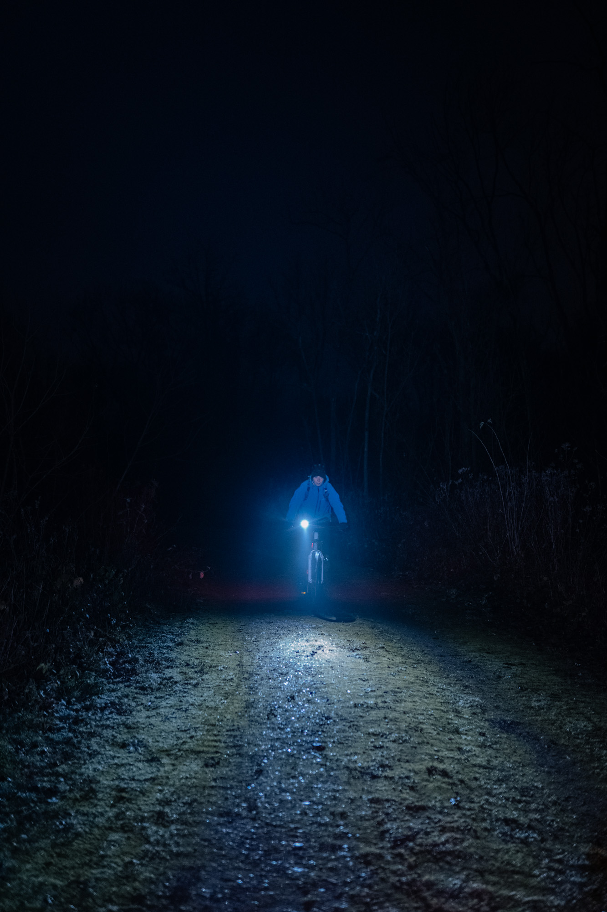

La saison hivernale rime souvent avec un temps maussade, des couleurs passées et une obscurité profonde. Nous avions initialement prévu cette sortie pour nous évader de notre routine quotidienne pour une balade nocturne. Le programme était simple : rouler sur des sentiers en pleine nuit à la seule lumière de feux, et manger un dîner lyophilisé dans les bois comme une dernière balade avant les fêtes de fin d'année.

Vous lirez souvent que si vous vous ennuyez sur vos sentiers locaux, essayez de les parcourir la nuit et vous découvrirez un tout autre terrain de jeu. Faire du vélo dans l'obscurité uniquement éclairé par ses lumières procure une sensation unique. Tout est calme, le rythme de pédalage est plus lent. On ne fait pas du vélo pour parcourir une distance ou battre un record, ici on pédale, on écoute, scrute, et prend notre temps. Le paysage n'a pas tant d'importance. Chaque racine devient un obstacle glissant, chaque flaque est un nouveau terrain de jeu. Nous sommes revenus assoiffés de revivre de nouvelles sorties nocturnes. Assoiffés de plus, mais heureux d'avoir découvert ces sentiers autrement.

Dans le but de dépeindre une vision différente des aventures hivernales à vélo, je me suis amusé à capturer une autre vision de notre sortie VTT nocturne dans la nature à travers les couleurs et le contraste. J'ai embarqué mon trépied et un petit [panneau LED Aputure](https://www.digit-photo.com/APUTURE-MC-Lampe-LED-RGBWW-rAPUTUREMC.html?dpa_id=21) pour éclairer notre sentier et les textures de ce terrain de jeu redécouvert pour donner naissance à cette petite série photo version _technicolor_.

   

   

    

   

   

   

   

   

   

