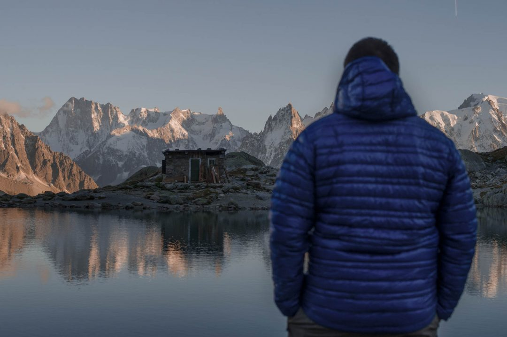

7h00. Le réveil sonne, les yeux collés, les jambes lourdes, les plis de l'oreillers cicatrisent encore ma joue. Le sac est prêt, il est lourd, trop lourd. Mais ce qui m'attend aujourd'hui en vaudra sûrement l'effort. Un peu plus de trois heures de route plus tard entre travaux, bouchons et lacets dans la brume, j'arrive finalement au Col des Montets, à côté de Chamonix, salué par le Mont Blanc et le massif des Aiguilles Rouges.

Le temps d'ajuster les derniers préparatifs pour [partir en randonnée bivouac](https://jeremyjanin.com/conseils-preparer-partir-en-randonnee-bivouac), serrer les chaussures et d'attraper mes bâtons de marche, c'est parti pour l'ascension jusqu'au Lac Blanc. La météo est incroyable et la vue déjà imprenable sur l'Aiguille Verte. La tente est dans le sac, c'était décidé, ce soir je dormirais avec une vue imprenable sur le Mont Blanc. En temps normal, la randonnée du Lac Blanc est l'une des plus accessibles pour les familles et les enfants, en empruntant le téléphérique de la Flégère qui permet de réduire la randonnée à 1h30 de marche. Téléphérique fermé pour la saison oblige, nous sommes partis du Col des Montets, ça se raidit un peu plus, les lacets s'enchainent mais le corps et le souffle en prennent un coup.

J'ai songé à faire demi tour à cause des 17 kilos de ce sac à dos qui me cisaille les épaules et me tire sur le dos, mais non, impossible, je veux ce bivouac, je le veux. J'avance donc, me voilà enfin au sommet de cette première difficulté, en retard sur l'horaire normal d'ascension, mais tant pis, j'avance à mon rythme et profite pour faire des pauses et des photos. Le lieu est magique. J'avance sur le plateau, puis le pierrier. Arrivé aux Lacs des Cheserys, j'en prends plein les yeux, le temps de me battre avec ma peloche, je retrouve Julien au pied de la dernière difficulté du jour avant d'atteindre notre Saint Graal, ce pourquoi nous avons passé les derniers jours pendus au téléphone pour préparer cette randonnée au Lac Blanc. Nous sommes fin septembre, nous devrions être seuls pour cette fraiche nuit sous la tente à 2 358m d'altitude, les quelques âmes que nous croisons, redescendent vers la vallée. On fait une pause, nous ne sommes plus très loin de notre but, mais nous voulons profiter de la vue, même si elle sera sûrement encore plus belle au dessus, on pose les sacs, on court, on se défoule, on savoure ce sentiment de liberté. Des vrais gosses.

Il est temps de remettre les sacs sur le dos, ça devient de plus en plus difficile de les soulever du sol et reprendre le sens de la marche sans grimacer. Finalement, on y arrive, la dernière ascension, nous fait emprunter quelques échelles totalement accessibles, nous arrivons enfin au point de vue, heureux de lâcher les sacs, d'enfiler une première puis une deuxième couche pour nous réchauffer de la fraicheur qui envahit le lieu. J'en profite pour tester ma nouvelle veste Patagonia, une veste compacte ultra légère qui m'a littéralement conquis et dont je vous reparlerai. On se retourne et là, c'est la claque, la vraie claque. Celle que je voulais prendre, mais que je n'attendais pas aussi forte. C'est beau. C'est TROP beau. On en prend plein les yeux, ça se passe de mot. On peine à sortir les appareils photos tellement on veut profiter, mais finalement l'appel de l'envie d'immortaliser ce moment est bien trop fort et nous commençons à déclencher, tout en savourant l'instant, la vue, l'ambiance entre les photos.

Ce moment est incroyable, Indécent comme j'ai tendance à dire trop souvent. Nous sommes littéralement bouche bée. Le reflet du massif dans le lac est juste sublime, d'autant plus avec les lumières du soir. On s'est retourné l'un vers l'autre, et avons acquiescé en même temps : il faut absolument le voir pour le croire, ceux qui font l'aller-retour dans la journée sans voir le coucher de soleil au moins, ratent vraiment quelque chose. Cette vue nous impressionne, on se sent tout petits et tellement vivants à la fois. Le vrai spectacle est arrivé quand le soleil s'est allongé sur l'horizon, la lumière rouge a commencé à embrasser les aiguilles qui se dressent face à nous, une à une, avant d'obscurcir complètement le paysage.

Les étoiles et la voie lactée se dressent alors petit à petit au dessus de nos têtes, le spectacle est encore une fois indécent, incroyable, magique, magnifique, inoubliable. Les étoiles se reflètent dans le lac. Il nous faut faire une pause dans les photos pour aller établir notre campement à la lampe frontale. On ne voulait pas rater le spectacle du coucher du soleil alors on a pris le parti de préparer notre bivouac à la nuit tombée. Notre campement surplombe le lac et les aiguilles, c'est magique, des photos que j'avais toujours rêvé de faire, étaient là, à portée de main. L'ambiance, la scène, le moment, est magique, incroyable, indécent, magnifique... inoubliable. On allume le réchaud entre deux photos pour dîner et prendre un chocolat chaud, assis sur notre pierre, face au paysage petit à petit illuminé par la lune.

Après une nuit un peu fraiche, on se lève avant les premiers rayons du soleil, pour ne rien rater, pour profiter du spectacle avant de redescendre. L'atmosphère se réchauffe au rythme où nos yeux s'écarquillent, on ne sait plus où donner de la tête, pour profiter de ces instants, c'est incroyable, indécent, magique, inoubliable.

Le soleil finit par s'élever au dessus des crêtes, on décide de profiter de l'arrivée de la lumière pour prendre notre petit déjeuner... assurément la plus belle vue que j'ai jamais eu pour un petit déjeuner, même en Australie, même à la Barbade ou en Norvège. Non, là c'était juste un cran au dessus, les montagnes, notre chocolat chaud et nous. Rien d'autre. Le silence absolu, et les rayons qui viennent balayer nos joues et nos rétines. C'est tout, rien que ça. Rien que du bonheur.

10h00. On ne veut pas partir, et pourtant il faut plier le campement, profiter une dernière fois de la vue, remplir la gourde et se remettre en marche pour retrouver la voiture. La descente est dure pour les chevilles, pour les genoux, pour les épaules, pour le moral. On se passe et repasse au fil des mètres ces paysages, ces couleurs qui nous ont éblouis depuis deux jours. Il est déjà l'heure de se dire au revoir. Ca faisait des années que je voulais venir à Chamonix, c'était l'occasion de découvrir ce paysage fabuleux avec toutes les aiguilles qui pointent vers le ciel, je n'ai pas été déçu, j'en ai pris plein les yeux et pour un bon moment. C'était incroyable, indécent, magnifique, magique, inoubliable.

Si vous voulez partir à votre tour, je vous invite à lire mon article pour bien [réparer votre randonnée bivouac](https://jeremyjanin.com/conseils-preparer-partir-en-randonnee-bivouac)
