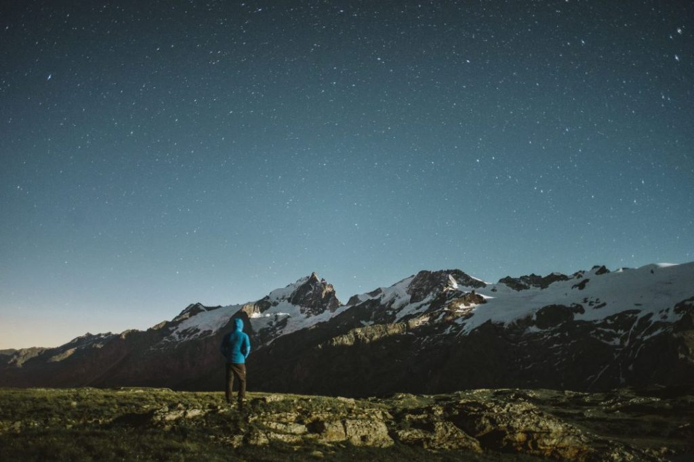
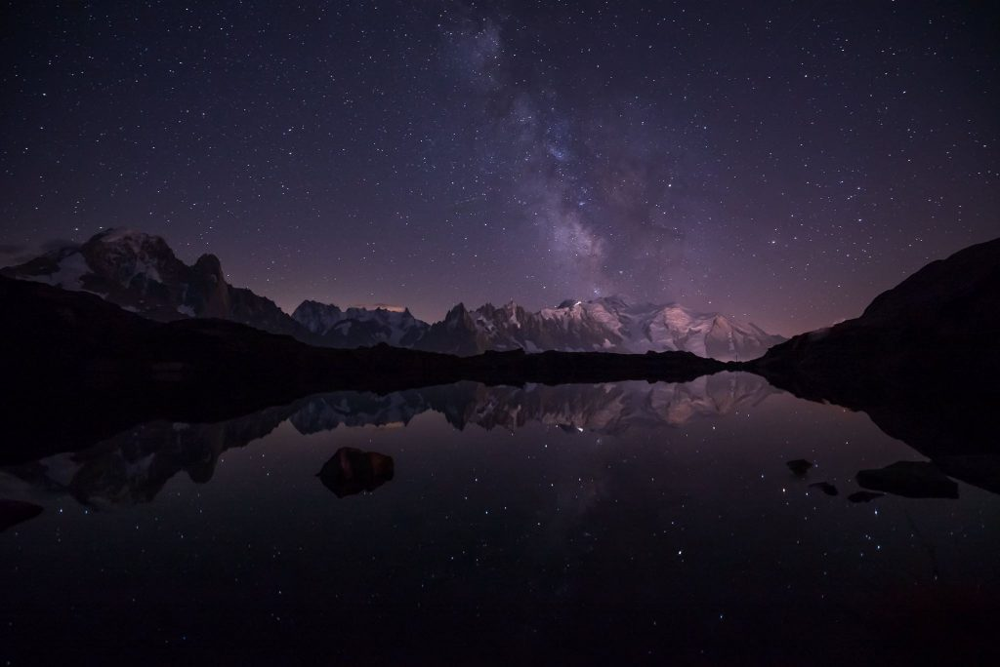
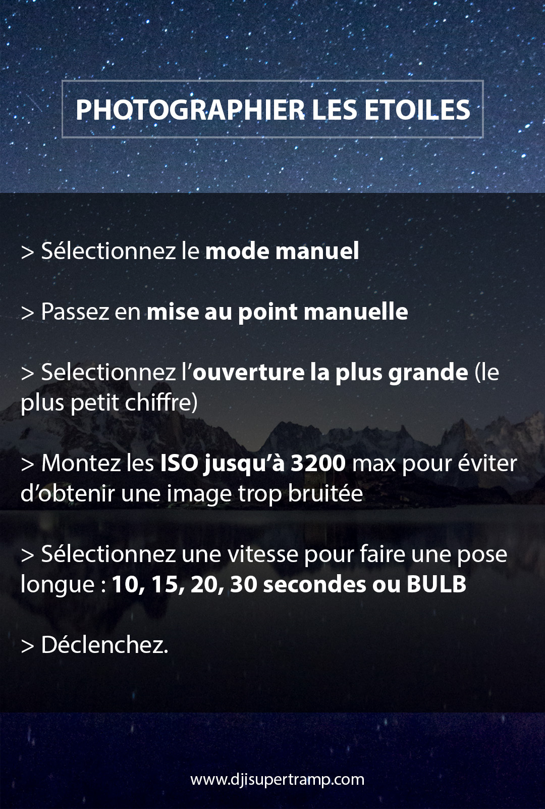

Lorsque j'ai commencé à apprendre la photographie il y-a 10 ans, je me suis découvert une passion pour les photos d'étoiles et de la voie lactée. Je ne connais rien en astronomie, et pourtant j'adore voir les étoiles se révéler sur l'écran de mon appareil et parfois, quand le ciel est assez clair, voir apparaître cette énorme cicatrice en travers du ciel appelée : voie lactée. Force est de constater que ça intrigue plus d'une personne aussi de savoir comment on fait, alors voici ma recette miracle (pas si miracle, mais juste efficace !). Je pars du principe que vous avez déjà des bases en photographie et maitrisez au moins les notions d' "_ouverture_", "_ISO_" et "_vitesse_".

[Comment photographier les étoiles et la voie lactée](images/photographier_les_etoiles_7-1024x684.jpg)

_(Une autre technique plus poussée pour photographier les étoiles : le startrail.)_

#### **PHOTOGRAPHIER LES ÉTOILES - QUELLES CONDITIONS MÉTÉO ?**

Pour photographier les étoiles et la voie lactée, il faut d'abord une nuit claire et si possible avec une une lune peu visible (évitez les soirs de pleine lune). Ensuite, vous l'aurez sans doute déjà remarqué depuis longtemps, mais les étoiles sont nettement moins visibles en ville qu'à la campagne ou à la montagne : la faute à la pollution lumineuse. Alors, un soir avec une nuit claire et dans un lieu à, au moins, 30 ou 40kms d'une forte source lumineuse (une ville par exemple) ça serait déjà des conditions assez idéales pour pouvoir vous essayer à l'astrophotographie.

[Comment photographier les étoiles et la voie lactée](images/photographier_les_etoiles_6-1024x683.jpg)

#### **MATÉRIEL : QUEL APPAREIL PHOTO ET OBJECTIF POUR PHOTOGRAPHIER LES ÉTOILES ET LA VOIE LACTÉE**

Pour ça, il faut un trépied et un appareil photo, c'est faisable avec n'importe quel appareil photo qui a un mode manuel et avec lequel on peut régler les ISO manuellement, même si les meilleurs résultats seront obtenus avec un reflex / hybride qui permet une bonne montée en ISO. Je vous ai préparé un kit un peu plus bas avec le matériel que je recommande pour photographier les étoiles.

Cela n'est donc pas possible au moment où j'écris ces lignes, avec un iPhone, c'est toutefois possible avec les GoPro les plus récentes comme la [**HERO8**](https://amzn.to/3j6nTGd) ou [**HERO9**](https://amzn.to/2Uw24Wx)

Une fois les conditions réunies, sortez votre trépied et votre appareil photo. Mon "kit" de choix c'est mon Sony a7sII avec mon [**16-35mm**](https://amzn.to/2WA1m6c) ou mon [**28mm**](https://amzn.to/2FPu6Tb) selon l'angle que je recherche. J'utilisais auparavant un réflex Canon avec un objectif 14mm f/2.8 : un ultra grand angle très lumineux, pour ne pas prendre en photo uniquement les étoiles mais aussi un peu de paysage pour rendre votre photo encore plus impressionnante en y incluant une montagne, des arbres ou tout ce que vous aurez sous les yeux.

#### **LE MATÉRIEL INDISPENSABLE**

**TRÉPIED**

Il est crucial d'avoir un trépied pour pouvoir faire une pose lente sans que l'appareil photo ne bouge. Il existe tout un tas de trépied, pour tous les budgets. Évitez les tout premiers prix qui peuvent vite être instables. Voici ceux que je recommande selon votre budget et votre pratique.

[**\>> Beike B55**](https://amzn.to/2WzZwlO) \- Un trépied entée de gamme plutôt léger que j'utilise depuis des années et dont je suis satisfais.

[**\>> Gorillapod 5K Kit**](https://amzn.to/2YEekBN)_\- ultra portable, facile à emporter partout._

**[\>> Manfrotto BeFree Advance](https://amzn.to/2WD2dTL)** \- _Trépied de voyage très stable et de très bonne qualité._

**OBJECTIF**

On peut potentiellement utiliser n'importe quel appareil photo et objectif mais pour obtenir de très bons résultats, opter pour un objectif grand angle et lumineux est la clé pour réussir à coup sûr à photographier les étoiles et la voie lactée.

Mon objectif coup de coeur pour ça et relativement abordable est le [Samyang 14mm f/2.8](). Il a tous les avantages des versions Canon, Sigma ou Nikon mais pour une fraction du prix. Si vous faites de la photo d'étoile de manière occasionnelle et que vous ne voulez pas vous ruiner, foncez pour le Samyang 14mm f/2.8, il existe en version autofocus et sans autofocus. Je vous conseille la version sans autofocus si vous voulez économiser un peu car de toute façon, on utilise la mise au point manuel pour photographier les étoiles.

[**\>> Samyang 14mm f/2.8 pour monture Canon**](https://amzn.to/2HT3SBk)

[**\>> Samyang 14mm f/2.8 pour monture Nikon**](https://amzn.to/2HQohH0)

[**\>> Samyang 14mm f/2.8 pour monture Sony FE**](https://amzn.to/2WDYPrT)

Si vous souhaitez une autre marque, voici d'autres objectifs parfaits pour photographier les étoiles :

[**\>> Canon 14mm f/2.8 série L**](https://amzn.to/2WD33zT)

[**\>> Nikon 14-24 mm f/2.8**](https://amzn.to/2CNhREF)

**[\>> Sigma 14mm f/1.8 Canon](https://amzn.to/2JUpkI5)** aussi dispo chez **[Nikon](https://amzn.to/2HOR0vV) / [Sony](https://amzn.to/2WCWtcO)** _(Oui oui c'est bien f/1.8 !)_

**TÉLÉCOMMANDE**

Pour éviter les secousses de boitier au moment du déclenchement, vous pouvez soit utiliser un retardateur de 2 ou 10 secondes soit utiliser une télécommande pour contrôler votre boitier. L'avantage des télécommandes c'est qu'en choisissant le bon modèle, elles vous permettront aussi de pouvoir réaliser des timelapses des étoiles ou des startrails grâce à leur intervallomètre. Attention à bien vous assurez que la télécommande que vous choisirez sera bien compatible avec votre modèle de boitier, pas seulement la marque.

**[\>> Télécommande intervallomètre](https://amzn.to/2HT2FKi)**

**LAMPE FRONTALE**

Et oui ! On y pense pas forcément mais on photographie dans le noir et c'est important de savoir où on met les pieds et où on place son trépied tout en ayant les mains libres pour retenir une chute au cas où et simplement trouver ces boutons sur son boitier. Le bonus est d'utiliser une lampe frontale qui bénéficie d'un mode lumière rouge, initialement prévu pour lire des cartes sans s'éblouir, mais le mode rouge fonctionne très bien aussi pour vos sorties à photographier les étoiles puisqu'il évite de mettre des rayons de lumière dans votre cadrage par inadvertance et évite d'éblouir les gens autour de vous.

Je vous recommande vivement l'un de ces deux modèles de lampe frontale :

**[\>> Black Diamond Storm](https://amzn.to/2WzYzde)**

**[\>> Black Diamond Spot](https://amzn.to/2CMS0wC)**

#### **PHOTOGRAPHIER LES ÉTOILES - TECHNIQUE DE PRISE DE VUE**

Passez votre objectif en mise au point manuelle et mettez votre appareil photo en mode manuel et réglez l'ouverture sur le plus petit chiffre que votre objectif vous permettra d'obtenir, avec mon objectif je me mets donc à f/2.8.

Montez la sensibilité jusqu'à 3200 ISO maximum pour éviter d'obtenir une image trop bruitée, après tout dépend de votre appareil et sa gestion du bruit. À réglages équivalents, une image prise avec un 5DMkIII par exemple sera moins bruitée qu'avec un 1000D par exemple, néanmoins pour débuter, on peut faire abstraction du bruit un temps pour comprendre le fonctionnement et commencer à se faire plaisir.

Après avoir réglé sur une grande ouverture et la sensibilité ISO, il reste à régler la vitesse. Etant donné qu'on photographie dans le noir, la grande ouverture et les hauts-ISO ne vont pas suffire, il va donc falloir faire une pose longue (d'où l'intérêt d'avoir un trépied). Pour se faire, il faut régler la vitesse à plusieurs secondes : 10, 20, 30 ou BULB. Le risque en faisant un pose trop longue, c'est que l'on en vienne à distinguer le mouvements des étoiles. Elles n'apparaîtront plus alors comme des "points" mais des "traits", se rapprochant alors d'un star trail (trainée d'étoile).

Mon "go-to mode" en général est **f/2.8 - ISO 1600 - 15 secondes** de pose. Mais retenez que chaque situation est différente alors ce qui fonctionne pour moi, ne fonctionnera peut-être pas pour vous, mais ça vous donne une idée, après amusez vous à réduire ou augmenter les ISO ou la vitesse pour voir ce qui vous correspond le plus.

Je vous invite aussi vraiment à photographier au format raw au lieu de jpg. Les fichiers raw retiennent beaucoup plus d'informations dans l'image et le post-traitement est clé sur les photos d'étoiles donc autant maximiser l'amplitude. Les cieux étoilés sont aussi souvent de sacrés spectacles, il serait dommage de se priver de la qualité maximale de son fichier. Enfin, à l'heure où les cartes mémoires et où le stockage ont bien baissé en tarif, je pense que c'est incontournable de photographier les étoiles en raw.

****

#### **MÉMO POUR PHOTOGRAPHIER LES ÉTOILES ET LA VOIE LACTÉE**

Je sais que vous n'aurez pas toujours cet article sous la main, alors je vous ai concocté une petite fiche récapitulative à télécharger sur votre smartphone pour avoir toujours ces explications à porter de main lorsque vous sortirez photographier les étoiles et la voie lactée. Vous n'avez qu'à enregistrer l'image ci-dessous.

* * *

_Cet article contient des liens affiliés Amazon. Si vous commandez un produit via l'un de ces liens, je touche une petite commission sans que ça ne change le prix pour vous. Cette commission me permet de continuer à faire vivre et mettre à jour ce site._
