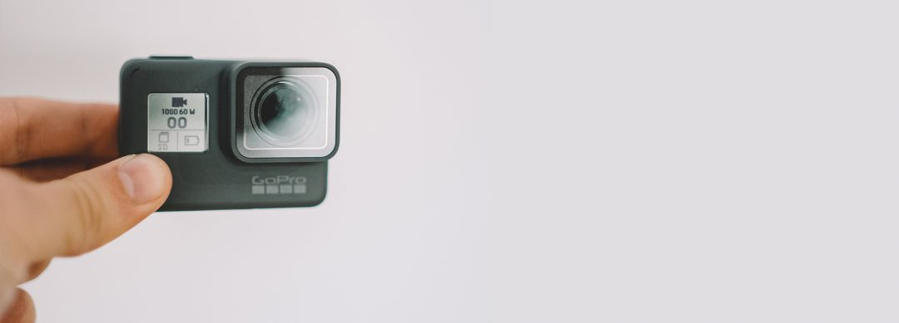
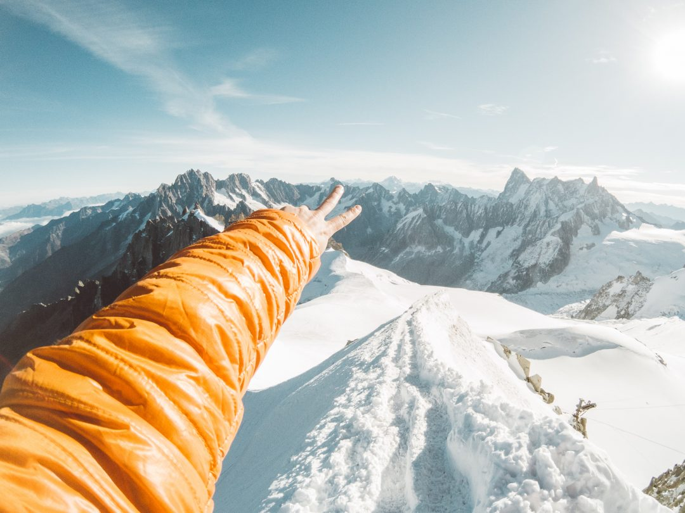
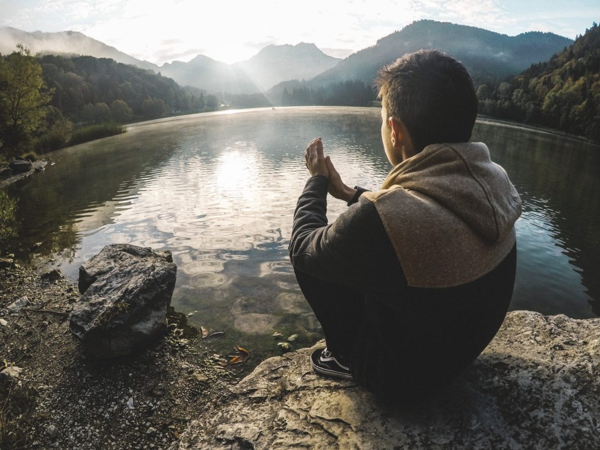
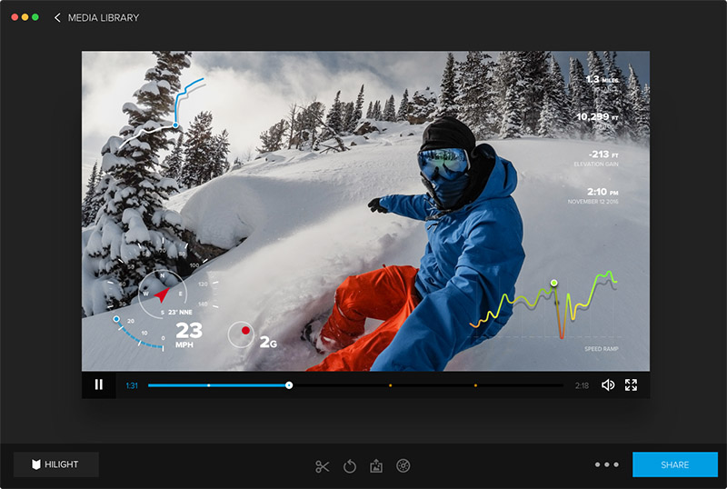
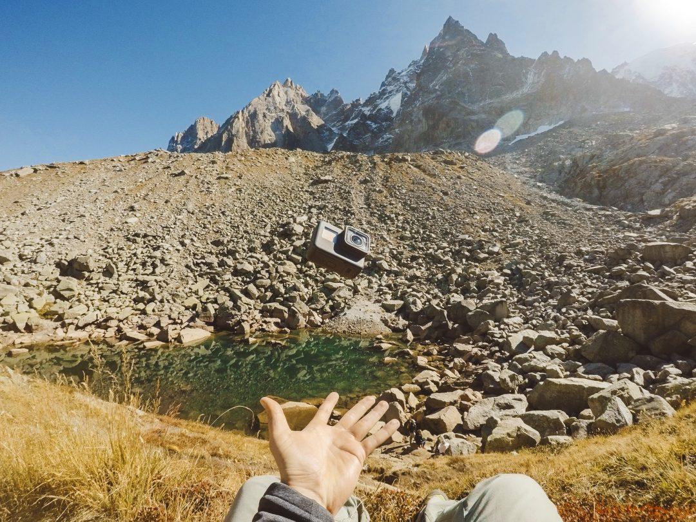
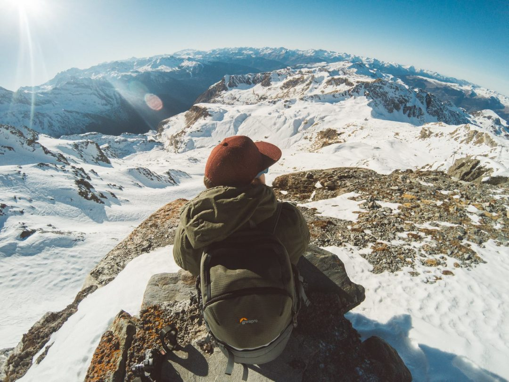
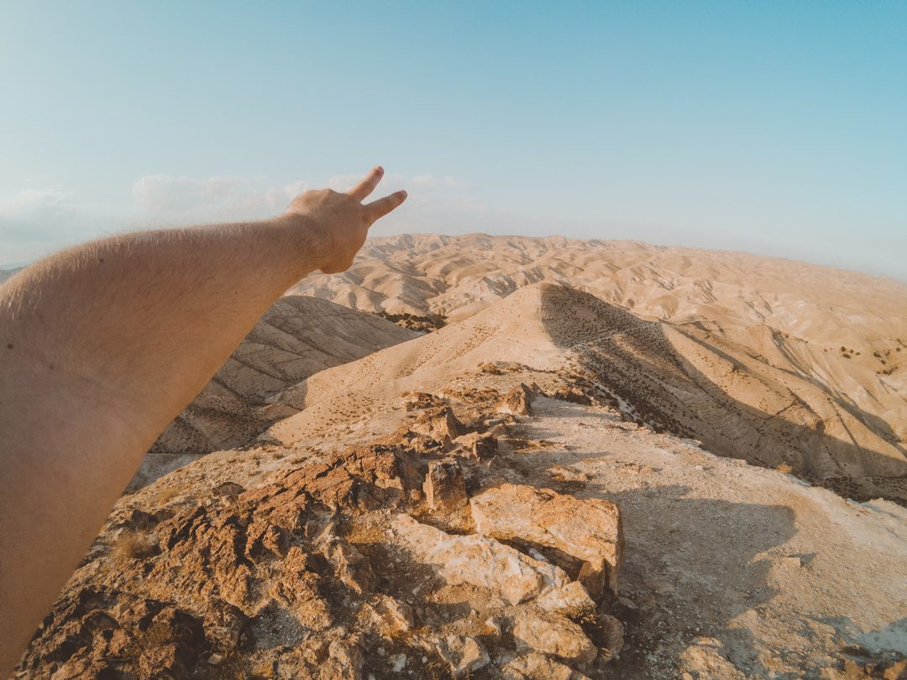

Après plusieurs mois d'expérience à l'utiliser dans de nombreuses conditions, voici **mes conseils pour régler et utiliser une** [**GoPro**](https://amzn.to/3hfhaY4). Entre nouvelles fonctionnalités grand public et mise à jour plus avancée, tour d'horizon de ce qui change dans la gamme GoPro depuis la HERO5 pour apprivoiser votre nouvelle caméra.

_(Mise à jour : Cet article est également valable pour la plupart des conseils avec la [**HERO6**](http://amzn.to/2juWEIW), [**HERO7**](https://amzn.to/2KDxpku), [**HERO8**](https://amzn.to/2KDxpku), [**HERO9**](https://amzn.to/2KDxpku). )_

Si la **HERO5 conservait beaucoup de points communs avec sa petite soeur la HERO4**, elle vient tout de même avec son lot de nouveautés à ne pas négliger et à apprendre à maîtriser qui ont ensuite développé la gamme qu'on connaît aujourd'hui avec la HERO 8 et HERO 9. Elle est compatible (comme chaque caméra) avec environ 90% de l'écosystème GoPro, en dehors des accessoires dédiés aux autres modèles, la **HERO5 et les suivantes sont compatibles avec la quasi totalité des fixations** puisqu'elle possède la même base de 2 pattes qui viennent se loger dans les fentes des fixations habituelles GoPro. En revanche les batteries et les caissons étanches sont différents des HERO4 en format et l'**autonomie a été grandement améliorée** avec des nouvelles batteries.

**Étanche**

Étanche sans caisson jusqu'à une profondeur de 10m depuis la **HERO5**, les GoPro possèdent aussi un **[caisson étanche à 60m](http://amzn.to/2ihbroz)** compatible (à acheter séparément) qui permet d'emmener la GoPro lors de plongées plus profondes. Attention toutefois, la HERO9, HERO8, HERO5 et les HERO4 ou 3 n'ont pas la même forme et les caissons étanches ne sont donc pas compatibles. En revanche, pas de problème pour les HERO5, HERO6 et HERO7.

**Écran tactile**

Auparavant avec la gamme **HERO4**, on devait faire un choix entre avoir l'écran tactile intégré sur la _HERO4 Silver_ mais ne pas pouvoir filmer en 4K ou l'inverse avec la _HERO4 Black_ en pouvant filmer en 4K et ne pas avoir d'écran intégré. Désormais, toutes les GoPro depuis la HERO5 possèdent l'écran tactile de 2", la vidéo 4K voire plus et tout un tas de fonctionnalités anciennes et nouvelles.

La [**HERO5 Session**](http://amzn.to/2h88DVR) fait quant à elle la même taille que la HERO Session mais est aujourd'hui surpuissante pour sa taille puis qu'elle bénéficie elle aussi de la **stabilisation électronique, de la 4K** et de nombre de nouvelles fonctions. Elle n'est toutefois malheureusement plus commercialisée à ce jour.

L'écran tactile de la **[GoPro](http://amzn.to/2hwuzei)** permet de contrôler l'ensemble de la caméra :

\- En glissant le doigt ("swipe") du **haut vers le bas**, on accède aux réglages généraux et de connectivité de la caméra. - Un swipe de la **gauche vers la droite** permet d'accéder au **contenu de la carte mémoire** - Un swipe de la **droite vers la gauche**, ouvre le menu pour régler le mode **ProTune photo, vidéo et audio**, activer/désactiver le **RAW**, le **WDR**, la **stabilisation d'image** et d'autres réglages.

L'écran tactile permet aussi désormais de pouvoir **ajuster la zone d'exposition**. Il n'y-a plus de mesure spot pour les images à fort contraste, à la place **on tient appuyé sur une zone à exposer et on bloque l'exposition** directement avant de shooter en déplaçant un petit carré du bout du doigt sur la zone sur laquelle la GoPro doit exposer.

**Stabilisation vidéo**

Fini les micro-tremblements sur les vidéos, la stabilisation fait son apparition sur la HERO5. Si elle **ne sert pas à stabiliser l'image quand on court** ou fait de la descente VTT sur un chemin défoncé par exemple car pour ça il faudrait une gimbal comme le [**_Karma Grip_**](http://amzn.to/2hYPVC7)... la **stabilisation interne**, elle, permet de réduire les microtremblements que l'on a à l'image quand on tient la GoPro à la main ou avec pas mal de fixations quand ça tremblote un peu.

La stabilisation interne n'est pas une stabilisation optique, la **GoPro HERO5 stabilise électroniquement l'image en temps réel** avant d'enregistrer le fichier. À savoir que lorsqu'on filme avec la stabilisation d'activée, l'angle de vue reste très large mais du fait de la stabilisation électronique, **l'image est légèrement recadrée.**

La **stabilisation n'est pas disponible en 4K sur la HERO5** mais fonctionne sur toutes les autres résolutions à 60fps et moins. Elle n'est pas disponible en 4K car pour stabiliser électriquement, la GoPro a besoin de filmer dans une résolution supérieure pour ensuite recadrer et enregistrer dans une résolution inférieure. La stabilisation est en revanche disponible en **4k30 sur la HERO6 et jusqu'en 4k60 sur la HERO7 Black et suivantes : HERO8 et HERO9.**

**Commande vocale**

Autre nouveauté de la gamme depuis la sortie de la HERO5 jusqu'à la toute dernière GoPro : la **commande vocale.**

En activant la fonction dans le menu, on peut **contrôler sa GoPro avec sa voix**. Fonction gadget inutile au premier abord, elle s'avère en fait très pratique à l'usage et il devient difficile de s'en passer dans certaines situations une fois qu'on a pris l'habitude de l'utiliser. L'un des points que je trouve vraiment top est le fait d'être par exemple en mode vidéo prêt à filmer et finalement on veut faire une photo... pas besoin de changer de mode dans l'empressement, on a juste à dire "**_GoPro prends une photo_**" et elle basculera automatiquement en mode photo pour capturer l'image.

La commande vocale est disponible en 16 langues différentes et voici les différentes commandes en français :

**GoPro enregistrer vidéo / GoPro arrêter vidéo**

**GoPro Higlight**

**GoPro prendre photo**

**GoPro prendre rafale**

**GoPro démarrer acceléré / GoPro arrêter accéléré**

**GoPro mode vidéo / GoPro mode photo / GoPro mode rafale / GoPro mode accéléré**

**GoPro éteindre**

**GoPro allumer\*** _(fonctionne uniquement avec [**GoPro Remo**](http://amzn.to/2ihh6uO))_

La liste des commandes vocales est assez robotique mais on peut ajouter des articles, au lieu de _"GoPro prendre photo_" la caméra reconnait aussi si on dit "_GoPro prends une photo._"

 

**Photo WDR** _(Wide Dynamic Range)_

Le mode WDR permet de capturer une plus grande plage dynamique en photo pour que toute l'image soit correctement exposée. Concrètement, WDR est mode comme l'HDR dans un smartphone ou en photo. Je ne suis personnellement pas fan de ces images mais force est de constater que GoPro a fait un excellent travail dans le traitement du fichier pour que l'image ne fasse pas fake.

**Option GPS & Telemetry**

On peut désormais activer la **fonction GPS** de la HERO5 pour conserver la géolocalisation de ses images mais aussi plus récemment suite à une mise à jour du firmware, d'activer la fonction Telemetry.

**Telemetry** permet d'enregistrer dans le fichier des données telle que **la vitesse, la distance parcourue, le dénivelé**... Une fois le fichier importé dans le logiciel **GoPro Quik sur ordinateur**, on peut alors choisir de superposer ou non ces informations à la façon d'un tableau de bord sur l'image.

**Le champ de vision Linear** _(pour enlever la déformation du fisheye GoPro)_

Longtemps convoitée notamment par les utilisateurs de drones, l'angle **Linear** est la réponse de GoPro à tout ceux qui se plaignent de la déformation de l'objectif fisheye de la GoPro.

En activant ce réglage, l'angle de vue se retrouve plus ou moins le même que l'angle medium et la GoPro corrige d'elle même l'effet de déformation. Le linear est présent en vidéo mais aussi en photo. En revanche la **photo raw et le mode linear ne sont pas compatibles**, c'est soit l'un soit l'autre. En linear, la GoPro exporte la photo en .jpg. En activant ce mode, on ne peut donc pas avoir le très grand angle de la GoPro et les lignes non déformées, c'est tout simplement impossible dans n'importe quel appareil photo.

Avec Linear on perd le côté immersif de la GoPro mais on gagne une image qu'on ne soupçonnerait pas pouvoir filmer avec une GoPro. C'est un mode idéal à utiliser avec un drone ou une gimbal par exemple ou toute action filmée de l'extérieure.

Linear est **uniquement disponible en mode 2,7k et 1080** pour la vidéo et tous les modes photos sauf le raw.

_Ci-dessous, on voit la différent entre le **champ de vision Large** (à gauche) **et Linear** (à droite). La distortion est corrigée en Linear et on voit que la GoPro pour compenser a besoin de recadrer l'image, d'où la différence d'angle entre les deux._

**Avant**

(effet Wide classique GoPro avec la déformation habituelle)

**Après**

(effet Linéaire qui permet de supprimer l'effet fisheye)

**Photo raw**

Le raw était une fonction attendue depuis plusieurs versions de GoPro et elle fait son arrivée sur la HERO5. Si vous ne savez pas ce qu'est un fichier raw en photo, je vous invite à lire [cet article](http://www.01net.com/actualites/photo-quest-ce-quun-fichier-raw-635698.html) qui résume très bien ce que c'est.

À noter : le mode **photo raw est uniquement disponible à ce jour en mode photo simple**. Si vous faites des photos en **mode rafale, timelapse, de nuit en mode Nightlapse** ou avec la fonction Linear activée, la GoPro exportera un fichier .JPG seul et désactivera automatiquement le raw.

**Comment convertir le fichier raw .GPR de la GoPro pour le traiter dans un logiciel de retouche ?**

Le format raw .GPR devrait être supporté par le logiciel vous n'auriez alors qu'à importer le fichier et le retoucher comme d'habitude. Si ce n'est pas le cas ou que vous éditez avec un autre logiciel, j'ai découvert un moyen gratuit de convertir les fichiers raw .GPR en fichiers .DNG : [**_Adobe DNG Converter_**](https://www.adobe.com/support/downloads/product.jsp?platform=Macintosh&product=106).

Le .DNG est le format raw propriétaire d'Adobe qui conserve toute les informations du fichiers .GPR mais dans une format beaucoup plus utilisé et mieux géré par les logiciels Adobe.

**Blocage ISO + Exposition manuelle**

Depuis la HERO5, on peut désormais **bloquer les ISO et régler la vitesse d'obturation** de la caméra manuellement, une fonction que beaucoup de gens n'ont que peu d'intérêt à utiliser mais dont les utilisateurs les plus avancés se réjouiront s'ils sont en quête de contrôle total pour notamment utiliser la GoPro dans des valeurs qui permettent d'obtenir un flou de mouvement en filmant.

Lorsqu'on active **ProTune** (swipe droite vers la gauche), il suffit de mettre le même ISO minimum que maximum pour bloquer l'ISO à cette valeur. Une fois l'ISO bloqué, on peut choisir la vitesse d'obturation que l'on souhaite utiliser. C'est un _must_ si on veut pouvoir notamment passer à **1/30, 1/60, 1/120** pour obtenir un flou _cinématique_ en respectant la règle de 180° du shutter, notamment pour les grands mouvements comme avec un drone ou à la gimbal et pour matcher avec les images d'autres caméras pour uniformiser le look global de la vidéo.

Même si on règle les ISOs au plus bas, si on veut obtenir du mouvement dans l'image en shootant à 1/60ème par exemple, l'image sera forcément sur-exposée à cause du surplus de lumière qui n'est plus compensé par les ISO ou par une vitesse plus rapide. Pour compenser ça, il faut se tourner vers les **filtres ND** pour venir couper l'arrivée de lumière à travers l'objectif de la GoPro et ainsi avoir la bonne exposition avec des réglages maitrisés. [**Polar Pro**](https://amzn.to/2X9yEcV) font de très bons filtres qui n'altèrent pas la qualité de l'image de la GoPro et viennent de sortir des nouveaux filtres adaptés au format de la HERO5/HERO6 et HERO7.

**Pour aller plus loin**

Quand on débute, un bon mode vidéo passe partout est le mode **1080 60** avec la **stabilisation vidéo activée** pour avoir une belle qualité d'image et la possibilité de faire des ralentis. Si vous avez plus de prétention en terme de montage et de résolution, optez pour le mode **4K60** où l'image est encore plus détaillée et plus belle.

Je recommande aussi d'activer ProTune et de mettre ces réglages pour un rendu avec une qualité optimale :

**GoPro Color** (ou Flat si vous voulez faire de la retouche couleur)

**Auto WB**

**ISO max : 400**

**Netteté : Medium**

Pour aller plus loin encore dans les choix des réglages par activité et en fonction de vos besoins, je vous invite à lire mon article [**ultra détaillé ici.**](http://jeremyjanin.com/gopro-choisir-les-bons-modes-et-parametres-pour-filmer-slow-motion-protune/) Évidemment, l'idée avec une GoPro est de varier les angles et adapter les réglages à chaque nouvelle action à capturer.

_Happy shooting._

* * *

_Ce site participe au Programme Partenaires d’Amazon EU, un programme d’affiliation conçu pour permettre à des sites de percevoir une rémunération grâce à la création de liens vers Amazon.fr._
