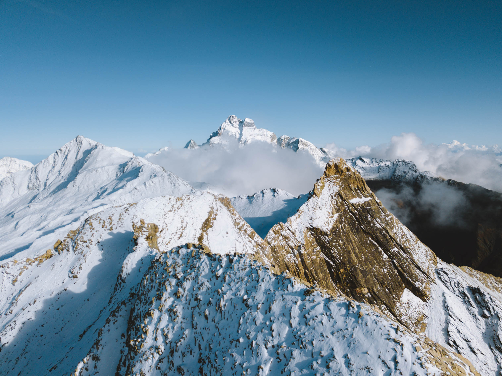
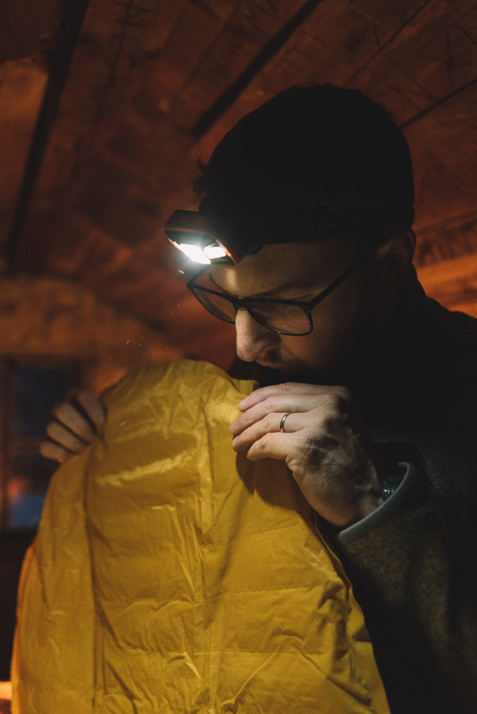
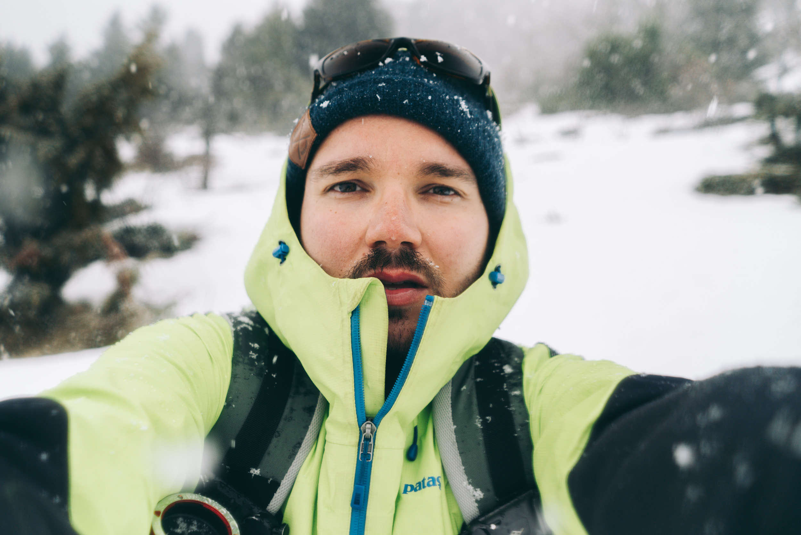
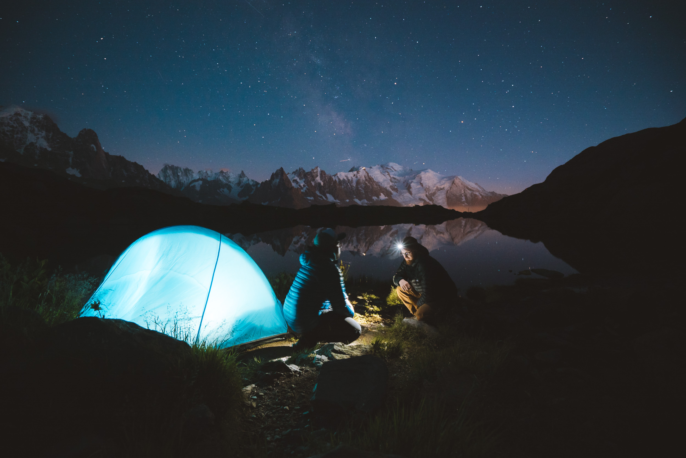
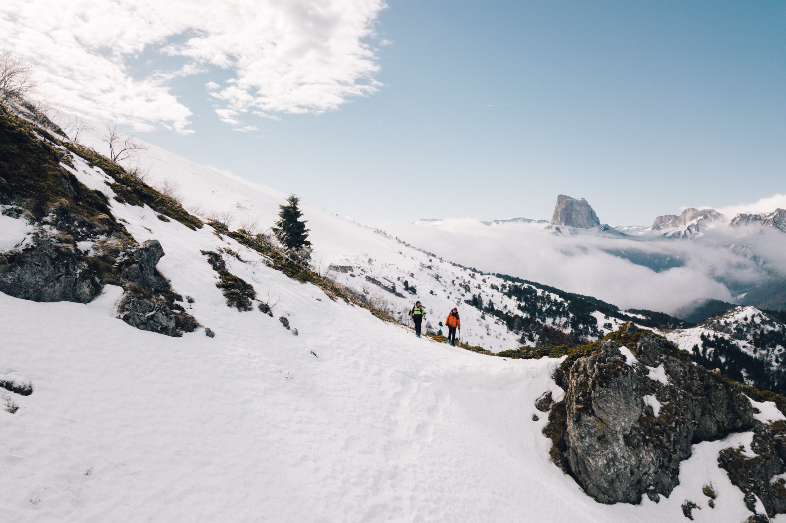
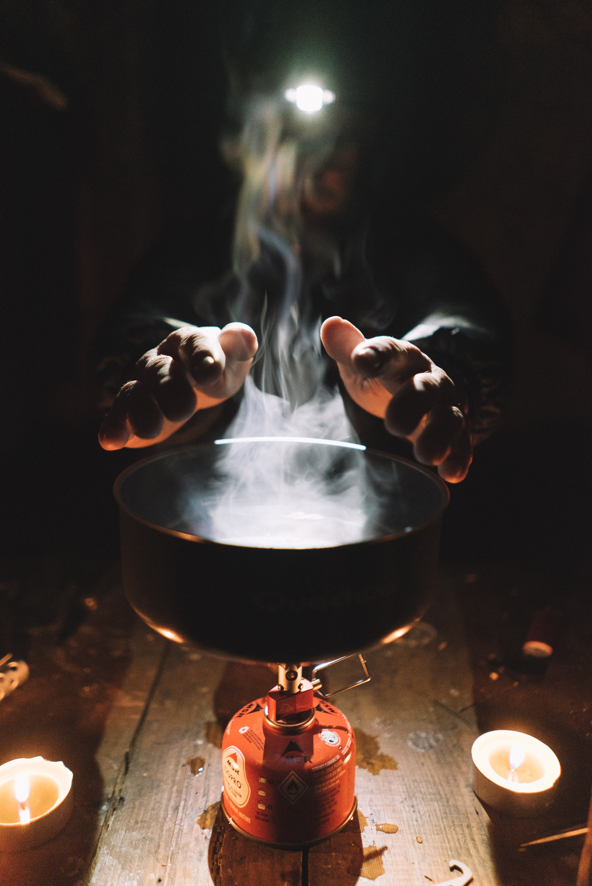
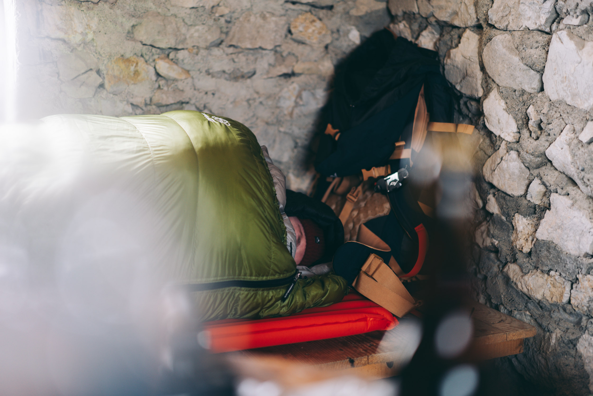
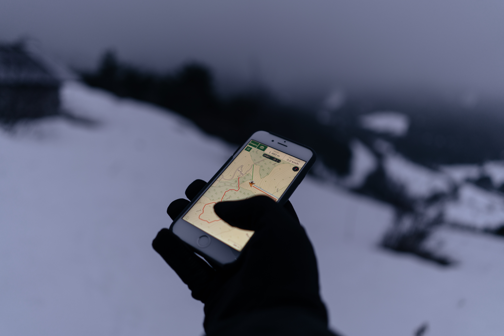
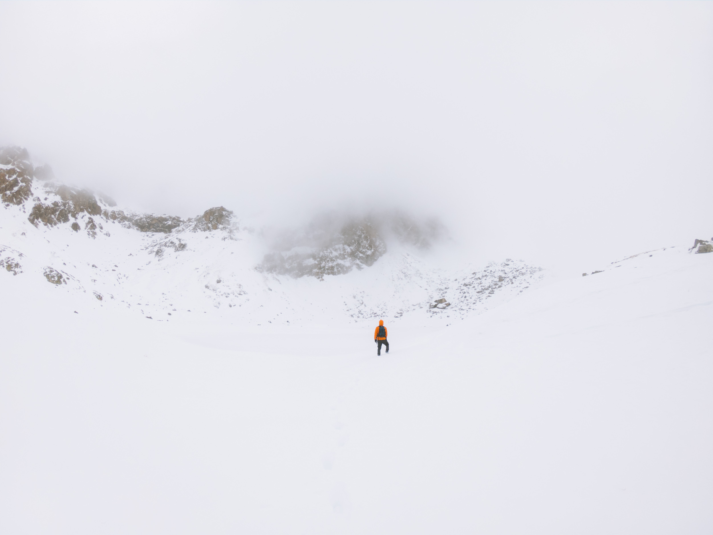

Partir en bivouac aux beaux jours, c'est bien, partir en bivouac en hiver : c'est froid mais c'est tout aussi magique, si ce n'est plus. Ce n'est un secret pour personne, l'idée de passer une nuit en pleine nature, surtout en montagne, est l'une des choses qui me plait le plus dans ma pratique de sports outdoor. Je ne suis pas encore allé jusqu'à l'étape de poser le matelas dans la neige sans abris ni rien mais c'est sur ma liste. On a vite tendance à ré-attaquer les beaux jours au printemps quand les journées sont plus longues et la météo est plus douce. Toutefois, il y-a quelque chose de spécial de partir en bivouac en hiver. On est bien souvent tout seul. On fait sa trace à la montée sans croiser âme qui vive, si ce n'est quelques animaux. Il y-a un silence happant et une ambiance particulière.

L'hiver, les deux plus gros points à prendre en compte quand le moment est venu de [**préparer un bivouac**](http://jeremyjanin.com/conseils-preparer-partir-en-randonnee-bivouac), c'est le froid et l'orientation. Les paysages immaculés sont sublimes mais on peut vite perdre le fil et le froid est forcément omniprésent et un facteur pré-pondérant à votre aventure. Bien planifier un bivouac en hiver est donc primordial pour éviter de se mettre dans une situation délicate.

 
## BIVOUAC EN HIVER : COMPRENDRE LE FROID

Pour savoir comment lutter contre le froid, il est important de comprendre le froid, de savoir comment il s'incruste dans nos sacs de couchages et comment la chaleur s'échappe pour pouvoir pallier à ça une fois sur place. Tout d'abord, on dit souvent que la chaleur peut s'échapper de 3 principales façons : par convection, conduction ou évaporation.

**1\. Convection**

L'air chaud est plus léger que l'air froid. L'air chaud remonte, l'air froid descend. L'air le plus proche de votre corps est le plus chaud puisqu'il est chauffé par vous-même. Si vous enfermez cette chaleur sous une polaire ou dans votre sac de couchage, vous resterez au chaud. Si toutefois, vous permettez à cet air de s'échapper alors l'air froid, plus lourd, viendra se rapprocher de votre corps et donc vous refroidir. C'est l'air enfermé dans vos vêtements qui vous tient chaud, pas le vêtement en lui même. L'air est donc un très mauvais conducteur de chaleur, d'où le fait de le piéger à l'intérieur de vos vêtements.

**2\. Conduction**

La perte de chaleur par conduction se fait, comme son nom l'indique, au contact d'une surface ou d'un objet froid. Isoler son corps de ces surfaces froides type aluminium est donc crucial. Par exemple, en bivouac en été comme en hiver, je dors toujours avec un matelas gonflable avec une matière isolante à l'intérieure pour éviter de conduire le froid de la matière sur laquelle j'ai installé mon matelas, vers mon dos. On sous-estime beaucoup la déperdition de chaleur par le sol et pourtant elle est très présente. On a tendance à surtout penser au sac de couchage mais à négliger le matelas quand on choisit son matériel. J'ai commencé à bivouaquer avec des matelas classiques et suis vite passer à un matelas isolant, le [**Thermarest NeoAir XTherm**](https://amzn.to/2DcEtic) en l'occurence, je ne reviendrais en arrière pour rien au monde. Si vous dormez proche d'une surface conductrice de froid, vous pouvez également étaler une couverture de survie entre la surface et votre matelas pour réduire la conduction de froid.

**3\. Évaporation**

L'eau éloigne la chaleur de votre corps environ 25 fois plus rapidement que l'air. Cela signifie que lorsque vous transpirez et que cette humidité s'évapore dans vos vêtements, l'évaporation va laisser échapper la chaleur de votre corps très rapidement. Ça s'appelle la perte de chaleur par évaporation.

L'évaporation est très efficace pour se débarrasser de la chaleur. (Voilà pourquoi on transpire beaucoup dès qu'il fait chaud ou qu'on fait beaucoup de sport !) L'inconvénient en hiver c'est que cette chaleur qui s'évapore va vous refroidir et le faire de manière encore plus rapide puisque l'air ambiant est déjà froid et que vos vêtements sont humides. Dès que vous vous arrêtez, il est donc primordial de changer tout vêtement humide (même légèrement) pour éviter de laisser la chaleur produite par votre corps s'évaporer et donc vous permettre de lutter contre le froid. On parle de transpiration, mais pas que. Si vous prenez la pluie lors de votre montée et que votre doudoune est mouillée, ses propriétés seront altérées par l'humidité. Elle n'arrivera pas à garder l'air chaud correctement à l'intérieur contre votre corps, puisque l'humidité évaporera l'air chaud.

## BIVOUAC EN HIVER : LE SYSTÈME 3 COUCHES

Le système 3 couches consiste à utiliser un minimum de vêtements pour un maximum d'efficacité pendant et après l'effort.

**1\. Première couche** Ce vêtement en première couche est au contact de votre peau. Si vous avez suivi l'article jusque là, vous aurez donc compris qu'il faut une matière respirante (on bannit le coton !) pour évacuer la transpiration du corps et ne surtout pas la garder au contact de votre peau. J'ai tendance à privilégier des matières comme le mérinos qui ont une très bonne respirabilité, qui ne sentent pas et sont très confortables, même s'ils sont légèrement moins rapides à sécher et plus fragiles que les t-shirt dits techniques en fibres synthétiques. _(voir la liste matériel plus bas pour les références produits que j'utilise)._

**2\. Couche intermédiaire** Cette couche est dite d'isolation. Le vêtement que vous mettrez par dessus votre première couche respirante est là pour maintenir l'air chaud autour au plus proche de votre corps et ainsi vous garder au chaud. On privilégiera ici des vêtements type polaire ou doudoune à duvet, malgré tout respirants.

**3\. Couche de protection**

Enfin, la 3ème couche. C'est la couche la plus extérieure à votre corps, elle prend souvent la forme d'un coupe vent et sert à vous protéger des intempéries et du vent, qui peuvent faire chuter votre température. Attention à bien prendre un coupe vent respirant pour toujours évacuer votre transpiration et éviter de suer encore plus dans un coupe vent qui ne respire pas. Privilégiez une 3ème couche avec une membrane respirante GoreTex.

Pour résumer, l'idée est donc de moduler ces couches en fonction de la température et des conditions météo pour réguler la température autour de votre corps. On peut très bien mettre les 3 à la fois, comme seulement la première couche ou bien la première couche et une coupe vent s'il ne fait pas froid mais qu'il y-a du vent.

En général, je randonne surtout avec la première couche et une deuxième couche en polaire. Je garde la 3ème couche s'il y-a du vent ou de la pluie pour éviter de mouiller mes vêtements et je garde la doudoune roulée dans le sac à dos, pour l'utiliser seulement le soir pour isoler la chaleur au plus près de mon corps au moment du bivouac. Je sors le coupe vent au sommet quand le vent s'intensifie ou si les intempéries viennent se mêler à la fête.

Attention à ne pas chercher à avoir chaud dès le départ de la randonnée, mieux vaut avoir un peu froid 5 minutes et laisser le corps se réchauffer au bout de quelques temps plutôt qu'avoir trop chaud et se mettre à transpirer rapidement.

## **BIVOUAC EN HIVER : QUEL MATÉRIEL ?**

_"There's no such thing as bad weather, only bad clothing"_

Pour mon équipement aventure, je tâche de mettre le prix si besoin pour m'assurer d'avoir du matériel performant sur lequel je puisse compter. J'aime bien m'équiper de marques que j'ai déjà utilisée par le passé et qui ne m'ont jamais fait défaut. Ça ne veut pas dire que ça marchera pour vous, mais pour moi mon équipement actuel fonctionne parfaitement avec mes besoins. Mes chaussures viennent de chez **Salomon**, mon sac couchage de chez **Cumulus** - une marque polonaise top, pour mes matelas c'est du **Thermarest** commandé sur [**Équipement Aventure**](https://www.equipementaventure.fr/), j'utilise également du **Patagonia**, **MSR** et pas mal de petits produits de la gamme **Forclaz** chez Décathlon qui a bien progressé en la matière depuis quelques années.

Ne pas fermer l'oeil de la nuit peut également être très long si on compte sur les premiers rayons du soleil pour venir nous réchauffer. Et croyez en mon expérience, rien de pire que passer une mauvaise nuit en bivouac et devoir refaire ensuite la descente jusqu'à la voiture puis les 2h de route retour jusque chez soi avec la fatigue accumulée. Certainement l'un de mes plus mauvais souvenirs en terme de sécurité sur la route tellement la fatigue prenait le dessus. Bref, sans plus attendre, voici une liste du matériel que j'utilise pour partir en bivouac en hiver :

**COUCHAGE**

- Sac de couchage [**Cumulus Panyam 450**](http://jeremyjanin.com/test-sac-de-couchage-cumulus-panyam-450) (-2°c) _\- (Pour les températures plus froides, optez plutôt pour le Panyam 600 qui descend à -8°c en confort)_
- Matelas [**Thermarest NeoAir XTherm**](https://amzn.to/2DcEtic) (isolant jusqu'à -25°c environ)

**VÊTEMENTS**

- T-shirt **[Merinos manche courte Icebreaker](https://amzn.to/2ZaGYuA)** (existe aussi en [version femme](https://amzn.to/2Peo2GW))
- T-shirt [**Merinos manche longue Icebreaker**](https://amzn.to/2P94vr8) (existe aussi en [version femme](https://amzn.to/2PeiQmf))
- Polaire [**Patagonia en Synchilla**](https://amzn.to/2DdhdR2) ultra chaude et confortable (existe aussi en [version femme](https://amzn.to/2PawJlr))
- Doudoune [**Patagonia Down Hoody**](https://amzn.to/2KOZSUy) (existe aussi en [version femme](https://amzn.to/2DeWRGV))
- Coupe vent Patagonia Mixed Guide (n'existe plus) voir le [**Patagonia Triolet Jacket**](https://amzn.to/2PbbbFg)  (existe aussi en [version femme](https://amzn.to/2X7RCQW))
- Chaussettes [**Merinos Stance**](https://amzn.to/2XgJX34)
- Tour de cou [**Buff Merinos**](https://amzn.to/2Xdc5E3)
- [**Bonnet Patagonia**](https://amzn.to/2PcMMix)
- [**Gants Forclaz**](https://www.decathlon.fr/gant-trek-500-nor-id_8396264.html)

**CUISINE**

- Réchaud [**MSR Pocket Rocket 2**](https://amzn.to/2X7YyxA)
- [**Couteau opinel**](https://amzn.to/2PcMR5Y)
- [**Spork**](https://amzn.to/2Pbi21l)
- [**Popotte Forclaz**](https://www.decathlon.fr/popote-trek500-1-pers-id_8492722.html)

**ACCESSOIRES**

- [**Batterie externe 20 000mAh**](https://amzn.to/2KHZqrh)
- [**Talkie Walkies**](https://amzn.to/2ZauWkR) _(il n'est pas rare d'être dans un endroit qui ne capte pas, et être en contact avec ses compagnons d'aventure est crucial si on s'écarte un peu. Les talkies walkies sont parfaits pour ça.)_
- Lampe frontale [**Black Diamond Storm**](https://amzn.to/2PatHh3) _(+ prévoir piles de rechanges)_
- [**Couverture de survie**](https://amzn.to/2PaCyiI)

_Note : cette liste n'est pas une liste exhaustive de tout ce que j'emporte, mais simplement des suggestions des pièces principales qui constituent mon sac de randonnée._

## **BIVOUAC EN HIVER : L'IMPORTANCE DE SE COUCHER CHAUD**

Il est primordial de se coucher chaud dans son sac de couchage. Si on a froid avant de se mettre au lit, mieux vaut faire un léger effort : marcher autour du spot à bivouac, remonter un peu dans la pente, faire un effort sur place type _squat_ pour monter la température (sans toutefois transpirer. Arrêtez vous avant quand votre corps commence à chauffer). Un sac de couchage n'est pas un radiateur. Il réfléchit la chaleur émise par votre corps et c'est l'air pris entre les plumes qui va répartir la chaleur dans votre sac de couchage. Si vous vous couchez froid, vous aurez beaucoup de mal à vous réchauffer et vous risquez de passer une sale nuit.

Nombreux sont les sacs de couchage pour l'hiver qui ont une collerette et un élastique qu'on peut resserrer. On perd beaucoup de température par les extrémités, et dormir avec un bonnet + resserrer la collerette et l'élastique autour de la tête, permet de grandement réduire la déperdition de chaleur par ici.

Un bon moyen de se coucher chaud est également de manger un repas chaud, par exemple un plat lyophilisé qu'on ré-hydrate avec de l'eau bouillie au réchaud pour faire le plein de protéine pour votre corps.

Enfin, si vous avez besoin d'uriner pendant la nuit, couvrez-vous et motivez-vous à aller faire vos besoins sans trop attendre. Pensez à bien rabattre votre sac de couchage en en sortant, pour éviter de perdre la chaleur qui stagnera à l'intérieur, mais allez-y. Ce n'est pas très glamour, mais l'urine a besoin d'être chauffée par le corps. Nous déployons donc de l'énergie pour chauffer l'urine alors qu'on pourrait utiliser cette énergie pour se réchauffer. Donc n'attendez pas et allez uriner, même si, je sais bien, la flemme se fait souvent bien ressentir dès qu'il s'agit de sortir de son sac de couchage en pleine nuit par des températures négatives.

## BIVOUAC EN HIVER : GÉRER LES BATTERIES AVEC LE FROID

Partir en bivouac l'hiver, c'est aussi partir quand les journées sont plus courtes et qu'on se retrouve très vite dans l'obscurité alors qu'il est seulement 17h ou 18h. On se retrouve donc plus vite à devoir utiliser la batterie de nos différents outils : lampe frontale, smartphone, etc... Gérer ses batteries est donc crucial ! Le froid a tendance à épuiser les batteries plus rapidement, il est donc important de prévoir des batteries de rechanges et de les conserver au plus proche de son corps (dans la poche intérieure de sa veste par exemple) pour que la température du corps les maintienne à une bonne température et ne vide pas vos batteries.

Voici ce que je recommande de prévoir comme batteries :

\- Des [piles de rechange](https://amzn.to/2V3JxiT) pour sa lampe frontale et des talkies walkies - Une [batterie externe / powerbank](https://amzn.to/2KHZqrh) pour charger son téléphone ou votre système de sécurité en montagne type Arva si vous allez dans des zones à risque d'avalanche.

## BIVOUAC EN HIVER : S'ORIENTER EN RANDONNÉE

En randonnée l'hiver, on se retrouve vite les pieds dans la neige et les reliefs ne sont plus du tout les même qu'en été. Le sentier est plus difficile à repérer et même si vous connaissez déjà cette randonnée pour l'avoir faite aux beaux jours, elle sera transformée quand vous la découvrirez sous la neige et ne la reconnaîtrez vraisemblablement pas. Avec ce manteau blanc partout autour de nous, il est encore plus important de bien s'orienter. L'idéal est de tracer son itinéraire avec des sites comme **Komoot** ou **Gaia** ou de télécharger le fichier _.gpx_ déjà existant en ligne. Ensuite, chargez la trace GPS dans votre GPS de rando ou une encore meilleure option selon moi : [**utiliser son smartphone comme gps en randonnée**](https://gregorymignard.com/utiliser-son-smartphone-comme-gps-en-randonnee/). Avec Greg, on utilise tous les deux la même app smartphone : Gaia. On trouve ça beaucoup plus intuitif et qualitatif qu'un vrai GPS de randonnée, en tous cas, pour notre usage ça nous suffit amplement. Je comprendrais toutefois que certains préfèrent un GPS de randonnée en partant en expédition par exemple.

## BIVOUAC EN HIVER : GARDER UN OEIL SUR LA MÉTÉO

Je me suis déjà retrouvé en bivouac sur un col avec une nuit claire et étoilée quand au bout de quelques minutes, tout a changé. Les éclairs ont commencé à péter à l'horizon, à ma droite et à ma gauche. J'avais vue côté suisse et côté français et les orages grondaient en vallée. Ce n'était pas du tout prévu. Mais en montagne tout peut très vite changer. Je me suis assis en regardant l'évolution de l'orage et ai décidé de rester là haut, voyant l'orage s'éloigner au fil des minutes. Petite alerte mais je me rendormirai finalement sans encombre. C'était en plein été, je dormais sans tente, je n'ose pas imaginer si ça avait été en hiver et que l'orage m'était arrivé dessus. Été comme hiver, garder un oeil sur la météo en montagne est primordial pour sa propre sécurité.

N'hésitez pas à consulter l'évolution de la météo sur des sites comme **Météociel** et de contacter l'office de tourisme local la veille du bivouac pour connaître la tendance météo et le **BRA** _(Bulletin de Risques d'Avalanche)_ lors de votre venue. Je regarde aussi les conditions en regardant les dernières sorties relayées sur [skitour.info](http://skitour.info) N'oubliez pas de vous équiper du matériel nécessaire à votre sécurité en cas d'avalanche et à partir accompagné, d'autant plus si vous partez dans des coins à risque. (Et formez-vous à savoir utiliser ce matériel ! L'avoir c'est bien, mais si on ne sait pas l'utiliser pour chercher son pote sous 2m de neige... Ça ne sert à rien !) Enfin, tout au long de la sortie, gardez toujours un oeil sur le ciel, l'évolution du manteau neigeux et les évolutions météorologiques au fur et à mesure de votre journée, qui pourraient vous laisser penser que le temps pourrait changer. En cas d'orage menaçant ou de quelconque faits rencontrés sur son chemin, l'importance en montagne est de savoir renoncer. Mieux vaut rentrer frustré d'avorter une sortie à quelques mètres du sommets, que ne pas rentrer du tout ;)

Voilà qui clôture cet article très long à propos des bivouacs en hiver. Profitez de l'expérience, c'est vraiment unique de se réveiller face au paysage enneigé, vous verrez ! Enfin, pour un premier bivouac en hiver, mon conseil est de viser quelque chose de relativement abordable et simple pour se faire la main, tester le matériel avant de partir pour des bivouacs plus hauts et plus froids.

Pour encore plus d'infos sur les bivouacs, je vous invite à lire mes conseils pour **[préparer et partir en randonnée bivouac](http://jeremyjanin.com/conseils-preparer-partir-en-randonnee-bivouac)**. _Bon bivouac !_ 🙌🏻

 

_Cet article contient des liens affiliés. Ils me permettent de recevoir une petit commission sur les commandes que vous passez sans que ça ne vous coûte plus et me permet de continuer à faire vivre ce blog._
