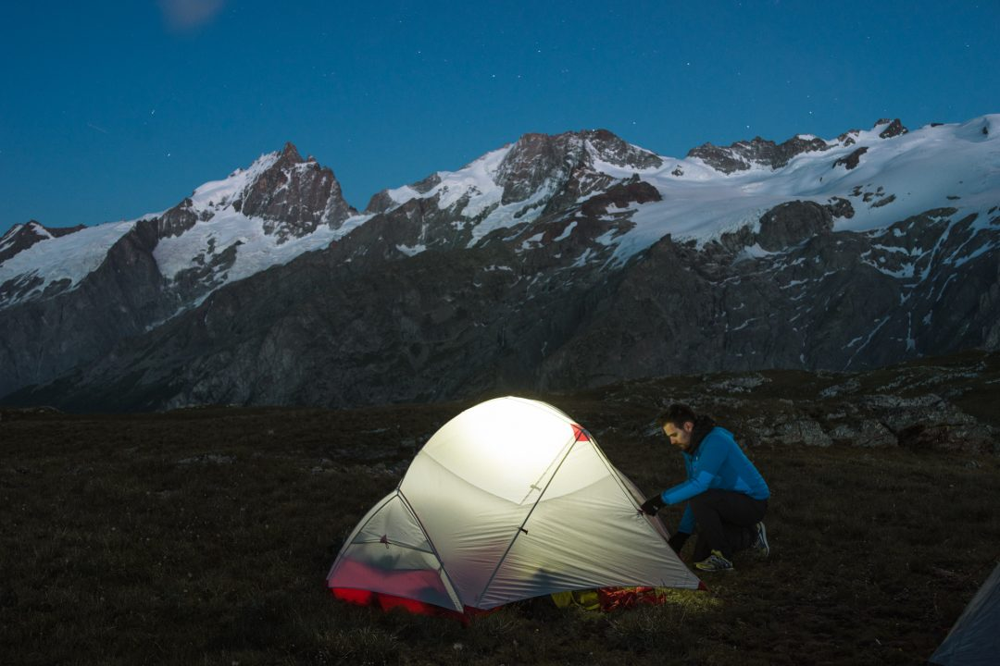
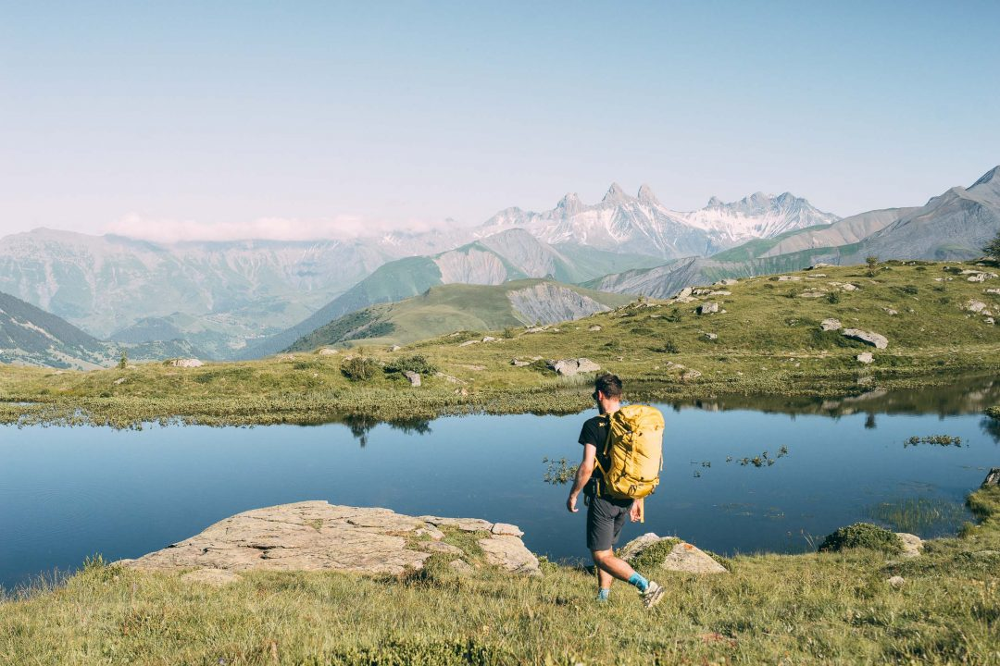
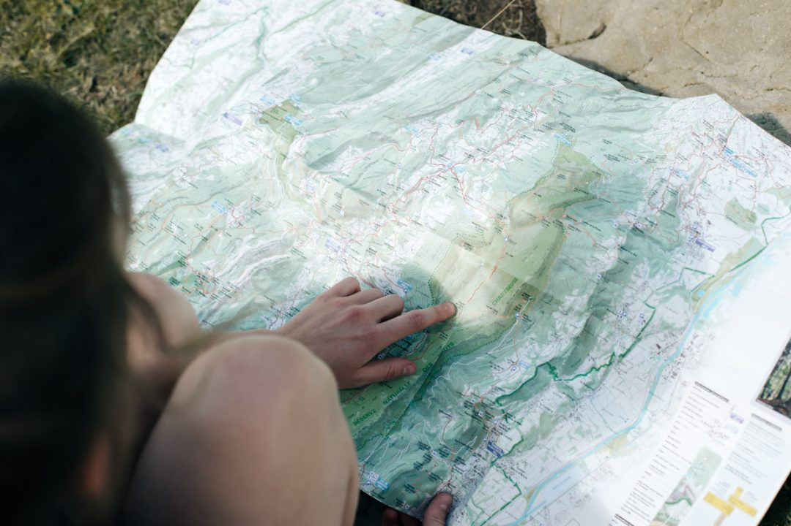
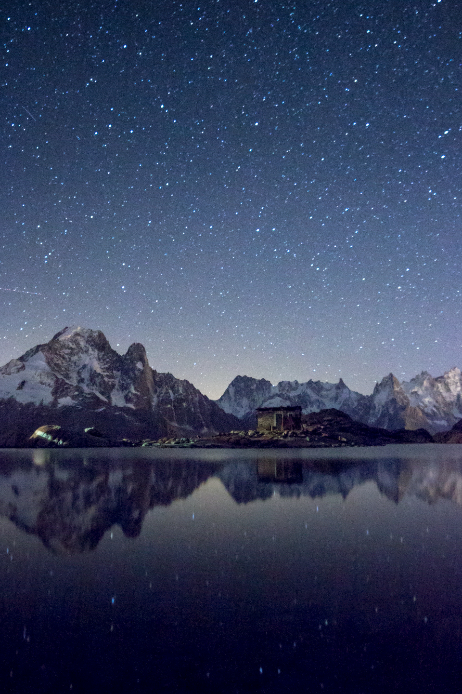
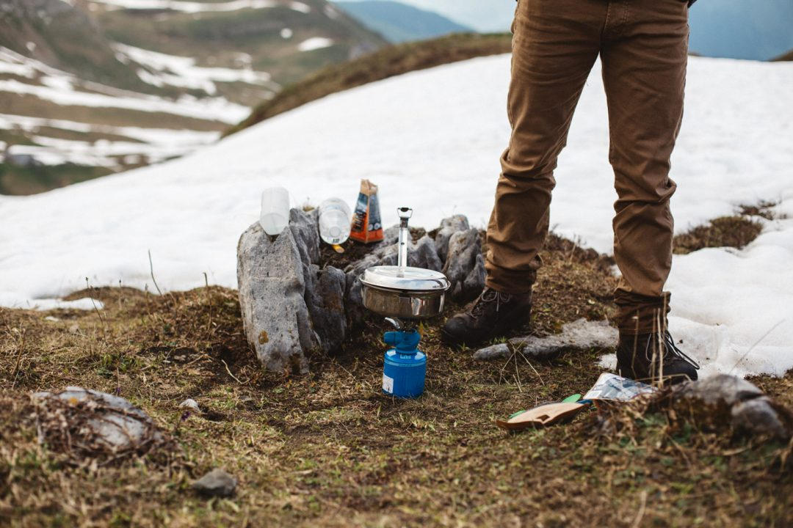
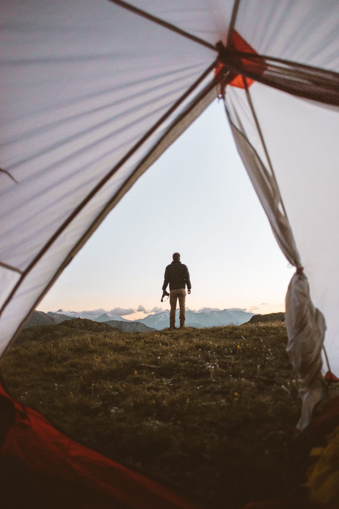

En manque d'aventure ? Et si la solution était de tenter l'expérience et partir en randonnée bivouac ?

Avec l'afflux de belles images de montagne sur les réseaux sociaux comme Instagram, on peut très vite être tenté de tenter l'aventure bivouac en montagne. C'est l'une de mes aventures préférées et si elle est accessible à un grand nombre, il faut toutefois ne pas oublier que ça se passe en montagne et qu'il est important de ne pas négliger les préparatifs. Préparer et réussir une randonnée bivouac en va de votre sécurité en montagne. Que vous partiez en [bivouac en hiver](https://jeremyjanin.com/conseils-pour-partir-en-bivouac-en-hiver/) ou en été, voici donc quelques conseils tout droit tirés de mon expérience personnelle.

_Disclaimer : je ne suis pas guide ni professionnel de la montagne, ce sont donc des enseignements et leçons uniquement tirées de mon expérience personnelle à force de partir en randonnée bivouac depuis plus de 4 ans._

### **Choisir de partir en randonnée bivouac accessible pour une première fois et bien connaître sa forme.**

Bien qu'étant accessible au plus grand nombre, il est important à mon sens de ne pas négliger le fait qu'un bivouac se passe en pleine nature et donc qu'il y-a plusieurs éléments qu'on ne maitrise pas et donc qui peuvent avoir un impact sur notre sécurité (la météo, la difficulté physique et technique du parcours, la praticabilité en fonction de la saison,...). Il est donc primordial de ne pas se sur-estimer avant de se lancer pour sa première randonnée bivouac. Il vaut mieux rentrer en se disant qu'on en veut encore plus la prochaine fois que rentrer dégoûté de l'expérience.

Pour quelqu'un qui n'a pas spécialement l'habitude de randonnée, je recommanderais pour les premières de partir en randonnée bivouac avec moins de 700m de dénivelé positif, c'est déjà une randonnée plus qu'honorable et qui peut permettre d'atteindre des sommets vraiment canons.

Au fil de mes sorties en montagne, je sais quel type de paysage me plait plus que d'autres et sur quel type de terrain j'aime évoluer. Avec l'expérience, ça me permet donc d'être plus exigent sur les endroits que je cible pour vraiment en prendre plein les yeux. Etant passionné de belles images, la dimension visuelle du lieu où je randonne est primordiale dans mon choix. La nature est toujours belle mais j'aime aller dans des endroits qui me dépaysent et m'apportent ma dose d'aventure dont j'ai vraiment besoin.

### **Trouver où partir en randonnée bivouac**

Pour mes préparatifs avant de partir en randonnée bivouac, j'utilise le site d'[**Altitude Rando**](https://www.altituderando.com/spip.php?page=facette-topos) qui est une mine d'or selon moi. Je cherche des randonnées qui correspondent à mon envie du moment en terme de paysage, massif montagneux, difficulté, dénivelé... J'aime aussi trainer sur [**Camp to Camp**](https://www.camptocamp.org/) pour approfondir les recherches sur un sommet ou une rando. Lorsque je vise des week-ends randonnée bivouac de mi saison type printemps ou début d'hiver, je vérifie l'enneigement en regardant les récentes sorties postées par les membres du forum de **[Skitour](http://www.skitour.fr/).** J'ai souvent planifié une rando dans un coin, tout préparé et puis à 2 jours du départ, je fais un tour sur le forum et là, je découvre que quelqu'un était dans le secteur en ski de rando. Je recommence donc de zéro dans ces cas là pour trouver une autre randonnée dans un autre massif ou moins élevée pour ne pas rencontrer la neige et ne pas atteindre mon objectif.

Une fois la randonnée trouvée, il convient de vérifier si on est autorisé à bivouaquer là où on va. Pour ça, le mieux reste de contacter l'Office de Tourisme à proximité du point de départ de la randonnée ou le parc dans lequel vous allez évoluer pour poser la question.

Tâchez de partir au moins à deux, une blessure ou un accident est vite arrivé et puis c'est plus fun quand on le partage. D'un point de vue sécurité, laissez aussi les infos à un proche qui ne vient pas avec vous pour qu'il sache précisément où vous allez et quand vous prévoyez de revenir... au cas où, si vous n'êtes pas rentré à l'heure prévue, pour lancer des recherches en conséquence. Enfin, n'oubliez pas de partir avec un téléphone portable, même si parfois ça ne capte pas, on trouve souvent des endroits avec du réseau en montagne et ça peut littéralement vous sauver la vie en cas de besoin.

### **Vérifier la météo jusqu'au dernier moment avant de partir en randonnée bivouac**

Se prendre un gros orage en montagne n'est jamais fun et peut vite être dangereux. J'ai le souvenir d'une sortie aux Aiguilles de Chabrières dans les Hautes Alpes, où j'étais dans la tente prêt à dormir quand l'orage est arrivé sur nous et qu'à 23h, on a du redémonter tout le campement installé 3h plutôt et redescendre à toute vitesse avant qu'il n'arrive sur nous. Grand bien nous en a pris, car en arrivant à la voiture à 2h du matin, la grêle s'est mise a tombé, la pluie n'a pas cessé et le vent a soufflé très fort. Si on était resté sous la tente, ça aurait très vite pu partir en _live_.

C'est le genre de situation à éviter, surtout lorsqu'on décide de partir en randonnée bivouac pour la première fois et donc sans expérience. En montagne, il faut être lucide sur sa forme mais aussi sur les éléments qui nous entourent. Même si parfois ça fait mal de devoir faire demi tour, il faut être humble et raisonnable face à la nature car tout peut très vite tourner. Il est donc crucial de bien vérifier la météo les jours précédents la randonnée, et le matin même avant de partir, puis re-vérifier le bulletin météo local en se rendant ou en contactant l'office de tourisme ou la station locale.

Pour un premier bivouac, je vous conseillerais de tenter l'expérience fin de printemps ou pendant l'été, il y fait plus chaud la journée mais les nuits ne sont en général pas trop froide pour éviter la surprise de la tente gelée au petit matin et ne plus fermer l'oeil depuis 2h du matin car on est congelé sous la tente, à attendre désespérément que le soleil se lève pour réchauffer le corps.

### **Partir en randonnée bivouac bien équipé est primordial**

Pas facile de partir en randonnée bivouac en ayant directement le bon matériel et pourtant il en va de votre confort et de votre sécurité que d'être bien équipé.

Au moment de s'équiper, la clé est de trouver le bon équilibre entre poids / qualité / budget tout en évitant de surcharger le sac à dos car il n'y-a rien de pire qu'un sac à dos beaucoup trop lourd qu'on garde sur les épaules pendant plusieurs heures. Vous lirez beaucoup dans ces lignes que partir léger est primordial. Si acheter du matériel light aide grandement, une grande partie du poids du sac initial peut être réduit si on est rigoureux et strict dans le tri. Randonner léger c'est surtout apprendre à se passer de ce qui n'est pas nécessaire.

Je pars le plus souvent en bivouac en moins de 24h, en démarrant ma rando en début d'après-midi et en revenant le lendemain dans la matinée. Pour ce type de sortie courte, je conseille d'opter pour un sac à dos de 35L / 40L mais évitez plus, car plus on a de place, plus on est tenté d'en mettre et donc d'alourdir le sac. J'utilisais un [**sac à dos Millet Ubic 40**](http://amzn.to/2qtGEWP) dont j'étais pleinement satisfait pour son rapport poids / qualité / prix / confort mais je suis désormais passé au [Salomon XA 35](https://amzn.to/3qy2J5G) nettement plus léger et plus pratique avec ses poches avant pour la flasque notamment.

Pour dormir, j'utilise :
- [Matelas Thermarest NeoAir](https://amzn.to/2Syz1Rs) isolant pour ne pas avoir de déperdition de chaleur par le sol
- Sac de couchage Cumulus Panyam 350 qui permet de dormir confortablement avec des températures autour de -2°c
- [Tente NatureHike Cloud Up 2](https://amzn.to/3qCM0Oz) pas chère et légère pour une deux personnes.

Et je ne pars jamais sans ma lampe frontale ultra légère et puissante, rechargeable en USB : [NiteCore NU20](https://amzn.to/3dp31Xf)

Un bon bivouac passe aussi par une bonne nuit à passer sous la tente. Outre le fait d'opter pour une tente légère et robuste, avoir un bon sac de couchage est primordial. Même en été en montagne, la nuit, la température peut descendre proche du zéro autour de 2500m d'altitude. Faire le choix d'un bon sac de couchage chaud, compact et léger peut vite couter plusieurs centaines d'euros mais c'est l'un si ce n'est LE choix à ne pas négliger. Au moment du choix, pensez à regarder la température de confort plus que la température minimale, mais aussi le poids et l'encombrement dans le sac. C'est en faisant attention à ces détails qu'on finit par partir avec un sac pas trop lourd, car n'oubliez pas qu'il y-a aussi l'eau et la nourriture à transporter en plus du matos pour être au chaud, le matériel pour se faire à manger, etc...

Je reviendrai prochainement dans un article dédié sur le matériel indispensable à emporter pour une nuit en montagne.

### **S'hydrater et s'alimenter correctement**

L'alimentation et l'hydratation sont des points non négligeables à soulever avant le départ. Selon où vous allez, regardez s'il n'y-a pas un refuge sur le chemin où vous pourriez re-remplir en eau potable par exemple, sinon prévoyez suffisamment d'eau pour tenir pour votre effort à la montée, pour le soir et le lendemain matin. On parle en général de 0,5L d'eau par heure d'effort, mais tout dépend aussi vos besoins si vous buvez beaucoup ou non. Dans tous les cas, le corps perd beaucoup d'eau, surtout pendant l'effort et par fortes chaleurs (ou froid !), ne négligez pas l'eau que vous emmener pour éviter la déshydratation.

Pour se nourrir, prévoyez des aliments riches en calories pour tenir face au froid notamment. Rien de tel que des biscuits petit déjeuner type Belvita à glisser dans le sac en plus de barres de céréales notamment à grignoter en cas de fringale ou au petit dej'.

Les fruits secs et les noix sont aussi bons à emporter et consommer en montagne. Pour le dîner c'est selon vos choix et ce que vous voulez porter. Tâchez d'opter pour un dîner pas trop lourd mais qui tienne au ventre et vous permette de vous faire plaisir après l'effort et surtout de récupérer des efforts du jour et anticiper ceux du lendemain. La [nourriture lyophilisée](http://amzn.to/2pI1AMK) peut être une bonne solution pour réduire l'encombrement et le poids dans le sac.

Niveau matériel pour me nourrir j'utilise :
- [Tasse en titane](https://amzn.to/3w2t4tJ)
- [MSR Pocket Rocket 2](https://amzn.to/2TlinFc)
- [Cartouche de gaz MSR](https://amzn.to/3x9IHAY)
- [Une Spork](https://amzn.to/3Aa18aM)
- [Gourde Klean Kanteen 800ml](https://amzn.to/2SAEPdl) ou ma [gourde Nalgene 1L](https://amzn.to/3xhgZCc)
- [1x flasque 500Ml Salomon](https://amzn.to/3wapWw8)

### **Partir en randonnée bivouac et respecter le Leave No Trace**

Dernier point et non des moindres avant de partir en randonnée bivouac et partout en pleine nature : respecter le _Leave No Trace_. Qui aime arriver dans un endroit en pleine nature, se sentant seul au monde, mais découvrir des détritus, canettes et autres déchets laissés par d'autres randonneurs ? Personne... alors pourquoi le faire ?

Si on est capable de transporter sa nourriture pleine dans son sachet à l'aller, on a aucune excuse pour ne pas redescendre les emballages vides, car le sac est encore plus léger au retour du fait d'avoir consommer leur contenu. Je vous invite à lire les  [**7 principes de Leave No Trace**](https://lnt.org/learn/7-principles) sur le site de l'association. Tout est plutôt affaire de bon sens, mais a priori, tout le monde n'a pas la même définition de bon sens :)
