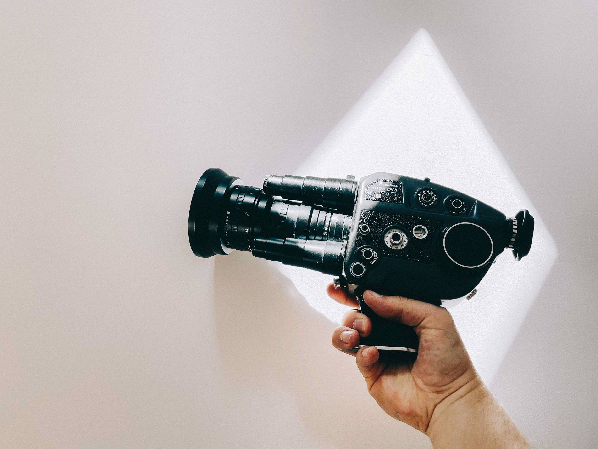
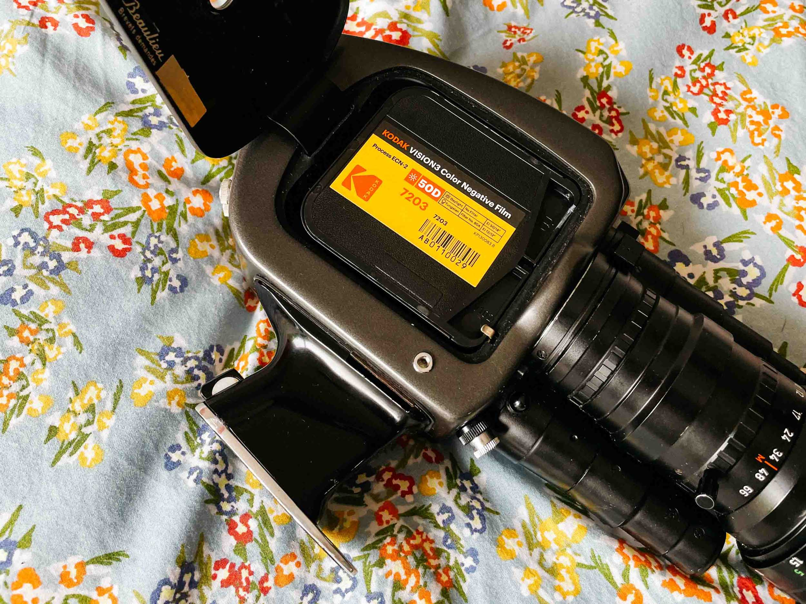

### 1 - Ne pas chercher à tout filmer à la Super 8 !

L'excitation des débuts une fois qu'on a sa caméra, c'est de vouloir tout filmer à la Super 8. Or, on se rend bien compte que ça a un certain coût, donc il vaut mieux être sélectif dans ses choix, et surtout, tout ne s'y prête pas. Personnellement, j'utilise la Super 8, soit comme un parti pris créatif dans un projet vidéo, soit et surtout comme moyen de documenter des moments du quotidien ou en famille sur un médium qui transmet directement une certaine émotion.

   

### 2 - Surveiller combien de film Super 8 il vous reste

C'est LE piège de la Super 8. Il n'y-a (souvent) pas de voyant ou d'information lorsque la bobine est terminée donc si vous ne voulez pas filmer tout une journée alors que vous avez terminé votre bobine la veille, il faut surveiller de près combien de film il reste sur votre bobine. Une bobine fait 15 mètres de long. En filmant en 18 images par secondes, vous pouvez filmer autour de 3min 10ec, et autour de 2min 20sec si vous filmez en 24 images par secondes. Les caméras Super 8 sont pourvues d'un compteur, mais il n'est pas très précis, donc ce n'est pas évident de savoir exactement quand il n'y-a plus de bobine. Avec l'expérience, on arrive à ne pas manquer trop d'image. Une chose à savoir, c'est que si vous avez un doute, vous pouvez toujours sortir la bobine. Seuls les 7 derniers "frames" seront alors cramés par le contact avec la lumière (donc à peine une demi seconde d'image). Lors qu'une bobine est exposée, elle doit afficher *"exposed"* quand vous la sortez de la caméra.

### 3 - Tungsten ou Daylight : penser à régler sa caméra en fonction de la balance des blancs d'une bobine Super 8

Si vous achetez une bobine Kodak Vision 3 50D, la bobine est calibrée pour filmer en plein jour. Or, si vous optez pour une 200T ou 500T il s'agit de films "Tungsten", déjà corrigés pour filmer en intérieur notamment. Très souvent, les caméras Super 8 sont équipés d'un bouton qui permet d'activer un filtre orange dans la caméra et qui permet d'utiliser une bobine tungstène pour filmer en extérieur et corriger le rendu "bleu" naturel de la chimie de la bobine. Donc en fonction de votre choix de bobine, pensez à vérifier comment régler votre caméra pour filmer de jour ou de nuit, surtout si vous prenez une bobine tungstène.



### 4 -  Ne pas négliger son labo de développement et de scan Super 8

Le développement et le Scan de vos images, c'est assurément LA partie à ne pas rater pour la Super 8. C'est cette étape qui va révéler vos images ! Ne perdez pas votre temps avec les scanners du commerce, une pellicule a une latitude incroyable dans l'image et ces scanners domestiques ruineraient ça. Faute de bon labo moderne en France pour développer et scanner la Super 8 (croyez moi, j'ai testé !), j'ai fait des recherches pour trouver un bon labo en Europe avec des prix qui resteraient abordables pour de la Super 8, et depuis que j'ai trouvé [**Mutascan**](https://mutascan.film/) à Helsinki, je ne regarde plus ailleurs. Leur service client est incroyable de gentillesse et de réactivité, et la qualité du développement et du scan est superbe, avec des scans hyper personnalisables en réglage, jusqu'en 4K.

{}
**À LIRE AUSSI... [Comment développer et scanner ses bobines Super 8 chez Mutascan : le processus complet](https://jeremyjanin.com/developper-scanner-super8)**
{}

   

*À gauche : un scan réalisé dans un labo Français de basse qualité / À droite : un scan 4K réalisé chez Mutascan*

### 5 - Privilégier les clips courts pour filmer à la Super 8

Le format Super 8 évoque essentiellement des souvenirs et de la nostalgie. On ne produit a priori pas de documentaire de 52 minutes à la Super 8 aujourd'hui. Privilégiez donc de filmer des clips courts qui s'enchaineront au montage. Pour ma part, je compte entre 3 et 4 secondes par clip, et fini toujours par enlève quelques dixièmes au moment du montage. Je préfère séquencer une action en plusieurs petits clips de 3-4 secondes qu'un long sur une action qui durerait longtemps.

### 6 - 18fps vs 24fps

Le nombre d'images par secondes en Super 8 est directement lié au rendu qui le rend aujourd'hui plus populaire et qui évoque la nostalgie. Même si certaines caméras, dont la mienne, permettent de filmer en 24 images par secondes (la norme moderne aujourd'hui et pour laquelle le cerveau interprète une image comme fluide), je préfère utiliser le 18 images par seconde. L'image est à peine moins fluide qu'en 24 images par seconde, en revanche, il y-a ce petit truc en plus qui saccade très légèrement à 18 fps qui procure beaucoup de charme aux images. En plus, étant donné qu'on enregistre sur une bobine et non sur une carte mémoire, filmer en 18 fps permet de filmer plus de temps à bobine équivalente. J'enregistre environ 3min10 sur une bobine de 15m à 18 images par secondes. Si je filmais en 24 images par secondes, je ne pourrais filmer que 2 minutes 40.

Sauf choix artistique délibéré pour un projet professionnel par exemple où le 24 images par secondes pourrait s'imposer, le 18 images par seconde reste mon option de choix pour ma part.

### 7 - Garder un oeil sur l'exposition de la bobine Super 8

C'est comme pour de l'argentique, il vaut mieux sur-exposer que sous-exposer une bobine de film, contrairement aux caméras numériques. Donc si vous filmez en auto, assurez-vous d'avoir toujours assez de lumière par rapport à la sensibilité de votre bobine et l'ouverture de votre objectif. Si vous filmez en manuel, tâchez d'exposer correctement pour ne pas avoir d'image sous exposée, qui est difficile voire impossible à récupérer, même scannée en LOG.

{}
**À LIRE AUSSI...[Comment filmer à la Super 8 : tous mes conseils.](https://jeremyjanin.com/filmer-super8)**
{}

### 8 - Se renseigner et faire les bons choix.

La Super 8 est un loisir qui implique un certain coût, de l'achat de la caméra au développement en passant par l'achat de bobines. Je vous conseille de bien vous renseigner sur **comment filmer à la Super 8** en amont, de prendre le temps de choisir une caméra qui répond à vos attentes et si vous pouvez, achetez la auprès d'un spécialiste qui peut vous garantir qu'elle fonctionne. On trouve beaucoup de caméras sur Le Bon Coin ou eBay, mais beaucoup ne fonctionnent plus malheureusement. C'est le cas notamment de beaucoup de caméras en plastique type Canon ou Chinon. Ce n'est bien sûr pas une généralité, mais je n'aimerais pas dépenser près de 200€ de bobines / développement / scan pour m'apercevoir que la caméra ne fonctionne pas. Personnellement, j'ai acheté ma caméra auprès d'un passionné qui restaure des Beaulieu et qui pouvait me garantir que tout fonctionnait parfaitement, la batterie avait même été refaite à neuf.

Pour ce qui est de votre choix de bobine, prenez le temps de comparer en ligne le rendu des images entre les bobines qui vous attirent pour voir ce qui correspond le plus à vos attentes. J'ai filmé tout un été avec une Kodak Vision 3 50D, j'ai décidé de passer sur une Kodak Vision 3 200T pour filmer en hiver à New York. Je suis ravi, mais je la trouve par exemple trop granuleuse et je vais désormais rester sur la 50D toute l'année.

Voici mes 8 conseils pour filmer à la Super 8. Je vous recommande aussi de lire mes [conseils pour filmer à la Super 8](https://jeremyjanin.com/filmer-super8) où je rentre davantage dans les détails.

Envie d’échanger sur le sujet avec moi ? Rejoins-moi sur [Twitter](https://twitter.com/jeremyjanin) ou sur [Discord](https://discord.gg/rvk5DTwT8H) !
