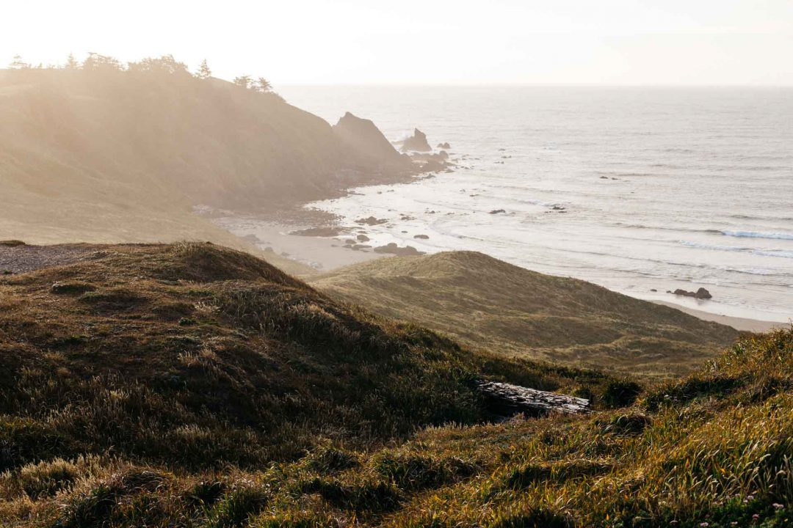
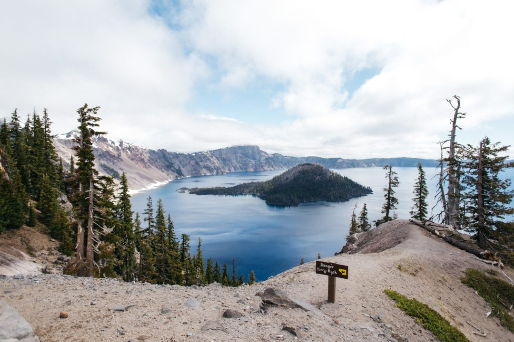

Il est temps de finir nos derniers miles le long de la côte de l'Oregon, avant de franchir une nouvelle frontière en hurlant "_Californiaaaaa, Californiaaaaa, here we cooooooome_". Nous avons vu tous les phares de la côte de l'Oregon, nous avons vu des couchers de soleil incroyables et même si la pluie ne nous aura pas lâché, je garde un souvenir impérissable de cette belle côte Pacifique. On a quitté l'Oregon en lui disant "à demain", on a salué la Californie en s'excusant car ça serait bien court. On poursuit notre périple le long de la côte de l'Ouest Américain sur la route 101 qui nous mène jusqu'à Crescent City, à 300miles au nord de San Francisco, pour avaler un déjeuner avant de nous faufiler dans l'immense forêt de Redwood National Park. On quitte cette route que nous avons suivi depuis notre départ tout en haut avec un pincement au coeur.

      

Le prix des campings pour garer la voiture nous font halluciner et même modifier nos plans. On a profité de cette lumière incroyable de fin de journée pour faire des photos et marcher dans le parc national mais finalement, à la nuit tombée nous décidons d'entamer notre route retour en direction de Seattle pour nous rapprocher de la frontière avec l'Oregon.

           

Le lendemain matin, on suit les panneaux qui nous mènent jusqu'à Jacksonville où Samantha tombe littéralement en amour pour ce village presque fantôme. Entre vitrines antiques, façades en bois d'époque, le dépaysement continue, on se croirait revenu à la période de la ruée vers l'or. On jette un oeil à travers la vitre du barbier, on descend dans les sous-sols des brocanteurs, on s'arrête devant une vieille voiture. C'est d'ailleurs ici que nous trouverons notre première plaque d'immatriculation Californienne, bien décidés à en rapporter une de chaque état des USA pour habiller le mur de notre chambre. L'aventure continue et ne cesse de nous surprendre !

On poursuit finalement notre chemin sur une route magnifique à travers la campagne de l'Oregon après avoir laissé la Californie derrière nous pour de bon. On reprend la route entre fermes et champs à perte de vue, l'ambiance est irréelle et nous donne déjà envie de revenir. On perd des degrés au rythme des kilomètres, le paysage défile en même temps que les vêtements s'enfilent. Ce dépaysement est fou et inattendu, on passe de la forêt à la montagne, de la neige au désert en quelques encablures. La route serpente et s'élève jusqu'à arriver à l'un des lieux que j'attendais le plus durant ce voyage : _Crater Lake_.

      

Le lieu est recouvert petit à petit par le brouillard mais l'immensité et la majesté de ce lac et de cratère au milieu me coupent littéralement le souffle. La beauté du lieu est magique, hallucinante et indescriptible.

Ca faisait longtemps que je n'avais pas vu une montagne digne de ce nom, depuis mon départ de France à vr ai dire, et bien force est de constater que là j'ai eu ma claque. Je me suis assis, me sentant tout petit, et me suis tu. La claque est grande, l'émerveillement intense, le bonheur immense.

Quelle joie de voir cela et de le partager.

\[video width="1280" height="720" mp4="http://jeremyjanin.com/wp-content/uploads/2015/02/craterlake.mp4"\]\[/video\]

On décide de prendre notre diner à flanc de montagne pour voir la nuit enlacer le cratère sous un brouillard épaississant mais surtout face à une vue inoubliable. Nous décidons de passer la nuit dans le parc. Au passage, Samantha a su se faire remarquer au parking au moment de réserver notre place en appuyant sur l'alarme de la voiture au lieu du bouton "ouverture centralisée" et ainsi avoir tous les regards rivés sur elle et notre voiture. Ahem. Je vous passerais l'épisode du fou rire énorme qui c'en est suivi, des larmes, des crampes d'estomac même. Niveau discretion pour notre arrivée, je crois qu'on a battu un record là. Bref, remis de nos émotions, nous nous emmitouflons sous la couette à la recherche du moindre carré de chaleur, car le froid sévit fort dehors.

       

Le verdict est sans appel. Il fait -1°c ! Je sors en short sans voir venir la chose, ça pique un peu, mais amplifie mon côté "comme un gosse" dans ce lieu unique. Même si le réveil dans la voiture par cette fraicheur est un peu dur, aucun regret de dormir ici et de cette manière. L'aventure bat son plein et je suis le plus heureux du monde à ce moment précis. Voir que Samantha y prend goût et voir tous ces paysages, me rend tout simplement heureux. Que c'est bon, que c'est beau !

Il y a quelques heures il faisait 20°c, et au réveil nous avons été accueilli par les flocons de neige qui tombent du ciel.

On profite du calme de Crater Lake, on lui jette un dernier coup d'oeil, on remonte sans un bruit dans la voiture, refusant de s'en éloigner. Je pourrais rester ici encore quelques jours juste assis là, face à cette vue, sans bruit. La route redescend petit à petit pour nos amener en direction de Bend avant de filer vers Painted Hills et sa région semi-désertique. Passer de la montagne enneigé au désert en l'espace d'une journée est déroutant, hallucinant et tout simplement fou. Encore une autre belle étape de ce voyage dont je vous reparle très vite.

_P.S : Crater Lake, I love you._
