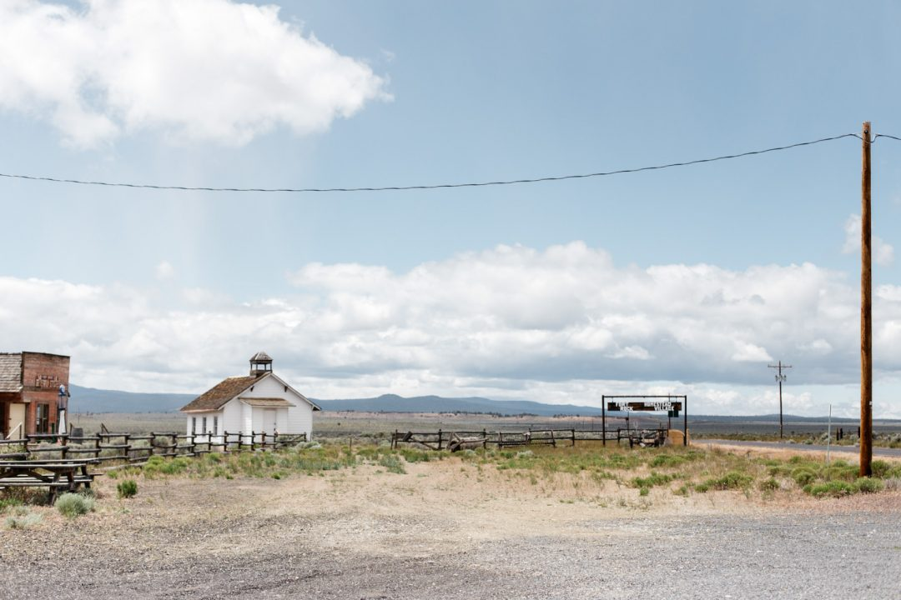
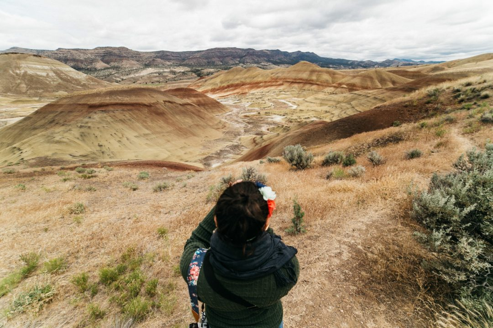

La fin du roadtrip approche à grand pas lorsqu'on aperçoit [Crater Lake](http://jeremyjanin.com/coup-de-coeur-pour-crater-lake) dans notre rétroviseur, le coeur serré de quitté ce lieu magique et déjà excité de voir Painted Hills et ses paysages désertiques. Les miles s'enchainent et le paysage change, nous excités de découvrir la suite et tristes de sentir que petit à petit nous nous approchons de la fin du voyage. On s'échappe et on profite de cette liberté que nous offre la route, on taille la route, ce roadtrip excède toutes nos attentes, continuons à le rendre inoubliable !

     

On quitte les virages sinueux et brumeux de la montagne pour voir la route s'étirer et les lignes droites s'enchainer. Quelques heures de route plus tard, nous arrive à John Day Fossil Beds, le coin qui regroupe des paysages arides à l'opposé total de tout ce que nous avons vu depuis le début de ce voyage, nous sommes venus pour Painted Hills, nous avons avant ça découvert Fort Rock et la claque fut grande.

Nous étions seuls ici, on immortalise le vieux village avant de nos décider à monter au sommet de ce promontoire rocheux au milieu de nulle part pour profiter de la vue sur cette immensité plate. La vue en haut est à couper le souffle, on escalade quelques pierres pour gagner quelques mètres et se protéger du vent. Le spectacle est hors norme, on surplombe toute la plaine aride. Je me revois sur la cote Ouest de l'Australie quelques années avant. Le lieu est magique !

       

Une fois remis de nos émotions et retourné sains et saufs à la voiture, on reprend la route toujours plus vers le nord, les terres intérieures de l'Oregon continuent à nous gâter en nous offrant des surprises à chaque nouveau virage. Cet état de l'Oregon est une pépite, un bijou rien que par la diversité des paysages. Si vous avez suivi mes articles de ce roadtrip, vous devez comprendre de quoi je parle. Imaginez vous passer de la cote aux falaises abruptes qui se jettent dans le Pacifique, de la forêt verte et brumeuse, à la montagne au sommet enneigé et là, maintenant, le desert avec sa plaine à la végétation aride et au sol rocailleux. Voilà 3 semaines que nous voyageons. DANG, quelle claque, mais quelle claque !

On poursuit notre route pour aller vers Painted Hills où on s'apprête encore à être surpris, à se sentir tout petit face au paysage. Et la surprise fut grande. Ca me parait presque banal de dire que nous avons pris une claque et pourtant croyez moi, ce fut le cas à chaque fois, il n'y en a pas eu une moins forte qu'une autre. A Painted Hills, c'est la couleur du sol et les courbes parfaites du terrain qui m'ont vraiment bluffé, je n'avais jamais rien vu de pareil, on a envie de se jeter dedans tellement ça a l'air moelleux et rebondi.

          

Le temps de finir mon timelapse et d'avaler quelque chose à manger nos reprenons la route de Bend pour une pause ravitaillement et c'est à regret que nous la quittons aussi vite. Cette ville qui ne payait pas de mine sur la carte lors de nos préparatifs est en vérité l'une des Mecques de la culture outdoor Américaine. _Comment ai-je pu manquer ça ? Comment ?_

Dommage, on reviendra visiter cette jolie ville lors de notre prochaine venue, c'est sûr. On décide de couper le moteur pour la nuit dans la ville de Prineville, on s'arrête en haut de la colline avant d'arriver pour profiter des dernières lueurs de la journée avant de finir notre route à la lueur des phares où nous serons accueillis par la voie lactée.
