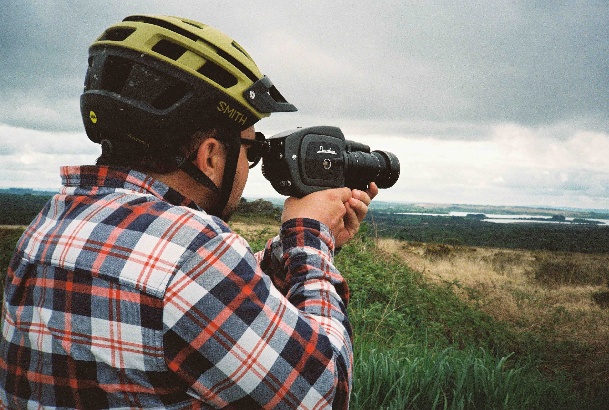
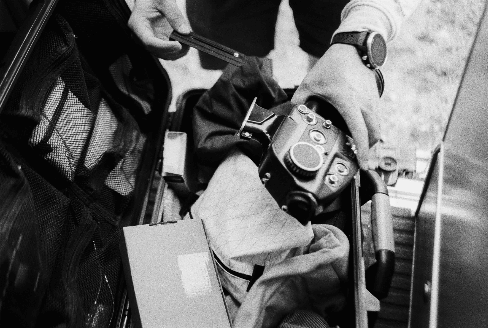
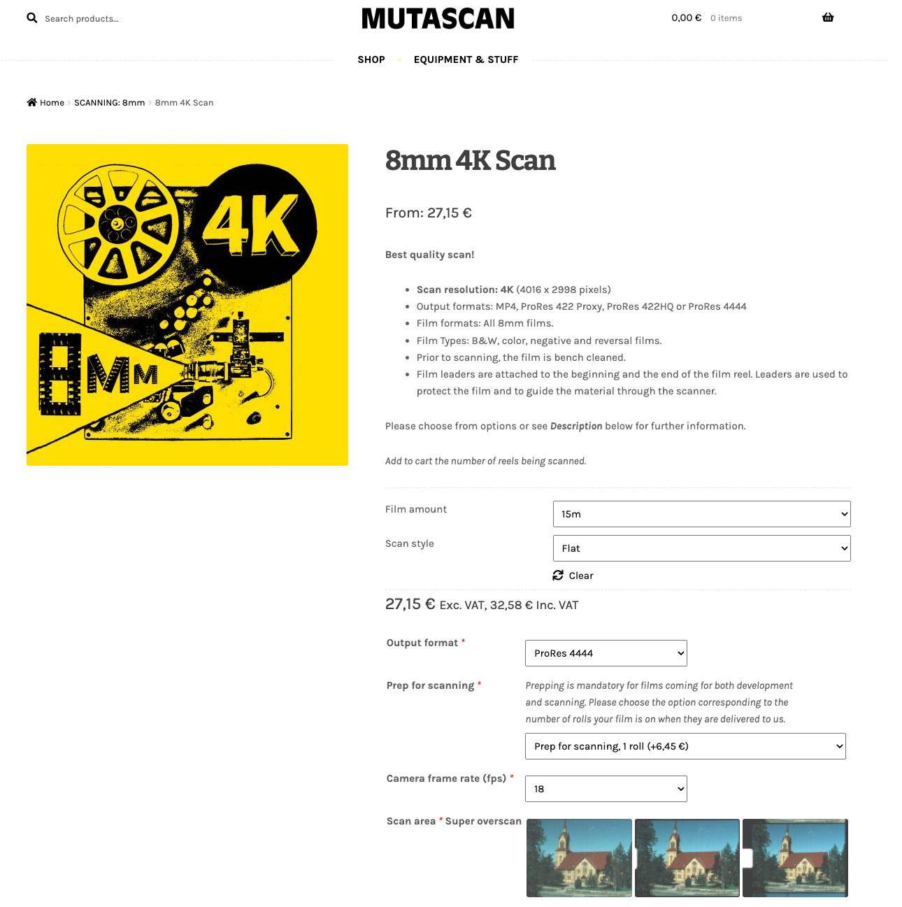

Voici pourquoi je fais développer et scanner mes bobines Super 8 chez [Mutascan](https://mutascan.film/) à Helsinki.

Depuis que j'ai commencé à filmer à la Super 8, je ne peux plus m'en passer. J'ai fait développer ma première bobine dans le seul labo en France mais je n'ai pas du tout été satisfait du service ni de la qualité du développement et de la numérisation. Je ne voulais toutefois pas laisser ce grain de sable dans la machine, m'empêcher de filmer à la Super 8. Je me suis donc mis en quête d'un nouveau labo hors de nos frontières. Après des heures de recherches et de comparatifs, de Berlin trop oldschool à Rotterdam qui manquait de retour utilisateurs en passant par Londres qui est trop cher avec la différence de monnaie et frais d'envoi ou l'Espagne qui ne proposait pas les options que j'attendais, j'ai finalement trouvé le labo qui me convient. L'équivalent d'un labo américain mais chez nous en Europe. Je ne suis pas payé pour vous parler d'eux, mais j'ai tellement mis du temps à trouver un bon labo et je suis tellement satisfait d'eux que je suis obligé de vous en parler.

**À LIRE AUSSI... [Comment filmer à la Super 8 : tous mes conseils.](https://jeremyjanin.com/filmer-super8)**

# OÙ FAIRE DÉVELOPPER ET SCANNER SES BOBINES SUPER 8 ?

J'en suis à près d'une dizaine de bobines développées chez [Mutascan](https://mutascan.film/) et comme je le dis dans mes 8 conseils pour filmer à la Super 8, il est crucial de trouver un bon labo, en qui on a confiance et dont le travail est propre. Initialement, je ne trouvais que des images de Finlandais quand je me suis renseigné sur eux donc j'avais du mal à savoir comment ça se passerait d'envoyer depuis la France vers chez eux. Quelques échanges de mails très réactifs plus tard, j'étais conquis et depuis, je suis sûr de ne plus jamais regarder en arrière. Ils investissent dans des scanners de haute qualité pouvant filmer de la Super 8 jusqu'en 4K, avec la possibilité d'avoir un fichier *LOG* et *ProRes 4444* sans sur-coût pour les plus aguerris ou des fichiers déjà traités au niveau des couleurs et dans un format moins lourd.

Pour vous aider à y voir plus clair dans cette marée d'options, voici comment je procède quand je passe commande pour faire développer et scanner mes bobines Super 8.



# DEVELOPPER SES BOBINES SUPER 8

Je choisis le développement de film 8mm pour bobine en *"[Color Negative](https://mutascan.film/en/tuote/8mm-color-negative-processing/)"* car je filme toujours avec des bobines négatives : **Kodak Vision 3 50D et 200T**. Pensez à vérifier que vous choisissez le bon en fonction de votre bobine.

Par exemple, choisissez *"Color Reversal"* si vous filmez avec une Ektachrome ou *"Black and White"* si vous filmez en noir et blanc.

# NUMERISER / SCANNER SES BOBINES SUPER8

C'est à cette étape que ça se complexifie un petit peu et qu'il faut faire le plus de choix :

### 1 - RESOLUTION

Choisissez la résolution dans laquelle vous souhaitez numériser vos images Super 8. Les options vont de 1,5K à 4K actuellement chez Mutascan, le prix n'est pas le même donc à vous de choisir en fonction de vos besoins et budget. Personnellement je choisis de [scanner en 4K ](https://mutascan.film/en/tuote/8mm-4k-scan/) mais beaucoup diront que ça ne sert à rien de scanner au dessus de 2,5K.

### 2 - LES OPTIONS DE SCAN

Une fois la résolution choisie, vous aurez plusieurs options à sélectionner :

- *Film amount* = longueur de votre bobine de Super 8. La plupart du temps les bobines font 15m.

- *Scan style* = Quel traitement souhaitez-vous sur votre image scannée ?

	**Flat** scanné en LOG, le fichier est décontracté et désaturé pour permettre une post-production plus fine et poussée. Il faut impérativement maitriser la retouche colorimétrique pour cette option sinon vous serez forcément déçus du rendus.

	**One Light** = Scanné et traitement colorimétrique appliqué sur l'ensemble de la bobine par le labo

	**Best Light** = Scanné et traitement colorimétrique personnalisé à chaque clip de la bobine par le labo. C'est le plus cher mais le plus personnalisé.

   

*À gauche : scan en LOG brut de chez Mutascan / À droite : Même scan une fois que je l'ai post-traité*

**Personnellement, j'opte pour le Flat pour pouvoir faire la colorimétrie moi même.**

### - Output format

À vous de choisir le codec / format de fichier que vous préférez. MP4 est le plus simple et le plus léger, ProRes 4444 s'adresse plus aux pros ou si vous voulez la meilleure qualité possible, tout en sachant qu'un scan de bobine pèsera autour de 80Go !
**Personnellement, j'opte pour le ProRes 4444.**

### - Prep for Scanning

Il s'agit là d'une option pour dépoussiérer et nettoyer votre film une fois développé, avant de le passer à la numérisation. C'est obligatoire à mon sens. Vous n'avez qu'à sélectionner le nombre de bobines qu'il y-a à nettoyer. Si vous ne le faites pas, vous aurez plus de poussières, poils et autres éléments parasites sur la bobine au moment du scan.

### - Camera Frame Rate

C'est important de stipuler à combien d'images par seconde vous aurez filmer.
**Personnellement, je filme en 18fps et sélectionne donc cette option dans ce menu déroulant**

Les autres options sont explicites, ajoutez autant de scans à votre panier qu'il y-a de bobines à numériser.

   
   

Voilà, il ne vous reste plus qu'à finaliser votre commande, préparer votre colis avec vos bobines et le tour est joué. Je choisis de toujours me faire renvoyer les bobines une fois numérisées, et j'en profite pour leur faire glisser une ou deux bobines neuves dans le colis pour couvrir mes besoins suivants.

**À LIRE AUSSI... [8 conseils pour filmer à la Super 8](https://jeremyjanin.com/conseils-super8)**

Ensuite, il faut être patient jusqu'au jour où le mail arrive avec le fichier scanné et là c'est comme le jour de Noël quand on découvre ces images Super 8.

*Kiitos Mutascan!*

Envie d’échanger sur le sujet avec moi ? Rejoins-moi sur [Twitter](https://twitter.com/jeremyjanin) ou sur [Discord](https://discord.gg/rvk5DTwT8H) !
