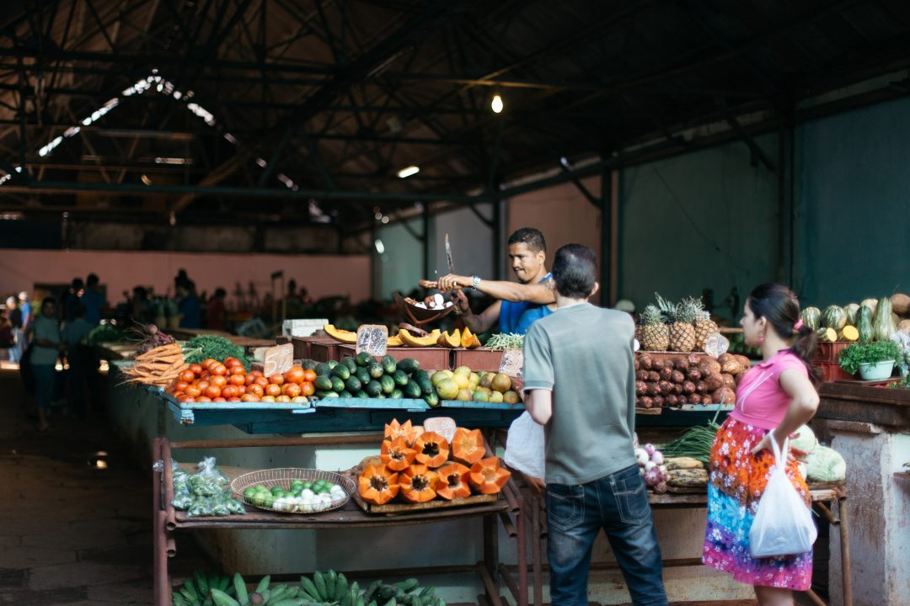
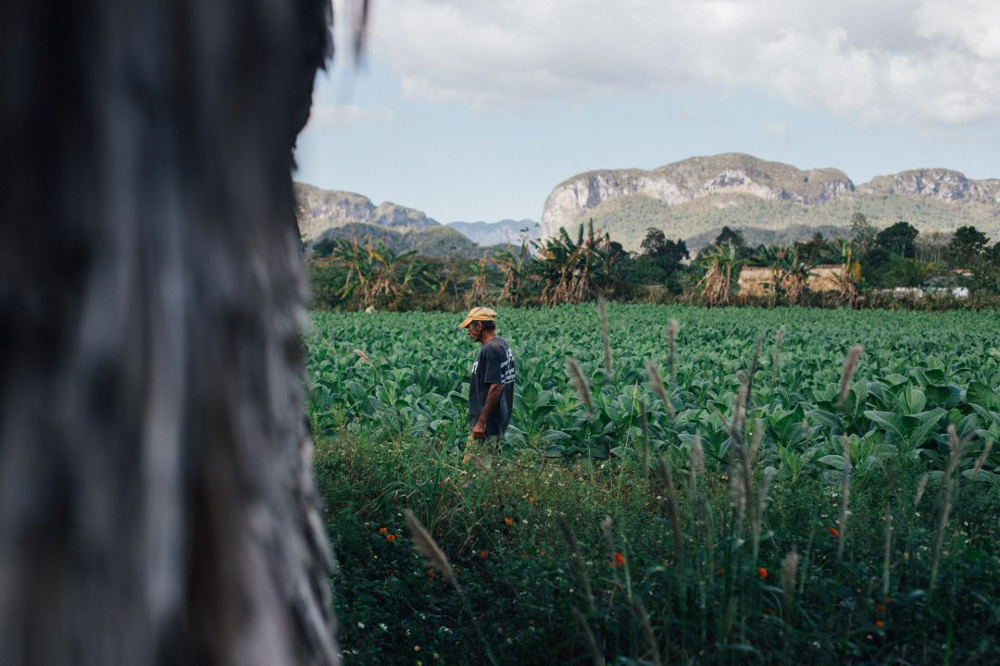
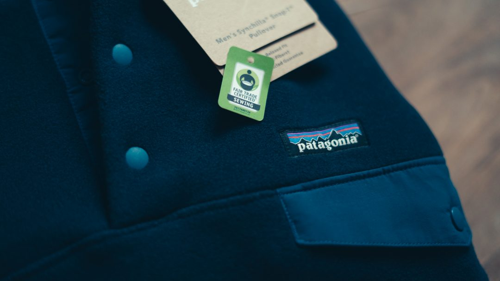
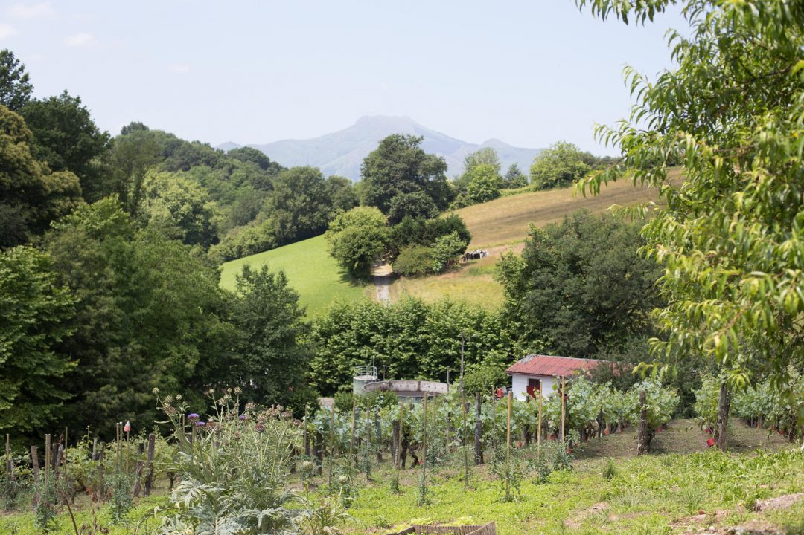

"Et si je devenais plus écolo ?" ce fut la phrase que je me répétais en début d'année. Aujourd'hui, j'ai décidé de me lancer à parler de ce sujet qui me tient à cœur mais pour lequel je ne me suis jamais suffisamment senti en confiance pour l'aborder : la protection de l'environnement, réduire son impact sur la planète, le consommer mieux, devenir écolo, être plus éthique, plus responsable... bref, l'écologie mais pas que. Loin de là. C'est un sujet vaste et je suis loin de le maîtriser parfaitement. J'y suis sensible depuis longtemps sur les choses les plus simples du quotidien mais 2017 aura été une année déclic sur ce sujet dans ma vie, alors... Pourquoi pas ? Je me suis rappelé ce pourquoi j'ai ouvert ce blog il y-a presque 10 ans : partager ce que je faisais et vivais. Force est de constater que la protection de l'environnement fait de plus en plus partie de mon quotidien; plutôt que donner des leçons, je vais partager ici mes découvertes, ce que je trouve au fur et à mesure de mon apprentissage, ce qui me fait ouvrir les yeux, hérisser les poils ou au contraire des solutions concrètes pour réduire mon impact environnemental. Je ne veux surtout pas tomber dans la moralisation, mais j'ai eu énormément de mal à trouver les bonnes informations pour savoir par où commencer. Peut-être qu'en partageant ici, je faciliterai un déclic envers l'un ou l'une d'entre vous qui me lisez et ça serait sûrement la plus belle des victoires. Cet article sert en quelque sorte d'introduction à d'autres qui suivront avec le temps. Alors, c'est parti ?

Si j'ai toujours été passionné par la nature, je m'aperçois que ma vision de ce qui m'entoure s'affirme et mon voeu de la protéger devient de plus en plus fort. Né en décembre, j'avais l'habitude, petit, de fêter mon anniversaire avec de la neige dans le jardin. Je me souviens aussi qu'en rentrant de l'école mes copains et moi nous précipitions pour aller jouer dehors... après avoir regardé les Minikeums. Sans passer pour un vieux con, beaucoup de choses ont changé d'un point de vue climatique mais aussi dans notre comportement sur le fait "d'aller dehors". Forcément, quand j'étais enfant au début des années 90, internet n'était pas là. Je ne tomberai pas dans le "c'était mieux avant", mais tout de même. Certains chiffres font froid dans le dos quand on voit qu'aujourd'hui les enfants passent moins de temps à l'extérieur que des détenus ! [(source)](http://www.lepoint.fr/societe/royaume-uni-3-enfants-sur-4-passent-moins-de-temps-dehors-que-des-detenus-26-03-2016-2028181_23.php)

Ça me révoltait aussi de retourner à la campagne, chez mes parents, et voir l'arrosage tourner dans des champs des jours entiers alors qu'il pleuvait _non stop,_ voir différents scandales éclater à propos des risques pour la planète et notre santé et finalement voir le sujet être étouffé quand il prend un peu trop d'ampleur_.._. Bref, pour tout ça et tant d'autres choses, sans pour autant tout comprendre. Ce sont ces petites interpellations additionnées à plusieurs discussions passionnantes avec des personnes un peu plus calées que moi sur le sujet qui m'ont amené à me poser des questions et à m'ouvrir à ce vaste sujet.

Depuis quelques années, on nous sature le cerveau avec des mots sans nécessairement savoir ce qu'ils signifient et sans pleinement en prendre la mesure. Les mots et les idées se mélangeaient dans mon esprit : " _Bio. Réchauffement climatique. Perturbateurs Endocriniens. Monsanto. Fast Fashion. Lobbies. Durable. Impact environnemental. Empreinte écologique. Circuit court._" et j'en passe. Ces mots étaient encore il y-a quelques mois, complètement ou en partie, flous pour moi. Je les comprenais sans les comprendre et pourtant ils m'interpellaient. Je cherchais à en savoir plus sans savoir par où commencer. Chaque nouvelle sortie sportive ou simple balade en pleine nature m'ouvrait un peu plus les yeux sur les problèmes qui nous entouraient. J'avais déjà l'impression de faire attention à la planète avec quelques gestes simples du quotidien comme beaucoup de personnes font mais rien de transcendant non plus. J'avais l'impression de faire les choses, non pas parfaitement, mais au moins pas trop mal. Je voulais agir, faire mieux que je ne le faisais déjà mais un grand sentiment de méconnaissance du sujet me bloquait.

À force de suivre certains sportifs et ambassadeurs de certaines marques eco-friendly, de voir leur mode de vie, certaines valeurs qu'ils transmettent... mais aussi les conseils de [Victoria](http://mangoandsalt.com) et [Laëtitia](http://eleusis-megara.fr) et j'en passe, m'a aidé à ouvrir les yeux et trouver quelques pistes. J'ai regardé des documentaires comme _DamNation, Cowspiracy ou encore Unbroken Ground_, qui m'ont fait prendre conscience de l'importance de bien consommer, bien se nourrir et protéger l'environnement. Je n'avais pas l'impression d'avoir un savoir étendu, mais la sensibilisation commençait à fonctionner et je trouvais quelques billes, ça et là.

#### LE CHANGEMENT, C'EST MAINTENANT

Finalement, j'ai pas mal discuté avec [Greg](http://santadenn.com), qui lui était un peu plus avancé que moi sur le sujet. J'ai aussi fait la rencontre d'Anaïs dont le [compte Twitter](https://twitter.com/AnaisElsaD/) (et ses [Instagram Stories](https://www.instagram.com/anaiselsa.d/)) sont très intéressants à suivre sur ce sujet. J'ai commencé à lire, regarder et comprendre ce qui se passait. Nous sommes donc passés à l'action avec [Samantha](http://paris-tu-paris.fr). Depuis 2 ans environ et notre retour du Canada, nous avons commencé par changer notre alimentation en passant à une consommation bio et en privilégiant les circuits courts autant que possible, avec des producteurs qui viennent d'un rayon de moins de 70 kms autour de chez nous. Tout le reste, on tâche au maximum de l'acheter en boutique bio et en respectant les fruits et légumes de saison, en privilégiant le vrac et en essayant d'acheter ce qui génère le moins de déchet.. Car bio ne veut malheureusement pas toujours dire écolo quand on voit parfois la quantité d'emballages. Si on devait changer des choses dans un premier temps, je voulais que ça fasse aussi une différence sur notre santé. Ce fut vraiment le pas vers un début de transition. Un jour par hasard, je suis tombé sur un test en ligne pour calculer mon impact écologique en analysant ma façon de consommer, de me déplacer, de vivre... Le résultat m'a choqué. Moi qui avais l'impression de faire attention à la planète, j'ai pris un coup de massu. Si l'ensemble de la population mondiale vivait comme moi, il nous faudrait 2,3 planètes pour produire suffisamment d'énergie, d'eau, de nourriture, pour absorber le CO2 rejeté dans l'air... pour vivre de manière durable. Or, aux dernières nouvelles, il n'y-a qu'une seule planète Terre et sans solution de repli possible connue à ce jour. J'ai envoyé ce test à 2 ou 3 amis et tous obtenaient un résultat aussi dramatique, voire pire parfois, végétariens ou non. Ce constat m'a glacé et m'a poussé à vouloir faire plus et surtout comprendre d'où ça venait, pourquoi et comment le contrer.

Au fur et à mesure des nouveaux changements, de nouvelles rencontres, je commençais à trouver plus d'infos, à m'informer et m'éduquer d'avantage.  Il y-a quelques mois, je pensais que l'on polluait _uniquement_ notre planète avec les déchets, l'élevage bovin, la _fast fashion_ et j'en passe. Aujourd'hui, et bien que je n'en sois encore qu'au début, je me rends compte qu'en plus de pourrir la Terre, on se pourrit notre propre santé avec certaines substances qu'on retrouve dans notre nourriture, nos produits cosmétiques, nos vêtements...

#### COMMENT AVONS-NOUS COMMENCÉ À MIEUX CONSOMMER ?

Avec ces premières réponses, j'ai découvert que cette bouteille en plastique qui trainait parterre et qui me révoltait, n'était en réalité que l'arbre qui cachait la forêt.

**Ce qu'on a changé facilement du jour au lendemain**

On a fait nos achats au marché avec des producteurs de la région. En plus de mieux manger pour notre corps, on réduit l'impact environnemental de nos fruits et légumes en achetant des légumes de saisons et cultivés autour de chez nous, ce qui signifie pas de transports en camions ou avion sur des longues distances donc moins de pollution.

On a banni les bouteilles d'eau en plastique pour les remplacer par des gourdes. On a opté pour des Kleen Kanteen qui sont membres d'_1% Pour La Planète_ et reversent 1% de leur chiffre d'affaires annuel à des associations de protections de l'environnement.

Nous avons éradiqué l'usage du sac plastique, et privilégions désormais nos sacs à dos et nos sacs réutilisables : tote bags, sacs en tissus légers pour les fruits et légumes ainsi que les denrées en vrac, sac à pain pour la boulangerie...

**Ce qu'on a changé avec le temps**

J'ai voulu aller plus loin et fabriquer certains de nos produits du quotidien, on se lave désormais qu'avec du savon de marseille (acheté dans le sud à la savonnerie Marius Fabre à Salon de Provence, garantie sans huile de palme). Je fabrique notre lessive et mon déodorant, nous avons aussi du savon noir pour laver le sol, par exemple. J'ai délaissé les cotons tiges au profit d'un [oriculi](http://amzn.to/2jq7IDx) (petit baton de bambou, on s'y fait bien et ne reviendrai pas en arrière. C'est très pratique en voyage en plus pour éviter d'emmener des cotons tiges.).

**Ce que j'aimerais encore améliorer prochainement**

Avoir un compost. Malheureusement, le lombricomposteur ne m'emballe pas en appartement à cause des vers. J'aimerais encore fabriquer mon dentifrice, trouver un shampooing qui ne soit pas bourré de perturbateurs endocriniens, mieux acheter mes vêtements même si j'ai déjà entamé un grand changement depuis quelques temps déjà, notamment en achetant des produits chez Patagonia. Si vous connaissez des marques éthiques, _fair trade_ et respectueuses de l'environnement (et idéalement françaises), n'hésitez pas à me les recommander.

#### COMMENT DEBUTER ?

Pour conclure ce premier article, voici quelques ressources que j'ai utilisé pour faire mes armes et commencer ma démarche plus green et plus responsable. Je ne dis pas qu'ils sont les références, mais ils m'ont aidé à passer de non-initié à "un peu plus calé" en la matière. J'espère donc que ça pourra servir à certain.e.s d'entre vous.

#### **QUELQUES RESSOURCES**

**Documentaires**

[2°c avant la fin du monde](https://youtu.be/Hs-M1vgI_4A)

[Demain, le film](https://youtu.be/Bk2LnbrXx_I)

[Before The Flood](https://youtu.be/D9xFFyUOpXo)

[Cash Investigation, le grand bluff des multinationales](https://www.francetvinfo.fr/replay-magazine/france-2/cash-investigation/cash-investigation-du-mardi-24-mai-2016_1454987.html)

[Harvesting Liberty](https://youtu.be/AXFQrhQsCyw)

**Livres**

[Greenlife](http://amzn.to/2jpf9dQ)

[L'Ecologie pour les nuls](http://amzn.to/2k2QakB)

[Zero Dechet](http://amzn.to/2jpdRj0)

**Pourquoi ce qu'on mange impacte la planète plus qu'on ne le croit ?**

[Unbroken Ground](https://youtu.be/3Ezkp7Cteys)

[Cowspiracy](https://youtu.be/nV04zyfLyN4)

**Mieux acheter ses vêtements et comprendre l'importance du commerce équitable :**

[The True Cost](https://youtu.be/OaGp5_Sfbss)

[Fair Trade](https://www.youtube.com/watch?v=Q1gIKo0kti4)

**Blogs à suivre :**

[Mango and Salt](http://mangoandsalt.com)

[Eleusis Megara](http://eleusis-megara.fr)

[The Green Eyes](http://thegreeneyes.fr/)

[L'atelier Green](http://latelier-green.com/)

[Je deviens écolo](https://www.jedeviensecolo.fr/)

Encore une fois, je ne suis pas plus légitime que les personnes que j'ai cité ici, mais je me dis que chaque voix compte pour faire plus et mieux protéger, mieux consommer. N'hésitez pas à me dire ce que vous en pensez, ce que vous aimeriez trouver ? Peut-être que parmi vous certains sont activistes ou mènent des actions pour sensibiliser les gens à des problèmes environnementaux pour aider à faire changer les mentalités ? Manifestez vous ! Vous connaissez des sources, des associations ou marques qui se bougent et qui mériteraient d'être mises en lumière de par leurs actions ? Je vous écoute.
