Depuis notre premier road trip, dormir dans une cabane aux États Unis était devenu une obsession. Lors de notre second road trip américain, après avoir découvert [North Cascades National Park](http://jeremyjanin.com/road-trip-north-cascades-national-park), l'un des moments forts de ce voyage allait se passer quelques centaines de kilomètres plus bas, toujours dans l'état de Washington, entre Skykomish et Steven's Pass. Après une longue journée de route depuis le nord des North Cascades, nous sommes redescendus vers les Central Cascades pour rejoindre notre havre de paix pour les deux prochaines nuits, une cabane en A-Frame (triangulaire) nichée au coeur d'une forêt du Pacific Northwest.

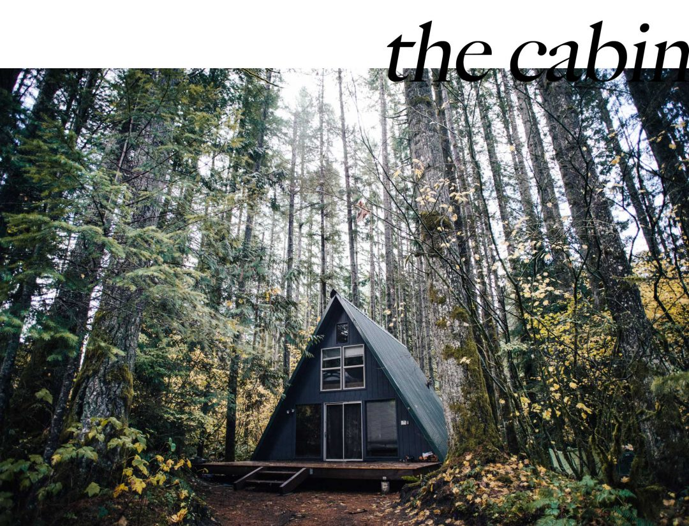

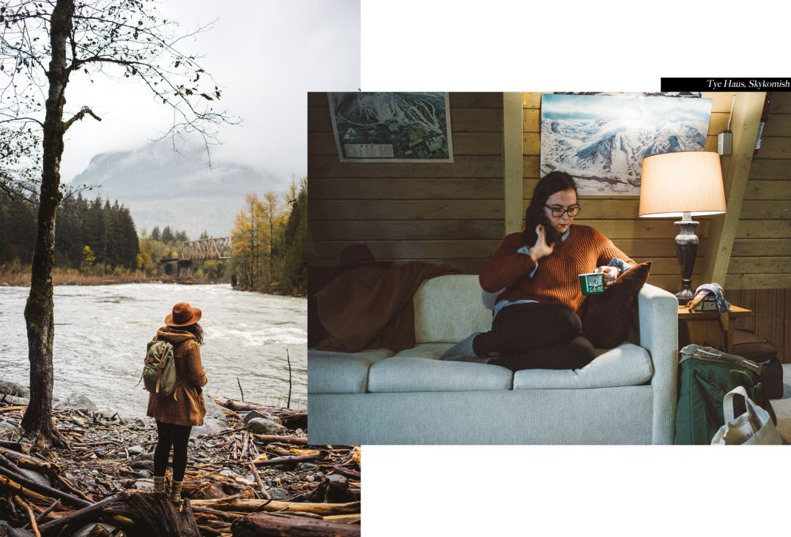

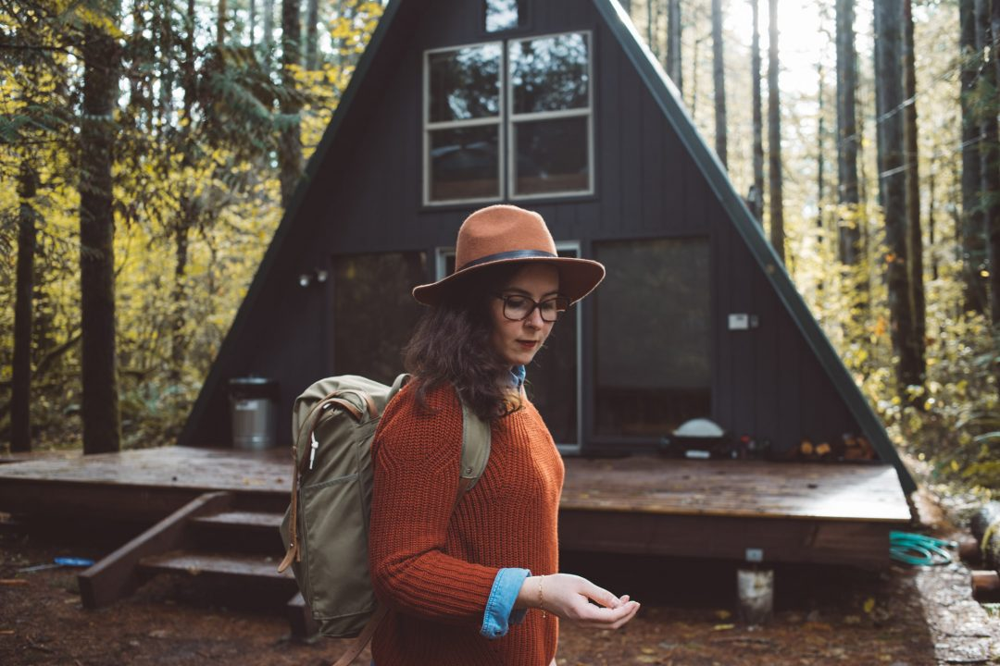

Pour arriver ici, on a essuyé deux tempêtes de neige et une pluie battante, et c'est en début de nuit que nos phares s'engouffrent sur la route de cette petite communauté au coeur de laquelle se nichait la cabane que nous avions réservé. C'est ici que l'on se réchaufferait au coin du poele, que l'on savourerait d'être à l'abris sous un vrai toit et ce serait aussi d'ici que nous partirions en quête de belles images le long de la Skykomish river. On avait repéré cette cabane à l'avance et lorsqu'on est arrivé devant que le rêve eveillé a pu débuter. Les phares de la voiture éclairent le passage sur la terrasse en bois qui surélève la cabane du sol. La grande baie vitrée nous accueille et laisse présager une superbe lumière au petit matin. Pour l'instant, ce sera à la lueur du poele et en allumant quelques lampes que l'on passera la fin de la soirée dans les canapés, à profiter de la chaleur et de l'ambiance cosy du lieu, le tout embaumé par le parfum du bois de la cabane. Il y-a un je ne sais quoi d'inexplicable que de se sentir bien au chaud sur un canapé confortable, au chaud, à regarder la pluie tombée. Oui vraiment, cette cabane, on s'y sent déjà comme chez nous. On grimpe à l'étage pour découvrir les chambres, on pourrait facilement loger à 6 ici tellement c'est spacieux et cosy. On s'y sent vraiment bien. On optera pour la chambre avec une baie vitrée qui donnera sur l'avant de la cabane. Il est l'heure d'aller se coucher mais on a déjà hâte de découvrir la lumière du lendemain, (re)découvrir notre "maison" de jour et partir découvrir les alentours !

Au petit matin, les rayons du soleil perçent l'épaisse forêt qui nous entoure et viennent réchauffer l'intérieur de la cabane en frappant les vîtres. On ouvre les baies vitrées et c'est l'odeur des feuillages et du bois détrempés par la pluie qui s'engouffrent dans la pièce... on fait difficilement plus doux comme réveil.

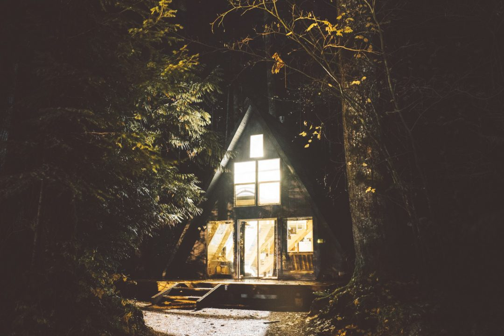

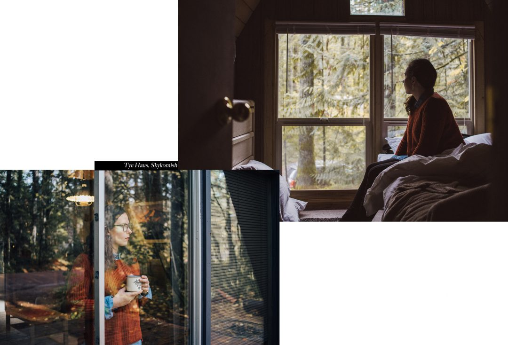

* * *

### _**Comment trouver une cabane pour dormir aux Etats Unis ?**_

_Nous avions repéré cette cabane sur Instagram et avions décidé d'y réserver deux nuits. Quitte à passer dans le coin, autant le faire jusqu'au bout et y dormir. À 127€ la nuit (140$) la nuit, ce n'est pas donné, mais on a décidé de se faire plaisir, on ne reviendra peut être pas ici alors, on a fait chauffer la CB et on ne regrette pas, c'est une expérience qu'on avait envie de vivre en étant ici. À ce prix là, la cabane est toute équipée pour 6 personnes, on ne manque de rien, il faut juste penser à faire des courses avant car il n'y-a pas grand chose aux alentours. On ne s'en plaint pas, finalement c'est ce que nous sommes venus chercher._

_Trouver une cabane n'est pas aussi simple qu'un motel mais avec un peu de patience et de recherches en amont, on finit par trouver son bonheur. Si là, on savait exactement laquelle on voulait: [Tye Haus](http://www.tyehaus.com/), on a aussi essayé d'en chercher d'autres pour agrémenter notre voyage. Finalement, on trouve pas mal de résultats mais souvent un peu kitsch, très très à l'américaine avec les gros rondins de bois vernis et la grosse baraque. On préférait trouver quelque chose de plus cosy et plus petit. Finalement, même si certaines entreprises sont spécialisées là dedans, notre meilleur résultat était encore de chercher sur AirBnb en filtrant la recherche avec "Cabane" comme type de bien. En prenant un bon périmètre autour de plusieurs villes ciblées, on trouve relativement bien son bonheur. Que ce soit des cabanes en bord de lac, ou au milieu d'une prairie du Montana, il y-en a pour tous les goûts et tous les budgets. Si c'était à refaire, on signerait tout de suite tellement l'ambiance était vraiment unique._

* * *

On a embarqué nos appareils photos dans le coffre et garder les k-way sur le dos, on a écumé les miles au milieu de la forêt en quête de belles images et d'aventure. Du _Lac Wenatchee_, au village bavarois de _Leavenworth_ en passant par la Skykomish river, les Central Cascades nous en ont mis plein la vue !

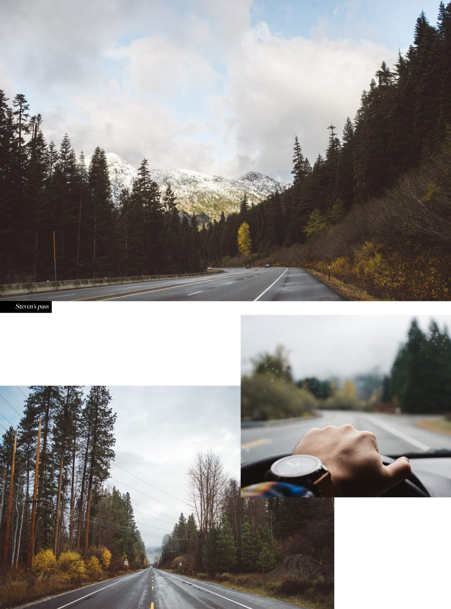

À 1h de route à l'Est de Skykomish, et après quasiment autant d'arrêts photos, on gare la voiture aux abords du Lac Wenatchee. Le lac est encore calme malgré la légère brise très fraiche du matin et les premières lueurs du jour ne suffisent pas encore à nous réchauffer mais apporte déjà une pointe de magie au lieu. On s'emmitouffle dans la couverture, on se souffle dans les mains et tâchons de ne pas perdre notre nez, mais on en prend plein les yeux. On va et on vient au ras de l'eau, on foule la plage du lac, s'aventure parmi les arbres qui nous entourent pour admirer le paysage qui s'offre à nous : lac, îlet central et les sommets enneigés comme toile de fond. On se croirait presque dans un fjord, le moment est magnifique, on voudrait qu'il dure, dure, duuuuure.

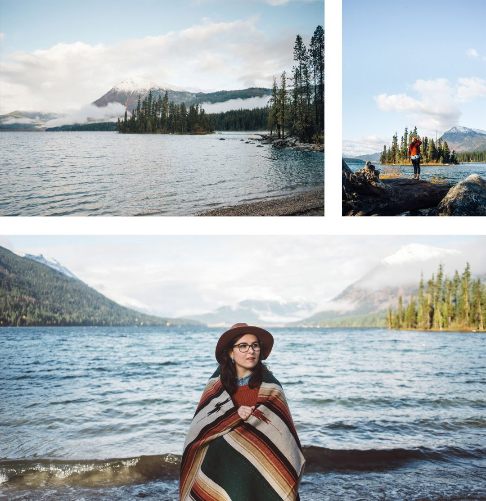

 _L a  B o n n e   A d r e s s e_

_Après avoir passé une bonne partie de la matinée au lac, on reprend la route en s'arrêtant ça et là pour faire quelques photos au milieu des bouleaux qui jaunissent avant de faire route pour Leavenworth, une petite ville au style Bavarois en plein coeur de l'état du Washington : wilkommen!_

_On s'arrête pour un petit dej' au "Tumwater inn restaurant"  à l'intérieur encore plus bavarois que la ville elle même, histoire de se réchauffer, apprendre à se connaître avec Cory, le photographe qui nous accompagne toute la journée pour une séance d'engagement. Samantha opte pour une énorme gauffre sucrée, il est 10h30 mais, on est "en Bavière", alors j'opte pour le combo omelette, pommes de terres, saucisses de francfort / sauce gravy ! On repart de là plein de force, réchauffés et prêts à continuer à en prendre plein les yeux pour le reste de la journée._

<table style="width: 304px; height: 189px;" border="0.5" cellspacing="1" cellpadding="1" align="center"><tbody><tr><td style="text-align: center; width: 300px;">&nbsp;

<em>The Tumwater Inn Restaurant &amp; Lounge</em> P.O. Box 721, Leavenworth, Washington, 98826 U.S.A.

<em>- Menus à partir de 11$ -</em></td></tr></tbody></table>

On reprend la route en direction de Skykomish, on a vu beaucoup de ponts à l'aller pour traverser la Skykomish river dont un qui avait l'air particulièrement photogénique. On profite de la brume qui commence à s'abaisser sur les montagnes environnantes pour faire quelques clichés, se balader sur les gros galets qui longent le cours d'eau, continuer à rire, à apprendre à se connaître et déjà avoir le sentiment que cette journée nous aura apporté bien plus qu'on ne pouvait le soupçonner. Cory est une personne incroyable, et finalement, on lui propose de rester avec nous à la cabane pour la nuit, il a plus de 4h de route le lendemain et on a pas envie que cette journée s'arrête.

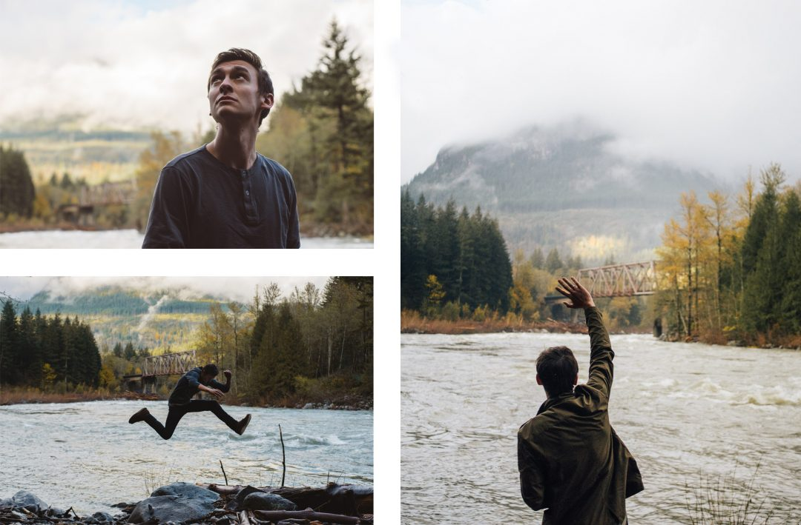

Après avoir guetté le passage du train sur le pont face à nous, on se dépêche de rejoindre un nouveau coin avant la tombée de la nuit. On ne sait pas vraiment où ça se trouve, Cory a une petite idée mais sans être convaincu. On sort nos smartphones et commençons une course contre la montre contre la nuit pour tenter de repérer ce chemin de fer au dessus d'une autre partie de la rivière. _Got it!_ On s'engouffre dans un chemin de terre à sens unique en avançant au milieu des bois, on a encore assez de lumière pour faire quelques images, mais le fond de la vallée est déjà vraiment sombre. Un dernier raidillon à grimper et nous voilà sur les rails. Le chemin de fer est encore actif donc la prudence est de mise, le passage n'est pas large du tout et on a pas tellement envie de se faire écraser par un train. Finalement après avoir pris le temps de faire des images, on rebrousse chemin dans la nuit noire et à peine sortis des rails qu'un train arrive. On est bouche bées face à la longueur du train. Montre en main et sans exagérer, nous avons vu passer des wagons tirés par une même locomotive pendant plus de 5 minutes. Il était juste gigantesque. Finalement l'humidité du soir, nous fera remonter dans la voiture pour aller nous réchauffer à la cabane au coin du poele - à rire, à grignotter, à refaire le monde et débriefer cette journée incroyable. Cette rencontre n'était pas anodine, c'est sûr, on se reverra Cory ! _(Samantha raconte d'ailleurs cette superbe [journée de session d'engagement](http://paris-tu-paris.fr/2016/04/yes-i-do/) sur son blog, lisez-le, ça vaut le coup d'oeil.)_

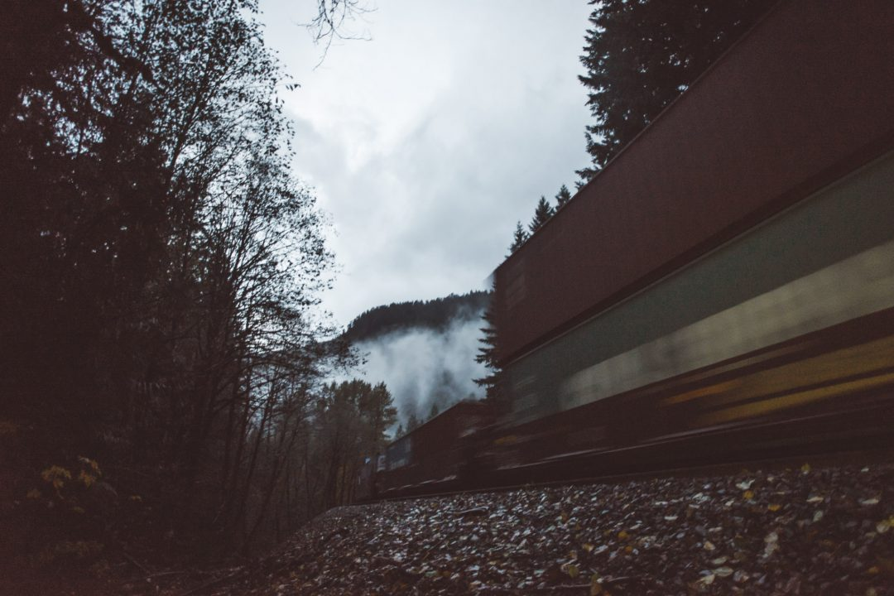

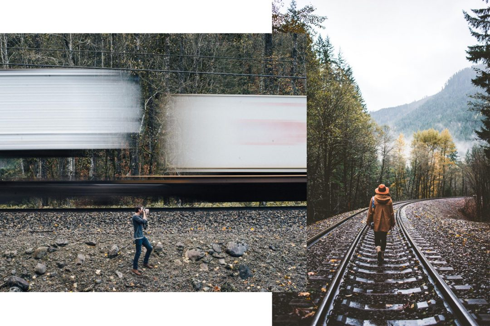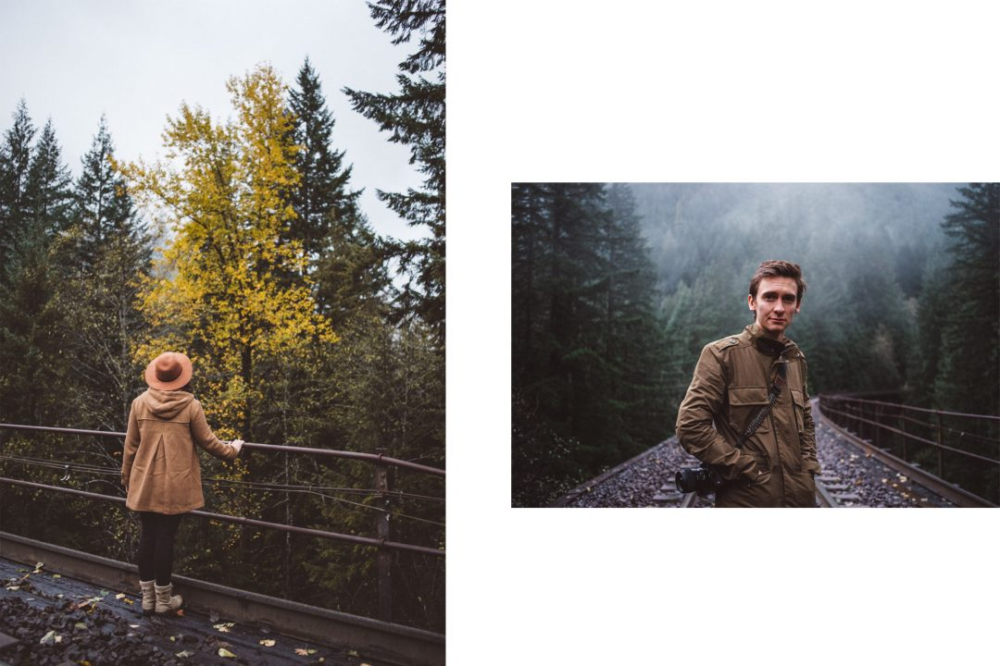

Le lendemain, on repoussera autant que possible notre départ de la cabane, même si, il faut l'avouer, l'appel de la route nous consolera bien vite d'être reparti. Cette fois-ci, on met les voiles, ce soir là on dormira dans l'Idaho. Au revoir le Washington. Une fois encore cet état nous aura bluffé, ça fait deux fois qu'on y vient et on le quitte systémtiquement le coeur lourd et l'envie d'y revenir tellement il y-a de choses à voir et tant les paysages sont inspirants, photogéniques, mystiques, magiques... tout simplement beaux.
