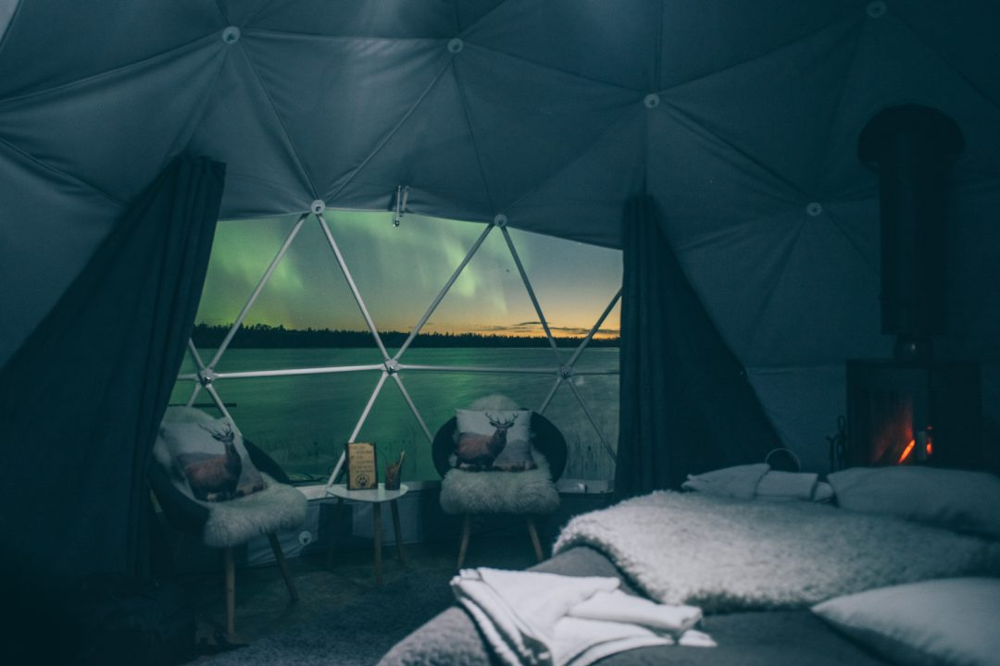

En septembre dernier, je me suis envolé en Finlande et ai vécu l'une des expériences les plus marquantes de toute ma vie puisque j'ai pu dormir dans un dome sous les aurores boréales. Avant de vous conter l'ensemble de mon séjour à la saison Ruska, les premières couleurs de l'automne, je voulais partager avec vous ce moment unique, inattendu et littéralement merveilleux.

Ce n’était pas prévu, je devais dormir dans un hotel en bord de rivière après avoir rencontré avec les rennes et fait du rafting, et finalement le soir venu, nous nous sommes secrètement éclipsés avec Joachim, mon comparse du voyage. Lors de ce voyage organisé par Visit Finland, nous avions découvert plus tôt dans la journée cet endroit idyllique, calme et apaisant. En voyant notre coup de coeur indéniable et ayant un dome libre pour la nuit, Pyry, la gérante, nous a ouvert les portes de l'un des auroras domes pour une expérience unique, à vivre une fois dans sa vie : dormir dans un dome sous les aurores boréales.

##### **AURORA DOME, qu'est-ce que c'est ?**

L’Harriniva Hotel possède deux domes. Ils sont situés en bout de ponton en bois sur les rives du lac Torras-Sieppi en Laponie Finlandaise. C'est un endroit parfait pour une cure loin du bruit et de la sur-connexion, en allant là bas, on coupe tout et on se laisse vivre au rythme de la nature. Ne vous attendez donc pas à être entassés ou à voir les bords du lac surpeuplé, l'endroit est assez reculé et ça permet de mieux se ressourcer.

Les aurora domes sont équipés d'un lit double, un poêle à bois pour chauffer un peu le dome car la température peut vite descendre la nuit. L'intérieur du dome est décoré avec goût, à la scandinave, et c'est le genre d'endroit dont on tombe sous le charme dès la porte poussée. Une partie transparente dans la toile donne sur le lac, gelé et enneigé en hiver, et permet de profiter sans avoir à sortir de sous la couette pour admirer les aurores boréales depuis son lit.Pas mal non ? Une nuit de rêve je vous dis !

D'un point de vue plus pratique, les commodités se situent à une centaine de mètres derrière le dome dans un bâtiment dédié à côté d’autres cabines plus classiques avec 4 murs où d'autres visiteurs peuvent venir pour séjourner, mais les domes eux bénéficient bien d’une situation privilégiée sur leurs pontons de bois sur le lac, et renforcent la magie du lieu et de l'expérience.

En plus des domes, Harriniva propose différentes activités pour s'occuper la journée : rafting, voir des rennes, découverte de la culture Same, chien de traineau, motoneige... Si vous partez là bas entre août et avril, vous aurez des chances de voir des aurores boréales comme ce fut mon cas.

En arrivant là bas, nous avions déjà vu plus d’aurores boréales pendant ce séjour que tout ce que nous aurions pu espérer. On croisait les doigts et espérions tellement qu’elles voudraient bien réapparaître dans le ciel mais cette fois au dessus des domes. Quoi de mieux que dormir sous les aurores boréales en guise d’au revoir avant notre départ ?

Pour ma part, j’ai passé une grosse partie de la nuit dehors à profiter du spectacle mais suis quand même allé me coucher en regardant encore les aurores danser avec la tête sur mon oreiller. Je me répète et je manque de superlatif, mais ce fut LE coup de coeur de ce voyage. LA bonne adresse à ne pas manquer pour une expérience d’une vie. Ça parait fou, magique, incroyable, on a envie de se pincer pour y croire. Et pourtant vivre ce moment aussi spectaculaire dans un dome, reste l’une des expériences les plus belles de ma vie. Je dis souvent que je vis des expériences marquantes ou dingues, mais là vraiment, dormir dans un dome sous les aurores boréales était vraiment inattendu et ça a rendu la surprise et le coup de coeur encore plus fort.

##### **DORMIR DANS UN DOME SOUS LES AURORES BORÉALES : INFOS PRATIQUES.**

Les auroras domes sont ouverts toute l’année et j’adorerais y revenir en plein hiver. J’y étais début septembre pour les premières couleurs de _ruska_ (l’automne) et revivre cette expérience quand le lac est gelé et complètement enneigé doit être très différent et peut être même encore plus magique, si jamais c'était possible.

**Avant d'y aller**

Je vous invite à lire mon article pour savoir [**où voir et comment photographier les aurores boréales**](http://jeremyjanin.com/voir-comment-photographier-aurores-boreales-finlande) pour ne rater aucun cliché.

**Adresse**

**HARRINIVA HOTELS & SAFARIS** – Harrinivan Lomakeskus Oy

Harrinivantie 35 – 99300 MUONIO – LAPLAND – FINLAND

[www.harriniva.fi](http://www.harriniva.fi/)

**Accès**

L'aéroport le plus proche est celui de **Kittilä**, situé à environ 80km de là. Le mieux reste ensuite de louer une voiture pour rejoindre ce coin là et profiter pleinement de la Laponie.

**Tarifs**

Prix : **200€ la nuit en été** et **300€ la nuit en hiver**.

À réserver à l'avance car ils affichent très vite complet.

_Merci à [**Visit Finland**](http://www.visitfinland.com/) pour avoir rendu voyage possible et de m'avoir permis de partir à la découverte de la Laponie Finlandaise._
