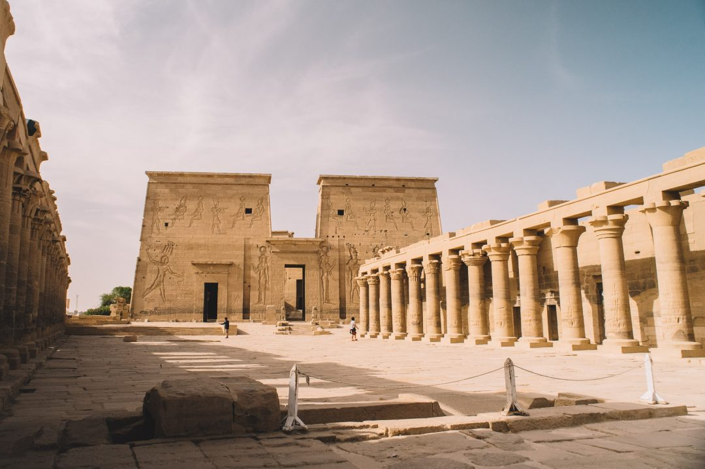
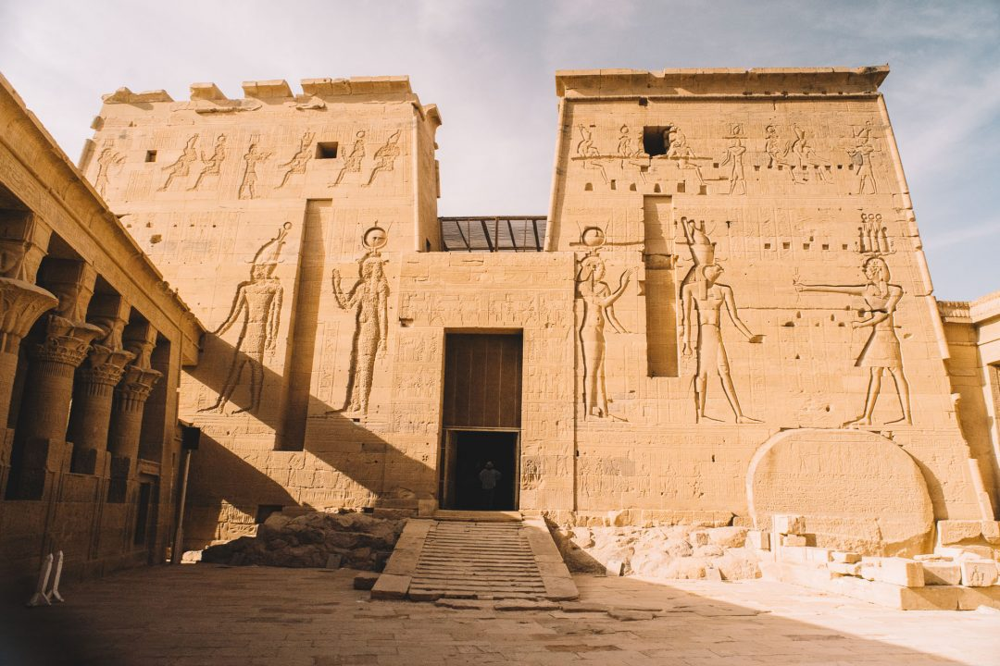

Cette croisière sur le Nil se poursuit, d'Efou à Assouan à bord du **[Steam Ship Sudan](http://jeremyjanin.com/partir-en-voyage-en-croisiere-en-egypte)**. Suite et fin de ce carnet de voyage en Egypte au fil du plus long fleuve du monde. Si vous avez manqué la première partie du voyage, je vous invite à relire mon article de **[Louxor au temple de Ramsès III](http://jeremyjanin.com/voyage-en-egypte-de-louxor-au-temple-de-ramses-iii).**

**Croisière sur le Nil - JOUR 03 : d'Edfou à Kom Ômbo**

La navigation s’est poursuivie pendant la nuit et nous accostons à Edfou. Nouveau départ matinal pour visiter les trésors de la région et ne pas trop souffrir de la chaleur. On se promène au gré de nos envies dans les petites ruelles de ce village en bord de fleuve, la journée a déjà bien commencé ici. Finalement après avoir échangé quelques sourires et fait quelques images, on se sent un peu en trop au milieu de ces scènes de vie et préférons laisser les habitants mener leur vie sans que des touristes avec leurs grosses baskets ne viennent interférer là dedans.

Avant de reprendre notre croisière sur le Nil, on part vers le célèbre temple d’Edfou, immense, majestueux, dédié au dieu à tête de faucon : Horus. Ce qui frappe, au delà de l’imposant portail d’entrée de cet édifice, c’est de voir que les visages représentants les dieux gravés dans la pierre ont touts été vandalisés à coup de burin. On pensait d’abord à une détérioration « moderne » mais nous apprendrons pendant la visite qu’il s’agissait en fait des Coptes qui ont martelé, un à un, les visages des représentations des dieux, qui étaient païennes selon eux.

Le lieu est impressionnant, on passe d’une salle à l’autre, d’un couloir étroit à l’allée principale. Certains coins sont baignés d’un puit de lumière quand d’autres nous plongent dans la pénombre et le mystère enfermé dans ces murs. C’est un vrai labyrinthe et je me sens l’âme d’Indiana Jones qui découvrirait un temple perdu par moment. On en prend plein les yeux au cours de cette découverte bercée par les légendes racontées par notre guide, Khaled. On se retire et saluons Horus et les autres afin de reprendre quartier à bord de « notre » bateau. En effet, le Steam Ship Sudan n’a pas du tout été privatisé mais il se trouve que nous sommes les seuls sur le bateau pour cette croisière sur le Nil, ce qui rajoute une dose de magie supplémentaire.

L’équipage met en marche le moteur à vapeur et la routine bien huilée pour quitter notre port d’attache et prendre la direction de Kom Ombo. Les scènes de vie et les paysages hors du commun défilent sous nos yeux. On rigole, on se tait, on discute mais surtout on savoure l’instant. Être sur cette croisière sur le Nil sur ce bateau est déjà un voyage à part entière et même si les visites que nous faisons sont magiques et passionnantes, il nous est à chaque fois difficile de quitter le navire, on voudrait étirer la navigation encore et encore. Quand la chaleur sur le pont supérieur se fait insoutenable, on rejoint nos cabines climatisées pour quelques minutes pour se rafraîchir avant de remonter à nouveau, savourer un boisson désaltérante ou un thé à la menthe.

On laisse le regard scruter les aspérités et les détails de ces paysages qui défilent et changent au rythme de notre remontée du Nil. C’est le moment pour nous d’enlever nos carapaces et profiter de ces bons moments, juste à nous, on apprend tous à mieux se connaitre et chacun venu blogueur, repartira avec de nouveaux amis trouvés quelque part sur le Nil. Nous tissons des liens très forts qui nous font encore, bientôt 1 an après ce périple, nous parler et nous voir. Cette croisière sur le Nil et plus particulièrement sur le Steam Ship Sudan fut ô combien spécial sur le plan humain en plus d’avoir été une sublime escapade et découverte. Nous mettons fin à cette quiétude sur le pont du bateau lorsque les étoiles ont fait leur apparition dans le ciel et que nous débarquons à Kom Ombo. C’est donc de nuit que nous partons visiter le temple éponyme. Nous sommes une fois de plus seuls à flâner entre les colonnes et les allées de ce temple érigé en l’honneur des Dieux Sobek et Horus. On apprendra d’ailleurs que c’est ici qu’a été découvert le premier calendrier astronomique, conçu en 2700 avant J.C. Fou !

**Croisière sur le Nil - JOUR 04 : Assouan et le temple de Philae**

Le bateau a poursuivi son trajet pendant la nuit et on sent Assouan pointer le bout de son nez. Il nous reste quelques heures à profiter et savourer ces bons moments sur le Steam Ship Sudan. On commence à bien connaitre les coursives, reconnaître le craquement du parquet et le son des clapotis de l’eau du Nil contre la coque de notre maison flottante de ces derniers jours. On dévale les escaliers du pont supérieur vers l’inférieur en laissant la main glisser sur la rampe fraîchement lustrée comme on dévale ses propres escaliers. On partage un sourire ou un fou rire avec un équipage qu’on sent sincèrement heureux de voir une bande de jeunes qui aiment se marrer sur le bateau. On passe d’un bord à l’autre pour scruter les rives tantôt sauvages tantôt aménagées. C’est calme et reposant de fixer l’horizon et le laisser défiler au rythme imposé par le capitaine. Le temps est comme suspendu et on aimerait qu’il ne redémarre jamais. Finalement, au bout de quelques heures, on finit par rejoindre Assouan, célèbre pour son barrage sur le Nil mais pas que. Nous abandonnons le bateau pour aller visiter le temple de Philae.

Il fut construit sur l’île de Philae en l’honneur de la déesse de la fertilité et mère d'Horus : Isis. On prend une petite embarcation en bois pour rejoindre l’île et cette petite virée aquatique de courte durée nous plonge directement dans l’ambiance. Le temple est comme souvent en Egypte, fascinant et imposant, chargé d’histoire et rempli de trésors à parcourir des yeux. Il faut savoir que le temple que l’on découvre d’abord depuis l’eau avant d’en fouler les grandes dalles de pierre, a été entièrement découpé et démonté en plus de 40 000 morceaux car l’ancienne île de Philae était inondée suite à la construction du barrage. Ce sont donc les même pierres et le temple reconstruit à l’identique mais sur une nouvelle île de Philae qu’on visite aujourd’hui. C’était le seul moyen de sauver le temple d’une érosion et d'une destruction assurée à cause des eaux.

Le soir venu, on part se balader dans les environs d’Assouan aux portes du désert pour savourer l’un de nos derniers couchers de soleil égyptien, avant de venir profiter de notre courte dernière nuit de cette croisière sur le Nil qui restera désormais à quai pour de bon.

**JOUR 05 : Fin de notre croisière sur le Nil, direction le Caire et ses pyramides**

3h30. On s’extirpe du lit, le cœur lourd de devoir quitter cette parenthèse enchantée que l’on vient de vivre. On salue une dernière fois l’équipage qui nous a chouchouté tout au long de se périple, on les remercie pour cette quiétude et ces bons moments partagés tous ensemble en journée ou au moment des repas. C’est avec un pincement au cœur non dissimulé qu’on referme nos chambres respectives et quittons ce chaleureux Steam Ship Sudan et ses hommes et notre guide qui nous auront accueilli comme des pharaons tout au long de ce périple. Notre avion nous attend, direction le Caire : son Sphinx, ses pyramides et tant d’autres choses à découvrir.

Quelques heures plus tard, nous voilà dans le dédale de la capitale polluée du pays. Après ces quelques jours de douceur et de quiétude au fil du Nil, le retour à la réalité nous frappe en pleine face entre pollution, klaxons et poussière ambiante… Bienvenue au Caire ! Notre van s’enfonce dans cette jungle urbaine au trafic désorganisé pour finalement nous déposer au pied des mythiques Pyramides de Gizeh. Situées littéralement aux portes de la ville, nous savourons cette chance que de les voir se dresser là, face à nous malgré les 45°c qui nous tapent sur la tête. On se tient à face à ces immenses pyramides composés de milliers de blocs de pierres. Prouesse architecturale grandiose. On les a vu des centaines de fois en photos et pourtant, être là, face à elle n’a rien de comparable. Elles sont encore plus immenses que je les avais imaginé, plus massives, plus imposantes, plus majestueuses. Ce pays est un livre d’histoire sans fin à ciel ouvert et les pyramides en sont l’un des symboles les plus forts. Il faut se pincer pour réaliser où nous sommes.

Clou du spectacle avant d’aller rencontrer la statue sans nez la plus célèbre du monde : le Sphinx, on se faufilera à l’intérieur de la pyramide de Kheops, la plus grande des pyramides de Gizeh, jusqu’à la grande galerie. Ici pas de décoration ni de jolis bas reliefs, seulement un tombeau ouvert et des murs de granit bruts, frais et austères imposants dans cette bulle au milieu de cet immense « tas de pierres ». On n'est pas émerveillé par les couleurs ou les détails comme ça a pu être le cas dans certains temples mais par le fait de se dire qu’on se trouve au cœur d’une pyramide vieille de plus de 4500 ans. Et même si des millions de touristes de toutes les nationalités ont foulé ces pavés avant nous, c’est intimidant de se dire que plusieurs millénaires avant nous des hommes étaient là, en train de construire ces édifices fascinants.

On retrouve la canicule à la sortie de la pyramide pour aller rejoindre le Sphinx. Si c’est tout un symbole de le voir et se tenir à ses pieds, les alentours sont moins convaincants et impressionnants, c’est toute fois, vraiment quelque chose d’être ici et de se remémorer simplement les noms mythiques de tous ces temples et ces lieux que nous avons pu découvrir au cours de ce voyage en Egypte. Les quelques heures qu’il nous reste dans la ville du Caire, nous les passerons à visiter une partie de la ville avec notre guide du jour entre souks et petites échoppes. Ça fait vraiment bizarre de retrouver le brouhaha de cette jungle urbaine.

Cette croisière sur le Nil touche à sa fin, la peau tiraillée par la chaleur et le sable, les yeux et la tête remplis de souvenirs et de belles images. Il va falloir rentrer, digérer et ressasser encore et encore ce voyage, cette parenthèse idyllique au fil du Nil. Dire au revoir à ces nouveaux amis forgés au rythme du fleuve, et se dire que tous ces moments vécus et partagés sont à nous et rien qu’à nous et que lorsqu’on voudra le revivre, il nous suffira juste de décrocher notre téléphone ou se revoir et se dire… dis tu te souviens, tu te souviens. On se regardera un brin nostalgique et un sourire au coin des lèvres, on fermera les yeux et on se reverra riants et insouciants à fendre les flots du plus long fleuve du monde en faisant craquer le parquet avec nos pieds, savourant un thé à la menthe au fil de l’eau et à s’émerveiller face aux trésors dont regorge ce pays.

Encore un énorme merci à [**Voyageurs du Monde**](http://voyageursdumonde.fr) pour cette magnifique parenthèse hors du temps et à mes compères de voyage : [**Anne**](http://le-chien-a-taches.com/) et Kévin, [**Alice**](http://tippy.fr) et Alexandre, [**Juliette**](http://jenesaispaschoisir.com) et [**Gaetan**](http://instagram.com/gaetan), [**May**](http://www.vie-de-miettes.fr/) et Anthony, [**Laëtitia**](http://eleusis-megara.fr) et [**Samantha**](http://paris-tu-paris.fr).
