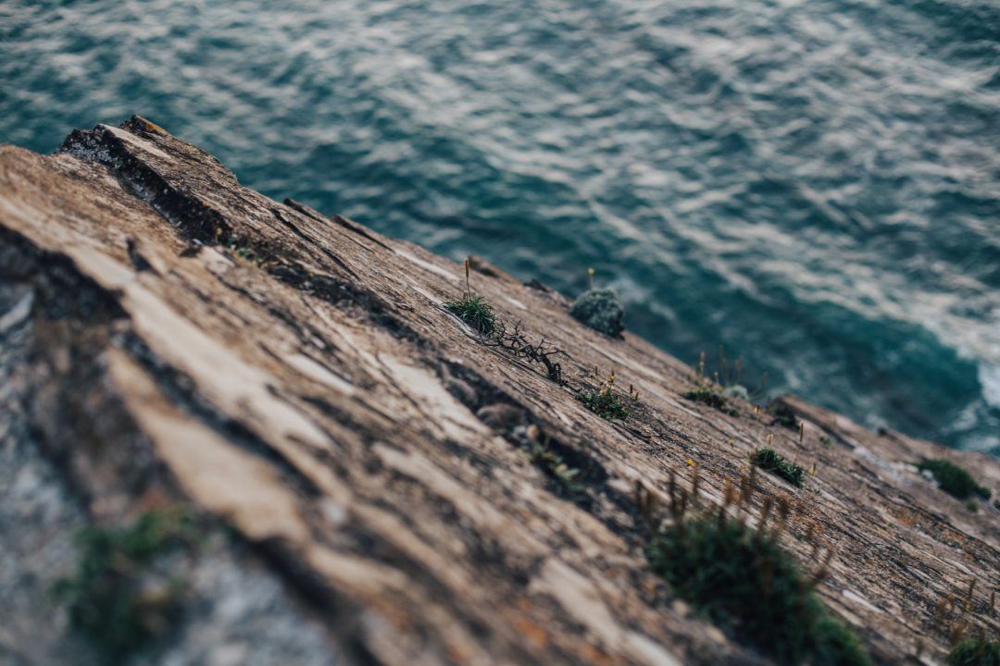
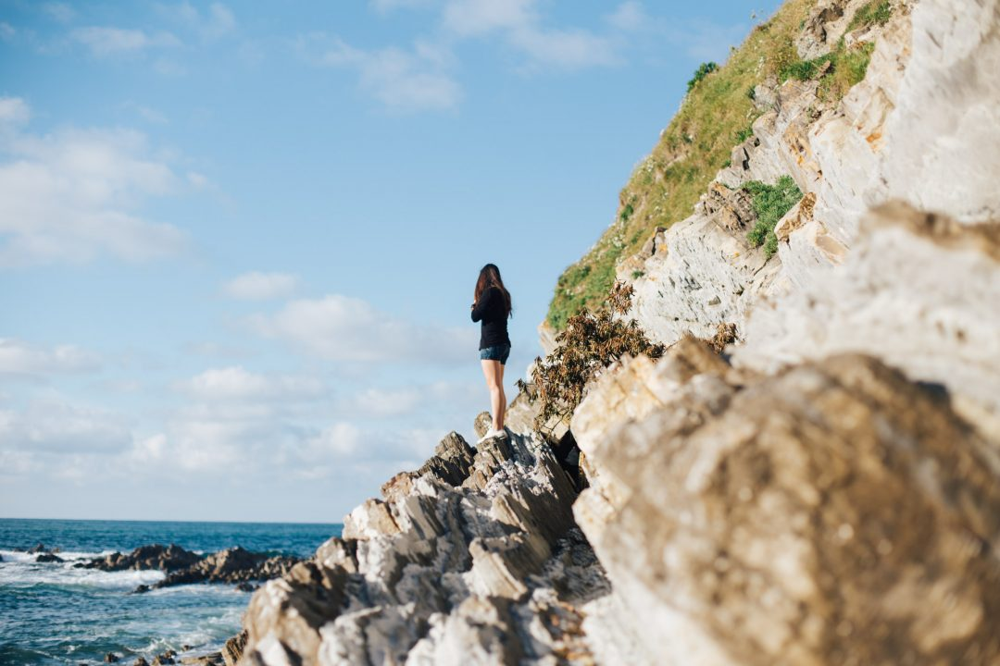
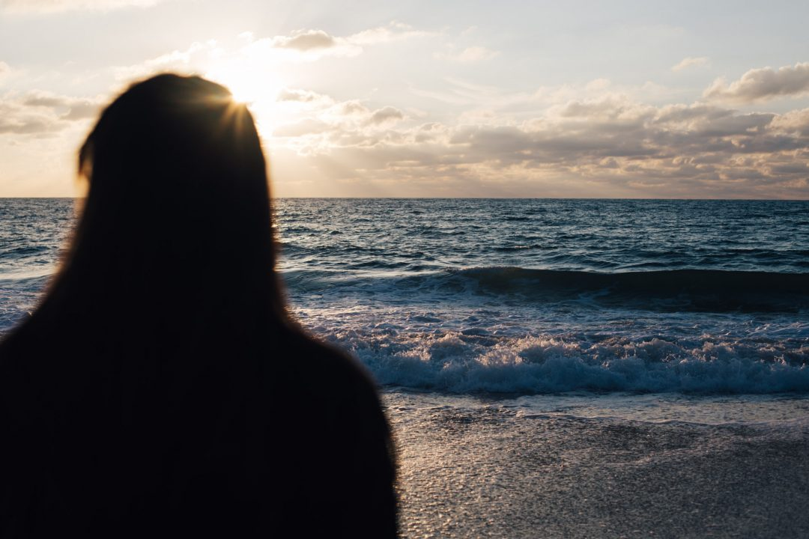

Il y-a quelques jours, je me suis envolé pour Bordeaux retrouver mon amie [**Maï**](http://iletaitunefaim.com) pour se retrouver après mon retour du Canada et partir découvrir sa région du Pays Basque que je ne connaissais que trop peu. Vous avez déjà dû voir passer quelques photos sur mon compte [Instagram](http://instagram.com/djisupertramp) mais voici le compte rendu complet en image.  J'ai beau surfer dans les Landes depuis que j'ai 12 ans, du Pays Basque je ne connaissais qu'Hendaye, Biarritz et Bayonne. Cette fois-ci, on a chargé les batteries du reflex et du drone pour partir explorer le Pays Basque français et espagnol.

   

On a taillé la route en direction de la frontière, on s'est arrêté faire des photos ça et là, on est sorti chaque soir profiter de la lumière du coucher de soleil pour faire des images, on a écumé les kilomètres le long de la côte Atlantique et dans l'intérieur des terres. Plutôt qu'un long discours, voici donc une sélection d'images de ces quelques jours dans cette région dont je suis tombé amoureux. Il me tarde déjà d'y retourner pour en voir encore plus et continuer cette quête d'aventure et d'exploration. J'y ai trouvé des paysages dignes du Pacific Northwest, la France prouve à nouveau à quel point on peut être dépaysé et se sentir ailleurs en son propre pays.

                    

La prochaine fois, [Samantha](http://paris-tu-paris.fr) nous accompagnera et ça sera à trois qu'on partira découvrir ces coins là, photographier du lever au coucher du soleil parce que l'aventure n'attend pas et elle souvent beaucoup plus proche qu'on peut le penser. _Get out there !_

Cher Pays Basque, je reviendrai, je te le promets !
