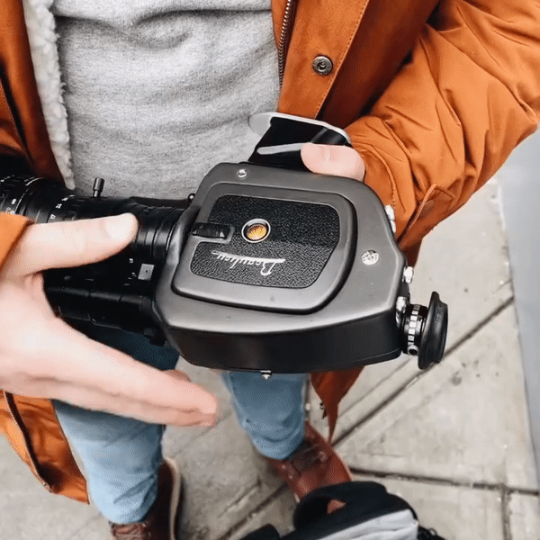
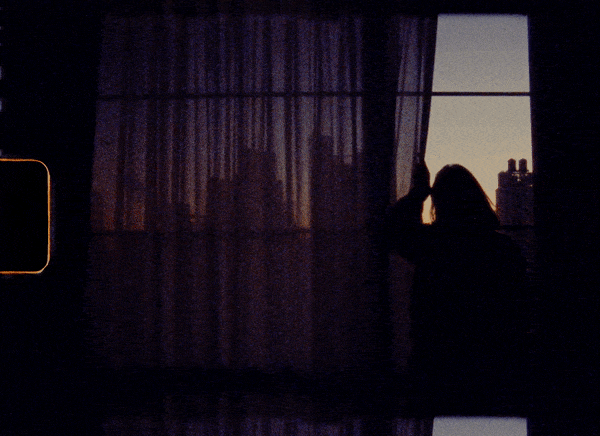
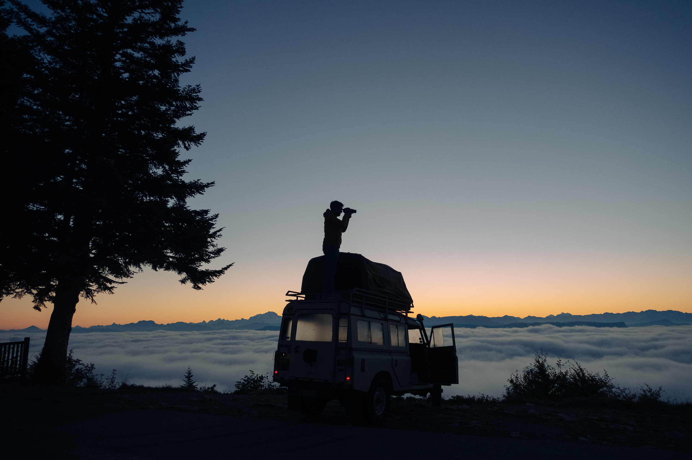

Filmer à la super 8 aujourd'hui, est non seulement attirant mais c'est devenu un de mes moyens favoris de capturer des souvenirs. Ça fait une dizaine d'années que je me suis pris de passion pour  filmer. J'ai commencé à l'époque où le 5DMkII révolutionnait le monde de la vidéo et aujourd'hui, je filme en 4K ou 6K avec des caméras toujours plus avancées. J'utilise ces caméras pour des projets de documentaire avec Captain Yvon, mais je m'aperçois que je filme pas ou peu pour documenter des moments du quotidiens ou plus perso. Il y-a 1 an et demi, je me suis relancé dans la pratique de l'argentique, ce qui m'a fait ouvrir les yeux sur ma passion et mon approche de l'image et comment j'aime photographier. Et puis, le déclic de filmer à la super 8 est venu de mon pote Jean qui a filmé un week-end dans les Alpes avec sa Super 8. Quand il m'a envoyé sa vidéo, je suis immédiatement tombé amoureux du format, du rendu de l'image et de la lenteur qu'imposait ce médium. J'étais persuadé que c'était un médium désuet et plus utilisé, mais c'est comme l'argentique : le film n'est pas mort, vive le film !
Après une année à filmer à la Super 8, j'ai décidé de distillé mes conseils pour vous aider dans une série d'articles. J'ai poncé le sujet et j'aurais aimé avoir une ressource pour mieux comprendre la Super 8 avant de commencer.

   

{{< youtube thGmMVeycDw}}

# Quelle caméra pour filmer à la Super 8 ?

Tout d'abord, pour filmer à la Super 8, il faut une caméra ! Il y-a énormément de modèles anciens disponibles sur le marché et il n'est pas évident de savoir comment choisir une caméra super 8. 

**Beaulieu** (marque française en plus !). J'ai personnellement la 4008 zmII avec un objectif Schneider 6-66mm, une semi professionnelle, pas légère mais l'image et l'optique sont incroyables. Tous les modèles Beaulieu semblent bons : 2008, 3008, 4008, 5008 etc...

**Canon** 514XL et XLS / les 1014xls (zoom x10) et 814xls (même modèle mais en zoom x8) / les modèles Autozoom comme la 1014, 814 ou 518.

Il y-a aussi les Nizo, Bauer, Chinon etc...

# Où et comment acheter une caméra super 8 ?

Commencez par faire le tour de votre entourage, pour voir si personne n'a une caméra qui traine dans son grenier. Si ce n'est pas le cas, je vous conseille d'acheter une caméra qui a déjà été testé récemment. Vous la paierez plus chère mais vous aurez la certitude qu'elle fonctionne. Vu le budget que représente le fait de filmer à la Super 8, autant éviter de sacrifier une bobine sur une caméra qui ne fonctionne pas. Si vous ne voulez pas une caméra déjà testée, dans ce cas, essayez au moins de la prendre en main avant de l'acheter. Je vous recommande Le Bon Coin, eBay (les prix sont plus chers, mais vous pouvez en trouver des déconditionnées), Facebook Marketplace ou Rakuten (c'est là que j'ai trouvé mon vendeur spécialisé en Beaulieu)

Vérifier qu'il n'y-a pas de champignons sur l'optique, que l'alimentation fonctionne toujours (prévoyez une pile avec vous avant d'aller la voir) ou achetez un modèle à batterie dont celle-ci a déjà été reconditionnée, comme ce fut le cas sur ma Beaulieu 4008ZMII. Si elle a été testé, demandez à voir les images, testez tous les boutons...

# Quelle bobine de film pour filmer à la super 8 ? 

J'ai expérimenté uniquement avec la gamme Kodak Vision 3 qui est également la plus répandue. Il y-a aussi la Kodak Tri-X en noir et blanc, de la Fomapan, de l'Ektachrome mais je ne les ai jamais testé. Ma pellicule de prédilection est la Kodak Vision 3 50D qui garde un grain contenu. J'ai essayé la 200T mais qui est un peu trop granuleuse une fois scannée en 4K. Partant de ce constat, je n'ai même pas essayé une 500T pour filmer de nuit qui est censée l'être encore plus. Mieux vaut un grain très fin en Super 8, car une image sur une bande Super 8 est vraiment petite donc scanner à haute résolution amène à grossir toute l'image, y-compris le grain. Voilà pourquoi la 50D est ma bobine de choix, dans toutes les conditions, même si la sensibilité à 50ISO semble extrêmement basse, j'arrive à filmer dans toutes les conditions où j'ai souhaité avec mon objectif ultra lumineux qui ouvre à f/1.8 sur ma Beaulieu.

# Où développer et scanner ses bobines super 8 ? 

Faute de labo de qualité en France, j'expédie mes bobines à Helsinki à mon labo de choix : Mutascan. La Super 8 représente un budget conséquent donc je voulais trouver un labo qui me permette de scanner en 2K ou 4K, en LOG avec un fichier et une compression de très grande qualité. Je pensais ne trouver ça qu'aux Etats-Unis et finalement j'ai découvert Mutascan en Finlande. Il y-a d'autres options en Europe comme des labos à Berlin, aux Pays Bas ou en Espagne, mais aucun d'eux ne possède un fonctionnement aussi fluide. Leur service client est d'une gentillesse et réactivité plus qu'appréciable. En général, une fois mes bobines envoyées, je reçois les images scannées dans les 10 à 15 jours suivants. 

Je reviens plus en détail sur les options que je choisis au moment de passer commande au labo pour [développer et scanner mes bobines de Super 8 dans cet article](http://jeremyjanin.com/developper-scanner-super8), mais je fais le choix de scanner en 4K et en LOG. Beaucoup disent que ça ne sert à rien sur une image Super 8, mais je vise d'avoir à chaque fois le fichier le plus haute qualité possible dans un but de pouvoir conserver ces images à vie et ne pas avoir envie de les faire re-scanner à l'avenir. Je vois ça aussi comme un moyen d'enrichir les archives familiales donc "qui peut le plus, peut le moins". Je fais scanner en LOG car je veux pouvoir traiter moi-même l'image brute du scan au moment du montage de la vidéo, mais évidemment, ça demande des compétences dans ce domaine. Mais si vous ne vous sentez pas à l'aise avec la 4K et le LOG, [Mutascan](http://mutascan.film) propose toutes les résolutions et type de fichiers, et même de retoucher les images pour vous. 

# Quel budget pour filmer à la Super 8 ? 

On ne va pas se mentir, filmer à la Super 8 demande un vrai budget. Pour ma part, j'ai fait le choix de prendre ce que j'estimais être la meilleure caméra Super 8 avec un très bon objectif tout simplement car si je suis prêt à mettre le prix en bobines et développement, j'ai envie que mes images soient belles. Ensuite, chez Mutascan, je prends les options de développement et de scans les plus élevées donc il y-a possibilité d'en avoir pour moins cher, notamment en faisant scanner en 1,5K ou 2,5K par exemple ou en choisissant qu'ils ne vous renvoient pas vos bobines.

En moyenne, une fois la caméra achetée, comptez environ 45€ pour l'achat d'une bobine de Kodak Vision 3, autour de 150€ pour le développement et scan d'une bobine avec envoi chez Mutascan en Finlande. 

Voilà, comment filmer à la Super 8 dans les grandes lignes. Je reviendrai plus en détails dans d'autres articles sur le développement et la numérisation des bobines, comment traiter l'image LOG une fois ses scans reçus etc... D'ici là, j'espère que ça vous aura permis d'y voir plus clair. 

En résumé, même si ce n'est pas donné, les souvenirs capturés à la Super 8 ont une saveur vraiment spéciale, inégalable d'un point de vue couleurs malgré toutes les retouches que vous voudrez, et puis l'expérience que de shooter avec une caméra ancienne font que c'est une combinaison dont je ne pourrais plus me passer aujourd'hui.

