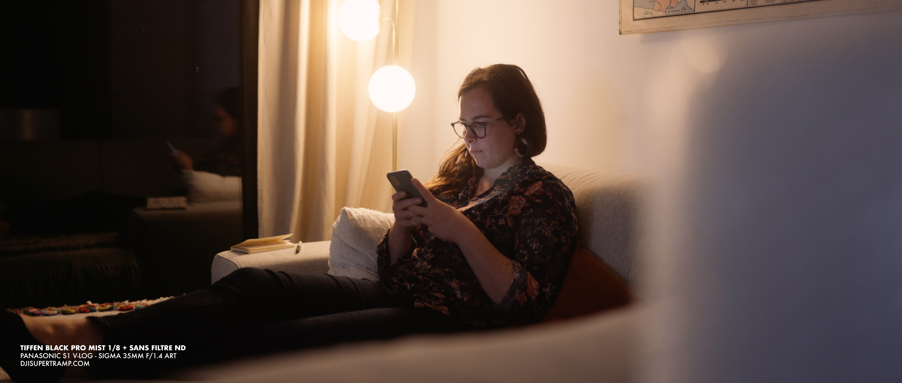

À l’ère où les capteurs et objectifs sont de plus en plus piqués, les filtres de diffusions Tiffen Black Pro Mist prennent encore plus de sens. Le [**Panasonic S1**](https://www.digit-photo.com/PANASONIC-Lumix-S1-Boitier-Nu-rPANASONICDCS1EK.html?dpa_id=21) avec le [**Sigma 35mm f/1.4 ART**](https://www.digit-photo.com/SIGMA-35mm-f-1-4-DG-HSM-Art-Monture-L-rSIGMA340969.html?dpa_id=21) est devenu mon combo de prédilection pour filmer tout type de projet : documentaire, voyages, sports… En complément, j’ai aussi acheté un Canon FD 24mm f/2.8 (vintage) dont je suis fan du contraste, du flare et du rendu des lentilles vintages. Idem pour mon 90mm f/2.5 macro vintage. Quand je shoote un projet et que je mixe ces 2 ou 3 optiques, je vois instantanément la différence entre l’un et l’autre. Je cherchais alors un moyen d'adoucir l'image de mon Sigma et c'est comme ça que j'ai décidé d'essayer le filtre [Tiffen Black Pro Mist](https://amzn.to/3n9rvqL).

## **Filtre Tiffen Black Pro Mist / Filtre de diffusion : c’est quoi ?**

Les filtres de diffusion existent depuis une trentaine d’années. Ils existaient donc bien avant l’avènement de nos capteurs ultra piqués d’aujourd’hui. Si j'en entends parler depuis des années, je ne m'étais jamais trop pencher dessus pour mon usage. Après [**avoir quitté Sony pour Panasonic**](http://jeremyjanin.com/matos-photo-video-pourquoi-jai-quitte-sony-pour-le-panasonic-s1), j’ai immédiatement vu la différence de fichiers, de par les codecs plus performants, le 10bits et le niveau de détails dans l’image. Le **Sigma 35mm f/1.4** est beaucoup plus piqué et l’image parait beaucoup plus détaillée. Si c’est ce que l’on cherche souvent en photo, le rendu numérique a tendance à rendre tout trop net en vidéo. En tous cas, à mon goût.

Les filtres de diffusion sont des filtres transparents et mouchetés qui permettent d’adoucir l’image en réduisant ce côté trop net et détaillé des images modernes. Ils permettent aussi de réduire les imperfections et les rides en réduisant la résolution de l'image pour donner un rendu plus doux sur un visage. Ils permettent aussi d'adoucir les transitions entre les tons moyens et les hautes lumières. En bonus, lorsqu’on filme une source de lumière, il y-a un halo de lumière qui se dessine autour, ce qui lui donne un rendu plus doux encore une fois et que je trouve très esthétique.

## **Filtre Tiffen Black Pro Mist : lequel choisir ?**

Le filtre Tiffen Black Pro Mist existe en plusieurs intensités : 1/8, 1/4, 1/2, 1, 2. Le [**Black Pro Mist 1/8**](https://amzn.to/3jpvoWb) étant le plus léger en terme d'intensité de la diffusion. Plus on avance dans les chiffres, plus l’effet est prononcé. J’ai fait quelques recherches sur YouTube et beaucoup de personnes semblent privilégier le rendu du [**Black Pro Mist 1/4**](https://amzn.to/3n42jSx). Au delà, le rendu a un côté très (trop) crémeux / ‘dreamy’ presque comme s’il y-avait de la buée sur l’objectif. Utilisé à de telles intensités au delà de 1/4, le filtre Tiffen Black Pro Mist est un vrai choix artistique très spécifique, et non plus seulement un choix polyvalent qui pourrait s’adapter à différents types de conditions.

#### Black Pro Mist 1/4 ou 1/8 ?

J’ai donc décidé de commander d’abord le 1/8 et ensuite le 1/4 pour voir si les deux pourraient se complimenter. Ou si un seul me suffirait. Si c’est le cas, lequel allais-je garder : le 1/8 ou le 1/4 ? Sur le papier, le 1/8 dont l’effet est plus subtile semblait être celui vers lequel mon choix allait s’orienter. Le 1/4 donnait parfois un rendu un peu plus intense. Comme pour tout effet, il faut l’utiliser avec finesse et ma crainte du 1/4 était qu’il serait trop prononcé dans mon usage. J’ai fait quelques tests dans différentes situations de lumières, pour me faire un avis.

La plupart des tests sur YouTube sont simplement des YouTubeurs qui se filment avec des lumières en arrière plan et qui s’ébahissent devant l’effet de halo autour des ampoules de leur studio. Il en faut pour tous les goûts, mais le filtre Tiffen Black Pro Mist que j’ajoutais à mon kit n’allait pas me servir à ça. Je voulais voir si je pourrais l’utiliser dans toutes les situations ou uniquement pour des plans très spécifiques.

#### Mes essais

Voici des screenshots extraits de rushes filmés en 4k 24fps au Panasonic S1 en LOG avec un filtre ND 8 et le filtre Tiffen Black Pro Mist (1/8 et 1/4), puis édité avec Filmconvert. Je vous laisse vous faire votre propre avis et vous donne ma conclusion personnelle en bas de cet article.

_On voit très nettement la différence de rendu avec le filtre Tiffen Black Pro Mist (photo 2 et 3) et sans (photo 1) en terme de netteté dans l'arbre centrale, les détails sur les camionnettes blanches en arrière plan, les écritures sur les panneaux._

_Sur les 3 photos ci-dessus, on voit la différence de détails dans les briques de la maison à droite, mais aussi la manière dont le filtre diffuse le soleil qui tape sur les façades._

_Sur les 3 photos ci-dessus en condition de basse lumière, filmé à f/1.4 et au delà à environ 8000ISO , on voit la différence à nouveau dans les détails dans les briques de la maison et sur l'effet de halo autour des lampadaires. Il pleuvait ce soir là, donc le halo est aussi visible sur le screenshot sans filtre car les gouttes avaient un effet diffuseur naturel. Dans les screenshots entre 1/4 et 1/8, on voit qu'avec le 1/8 on distingue encore le lampadaire dans le halo, contrairement au 1/4. (Désolé pour les variations de balance des blancs, je n'ai pas vu que j'étais en balance des blancs auto)_

_Sur les 3 photos ci-dessus en condition de basse lumière, on voit clairement l'adoucissement des détails de la peau entre avec filtre et sans filtre, et à plus ou moins forte intensité entre le 1/4 et le 1/8. Le roll off des hautes lumières vers les tons moyens est aussi adoucit et plus agréable._

_Idem ci-dessus, le halo est plus intense sur le 1/4 comparé au 1/8. Le 1/4 est plus crémeux et encore plus 'dreamy'. On aime ou on aime pas, c'est une affaire de goût. On voit aussi très nettement la différence de niveau de détails sur la peau du visage._

## **Superposer le Filtre Tiffen Black Pro Mist et le filtre ND : comment je fais.**

S’il y-a bien un truc qui m’exaspère sur un boitier c’est de ne pas avoir de filtre ND intégré. Je passe souvent du mode photo au mode vidéo quand je suis sur un projet ou même en voyage à titre perso et combien de fois, j’oublie de dévisser le filtre ND avant de faire une photo. Combien de fois ai-je pester du temps que ça me prenait de visser / dévisser mon filtre ND ? Beaucoup trop.

#### Quelle solution ?

Il y-a 2 ans, j’ai découvert le système magnétique **Manfrotto XUME** qui permet d’aimanter ses filtres à son objectif et ainsi ne plus avoir à les visser / dévisser. Le gain de temps est énorme. Fini de râler qu’il faut que je visse ou dévisse.

La façon dont le système fonctionne, c’est qu’il faut visser un [**porte filtre**](https://amzn.to/2SeNPRB) au bout de votre objectif et un [**adaptateur pour objectif**](https://amzn.to/3ipoRtc) sur votre filtre. Et voilà, désormais votre filtre tient par l’aimant du combo adaptateur / porte filtre et non plus par le pas de vis. De mon côté, j’ai acheté des step-up rings pour uniformiser tous mes objectifs à 67mm de diamètre. J'ai donc acheté les portes-filtre et adaptateurs pour chaque filtre et objectif au même diamètre pour pouvoir ainsi utiliser les même filtres sur tous mes objectifs.

Le système XUME est disponible sur Amazon (voir liens ci-dessus) mais aussi chez Digit Photo, je vous mets le lien ici car c'est le site que je privilégie en temps normal : [**porte filtre**](https://www.digit-photo.com/MANFROTTO-XUME-Porte-Filtre-a-Fixation-Rapide-67mm-rMANMFXFH67.html?dpa_id=21) et [**adaptateur pour objectif**](https://www.digit-photo.com/MANFROTTO-XUME-Adaptateur-pour-Objectif-a-Fixation-Rapide-67mm-rMANMFXLA67.html?dpa_id=21) sur Digit Photo.

#### Comment je l'utilise ?

Maintenant que j’utilise le filtre Tiffen Black Pro Mist en complément de mon filtre ND pour filmer, j’ai décidé que la meilleure solution était de visser le Black Pro Mist sur mon filtre ND. Comme mon ND est aimanté, quand je veux faire une photo, je n’ai qu’à retirer le ND grâce au système aimanté. Comme le Pro Mist est vissé dessus, il s’enlèvera en même temps et n’altèrera donc pas ma photo. Quand je souhaite changer d’intensité de filtre ND et passer de mon ND8 à un ND64, alors j’accepte la contrepartie de dévisser le Black Pro Mist et de le visser sur mon nouveau filtre ND.

J’ai essayé d’installer un porte filtre sur mon filtre ND et un adaptateur sur mon filtre Tiffen Black Pro Mist pour justement avoir le ND qui s’aimante sur mon objectif et le Black Pro Mist qui s’aimanterait lui même sur le filtre ND. Dans les faits, ça fonctionne mais ça n’est pas utilisable en l’état selon moi. Le système met trop de distance entre les deux filtres et on a ainsi du vignettage et surtout un phénomène de ‘ghosting’ qui apparait quand la source de lumière frappe le premier filtre. Ensuite, ce premier filtre dévie légèrement sur le deuxième qui lui même la dévie la lumière dans les lentilles de l’objectif. On se retrouve alors avec des flares incontrôlés et des taches de lumières pas prévues. La solution est donc de conserver la partie aimantée sur mon filtre ND et simplement visser / dévisser mon Black Pro Mist sur mes filtres ND.

## **Filtre Tiffen Black Pro Mist : lequel je choisis ?**

Après avoir comparé ces images, j’ai très vite pu répondre aux 2 questions que je me posais. Tout d’abord, on voit très nettement la différence entre filmer seulement avec un filtre ND, l’image est très nette et très ‘digitale’. Alors qu’avec l’addition d’un filtre Tiffen Black Pro Mist, on a une image plus agréable à l’oeil. Elle est moins détaillée avec un meilleur roll-off des hautes lumières et globalement une image qui personnellement me plait plus. Donc oui, je vais filmer avec le filtre Black Pro Mist quasiment constamment vissé à mon filtre ND, sauf cas exceptionnel ou si ce n’est pas le look que je recherche pour un projet donné.

Au niveau de l’intensité du filtre, j’ai décidé de conserver la version 1/8 qui est, comme je le pressentais, plus subtile mais malgré tout présente en rendu. Je me vois totalement en avoir un usage polyvalent. Autant filmer en plein nature que des interviews avec, sans pour autant que ça n’impacte l’image au point de dicter intrinsèquement le rendu final de la vidéo. Le 1/4 fonctionne très bien dans certaines situations, mais dans beaucoup d’autres, je le trouve trop prononcé et avec un rendu déjà trop crémeux et ‘dreamy’ à mon goût.

Voici les liens pour acheter le filtre Tiffen Black Pro Mist si ça vous a convaincu :

**Tiffen Black Pro Mist 1/8** - [**Amazon**](https://amzn.to/3jpvoWb)

**Tiffen Black Pro Mist 1/4** - [**Amazon**](https://amzn.to/36nu6Hs)

 

Alors, vous préférez lequel de votre côté ? Avec ou sans filtre Tiffen Black Pro Mist ? Dites le moi sur [**Twitter**](https://twitter.com/jeremyjanin)

 

_Les liens dans cet article sont des liens affiliés._
