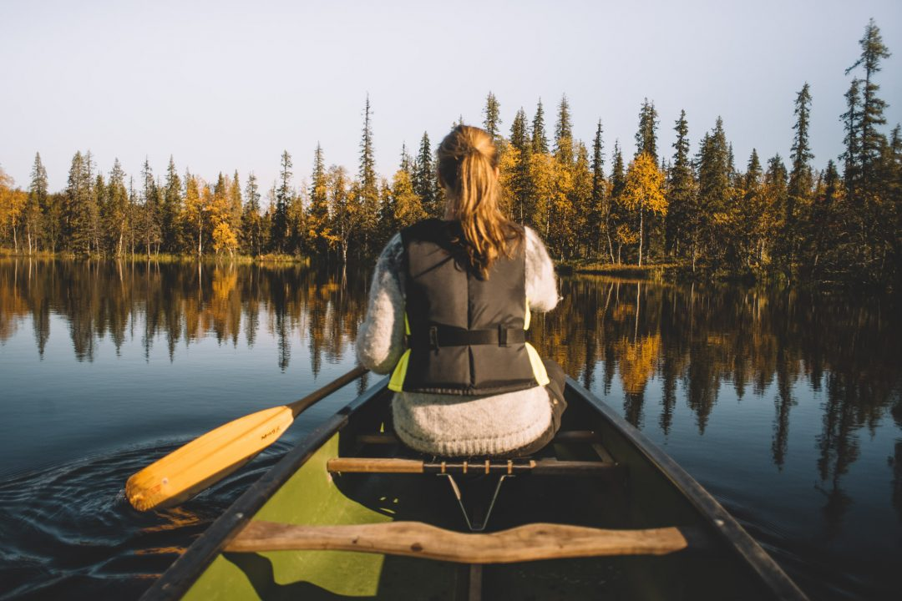
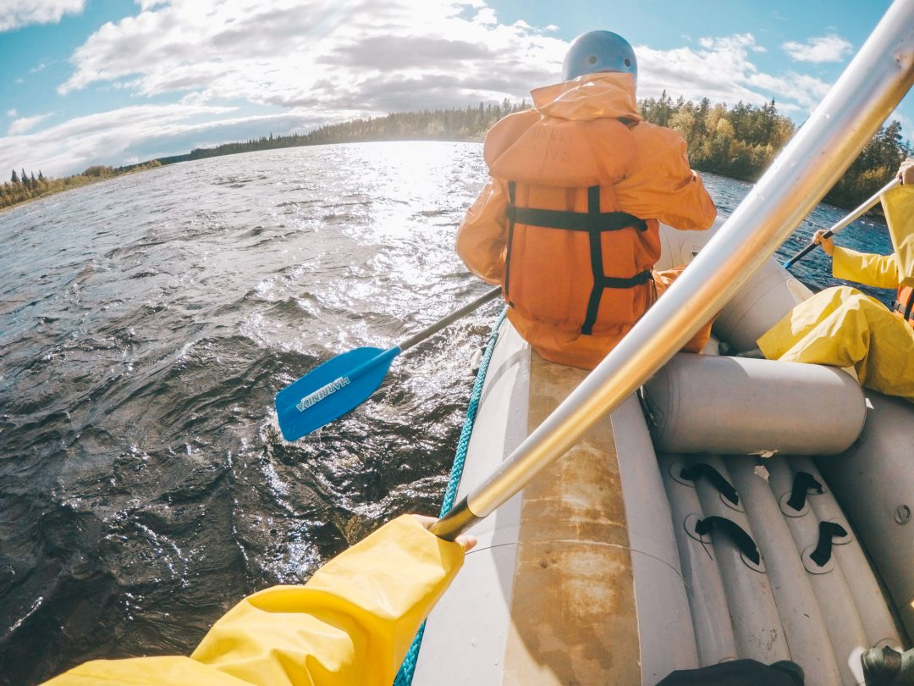

Voyager en Laponie faisait parti de ces voyages qui me faisaient rêver depuis longtemps. Le mode de vie dont on entend tant parler dans les pays nordiques, les aurores boréales, la mythique Laponie, le village du Père Noël… les images et les clichés se font et se défont sans vraiment savoir quoi en attendre.

En septembre dernier, je partais voyager en Laponie Finlandaise pour découvrir les premières couleurs de l’automne, une période aussi appelée « Ruska ». Riche de cette expérience et après un tel coup de coeur pour cette région, je vous livre mon récit de voyage et des idées de choses à faire, à vivre et à voir si vous décider de partir voyager en Laponie.

J’ai fait mon sac et paqueté plus de matériel photo que de vêtements. Je me suis mis en route pour ce périple direction l’aéroport de _**Kittilä**_, delà du cercle polaire arctique, via une escale à Helsinki.

La nuit à peine tombée, je pose le pied sur le tarmac de l’aéroport et m’apprête à vivre à fond ce voyage en Laponie Finlandaise. Assis derrière la vitre, je vois les lampadaires défiler et m’éblouir le long de la route qui serpente au milieu d’une forêt de bouleaux. Les troncs fins et écorchés avec leurs écorces branlantes me plongent d’office dans l’univers lapon que je m’apprête à explorer au cours des jours qui arrivent.

Depuis mon siège, je me prends à scruter la cime des arbres qui défilent en espérant apercevoir ma première aurore boréale. En vain. Mais je continue, inlassablement, à me rattacher à ma patience  et croire en ma chance.

https://www.facebook.com/djisupertramp/videos/1258074197571462/

Je m’installe dans ma chambre, découvre le sauna personnalisé et ne soupçonne pas encore à quel point je vais tomber amoureux de ce moyen de détente. Avant de venir, j’avais repéré sur une carte qu’il y-avait un grand lac qui pourrait être un sujet idéal si les aurores boréales pointaient le bout de leur nez. Je prépare mon sac, mes vêtements les plus chaud et de quoi m’hydrater et pars à pieds pendant quelques dizaines de minutes à la lueur de ma frontale déambuler sur les bords du lac Aklassompolo.

À peine sorti de ma chambre, j’aperçois une tâche blanche mouvante dans le ciel. Je n’ose pas y croire et me dis que ça y-est ce jour tant attendu est peut être arrivé. Le spectacle de la et des nuits qui s'en suivent vous pouvez le voir sur [**cet article**](http://jeremyjanin.com/dormir-dome-aurores-boreales-finlande) et [**celui là**](http://jeremyjanin.com/voir-comment-photographier-aurores-boreales-finlande)... tout ce que je peux dire c'est que ce voyage en Laponie Finlandaise n’aurait pas pu commencer de plus belle façon.

##### JOUR 01 : Randonnée et kayak en Laponie Finlandaise.

Réveil au petit matin, les yeux collés mais encore émerveillés par le spectacle de la nuit d’avant. Le temps d’avaler un petit déjeuner, j’enfile mon sac à dos et pars découvrir la région d'Äkäslompolo à côté d’Ylläs. Un pas, puis deux puis trois et cette première journée complète de voyage en Laponie Finlandaise est lancée. On ramasse quelques baies sauvages, on déambule au milieu de ces forêts aperçues la veille derrière ma vitre. La flore arbore encore fièrement la rosée du petit matin et les ruisseaux s’écoulent au milieu des parterres de mousse qui commencent à rougir en ces premiers jours d’automnes. Le feuillage jauni et orangé des bouleaux tranche nettement avec le bleu du ciel qui nous accompagne tout au long de cette journée.

Pas de grosse montagne ici, seulement des collines, qui laissent rêveur le VTTiste en moi. Le guide m'explique qu'en 2017, la Finlande ouvre une partie de ses parcs aux pratiquants du VTT, fat bike,etc... ce qui me donne instantanément l'envie de revenir pour me balader sur les _singletracks_ de la région. Bien que l'altitude soit faible, on voit très bien les couches sur la montagne, avec le bas rempli de bosquets, d'arbres et de baies, puis plus on monte plus on trouve des gros blocs de roches et plus la végatation disparait pour laisser place au bois mort et à la caillasse. Le sommet est pelé et arrivée là haut nous permet de surplomber toutes les plaines avoisinantes avec une vue imprenable sur le lac Kesänki sur lequel on ira pagayer un peu plus tard. La vue est à couper le souffle et l'air est d'une pureté rare. Que c'est bon d'être ici.

##### Faire du canoë en Laponie Finlandaise

 J'attendais cette activité avec impatience. Après être redescendu des monts où nous randonnions le matin même, on fait un petit arrêt pour manger dans une cahutte de bois dont les Finlandais rafolent : saucisse sur le bout du pic à faire cuir dans le feu qui trône au centre de la cabane, saumon fumé et chocolat local en dessert. C'est l'estomac rassasié que nous nous mettons en route vers le lac Kesänki, pour s'adonner une sortie canoë en faisant le tour du lac. Voyager en Laponie c'est aussi ça, pas seulement le chien de traineau et les aurores boréales. Le pays regorge de centaines de lacs et c'est vraiment l'un des lieux et moments les plus relaxants qui soit quand on part voyager en Laponie.

On part à deux avec Eva de Visit Finland, pour débuter notre chevauchée autour du lac Kesänki sur notre beau canot. La forêt qui embrasse le lac se pare déjà de ses couleurs d'or, il n'y-a aucun bruit, pas même un oiseau et c'est déroutant, seul le son de la pagaie qui plonge et le souffle de la coque qui fend les eaux viennent interrompre ce silence de plomb mais ô combien appaisant. Après avoir découvert le lac vu d'en haut, c'est bon d'être à fleur d'eau et à l'orée des bois pour se sentir en immersion avec ce paysage si captivant.

##### JOUR 02 : Visite d'une ferme de rennes et glamping dans un dome sous les aurores boréales.

Après une nouvelle nuit sous les aurores boréales, réveil au petit matin pour aller approcher les rennes, en découvrir plus sur la culture same puis découvrir les **"auroras domes"** pour **faire du glamping** dans un cadre de rêve. On rencontre Py-ry, la manager des lieux pour un rapide tour du propriétaire avant d'aller rejoindre le coeur de la ferme. À deux pas du lac et entouré de cette forêt qui jaunit et rougit au fil des jours, c'est ici l'occasion d'approcher les rennes. J'en avais déjà vu lors de mon périple hivernal en Norvège il y-a quelques années, mais les voir ici à nouveau fait vraiment quelque chose. Bien qu'aujourd'hui, tous les rennes appartiennent à des propriétaires des terres, ils peuvent toujours se promener et vivre où bon leur semble. Il faut l'avouer, je préférerais quand même m'échapper en pleine nature pour les observer libres et sauvages. La période de migration doit être absolument magique d'ailleurs.

Après les rennes, on découvre une maison-musée qui explique les coutumes sames, et la tradition des gardiens de troupeaux de rennes... un vrai bond dans le temps et dans leur culture. Entre fabrication d'outils, de vêtements à partir de peaux et légendes, technique de rassemblement, de comptage... moi qui ne suis pas un grand fan des musées, c'était assez fascinant d'en apprendre plus sur ce métier.

> [Une publication partagée par JEREMY JANIN (@djisupertramp)](https://www.instagram.com/p/BPNu592hv2Y/?utm_source=ig_embed&utm_medium=loading&utm_campaign=embed_loading_state_control) le 13 Janv. 2017 à 10 :27 PST

Enfin, pour clôturer cette nouvelle belle journée, on se rapproche du lac pour découvrir pour la première fois ces "aurora domes" en plein jour. Leur particularité ? Vous permettre de [**dormir dans un dome sous les aurores boréales**](http://jeremyjanin.com/dormir-dome-aurores-boreales-finlande). Rien que ça. Je ne vais pas m'attarder plus longuement dessus si ce n'est que l'ambiance calme et apaisante nous enveloppe, les gestionnaires des lieux offrent même des séjours "déconnexion" sans réseau, sans smartphone ni internet et il faut avouer, que dans ce cadre là, je veux bien tout oublier et juste me laisser aller au gré des clapotis du lac contre la structure du dome, au crépitement du feu à la nuit tombée et au souffle du vent le soir sous les aurores boréales. Ce n'était pas prévu au départ mais j'ai finalement eu la chance de pouvoir dormir dans l'un de ces domes et ce fut assurément l'une des nuits les plus magiques que j'ai pu vivre.

##### JOUR 03 : Journée rafting, sauna et jacuzzi.

Après cette nuit magique dans le dome sous les aurores boréales, voyager en Laponie m'aura rappelé pourquoi j'aime tant cette région au dessus du cercle polaire et les beaux souvenirs s'entassent déjà, à l'aube de ce troisième jour. Ce matin, l'eau est fraîche dans la rivière à la frontière entre la Finlande et la Suède, dans quelques heures nous irons la goûter entre deux sessions de saunas mais d'abord il est l'heure d'enfiler le ciré et les bottes. _(Je ressemble à un vrai playmobil!)_ On fait parti des plus téméraires pour une session rafting. Bon en réalité, c'était vraiment accessible et très facile, mais j'aime toujours autant cette sensation sur les rapides avec le bateau qui se déforme sous le choc avec les vagues. Le smile est rivé sur mon visage du haut en bas de la descente de quelques kilomètres.

Quelques heures après, nous voilà revenus pour un programme des plus intenses pour tester le sauna et le jacuzzi extérieur. Dur. J'ai eu une vraie révélation et un énorme coup de coeur pour le sauna. C'était la première fois que je testais un sauna digne de ce nom, et en temps normal, je ne suis pas un grand fan de chaleur extrême mais là, j'ai vraiment adoré. Cette sensation de sortir propre, d'avoir la peau qui transpire et respire et de me jeter dans le lac ou la rivière glacée avant de courir se remettre dans le sauna. Quelques minutes au creux du hamac dans le jardin d'**_Aurora Estate_** au bord de ce **lac Ylläsjärvi** immaculé pour clore la journée avant un bon repas, il n'en fallait pas plus pour me combler.

##### JOUR 04 : Rencontrer les huskies & chiens de traineau

Dernier jour après ce court séjour à voyager en Laponie, direction le plus grand chenil de huskies au monde. Plus de 400 chiens sont hebergés, nourris, blanchis, calinés et entrainés pour les courses de chiens de traineau. Lors de la visite (45min env.) on apprend comment fonctionnent les compositions des meutes, comment vivent les huskies et comment ils sont entrainés. Le highlight reste évidemment la partie avec les chiots, mais ça j'ai pas besoin de le préciser :)

##### **INFOS PRATIQUES POUR VOYAGER EN LAPONIE FINLANDAISE**

##### **Comment aller et voyager en Laponie Finlandaise ?**

L’aéroport le plus proche est celui de **Kittilä**, situé à environ 80km d'Ylläs. Il y-a des vols au départ de Paris, Lyon et autres grandes villes avec une escale à Helsinki.

Le mieux reste ensuite de **louer une voiture** pour rejoindre ce coin là et profiter pleinement de la Laponie. Vous pouvez aussi prendre un **bus depuis l'aéroport** (15€ l'aller / adulte sur réservation.) de/à Äkäslompolo et Ylläs.

La monnaie locale est aussi l'euro €. La carte de crédit est très largement acceptée.

N'hésitez pas à relire mes [**conseils pour photographier les aurores boréales**](http://jeremyjanin.com/voir-comment-photographier-aurores-boreales-finlande) avant de partir pour ne pas manquer les images le jour J.

##### **Quelles activités faire en Laponie Finlandaise ?**

**SAUNA, DÉTENTE**

[**Aurora Estate**](http://auroraestate.fi/en/)

Tirroniementie 4C 95980 YLLÄSJÄRVI

020 734 0800

**FAIRE DU KAYAK ET RANDONNER**

[**Ylläs Guide**](http://www.yllasguide.com/)

Guide : Ilkka Mäki +358 (0)40 565 2573

**VOIR LES RENNES, RENCONTRER LES HUSKIES ET FAIRE DU RAFTING**

[**HARRINIVA HOTELS & SAFARIS**](http://harriniva.fi/en/destinations/torassieppi)

Harrinivantie 35 99300 MUONIO – LAPLAND FINLAND

##### **Où dormir en Laponie Finlandaise ?**

**YLLÄS**

[**Lapland Hotel Äkäshotelli**](https://www.laplandhotels.com/EN/hotels-in-lapland/yllas/lapland-hotel-akashotelli.html) Äkäsentie 10 95970 Äkäslompolo +358(0) 16 553 000

**GLAMPING DANS UN DOME SOUS LES AURORES BOREALES**

[**HARRINIVA HOTELS & SAFARIS**](http://harriniva.fi/en/destinations/torassieppi/)

Harrinivantie 35 99300 MUONIO – LAPLAND FINLAND

Ce carnet de voyage en Laponie Finlandaise touche à sa fin, j'espère qu'il vous aura plu et donner envie de voyager en Laponie et en Finlande. Un immense merci à [**Visit Finland**](http://www.visitfinland.com/), [**Visit Yllas**](http://www.yllas.fi/en) et **TMC Echos** de m'avoir invité et permis de découvrir la Laponie sous les premières couleurs de l'automne... c'est sûr j'y retournerai. Ce voyage m'a mis l'eau à la bouche pour découvrir la Laponie en hiver. :)
