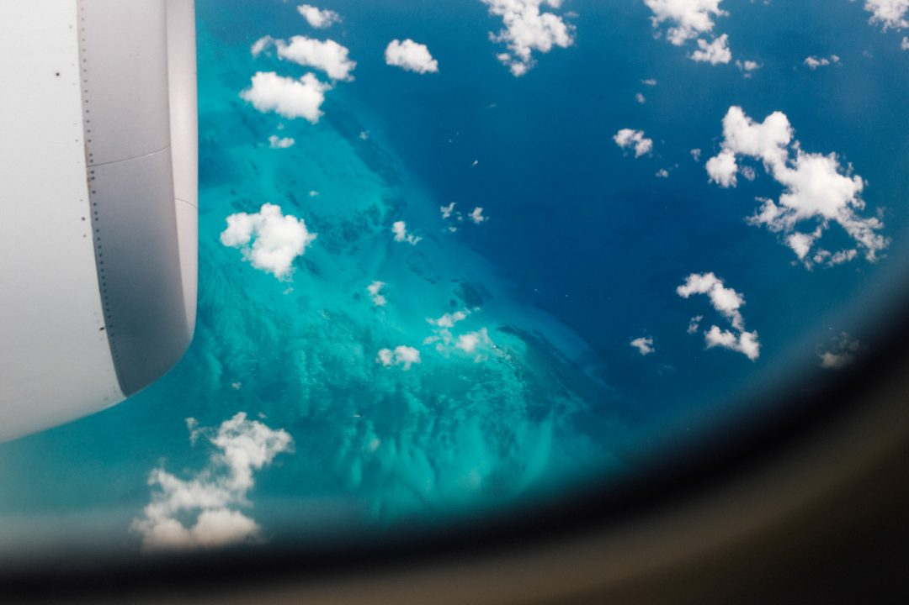
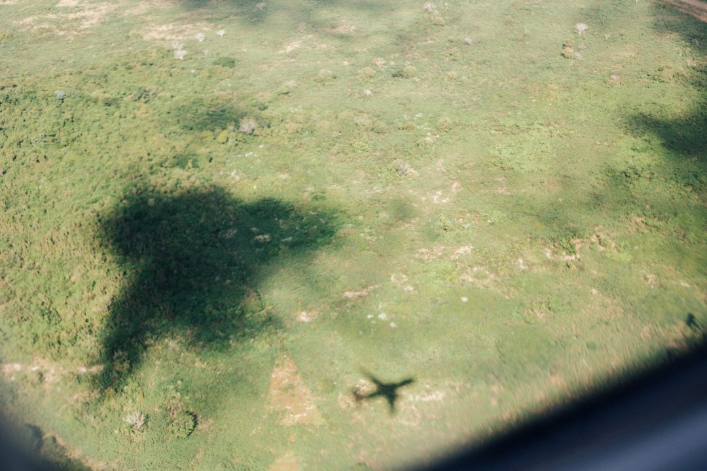
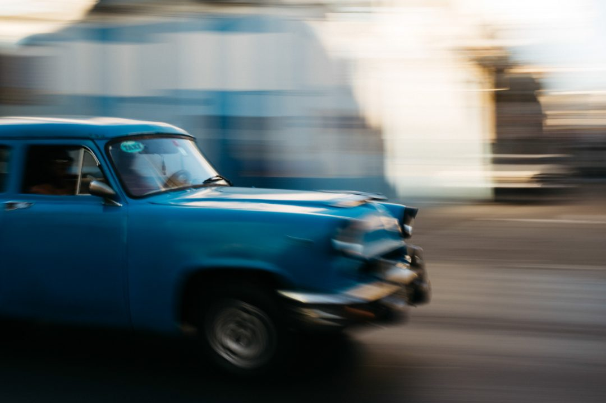
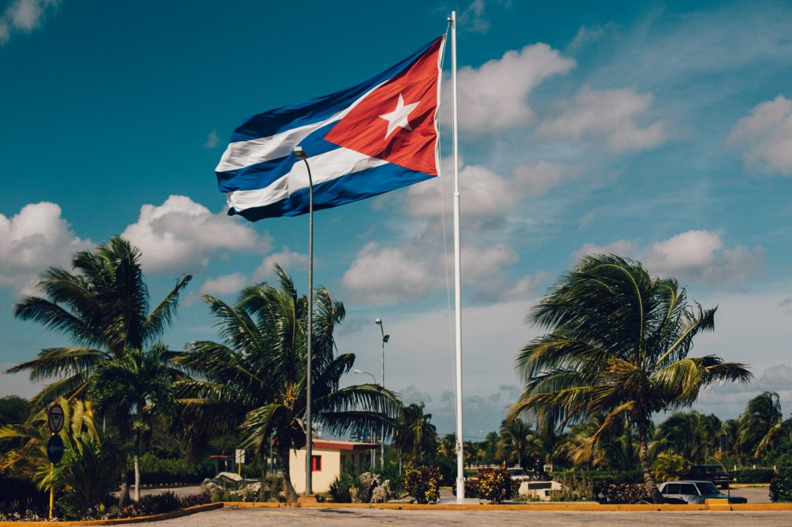
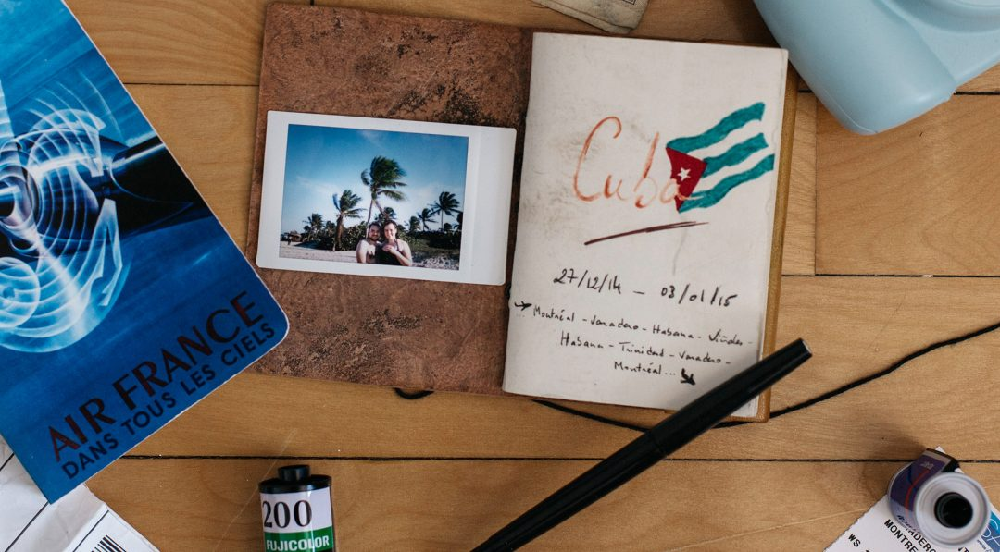
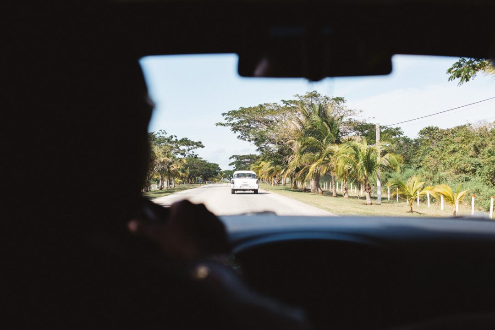
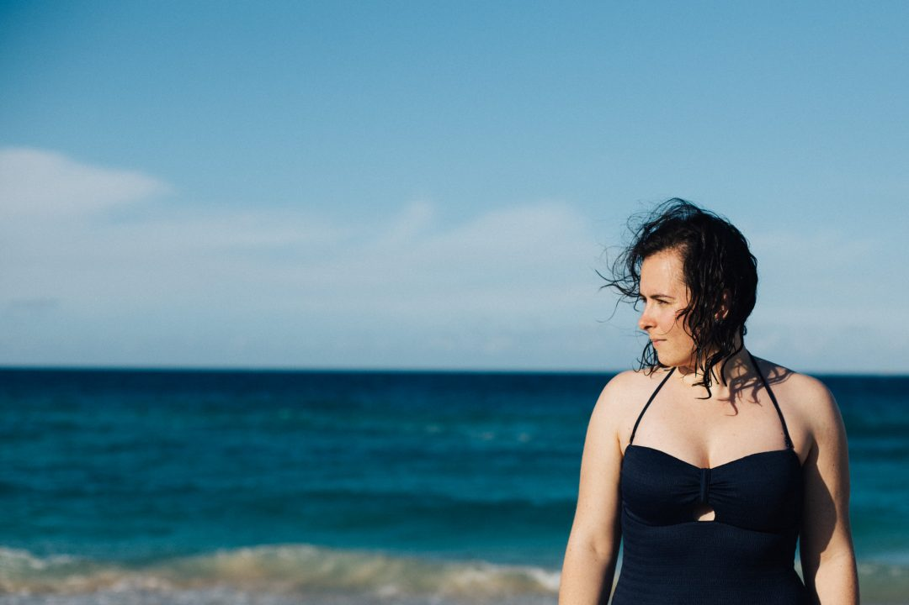
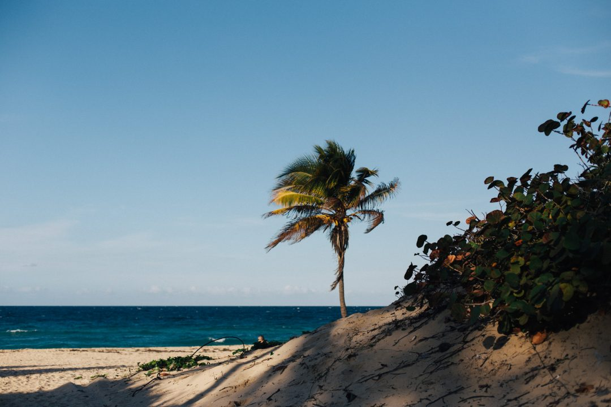
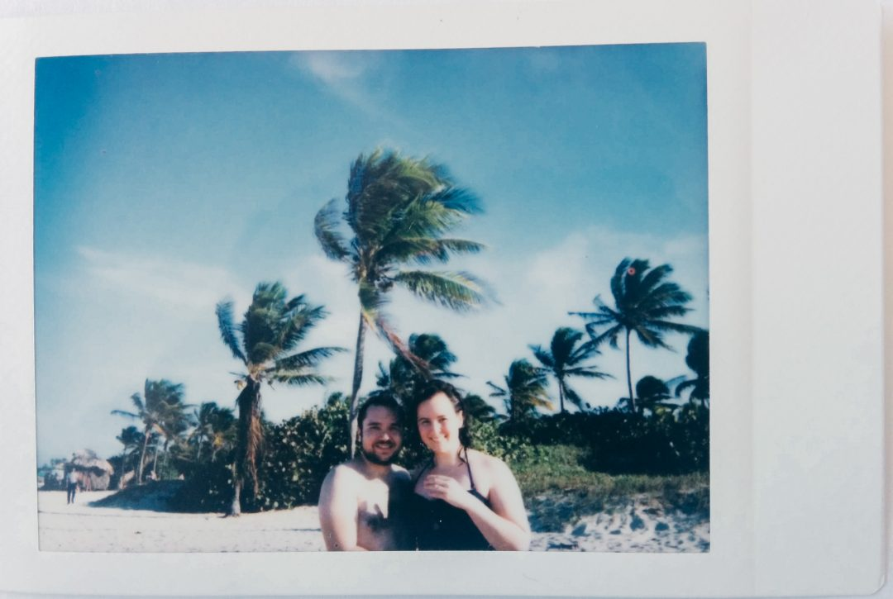
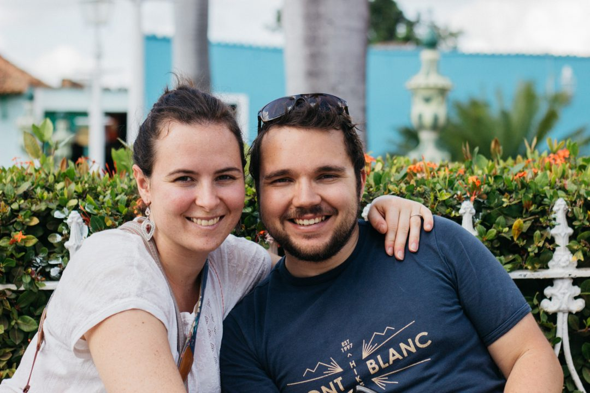

Comme chaque matin le réveil sonne bien trop tôt : les yeux qui piquent et le coeur qui s'emballe, je réveille Samantha et sors du lit. Nous sommes le 27 décembre, on fête notre anniversaire de rencontre et quoi de mieux pour deux voyageurs que de partir pour fêter ça ! Mardjane fait aussi partie du voyage, l'inconnu nous attend à bras ouvert, Cuba nous voilà ! Je cache mon excitation depuis de longue semaine, le jour est enfin arrivé.

On délaisse les manteaux de Montréal, pour les shorts et les lunettes de soleil, on ressort nos plus beaux bronzages couleur doliprane pour aller prendre le soleil du sud. Depuis quelques jours, les flocons n'ont pas cessé de tomber et la rue est aussi blanche que mes mollets. J'ai récolté tous nos souvenirs dans cette petite boîte, j'ai pris soin de la protéger et de bien la fermer.

Elle a pris place au fond de mon sac d'aventure aux côtés de mes fringues et des objos. J'ai embarqué mon réflex et mes trois mots d'espagnol, j'ai ajusté les sangles de mon 25 litres et on s'est engouffré dans la voiture main dans la main. Un dernier au revoir à l'appartement, un dernier coup d'oeil discret avant de tracer notre route, car lorsqu'on sera de retour, bien des choses se seront passées.

    

On passe très vite du couloir d'entrée au hall d'arrivée, mon coeur est parti en cavale, les réacteurs accélèrent, les roues s'élèvent... l'aventure commence. L'excitation du départ reprend ses droits, je retrouve mon vieil ami le hublot, je passe mes vols entiers à le regarder, mes yeux se perdent au dessus de la côte américaine, on dépasse la pointe de la Floride et des Everglades et c'est le saut au dessus du grand bleu. L'aile de l'appareil balaie les quelques nuages pour nous faire découvrir les nuances azures des quelques plages que l'on survole. Je me ressasse tous les souvenirs que j'ai enfermé dans ma petite boîte, une ribambelle de jolis moments que l'on a vécu de Paris à Montréal, de Seattle à Letterfrack, de Portland à New York. On inscrit nos noms sur la carte de visiteurs, on fait des ratures, on recommence, on rit et il est déjà l'heure de sortir de l'avion. La chaleur nous surprend, les -19°c de Montréal nous semble bien loin des 25°c qui règnent sur le tarmac de l'aéroport de Varadero. Les bagages à peine récupérés, on s'empresse de mettre les lunettes de soleil et de savourer notre arrivée face à cet immense drapeau cubain qui flotte devant les portes de l'aérogare. La horde de touristes québécois s'entasse dans les bus des all-inclusive, tandis qu'on négocie notre taxi pour la Havane.

En voiture, la tête contre la fenêtre et du bonheur plein les idées, mes yeux ne quittent plus cette croix qui va et qui vient sous le rétroviseur de cette vieille américaine. Je sens ma petite boite dans le fond de ma poche, comme un rappel pour me dire de profiter de chaque moment et de ne pas oublier de la remplir avec tous ces instants de complicité. On trace la route, les fenêtres ouvertes sur fond de musique locale. On ne traine pas à être dans l'ambiance. Un premier arrêt, et les premières photos avec la forêt comme arrière plan. Mardjane joue du maracasse, on danse sur les sièges arrière au rythme de la trompette et des guitares, ce voyage s'annonce déjà mythique. Les kilomètres défilent et l'excitation grandit, je palpite à chaque virage, je souris sans raison. Tous les trois sur cette banquette arrière avec la côte cubaine pour toile de fond, qu'est-ce qu'on est bien, qu'est-ce que c'est bon ! Le policier a failli tout gâcher mais quelques mots d'espagnols baragouinés et le plan pouvait à nouveau se dérouler comme je l'avais prévu. On délaisse la route principale pour s'engouffrer sur ce chemin secondaire, le taxi reprend sa route en échange de quelques pesos, on fait un doigt d'honneur à l'hiver montréalais et on saute à pied joints dans le sable chaud de la playa.

    

Ma petite boite est sur le qui-vive, j'entends toutes nos histoires s'y bousculer. Je l'emmène poursuivre notre destin en nous délestant de nos sacs au pied de ce cocotier, on rit, on nage, on blague. J'ai laissé sur la plage mon corps et ma tête de petit bonhomme, j'ai fait signe à ma petite boite à souvenir de ne pas louper ce moment. On plonge dans l'eau turquoise pour savourer ce premier bain depuis bien longtemps, je saute les vagues comme un gamin une veille de noël. Le coeur excité et les yeux iodés, je savoure ces moments, la fais rire, la porte et l'étreins, encore quelques minutes... pour ne jamais oublier. Le temps s'arrête, elle fait face à l'horizon, ses cheveux s'emballent sous la brise marine et ses yeux dévorent ce bleu infini, si attirants, si effrayants. Une dernière vague, un dernier souffle et quelques mots susurrés au creux de l'oreille dévoilent la promesse brillante d'un avenir que nous devrons tracer. L'écrin de nos souvenirs passés s'est ouvert, un long rire mais surtout un grand OUI. Un shot d'adrénaline boosté à la molécule du bonheur, un tsunami de sentiments qui fait trembler un petit bonhomme de 25 ans. Une réponse qui donne un sourire grand comme ça, qui fait battre le coeur très fort et qui nous fait nous sauter dans les bras. Ma petite boite à souvenir n'a rien manqué, elle a rangé ce doux moment dans le plus beau des compartiments, à ré-ouvrir et à savourer. Tout un tas de trucs vraiment chouettes qui se mélangent et qui se bousculent dans l'esprit du petit gars que je suis. Un truc un peu fou qui nous arrive, qui nous dévore. Un truc qui chamboule tout, un truc qui rend fier, la promesse d'une belle aventure à partager sur notre nouveau carnet de voyage, où l'on écrira le plus joli de tous les récits.
