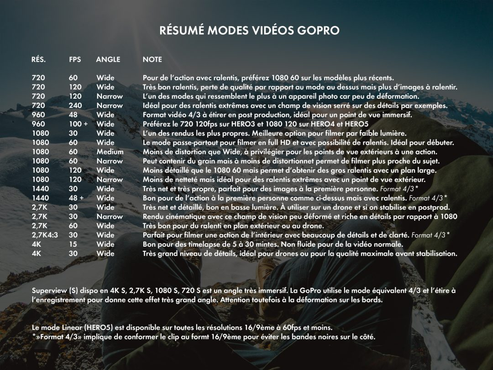
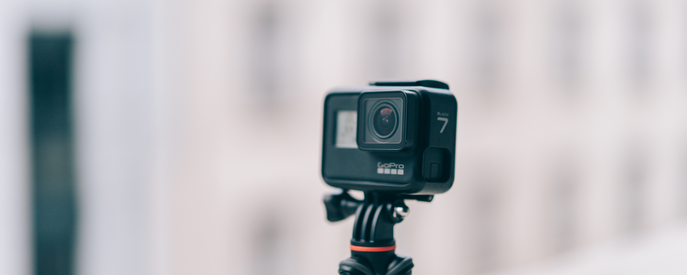
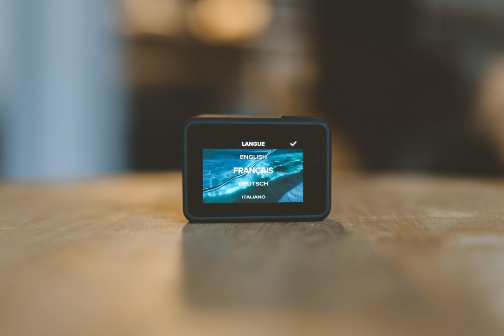
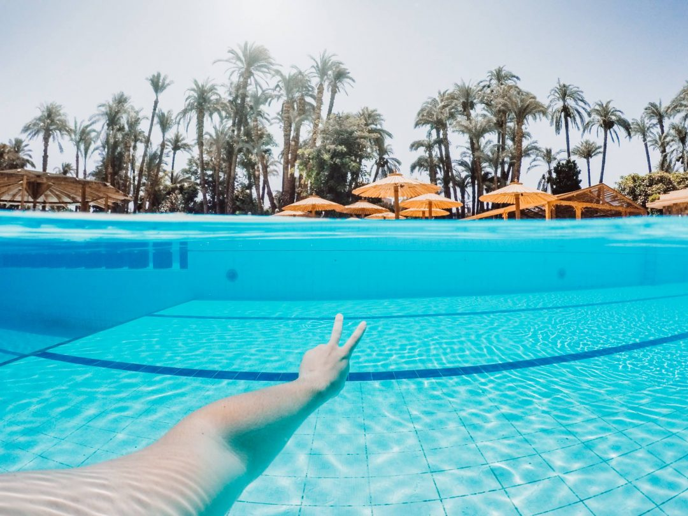
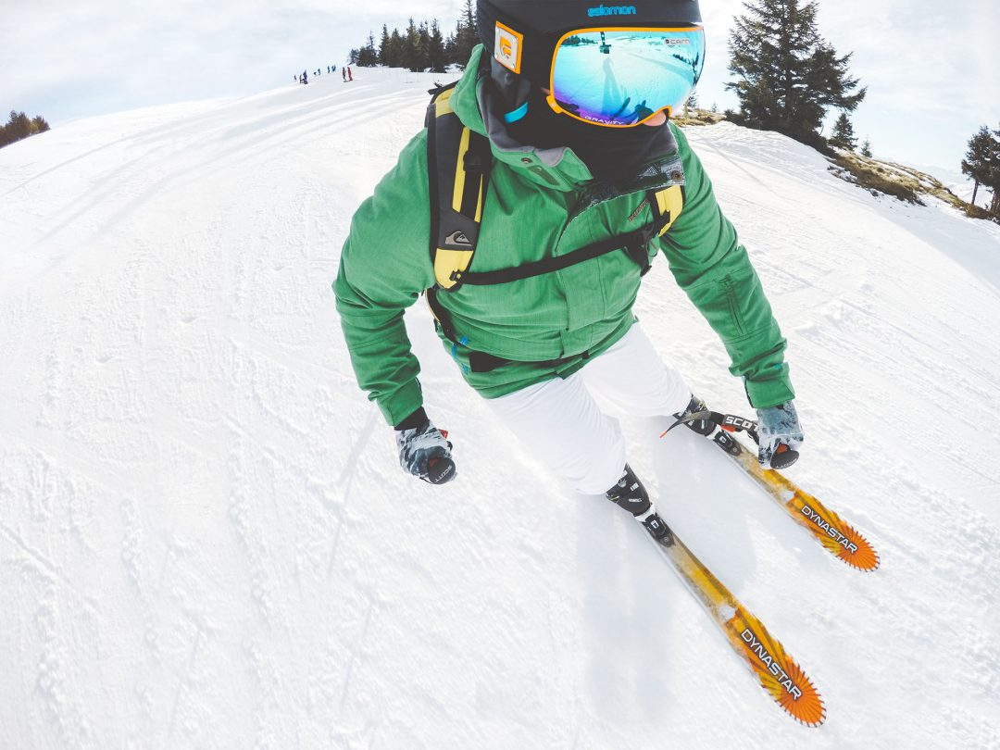
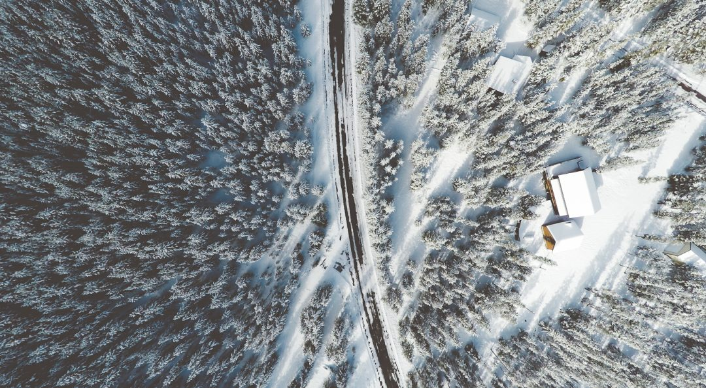
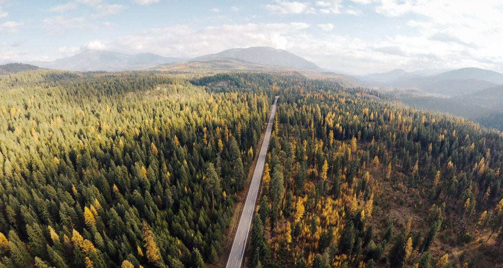

Lorsqu'on vient d'acquérir une [**GoPro**](http://www.amazon.fr/s/?_encoding=UTF8&camp=1642&creative=19458&field-keywords=GoPro&linkCode=ur2&rh=n%3A13921051%2Ck%3AGoPro&tag=djisupe-21&url=search-alias%3Delectronics), on peut parfois être perdu et ne pas savoir choisir les bons modes et paramètres pour filmer avec sa GoPro. Voici donc un tour d'horizon des modes présents dans les **GoPro HERO3,** **HERO4, HERO5, HERO6[,](http://amzn.to/2juWEIW)** **HERO7, [HERO8](https://amzn.to/2MA3afI) et [HERO9](https://amzn.to/3iXXkkD)** pour répondre aux questions : à quoi ils servent ? Que signifient tous les chiffres ? Quelles sont les différences entre eux ?

**SOMMAIRE DE L'ARTICLE** _(Mis à jour avec les modes de la GoPro **HERO7, HERO8 et HERO9**)_

[**\>> 10 accessoires GoPro indispensables**](#indispensables)

**[\>> Mode passe partout](#passepartout)**

[\>> **Filmer à faible luminosité**](#lowlight)

[\>> **Filmer en voiture**](#voiture)

[\>> **Filmer sous l'eau**](#eau)

[\>> **Filmer de l'action**](#action)

[\>> **Filmer avec un drone**](#drone)

[**\>> Utiliser sa GoPro en voyage**](#voyage)

À chaque nouvelle version de GoPro, la marque opère des changements et des mises à jours par rapport aux modèles précédents, en ajoutant de nouveaux modes ou réglages parmi lesquels il est très facile de se perdre. Voici une petite revue de quelques modes de la GoPro avec un avis rapide sur chacun d'eux.

_**À savoir :** Le mode Superview (S) disponible depuis la **HERO3+ et modèles suivants** est en fait l'équivalent du format 4/3 (type 1440p) mais que la GoPro conforme automatiquement au format 16/9ème à l'enregistrement. Testez ce mode chez vous avant de filmer car il est surprenant mais très efficace pour de l'action avec point de vue à la première personne. Attention aux déformations sur les bords._

FILMER AVEC SA GOPRO : LES 10 ACCESSOIRES GOPRO INDISPENSABLES

**1\. BATTERIE SUPPLÉMENTAIRE** _Je vous conseille 1 à 2 batteries supplémentaires en fonction de vos besoins._

**\> [Batterie HERO9](https://amzn.to/2YmMStg) / [Batterie HERO8 / HERO7](https://amzn.to/3ps6YOY)**

**2\. UNE BONNE CARTE MÉMOIRE POUR GOPRO** _Je vous conseille de prendre une ou deux cartes de 32Go ou de 64Go selon vos besoins. L'un des critères les plus importants est la vitesse d'écriture, 90Mo/s est une bonne vitesse d'écriture pour pouvoir copier vos fichiers vidéos 4k ou vidéos ralenties._

[**\> Carte mémoire microSD GoPro - 32Go**](https://amzn.to/2HK0uIP)

[**\> Carte mémoire microSD GoPro - 64Go**](https://amzn.to/2HJEcam)

**3\. LA MEILLEURE FIXATION GOPRO SELON MOI : MOUTH MOUNT (fixation bouche)** _Elle permet de tenir la GoPro dans la bouche. Ma fixation préférée pour donner un angle première personne très immersif._

[**\> Fixation bouche "Mouth Mount" GoPro**](https://amzn.to/2HLPNW8)

**4\. HARNAIS & HEADSTRAP** _Idéal pour utiliser à vélo ou dans toute activité sportive où vous n'aurez pas les mains libres._

[**\> Fixation harnais GoPro - Chesty**](https://amzn.to/2HY311B)

[**\> Fixation de tête - HeadStrap**](https://amzn.to/2FG4Yhl)

**5\. CAISSON ÉTANCHE**

_Pour plonger à plus de 10m de profondeur avec sa GoPro ou pour la protéger en cas d'activité extrême qui risquerait de la détériorer._

[**\> Caisson étanche GoPro HERO8**](https://amzn.to/3ptgOzP)

**[\> Caisson étanche GoPro HERO7/HERO6/HERO5](https://amzn.to/2WwZuvb)**

**6\. DOME GoPro** _Un dome GoPro vous permet de faire des photos mi-air / mi-eau où l'on voit sous l'eau et au dessus de la surface à la fois. C__ertains domes sont livrés avec le caisson étanche GoPro amovible pour pouvoir utiliser le caisson seul et ainsi éviter d'acheter un caisson en plus._

[**\> Dome GoPro**](https://amzn.to/2JJtjXK)

[**\> Dome GoPro avec caisson étanche amovible**](https://amzn.to/2HLDc5z)

**7\. Poignée flottante / Perche** _Avoir une poignée flottante permet à votre GoPro de flotter à la surface si vous la perdez à l'eau. _Pour faire des selfies ou simplement pour une plus grande extension, la perche la plus polyvalente est le 3-Way de chez GoPro.__

[**\> Poignée flottante GoPro**](https://amzn.to/2JJopKk)

[**\> Perche GoPro 3-Way**](https://amzn.to/2Wtb5v9)

**8\. Trépied** _Mon trépied favoris pour la GoPro est le Gorillapod. Il est ultra léger et permet d'accrocher sa GoPro autour d'une branche, d'une rembarde ou autre ou de l'utiliser comme un trépied classique pour faire des timelapses par exemple._

[**\> Trépied Gorillapod GoPro**](https://amzn.to/2HWEh9S)

**9\. Stabilisateur** _Le meilleur du marché selon moi est le Karma Grip fabriqué par GoPro, mais le Feiyu G6 consitue aussi une bonne alternative._

[**\> Stabilisateur GoPro Karma Grip**](https://amzn.to/2I3S66D)

[**\> Stabilisateur Feiyu G6 pour GoPro**](https://amzn.to/2HWEh9S)

**10\. Boite de rangement** _Pour ranger tout vos accessoires et ne rien perdre, acheter une boite de rangement pour GoPro est un must ! On peut jeter la boite dans son sac à dos et toujours retrouver nos accessoires à l'intérieur._

**[\> GoPro Casey](https://amzn.to/2FGkr18)**

**[\> Boite Amazon Basics](https://amzn.to/2WxkSAv)**

### MODE PASSE PARTOUT POUR FILMER AVEC SA GOPRO

Si vous avez un doute ou ne savez pas trop avec quel mode filmer, les modes passe partout sont le mode, qui vous permettront d'avoir de bons résultats dans toutes les situations sont :

## **1080 60fps**

ou

## 4K 60fps\*

_(\* Uniquement disponible à partir de la HERO7 et suivantes - à utiliser si vous avez la place en stockage et un ordinateur assez puissant pour éditer de la 4k)_

_(haute résolution + bonne netteté + possibilité de ralentis) et activez la stabilisation interne sur les **HERO5, HERO6, HERO7, HERO8 et HERO9.**_

### FILMER AVEC SA GOPRO À BASSE LUMINOSITÉ

Bien que l'objectif soit relativement lumineux : f/2,8, le capteur n'excelle pas en basse luminosité en vidéo. _(A noter que d'important progrès ont été apporté en photo sur la HERO7, HERO8 et HERO9 en photo de nuit : timelapse et photo simple, avec la possibilité de faire des réglages manuellement.)_

Pour ce qui est de la vidéo, dans la mesure du possible **restez sur le mode 1080 pour économiser de la place ou opter pour de la 4k pour une image plus détaillée.** Malgré tout, les basses lumières, c'est le point faible de la GoPro, l'image se retrouve très rapidement granuleuse et fourmille beaucoup. Les modèles les plus récents **HERO5, HERO6, HERO7, HERO8 et HERO9** embarquent un mode **"Auto Low Light"** qui ajuste automatiquement la fréquence d'images en fonction de votre résolution pour obtenir le meilleur résultat possible dès que vous filmez en basse luminosité.

Vous voulez filmer en basse lumière, alors restez sur du 30fps ou 24fps que ce soit 1080 ou 4k, c'est sur ce mode que vous obtiendrez le meilleur rendu d'image dans des conditions aussi difficiles. Le 30 images / secondes pour améliorer la qualité, car le capteur n'aura pas à lutter pour enregistrer 2 fois plus d'images à 60p alors qu'il est déjà en manque de lumière pour 30 images, vous aurez ainsi de meilleurs résultats.

Avec les modèles plus récents vous avez également la possibilité de limiter la montée en ISO. Dans les réglages, vous pouvez dire à la GoPro de ne jamais dépasser les 400ISO par exemple, l'image sera certes plus sombre de nuit mais du coup vous aurez beaucoup moins de grain qu'à 1600ISO par exemple.

**En résumé :**

**GoPro HERO4 / HERO5** / **HERO6 / HERO7 / HERO8 / HERO9** = Mode Auto Lowlight ou 4k 24fps _(réglez manuellement pour ne dépasser les 400ISO voire 800ISO en limite max. si vous voulez réduire au maximum le grain.)_

**GoPro HERO3 / HERO3+**  = 1080p 30 fps

### FILMER AVEC SA GOPRO EN VOITURE

Le mode **4K 30fps** sera le plus agréable à l'oeil car plus détaillé, avec la vitesse l'image défilera très vite et sauf si vous roulez sur une route défoncée, ça ne devrait pas trop trembler. Si vous n'avez pas de mode 4K, optez pour du **2,7K 30fps ou 1080 30fps**.

Fixez la GoPro sur une fixation à ventouse sur le pare brise, la vitre ou encore une fixation aimantée sur la carrosserie (attention à ne pas la perdre) et le tour est joué.

_**Activer la stabilisation : oui ou non ?**_

_Sur une route propre et qui ne tremble pas, je vous conseille de désactiver la stabilisation pour que le premier plan de la voiture soit fixe dans l'image. Si vous activez la stabilisation, l'image sera ultra stable mais la stabilisation créera un léger mouvement dans l'image)_

_Si vous partez faire du 4x4 ou roulez dans un chemin, l'image aura beaucoup plus de chance de trembler, dans ce cas, je recommande vivement d'activer la stabilisation interne à la GoPro, présente depuis la **HERO5** et qui est assez incroyable sur la **HERO7 Black / HERO8 et HERO9.**_

**En résumé :**

**GoPro HERO4 Black / HERO5 Black / HERO6 Black / HERO7 / HERO8 / HERO9 =** 2,7k 30 ou 50fps / 4k 30fps ou 60fps

**GoPro HERO3+ / HERO4 Silver / HERO7 Silver** \= 2,7k 30 fps / 1080 30fps

**GoPro HERO 3** / **HERO7 White** \= 2,7k 30fps / 1080p 30 fps

 

### FILMER AVEC SA GOPRO SOUS L'EAU

Pour filmer sous l'eau les **HERO5, HERO6, HERO7, HERO8 et HERO9** sont **étanches jusqu'à 10m sans caisson**. Pour les autres, elles sont livrées avec leur caisson étanche d'origine. Si vous souhaitez plonger plus profonds, n'oubliez pas d'acheter un [**caisson étanche GoPro**](https://amzn.to/2HLcytk) dédié à ça. Vérifiez bien la compatibilité avec votre modèle.

**MATÉRIEL CONSEILLÉ**

- Un [**caisson étanche**](https://amzn.to/2HLcytk) pour plonger plus profond qu'à 10m
- Un [**dome GoPro**](https://amzn.to/2JKfk3P) pour faire des photo mi-air / mi-eau comme la photo ci-dessus
- Une [**poignée flottante**](https://amzn.to/2Osvr4O) pour que votre GoPro flotte à la surface si vous la lâchez

**RÉGLAGES**

Le plus important pour la plongée ou dans la piscine c'est de bien **conserver le mode "Wide"**, car l'eau a un effet grossissant, donc si vous modifiez le mode à "medium" ou "narrow" votre image sera très zoomée et vous perdrez alors beaucoup de degrés dans votre champ de vision.

Pour la résolution, si vous possédez la **GoPro HERO7 Black / HERO8 / HERO9**, je vous conseille le mode **4k60 avec stabilisation activée** qui aura un rendu vraiment incroyable en terme de richesse des détails, de stabilité et de possibilité de ralentis.

Avec les **GoPro HERO7 Silver, HERO6, HERO5**, activez la stabilisation en **2,7k 60** ou **4k30** pour corriger les tremblements dûs à la nage sous l'eau.

**Pour les HERO3+, HERO4** optez pour le mode **4K30, 2,7K 30**. Si vous possédez une **HERO7 White** ou une GoPro précédente, optez pour le **mode 1080 60fps Wide.**

**En résumé :**

**GoPro** **HERO9 / HERO8 /** **HERO7 Black =** 4k60 avec stabilisation activée

**GoPro HERO5 / HERO6 / HERO7 Silver =** 4k30 ou 2,7k 30 avec stabilisation activée ou 4k60 ou 2,7k60 sans stabilisation mais possibilité de ralentis

**GoPro HERO3+ / GoPro HERO4** = 1080S ou 720S

**GoPro HERO7 White / HERO3 et précédentes** = 1080p 30 fps / 1440p 30fps

### FILMER AVEC SA GOPRO DU SPORT (SKI, VTT, SURF, KAYAK...)

Que ce soit ski, snowboard, VTT, skate, surf, bodyboard ou toute autre activité dans l'action, vous risquez d'avoir des problèmes pour stabiliser vos plans au moment du tournage. Tentez de maximiser la stabilisation c'est vraiment important.

Pour filmer de l'action en fixant la caméra sur son équipement (vélo, ski...) ou sur soi ([casque](http://www.amazon.fr/gp/product/B00F19PYR4/ref=as_li_tl?ie=UTF8&camp=1642&creative=19458&creativeASIN=B00F19PYR4&linkCode=as2&tag=djisupe-21), [harnais](http://www.amazon.fr/gp/product/B0025UEQQW/ref=as_li_tl?ie=UTF8&camp=1642&creative=19458&creativeASIN=B0025UEQQW&linkCode=as2&tag=djisupe-21) ...) : **si vous ne voulez pas trop vous embêter** optez soit pour le mode **Superview 1080S 60fps** si vous souhaitez ralentir, sinon **2,7k 30fps ou 4k 30fps Superview** pour une image à la clarté et au détail encore plus impressionnant.

Si vous voulez pousser un peu plus loin, optez pour le **4K 4:3 30fps** pour une image ultra détaillée et de haute qualité ou **2,7K 4:3 30fps** ou **1440 30fps** selon votre GoPro et étirez l'image en post production avec un plugin.

Pour des plans filmés de l'extérieur (où on voit la personne effectuer son action), optez pour des résolutions plus classiques comme **1080, 2,7k ou 4k**. Choisissez le nombre d'images par seconde en fonction de votre envie de ralentir l'action ou non ensuite. Les premières GoPro permettent de filmer en 1080 à 60 fps et 720 120fps, et les suivantes permettent de filmer à 120fps voire **240fps** pour des ralentis encore plus marqués.

Avec l'arrivée de la stabilisation intégrée (Hypersmooth) il est devenu encore plus facile d'avoir des vidéos ultra stables. Les HERO7/8/9 et leurs stabilisations HyperSmooth permettent même de se passer de stabilisateur GoPro dans la plupart des situations pour être encore plus léger et plus compact.

**En résumé :**

_Pour des plans d'actions filmés sur soi ou sur son équipement :_

**GoPro HERO5 / HERO6 / HERO7 / HERO8 / HERO 9 = 4K Superview 30fps** ou **4K** **4:3 30fps** ou **2,7k 4:3 30fps** ou **1440 30fps** (ou Superview) en activant la stabilisation interne.

**GoPro HERO4 Black =** 1080S 60fps ou 720S 120fps (S = Superview)

**GoPro HERO3+** / **HERO4 Silver** = 1080S 60fps ou 720S 120fps (ralentis) ou 30fps (si pas besoin de ralentir) (S = Superview)

**GoPro HERO3** = 1440p\* 48fps / 1080p 60fps ou 720p 120fps / 960p\* 60fps

(\* à conformer au format 16/9ème pour éviter les bandes noires à la lecture)

_Pour des plans filmés de l'extérieur de l'action :_

**GoPro HERO6 / HERO7 / HERO8 / HERO 9** = 4k 60 / 2,7k 120 / 1080 240

**GoPro HERO7 Silver / HERO5 / HERO4 Black** **\=** 4k 30fps / 2,7k 60fps / 1080 120fps

**Modèles précédents** \= 2,7k 30fps / 1080 30 ou 60fps / 720 120fps

### FILMER AVEC SA GOPRO SUR UN DRONE

Si vous fixez la GoPro sous un drone, volez avec un drone FPV et une GoPro, un hélicoptère ou en bout d'aile d'avion de tourisme par exemple, préférez le **mode** **4K 30fps** ou **2,7k 30** si vous l'avez dans vos options, ce sont les modes qui apportent le plus de détails et de clarté dans l'image. Si vous ne l'avez pas, optez pour le **1080 30**. Certains préfèrent utiliser ces modes en 60fps pour une image plus fluide, mais personnellement pour un rendu plus cinématique je préfère utiliser en 24fps ou 30fps.

Vous pouvez également activer le **Champ de Vision "Linéaire"** sur les modèles les plus récents pour supprimer la distortion du fisheye et avoir une image plus naturelle.

Pour régler la **GoPro dans un usage drone FPV**, utilisez le champ de vision large pour un rendu plus immersif. Personnellement, je préfère le rendu du 24 ou 30fps en FPV, mais pour une image plus fluide, optez pour le 60fps. Surtout si vous cherchez à faire de la stabilisation en post production avec un plugin comme Reelsteady.

**En résumé :**

**GoPro HERO 9 =** 5k 30 ou 4K 30 ou 24

**GoPro HERO8 / HERO7 Black / HERO6 / HERO5 / HERO4 = 4K 30fps** de préférence / 2,7k 30 ou 50fps

**GoPro HERO7 Silver / HERO4 Silver** =  2,7k 30fps / 1080p 30fps

**GoPro HERO7 White / HERO3** \= 1080p 30fps

### FILMER AVEC SA GOPRO EN VOYAGE

Si vous souhaitez utiliser votre GoPro en voyage, je vous conseille d'utiliser le mode passe partout que je vous ai indiqué en début d'article :

**1080 60fps**

_sur les modèles les plus anciens_

**4k 60fps**

_sur les modèles les plus récents (ce mode nécessite néanmoins un ordinateur puissant pour le montage et de quoi avoir assez de stockage)_

Pour filmer les paysages ou au drone, utilisez le **Champ de Vision "Linéaire"** pour supprimer l' effet de distortion dû au fisheye de l'objectif et ainsi avoir une image non déformée.

En voyage, on marche beaucoup et vit beaucoup d'activités, activer la stabilisation HyperSmooth sur la HERO7 Black et la stabilisation active sur les autres modèles HERO7, HERO6 et HERO5 est un bon moyen d'assurer d'avoir des plans qui ne tremblent pas et qui donneront un meilleur rendu à votre vidéo finale.

Pour plus d'infos sur [**comment utiliser et fixer sa GoPro en voyage**](http://jeremyjanin.com/comment-utiliser-et-fixer-sa-gopro-en-voyage), rendez-vous sur mon article dédié.

**En résumé :**

**GoPro HERO9 / HERO8 / HERO7 Black / = 4K 60fps** avec stabilisation activée / 2,7k 60 ou 1080 60 selon la puissance de votre ordinateur et vos capacités de stockage

**GoPro HERO6 Black / HERO5 Black** =  4k 30fps avec stabilisation activée / 1080p 60fps

**GoPro HERO7 Silver** \= 2,7k 30fps / 1080 60

Avant de sortir tester tout ça, vous pouvez aussi lire mon article pour savoir [**comment régler et utiliser la HERO5**](http://jeremyjanin.com/comment-regler-et-utiliser-la-gopro-hero5). La plupart des conseils s'appliquent à la HERO7 et suivantes également donc n'hésitez pas à jeter un oeil.

_Enjoy._
