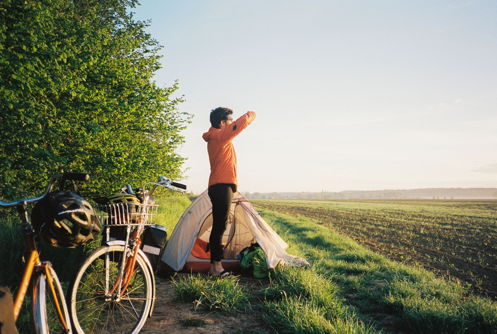

Vivre une micro aventure à vélo pour relier Hem à Us avec du matériel seconde main chiné chez Emmaüs... C'est la vie qu'on a décidé de mener. Tout ça pour un jeu de mot à la c*n.

# Une micro-aventure bikepacking version seconde main en France

Pour notre équilibre personnel avec mon pote [Jean](https://instagram.com/jean_hac), on a lui comme moi, besoin de vivre des aventures pour changer d'air et avoir notre dose de dépaysement.  Quand la pandémie nous a cloué à la maison, notre moral en a pris coup car même si on aime la France, c’est plus fort que nous on a tendance à vouloir voir l’Ailleurs avant tout. Pour autant, on a aussi une conscience écologique qui nous pose un dilemme et qui est contradictoire avec ce qu’on essaie de défendre à notre niveau. Contrairement aux préjugés, on est persuadé que l’aventure n’est pas forcément dans les endroits les plus touristiques. C'est d'ailleurs pour ça que j'aime les micro-aventures (à défaut d'aimer leurs noms), car elles permettent de se dépayser peu importe le nombre de kilomètres, la difficulté ou la durée. Un [week-end raquettes dans le Vercors dans une cabane en plein hiver](https://jeremyjanin.com/microaventure-raquettes-et-nuit-en-cabane-dans-le-vercors/), une virée [VTT au Cap Blanc Nez](https://jeremyjanin.com/aller-faire-un-tour-au-cap-blanc-nez-en-vtt-et-gravel/) ou [passer une nuit dehors en bivouac](https://jeremyjanin.com/les-bivouacs/)... Les possibilités sont sans limite.

Pour notre prochaine aventure, on voulait donc du local, chiner du matériel chez Emmaüs, sortir nos machines à coudre pour adapter le matériel et avoir un impact minimum sur la planète.
Au même moment, [Sport Planète](https://instagram.com/sportplanetemaif), la branche sport éco-responsable de la MAIF m'a contacté pour savoir si j'avais un projet éco-responsable car ils aimeraient s'y joindre. Il ne nous en fallait pas plus pour poursuivre notre réflexion et se dire qu'on tenait quelque chose. Hem est située à 15km de chez moi, le point de départ était donc tout trouvé… Que les amateurs de mauvais jeux de mots se rassurent, il y-a bien un « Us » en France.

C’était donc acté, on allait rallier Hem à Us à vélo avec du matos de seconde main.

# Comment on s'est équipé pour notre micro-aventure

_Emmaüs_, _Le Bon Coin_, _Marketplace_, brocantes, récup', matière première... tout y-est passé. Je le reconnais, j'ai été bien inspiré par les journées à suivre Samantha à chiner pour son activité de brocanteuse en ligne : [Bonjour Autrefois](https://instagram.com/bonjourautrefois).

On a commencé par chiner les vélos en priorité. Très vite, j'ai trouvé un Peugeot NS600 orange dans une recyclerie. On s'est alors mis en tête d'essayer d'en trouver un similaire à Jean. Une fois chose faite, il ne nous restait plus qu'à changer quelques pièces, faire l'entretien, peaufiner les réglages... Comme quand j'ai [remonté un vélo gravel](https://jeremyjanin.com/remonter-un-velo-gravel-de-mes-propres-mains/)

Vu qu'on partait en Mai, il nous fallait prévoir un peu tous les cas de figure en météo niveau vêtements, tout en ayant suffisamment de place pour transporter le matériel vidéo, tout ça sans être trop lourd pour pouvoir pédaler et avancer un minimum.

   

Jean comme moi, on est passionnés par l'optimisation du matos, avoir du matériel de randonnée / bikepacking léger et compact et de plutôt bonnes connaissances en terme de gestion de la nourriture, de la protection des intempéries etc... Jean a déjà traversé le Pacific Crest Trail à pied, la Nouvelle-Zélande à pied et retour au point de départ à vélo, j'ai fait pas mal de randonnées et de sorties bikepacking par le passé... On a donc suivi [nos propres conseils pour partir en bivouac](https://jeremyjanin.com/conseils-preparer-partir-en-randonnee-bivouac/) et ça nous a bien aidé au moment de décider ce qu'il nous fallait emmener.

   

On a décidé de garder nos casques de vélo car on ne plaisante pas avec la sécurité. On a récupéré des bâches de camion pour fabriquer une sacoche de guidon pour Jean, je me suis conçu une sacoche à mettre dans mon panier avant avec des chutes de X-PAC, une matière technique légère et résistante. On a trouvé des sacoches de La Poste pour mon vélo et des sacoches en toiles pour Jean.

   

Niveau matériel photo/vidéo, un trépied était incontournable pour nous filmer à deux, mon Panasonic S1 avec l'objectif 35mm f/2 était notre caméra principale. Jean et son Fuji XT-3 et j'ai embarqué avec moi mon petit compact argentique pour faire des photos au fil du trajet. On avait pris la gimbal (stabilisateur vidéo), mais au final on ne l'a pas utilisé, lui préférant la GoPro plus pratique à utiliser.

On a écumé quelques Emmaüs et Recycleries pour trouver quelques vêtements, pour ce qu'on ne trouvait pas, Le Bon Coin et Vinted nous ont bien aidé. Une fois tout ça récupéré, recousu, et peaufiné. Il ne nous restait plus qu'à planifier notre itinéraire et attendre (im)patiemment le départ.

# Planifier l'itinéraire de notre micro-aventure à vélo sur Komoot

Quand j'ai trouvé une petite ville appelée Us sur internet, c'était une première victoire. J'ai ensuite regardé le code postal. 95, c'est bon, déjà on allait pas devoir traverser toute la France. Je lance une recherche depuis mon [profil Komoot](https://www.komoot.fr/user/739261110267?ref=wud) "Hem" vers "Us" et là bingo. On cochait toutes les cases qu'on voulait : local, fun, dans une région pas très touristique.

Pour pimenter tout ça, on a choisi un type de trace "gravel" pour ne pas faire que de la route et avec le recul, on a aucun regret, on se sera éclaté dans les petits chemins, en bord de terrils, dans les bois, à travers champs... Étant donné qu'on savait qu'on souhaitait filmer notre aventure, prendre le temps de faire des photos, on a décidé de se laisser 4 jours pour parcourir les 250km. C'est pour ça que j'adore utiliser le planificateur d'étapes Komoot car j'ai juste eu à sélectionner le nombre de jour, le niveau — ici _débutant_ pour prendre en compte nos petits vélos, et les arrêts photos. Je l'avais déjà utilisé lors de [mon trip bikepacking en Écosse avec mon père](https://jeremyjanin.com/bikepacking-fatbike-en-ecosse-avec-mon-pere/) et à chaque fois c'est royal. Komoot sépare les journées en des étapes équitables et on a juste à trouver un endroit où dormir chaque soir dans le coin.

# C'est parti ! Plus que 250km avant Us...

On s'est donc élancés de Hem sous quelques gouttes de pluie : le Nord pleure déjà notre départ ! On a pris le vent de face, les petits chemins bien funs à flanc de terril, des pistes cyclables mais aussi des portions de routes où on serrait les fesses avec le trafic. On en a pris plein les yeux au monument de Vimy, on a dévalisé la boulangerie d'Arras à l'ouverture, on a arrêté de compter le nombre de champs de colza traversé au bout du premier jour, je ne passais aucune côte avec mon vélo en _singlespeed_ (mono vitesse), donc on pédalait fort dans les descentes pour essayer de remonter le plus haut possible dans la montée en face avant de finir en poussant. On s'est surtout sacrément marré !Mais le mieux, c'est encore de vous laisser découvrir tous ces bons moments dans le film de notre aventure !



