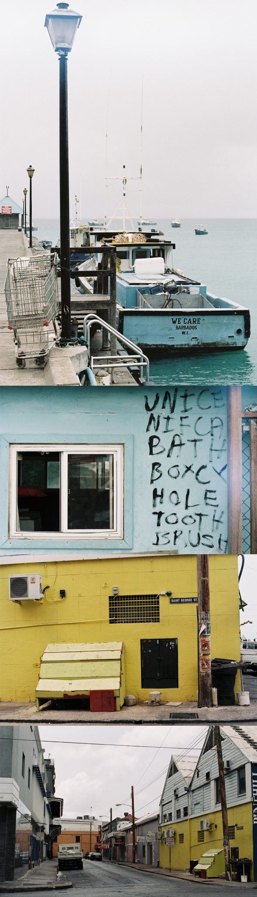

Mon expérience argentique se forge au rythme des pellicules que je déroule et rembobine dans mon X700. Au rythme des 12, 24 ou 36 poses, qu'elles soient noir et blanc ou couleur, elles se succèdent mais ne se ressemblent pas.

On répète toujours le même rituel, un rituel à la sonorité pleine de charme. On ouvre le capot, l'appareil est à nu et sensible. Sensible à la lumière, à la poussière, au moindre faits et gestes, le barillet est là, prêt à accueillir le corps de cette pellicule. C'est le moment de dérouler d'abord la pellicule pour la glisser autour de l'axe, puis l'étirer pour venir la loger dans son emplacement. Là... voilà... ça y-est, c'est bon. On pousse la manette pour faire avancer la bobine jusqu'au point de départ de la pellicule. SHLAAACK. On referme le capot pendant les 12, 24 ou 36 poses, sans jamais l'ouvrir, sans jamais pouvoir regarder ce qu'on vient d'immortaliser, sans jamais savoir si on devrait quand même en reprendre une "au cas où". On déclenche, puis on l'enroule à nouveau. Ca y-est, le petit curseur est en face du petit "1". La pellicule est chargée, prête à garder cette image, figer l'instant en un battement de cil pour l'apposer à jamais sur cette pellicule. Sur MA pellicule. Ma première péloche, elle a été naïve, simple mais j'y ai mis de l'émotion et beaucoup de moi. Les pellicules qui ont suivi se sont mises à chanter, à répéter sans jamais s'arrêter cette même mélodie, ce même refrain, celui du déclencheur qui se baisse et marque le recommencement de la manipulation, de la partition. SHLAAACK. Que c'est bon de l'entendre à nouveau. On l'effleure du bout du doigt, le presse, il se libère et vient figer cet instant à jamais. Que c'est bon de l'entendre à nouveau ce son si singulier du déclencheur de mon Minolta. Ce son, cette pression, que j'apprivoise un peu plus cliché après cliché. Ce son, cette vibration contre la paumette lorsque le miroir s'abaisse, je le reconnais, c'est lui, c'est mon argentique. Le pouce s'agrippe à la petite manette, la pousse, ce bruit métallique est alors remplacé par un son plus étouffé, la bobine coulisse autour de l'axe, et révèle une partition vierge avant que le déclencheur ne vienne y apposer ses propres notes, sa propre interprétation quelques secondes plus tard.

Le mécanisme de mon argentique, c'est un orchestre à lui tout seul, au rythme lent et hésitant lors de la première péloche, puis crescendo au fil des pellicules, pour finir par s'enchainer, en rythme, en parfaite osmose. On chuchote quand on change une pellicule, pour garder sa concentration, pour apprécier les sons. Le tempo s'est accéléré ces dernières semaines, je l'emporte partout, je ne peux plus le quitter. J'ai décidé d'emporter cette musique avec moi dans les Caraïbes cet été, pour continuer à l'écouter, à l'apprécier même si c'est bien loin de là où je l'avais entendu pour la première fois. J'ai glissé ma pellicule dans son étui, une Portra 160, je m'en souviens. Je lui ai fait prendre place dans mon sac. Juste à côté du Minolta qui, lui, a déjà commencé sa propre partition avec une Superia 200. Ils attendent patiemment leur tour. Je les sors une première fois à l'aéroport. SHLAAACK. Puis à Londres. SCHLAAACK. L'embarquement est imminent, je le glisse à nouveau dans mon sac, lui et la Superia 200, juste à côté de la Portra 160. Toujours. Je passe les portiques et les rayons X. Ils prennent place à mes pieds, à peine réchauffés par les quelques rayons du soleil qui traversent le hublot de ce Boeing. Je déclenche à 11 000m d'altitude, au dessus de l'Atlantique. C'est ma photo argentique la plus haute jamais prise. Les regards alentours sont inquisiteurs, ils ne connaissent pas cette mélodie, ne comprennent pas le mécanisme. Chaque déclenchement attire l'oeil du voisin, un oeil qui tente tant bien que mal de voir ce qu'il y a sur l'écran. Rien. Il n'y en a pas. Je suis à 11 000m au dessus de vos têtes, je viens de prendre ma première photo argentique en avion. Je pars en [voyage](http://www.fr.lastminute.com/). Je pars découvrir l'île de la Barbade. Je compte bien faire danser mon pouce et ma paumette au rythme de la mélodie de mon X700, entrainé par la Superia 200 avant qu'à bout de souffle, elle ne s'incline et donne le "LA" final à la Portra 160.

Si j'avais bien emmené mon argentique en Inde, je n'avais finalement rapporté aucun cliché, faute du débutant ou malchance, je ne saurai jamais, mais ce voyage à la Barbade m'offre la possibilité d'immortaliser à nouveau des instants à l'argentique. Mon X700 ne me quitterait jamais, c'était décidé. Et cette fois, son refrain chantonnerait aux quatre coins de cette île au coeur des Caraïbes. Je la connais presque par choeur cette mélodie depuis ma première péloche, mais je ne m'en lasse pas, et c'est presque avec la boule au ventre que je m'en vais tenter l'expérience argentique en voyage. Je ne me suis pas fixé d'objectif, ni de but précis. Je veux simplement figer l'instant sur ma pellicule et m'appliquer. Je m'apprêtais à immortaliser des paysages et scènes de vie, qui une fois sur négatifs révèleraient ma toute première série argentique en voyage. Finalement, j'ai retrouvé les mêmes automatismes qu'à la maison, à la différence près que je savais que je ne reviendrais certainement jamais ici. Avec le temps, j'ai plus envie de capter un moment qu'un paysage, j'ai envie de figer une émotion plus qu'une nature morte. J'essaie en tous cas. C'est ce qui charge un peu plus ma pellicule de souvenirs. 36 poses de souvenirs à jamais gravés. Je me suis surpris à déclencher de plus en plus vite en voyage, à être plus habile aussi pour changer la Superia 200 qui venait de tout donner et d'abdiquer dans un dernier souffle, une dernière pose. Le bout du rouleau. La fin de la bobine. Elle tire sa révérance et donne vie à la Portra 160. Mes doigts ont récité leur leçon, comme ceux d'un pianiste qui se baladent d'octaves en octaves.

La pellicule est enclenchée, prête à dégainer. Mon pouce active la manette, la pellicule s'enroule sur elle même, la mise au point est faite, mon doigt se pose, presse, actionne le déclencheur qui abaisse le miroir, capte la lumière qui se reflète sur ce dernier pour l'envoyer directement sur la pellicule vierge. Mes doigts viennent d'écrire une nouvelle partition, une portion de vie dont la note finale est toujours l'inconnue. Le refrain s'enchaine, encore et encore, sans que je m'en lasse, je guette ce qu'il se passe, à gauche, à droite, sous mes yeux, sous mes pieds, au loin, au large. La magie de l'argentique opère, elle n'est plus seulement là lorsqu'on récupère ses négatifs après quelques jours à attendre le résultat. Non, la magie opère bien avant. La mélodie m'a envouté dès le premier déclenchement, je voudrais qu'elle ne s'arrête jamais, je continue à regarder à travers ce viseur qui porte les traces des années, je répète une fois, dix fois, trente fois par jour, cette même mécanique. Une mécanique archaïque, mais une mécanique magnifique.

Si je n'avais pas cette passion pour la vidéo, je crois que je me verrais bien partir juste mon Minolta, mes peloches et moi. Je suis fan... émerveillé comme un gosse, subjugué par les émotions que me procurent ce petit appareil plus petit que mon reflex, plus lourd que mon iPhone, sans aucune nouvelle technologie à l'intérieur et pourtant, et pourtant... c'est sûrement l'objet qui a le plus de charme. Je ne prends plus seulement une photo pour prendre une photo, mais pour le plaisir de tenir cet appareil dans mes mains, de décider à quel instant je relance la mécanique, la mélodie, de sentir qu'en une pression de la durée d'un battement de cil, j'écris une nouvelle partition, un nouveau refrain aux notes identiques. Cette mélodie qui se répète mais dont la note de fin est toujours nouvelle... unique. Celle qui résonne à jamais, celle qui se fige sur la pellicule... c'est celle là, cette note unique qui donne du caractère à chacune de ses 12, 24 ou 36 poses. Le reflet d'un moment de vie. Un SCHLAAACK dans le temps qui marque la fin d'une mélodie, la fin d'un moment vécu. En attendant... le prochain. SHLAAACK.
