Aujourd'hui, j'ai envie de vous parler du jour où j'ai filmé une production GoPro en Ecosse. Je me suis envolé pour 5 jours du côté de Lochinver dans les Highlands pour tourner une production GoPro autour de l’écosystème Karma.

Nous étions une équipe de 5 personnes (1 producteur, 1 pilote drone, Jack et son ami Dominic héros de la vidéo et en charge de shooter les images POV - première personne, et moi en charge de diriger le shoot et les prises de vues) + notre guide pour nous accompagner dans la région.

On partait donc dans le but de ramener une histoire à raconter autour des aventures de Jack et son van et pour montrer comment il utilise sa GoPro et Karma pour immortaliser ses aventures.

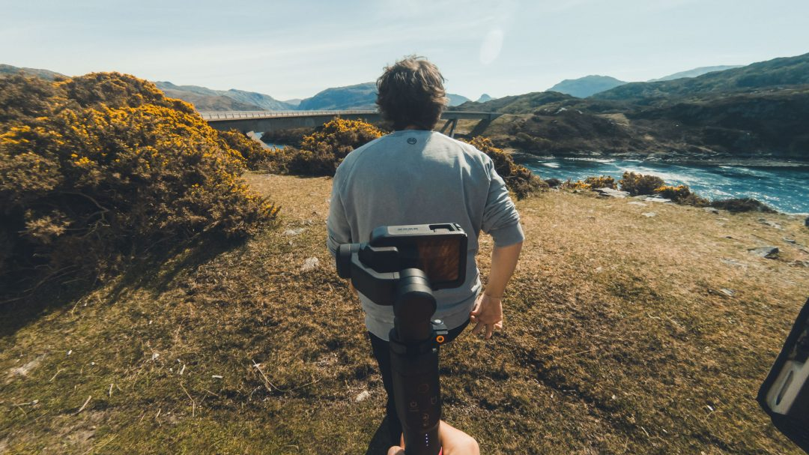
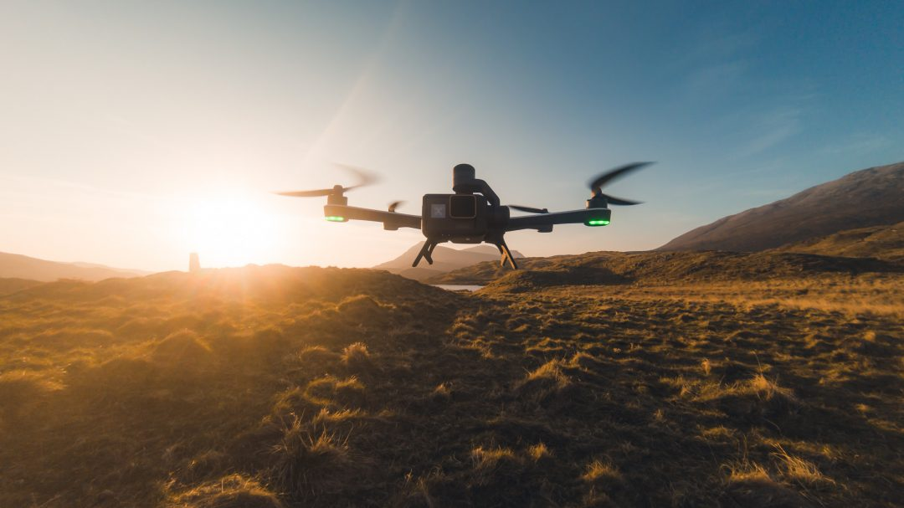
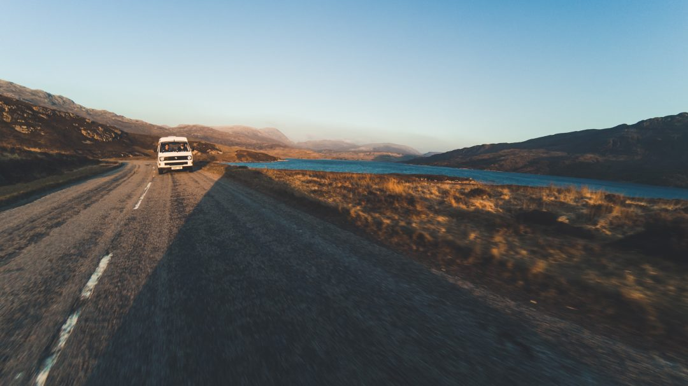

**Bilan :** 2 sommets gravis, 3500m de dénivelé cumulé, 400Go de contenu ramené, 5 jours de grand soleil digne d’un été en Californie et un feu sauvage qui nous aura tenu en haleine tout au long du shoot pour savoir si oui ou non, on pourrait grimper Suilven, LA montagne autour de laquelle s’articulait une bonne partie de l’histoire.

### PRE-PRODUCTION

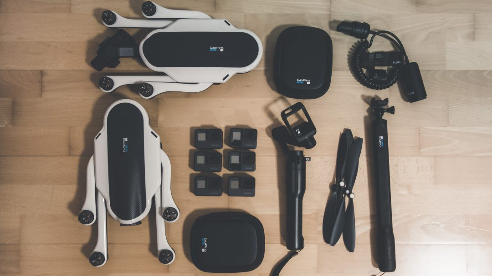

**Le voyage**

Nous sommes partis dans les Highlands écossaises, autour de Lochinver pour rouler sur la célèbre route 500 qui traverse des paysages somptueux. Niveau météo, on avait tout prévu sauf ça : 5 jours de météo exceptionnelle sous un soleil incroyable et même un shoot en péril à cause des énormes feux sauvages qui se sont déclenchés pile là où nous devions filmer.

**Mon rôle**

Lors de ce shoot, j'étais en charge de la direction artistique globale et des prises de vues non POV (Karma Grip, trépied, timelapse...). J'étais aussi là pour m’assurer qu’on capturait tout le contenu qu’il nous fallait à chaque moment de la journée, prendre des photos et vidéos _behind the scenes_ pour GoPro, diriger Pete, le pilote drone et Jack dans les choix de cadrage, de mouvements de caméras et du déroulement des actions à mettre en image, coordonner les réglages à utiliser pour chaque plan pour assurer que tout se conforme bien lors de l’editing et montrer différentes fonctions et réglages disponibles sur la _HERO5 Black._

**Le matériel**

Le but de ce tournage était de mettre en avant l'écosystème Karma et les principales fonctions de la HERO5 Black. Nous avons donc utilisé :

\- Des GoPro [**HERO5 Black**](http://amzn.to/2C9myd8) uniquement, toutes mises à jour avec la version v2.0 du firmware pour pouvoir shooter des timelapse, nightlapse raw notamment.

\- GoPro Karma : [**Karma drone**](http://amzn.to/2j4OpTK), [**Karma Grip**](http://amzn.to/2iv8WN4) et le [cable d’extension](http://amzn.to/2zwCNjl) pour Karma Grip

Et un tas d’accessoires : [**GoPro Seeker**](http://amzn.to/2zyc9GM), la perche [**El Grande**](http://amzn.to/2hFMPDZ), [**HeadStrap**](http://amzn.to/2AkqmEj), Ventouse [**Suction Cup**](http://amzn.to/2hHmRAj), des cartes mémoires 64Go principalement.

### JOUR 01

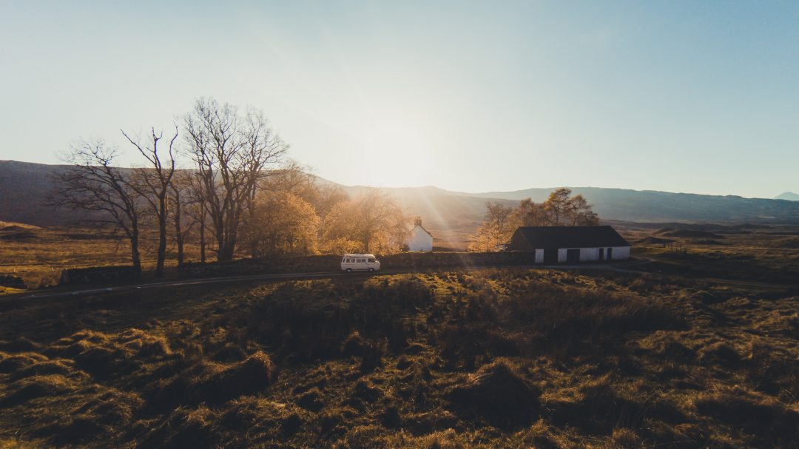
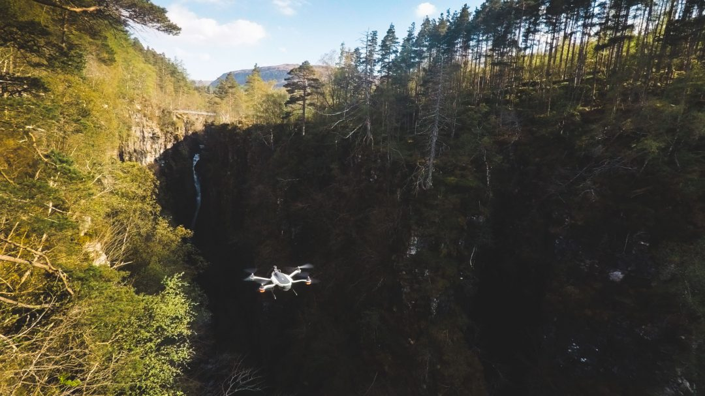
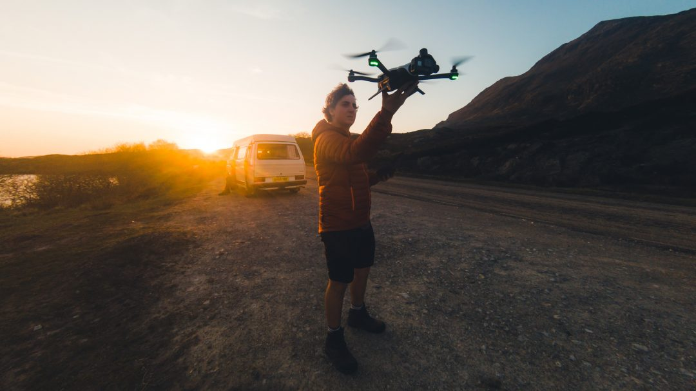

03:50. Le réveil sonne le début de cette journée de transport qui s’annonce. Je me prépare, finis de paqueter mon sac et saute dans un Uber pour l’aéroport de Lyon. Le temps d’enregistrer mon sac à dos, attraper un petit dej’ rapide et me voilà à bord de mon premier vol direction Londres. Arrivé à Heathrow, je retrouve Rich' le producteur sur le shoot. On partage une collation et filons vers la porte d’embarquement 10A pour notre vol final. 1h15 plus tard, le commandant de bord semble aussi excité que nous de voir cet énorme ciel bleu au dessus des Highlands écossaises et nous souhaite la bienvenue pour un « glorious weather in Inverness ».

On récupère notre voiture de location pour retrouver le reste du crew autour d’un déjeuner bien mérité. Le temps d’avaler un bon burger et nous voilà en route pour Lochinver au nord des Highlands. Après ma venue sur l’île de Skye l’an dernier, je n’avais qu’une hâte : aller découvrir les highlands. Je ne m’attendais pas à les découvrir si vite ni sous une telle météo. Pourvue que ça dure. On met 5h à boucler les 2h de route entre Inverness et Lochinver en réalisant les premières images du tournage en route. Le coucher de soleil nous en met plein la vue et nous donne tout sauf envie de ranger les caméras. Les ruines par ci, la route par là. On profite de ces conditions idéales au maximum pour faire des images. Finalement, c’est en début de soirée qu’on finit par prendre quartier dans la petite ville de Lochinver et on s’aperçoit bien vite que plus aucun restaurant ne sert après 20h. On retient la leçon pour les prochains jours.

On défait les sacs, fait un point sur la production et les jours à venir. Pour ce shoot, l’export se fera en 1080, je fais donc opter tout le monde pour shooter principalement en 2,7k 30 Linear pour les images non-POV (GoPro non montée sur soi) et 2,7k 30 Wide pour les images POV (GoPro sur soi, exemple: HeadStrap, Harnais…) avec des variantes en fonction des besoins en terme de ralentis ou d’angles à avoir.

Il est minuit passé, je sors sur le balcon et vois que les étoiles sont de sorties avec une demi lune et pas un nuage à l’horizon. Avant d’aller me coucher, je sors installer 2 HERO5 Black branchées sur une batterie externe pour shooter un nightlapse toute la nuit. Avoir une nuit aussi claire est déjà inespérée, moi qui m’attendais à des conditions quasi hivernales, mais avoir cette demi lune est idéal pour venir éclairer les zones sombres et conserver un peu de détail dans l’image dans l’obscurité de la nuit pour ce nightlapse. La première HERO5 Black est en charge de capturer le paysage et la seconde est placée juste en amont pour avoir le behind the scenes.

_**Réglages utilisés :**_

_Mode **Nightlapse raw** / ProTune ON / WB: 3000K / Temps de pose : 30 sec / ISO max : 800_

_Je rentre backuper les premières images de la journée avec le producteur sur 3 disques durs différents et file me coucher._

### JOUR 02

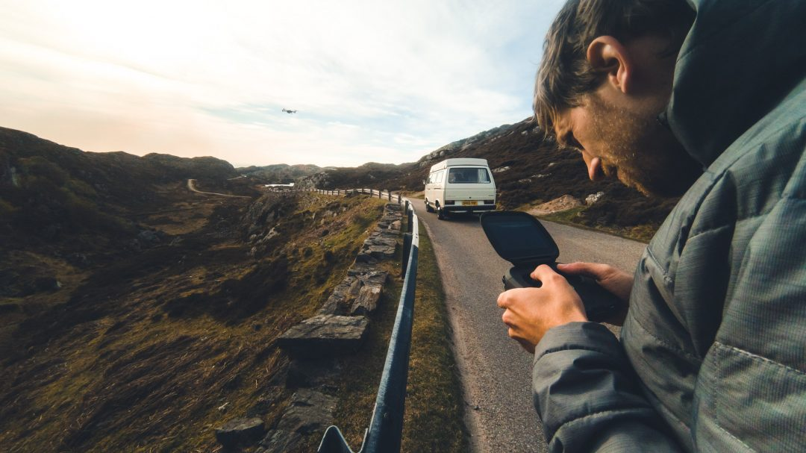
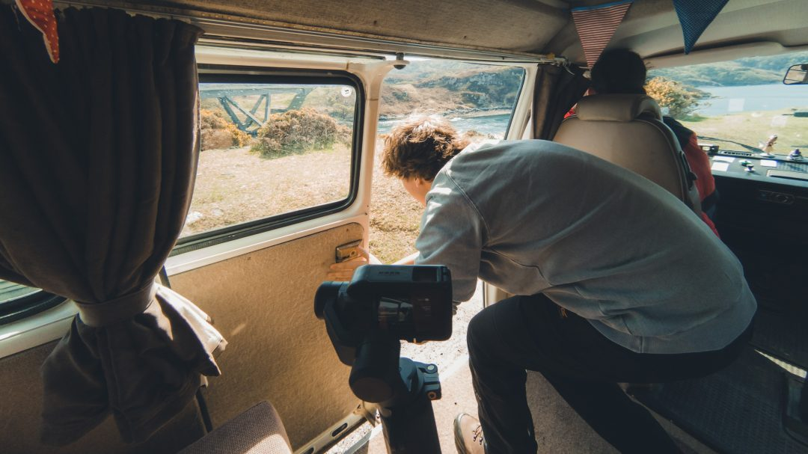
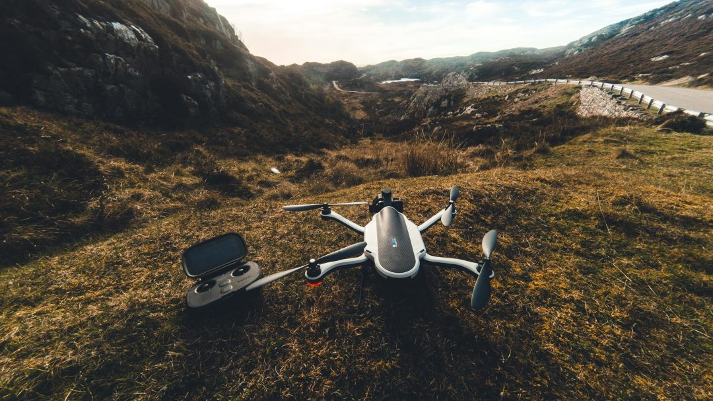

Encore une belle journée s’offre à nous. Pas un nuage à l’horizon. On a dû mal à croire qu’on a ce temps là, c’est incroyable et la météo annonce ça pour tout le reste du tournage. On a envie d’y croire, ça serait tout juste énorme pour la région et à cette période de l’année. Même les locaux qu’on rencontre n’en reviennent pas. Je file récupérer les GoPro qui ont passé la nuit dehors et backup les images de la nuit avant d’aller shooter les images pour la vidéo éducationnelle où Jack montre comment il utilise Karma. Cette petite crique avec cette île au milieu me rappelle des paysages du Pacific Northwest et on s’accorde à dire que ça serait un lieu idéal pour shooter cette partie vidéo. Karma Grip, Karma drone, Passenger App. Tout y passe. On mixe les images aériennes quand le vent est plus calme avec les images POV et au Karma Grip.

En fin de journée, une odeur forte de fumée vient nous troubler et on pense juste à un feu voisin. On découvrira plus tard qu’un (gros) feu sauvage s’est déclenché autour de Sulliven, la montagne qu’on est censé gravir le lendemain. :/

On prend finalement la route direction la côte pour aller faire des images avec le coucher de soleil qui s’annonce, direction un phare locale et une route qui longe des falaises impressionnantes.

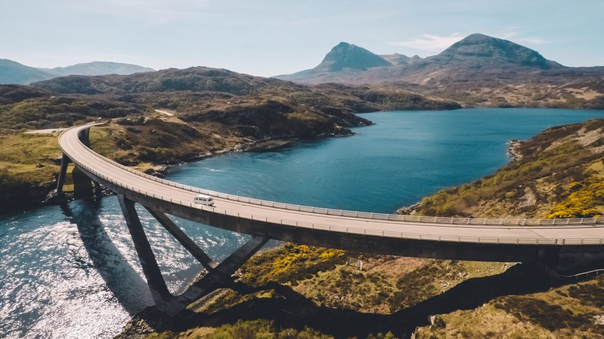

### JOUR 03

6:00 il faut sortir du lit pour tenter d’aller grimper _Suilven_. 22km de randonnée, 1400m de dénivelé cumulé dont les 700m de dénivelés à la montée se jouent dans l’assaut final. La marche d’approche est longue et à peine vallonnée. Ça promet une longue mais belle journée. On se rend au point de départ de la randonnée mais l’incendie sauvage de la veille a forci dans la nuit et commence à nous inquiéter. Est-ce qu’on pourra aller au sommet ? On commence le tournage de nos images si jamais on peut pousser jusque là haut mais il y-a des foyers un peu partout et ça fume pas mal juste là où on est censé passer. On décide de commencer la rando en glanant quelques infos auprès des pompiers qui veillent au grain pour pouvoir contrôler l’incendie. Au bout d’un quart d’heure de marche, l’incendie remonte jusqu’au premier tiers du sommet et ça serait trop dangereux de continuer. On est encore loin de l’incendie mais le feu nous bloquerait pour gravir la montagne. On fait donc demi tour, déçus de ne pas pouvoir y aller mais content de ne pas prendre de risque inutile. La fumée s’épaissie très rapidement et on finit par ne plus voir le sommet qu’on était censé gravir. On rebrousse chemin en croisant les doigts pour que demain soit la bonne.

On rentre à notre « camp de base » pour un backup des images du matin, avaler un repas et partir grimper une autre montagne dans les alentours : _Stac Pollaidh._

Arrivé là haut, c'est très venté mais la vue à 360° est sublime. On surplombe les lochs et les collines avoisinantes; on a une vue de choix sur _Suilvven_ embrasé et la mer tout au fond. On fait le plein d'images avec Karma Grip et Karma entre 2 grosses rafales de vent avant de rejoindre la côte pour un coucher de soleil sublime.

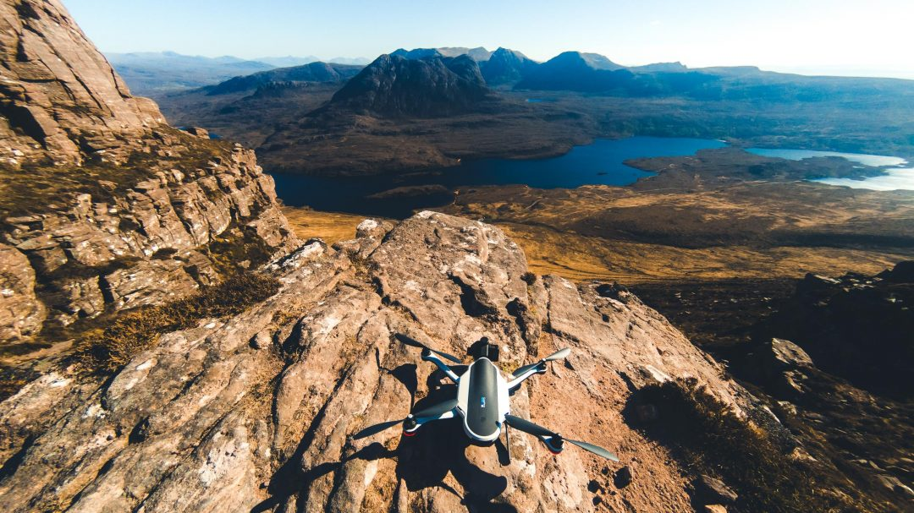
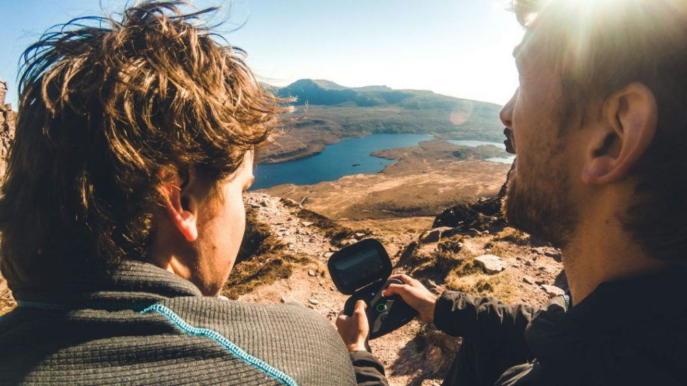

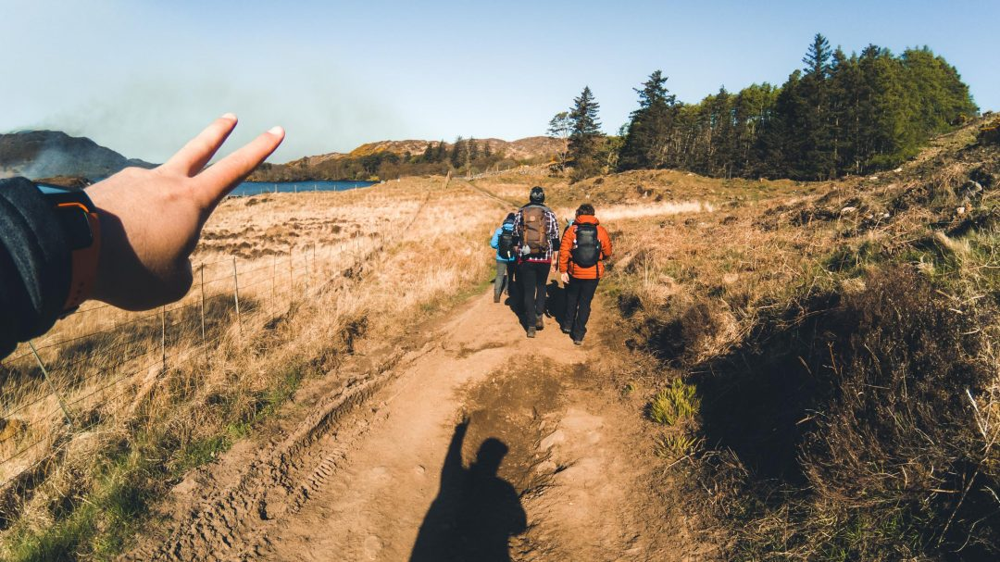
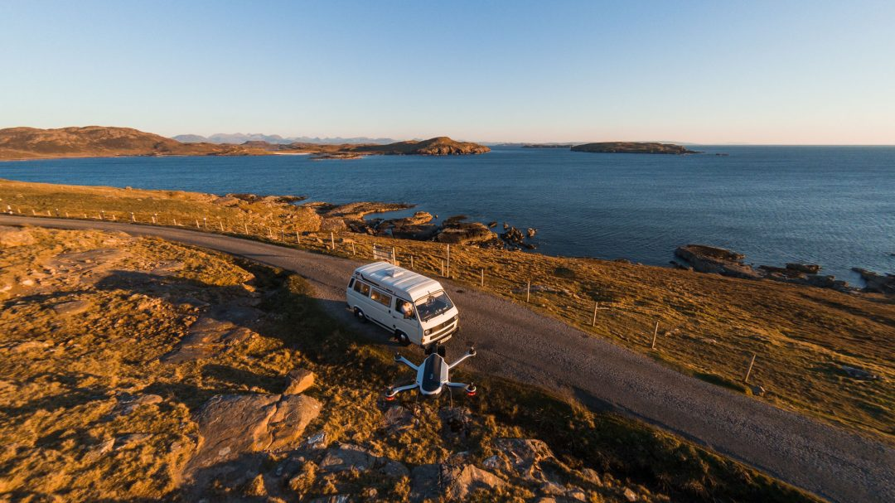
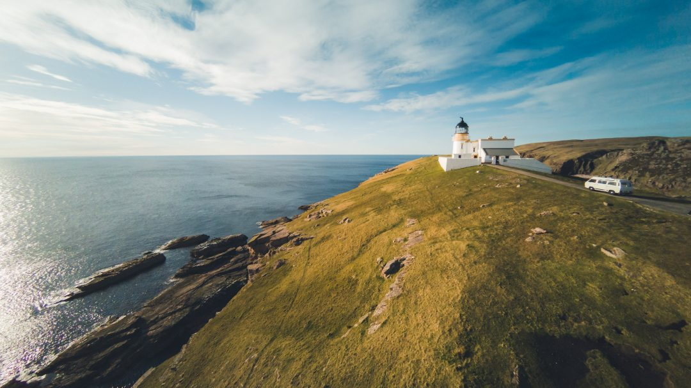

### JOUR 04

Après l'échec de la veille, on part surmotivés (mais un brin inquiet) direction Suilven. C'est notre dernier créneau car demain on repart tous à la maison et il nous faut ces images de l'ascension de Suilven. On arrive sur place, on voit toujours la fumée et quelques zones encore en train de fumer mais un très gros travail des pompiers pendant la nuit, nous permet de partir sereinement pour ces 22km de randonnée. Le paysage est dingue, l'ambiance est folle et on ne tarde pas à faire décoller le drone et à faire des images. Les heures défilent et nous voilà arrivés au pied de _Suilven_. À ce moment précis, je suis un tout petit peu moins excités vu l'effort qui s'annonce. Finalement, la vue au sommet valait plus que la peine. Le vent souffle, il est temps de remettre une couche de vêtements et de commencer à shooter, on a environ 1h30 devant nous au sommet avant de devoir repartir. On commence par quelques plans au Karma, plus des images POV en crapahutant sur certaines zones un peu plus exposées et entre les cailloux, j'assure aussi quelques photos et des rushes au Karma Grip. On ne pourra malheureusement pas atteinte le point le plus haut de la crête qui est encore en proie aux flammes, le vent n'aide en rien. On part à l'opposé pour faire des images sur la crête avec Karma et les images sont vraiment folles. On shoote quelques images en 4k30 large mais sinon la majorité se fait en 2,7k30 Linéaire pour ne pas avoir de distortion d'image sur les plans aériens. Quelques _high five_ plus tard après avoir vu les premières images, on se concentre sur les photos et les prises de vues POV. Le temps file, le vent a tourné et les flammes ont gagné du terrain de l'autre côté de la crête, on décide donc de repartir. Le retour sera long et on shootera peu d'images, on a déjà plus qu'il n'en faut pour aujourd'hui. On se contentera de mettre un pied devant l'autre pour ce (long) retour jusqu'à la voiture. Le soir, backup, retouche de quelques images et on file au lit pas très tard, la fatigue aura pris le dessus.

Le temps file, le vent a tourné et les flammes ont gagné du terrain de l'autre côté de la crête, on décide donc de repartir. Le retour sera long et on shootera peu d'images, on a déjà plus qu'il n'en faut pour aujourd'hui. On se contentera de mettre un pied devant l'autre pour ce (long) retour jusqu'à la voiture. Le soir, backup, retouche de quelques images et on file au lit pas très tard, la fatigue aura pris le dessus.

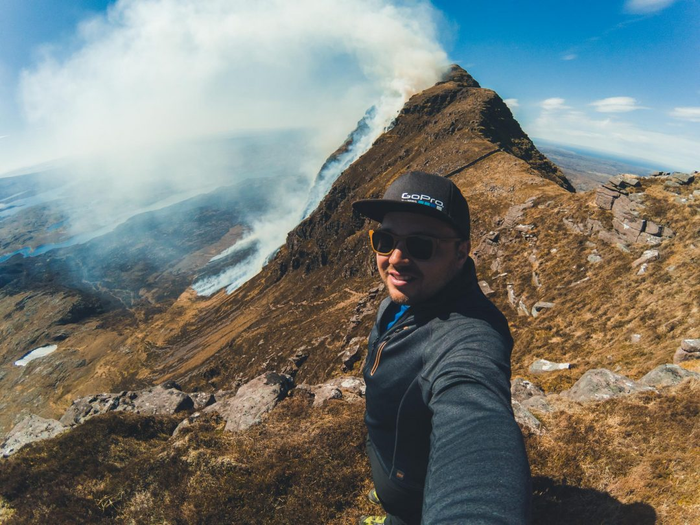
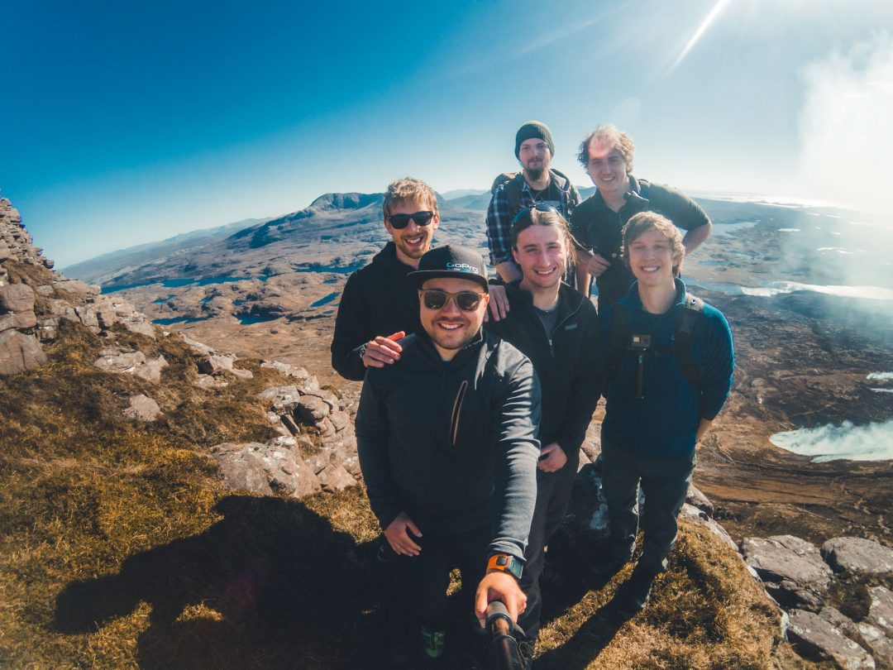
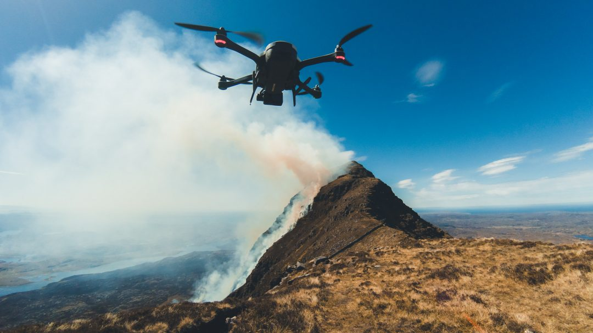
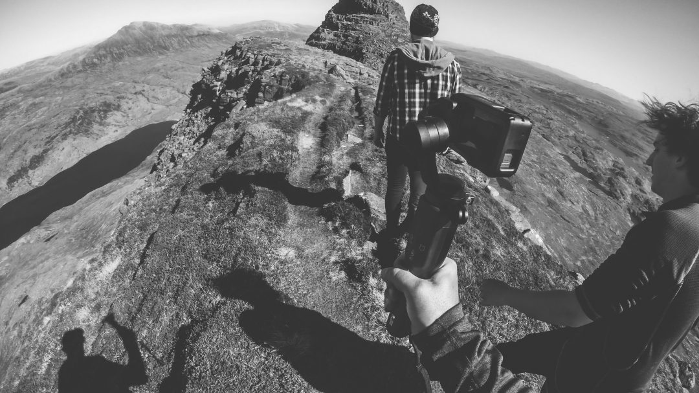

### JOUR 05

Il est l'heure de rentrer à la maison. Je laisse Rich' et Pete faire route vers leur domicile, et monte à bord du van avec Jack et Dom pour un long roadtrip retour jusqu'à Edimbourg d'où je décollerai le soir même. On rigole, on taille la route, je somnole un peu sur la banquette arrière, mais on continue surtout à assurer les images dès qu'on le peut. Quelques heures plus tard, me voici de retour, prêt à rentrer à Lyon après ce trip de folie.

https://www.facebook.com/GoProinFrance/videos/2041748262715392/?t=0

https://www.facebook.com/GoProinFrance/videos/2043036329253252/?t=0

Quelques semaines plus tard, les images sont partis chez l'éditeur qui se sera chargé de monter les 2 épisodes (voir ci-dessus) + un [court clip behind the scenes](https://www.facebook.com/GoProUnitedKingdom/videos/2005164363073879/).

J'espère que cet article vous aura autant intéressé que moi je me suis éclaté sur ce shoot.

Si vous voulez plus de conseils pour savoir [comment régler sa GoPro HERO5](http://jeremyjanin.com/comment-regler-et-utiliser-la-gopro-hero5) ou HERO6 et comme je [**règle ma GoPro**](http://jeremyjanin.com/gopro-choisir-les-bons-modes-et-parametres-pour-filmer-slow-motion-protune), je vous invite à lire mes articles qui devraient vous aider.

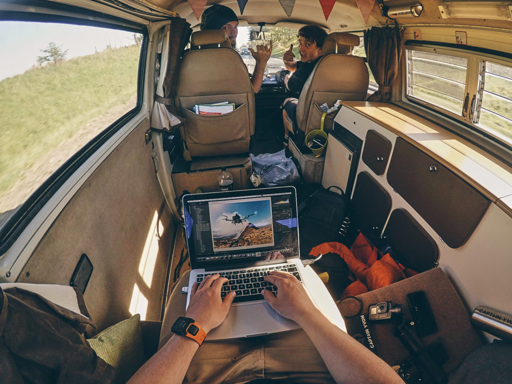
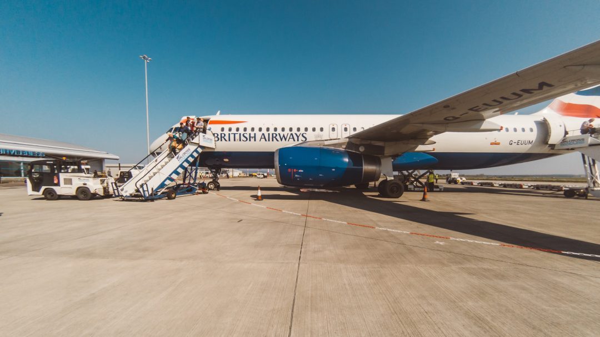

_Cet article contient des liens affiliés Amazon._
