Cet été j'ai renoué avec la montagne et les bivouacs. J'ai ressenti l'excitation la veille du départ à l'idée de repasser du temps isolé tout là haut, j'ai pesté à chaque pas contre la charge du sac trop rempli de matériel photo, comme à chaque fois mais comme à chaque fois, je continue d'emmener ce matériel pour immortaliser la montagne. J'ai ressenti les coups de mou au milieu de la montée, j'ai été encore et toujours émerveillé face à ce ciel étoilé, face aux glaciers éclairés par la pleine lune,. J'ai claqué des dents durant les nuits très fraiches, tellement fraiches qu'elles vous gèlent les chaussures, vous font ressortir les gants et le bonnet en plein moins de juillet.

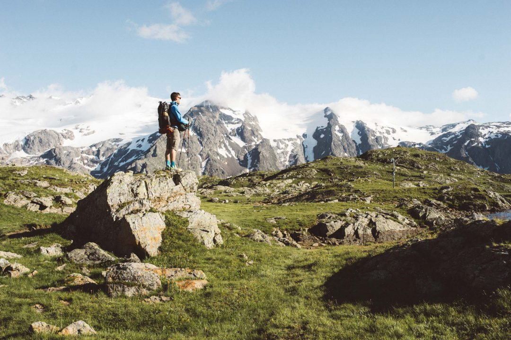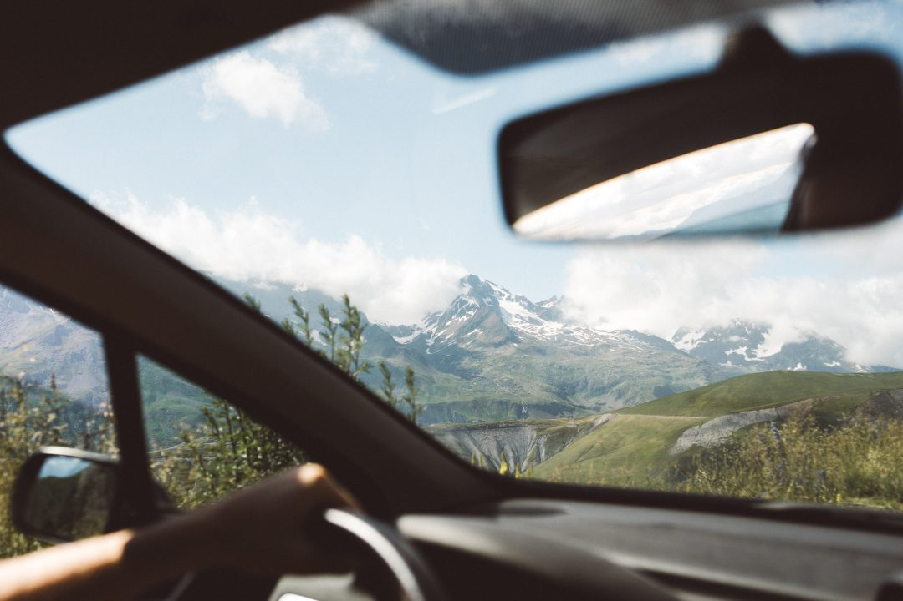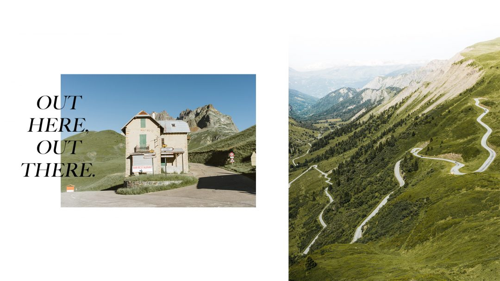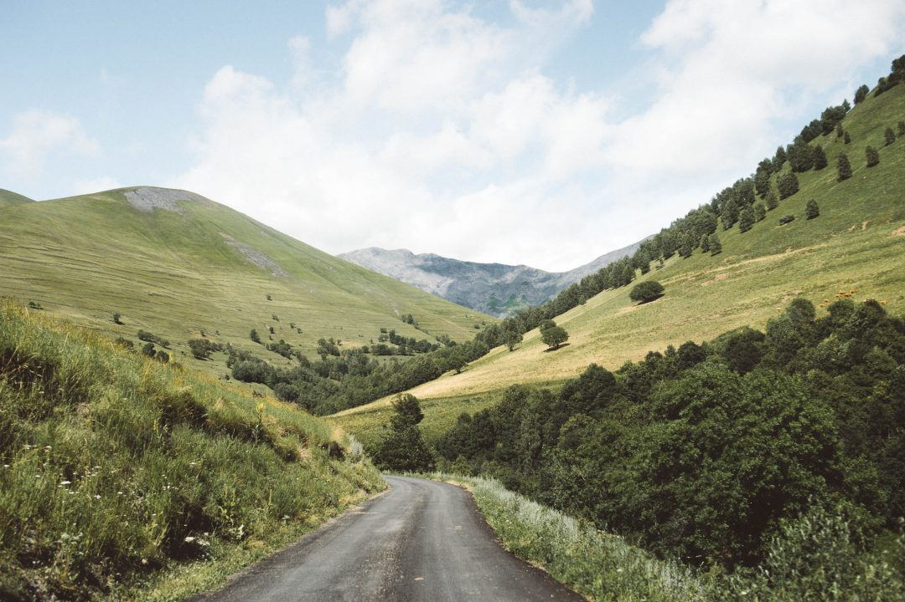 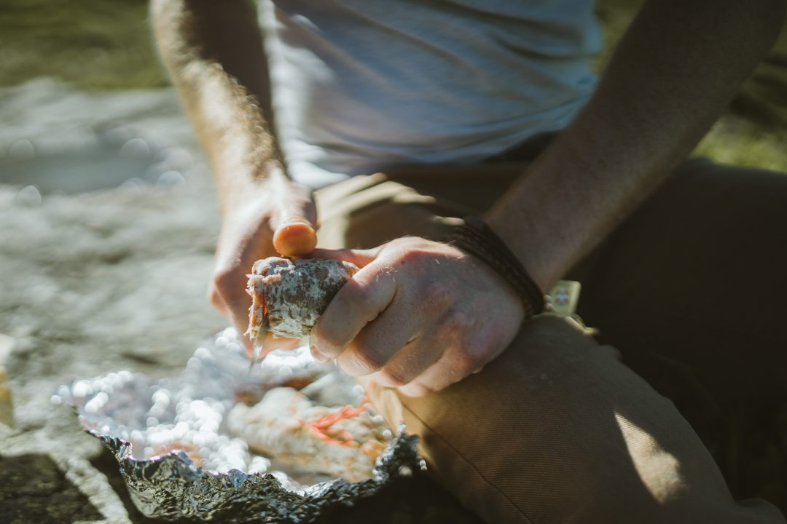 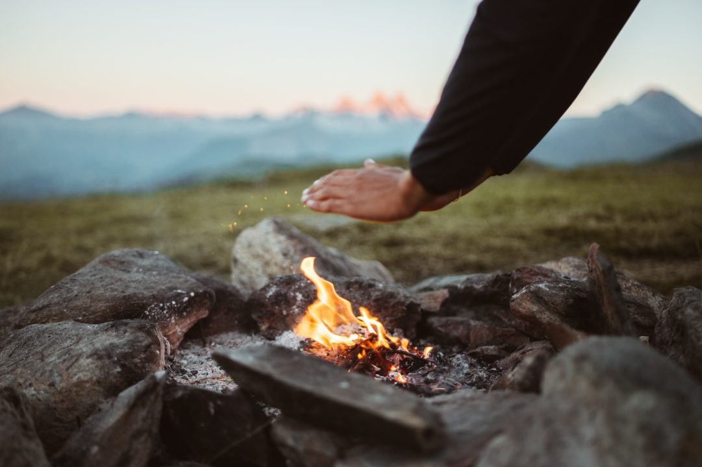

Cet été, j'ai pu gouté à nouveau au plaisir de crapahuter dans les Alpes, ce terrain de jeu sans fin, on s'est retrouvé et on a partagé ça entre amis autour de quelques rondelles de saucisson, une tranche de vie à 2, à 3 ou 4 à discuter, s'émerveiller, rire et photographier car la montagne sans le partage n'a pas la même saveur. On ne vient pas en bivouac pour passer la meilleure nuit de sa vie d'un point de vue confort mais dans quelques années, on se souviendra avant tout des nuits passées sous la voie lactée et face aux pics enneigés plutôt que celles passées au creux de son lit. Chaque bivouac me tient émerveillé comme un gosse un soir de noël, la même routine, le même plaisir, la même naïveté et le même sourire niais au moment de découvrir la vue qui nous accompagnera la nuit suivante. Je ne suis pas le plus rapide à la montée mais je finis toujours par arriver. J'arrive au pied des sommets comme si j'entrais dans un nouveau monde, je laisse tout dans le coffre de la voiture et j'oublie tout le temps de grimper et de savourer cette parenthèse enchantée. La montagne remet tout à sa place et permet revenir aux choses simples, c'est l'humilité qui règne et la liberté qui prend le dessus.

On vient y trouver le silence et la quiétude, on tâche de se faire tout petit et repartir sans laisser de trace. On en revient à chaque fois bouleversé, rattrapé par la fatigue, par le manque de sommeil, l'exposition longue au soleil qui fait craquer la peau, qui fait plisser les yeux et donne un mauvais pli aux cheveux. On y prend sa dose de liberté et sa piqure de bonheur, on ne vient ni pour un record ni pour briller. On cotoie la montagne, on ne la conquiert jamais. On tutoie les sommets avec respect, on se balade, on crapahute, on escalade, on court pour ne pas rater le coucher du soleil. On engrange de l'expérience à chaque sortie, les petites chutes sont un rappel à l'ordre pour rester lucide et concentré.

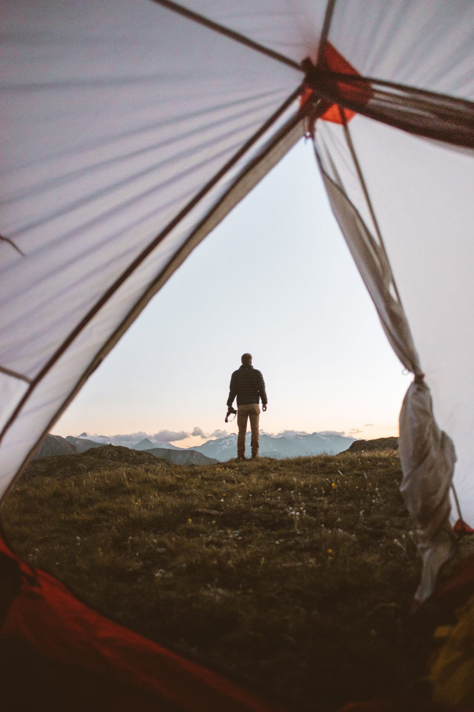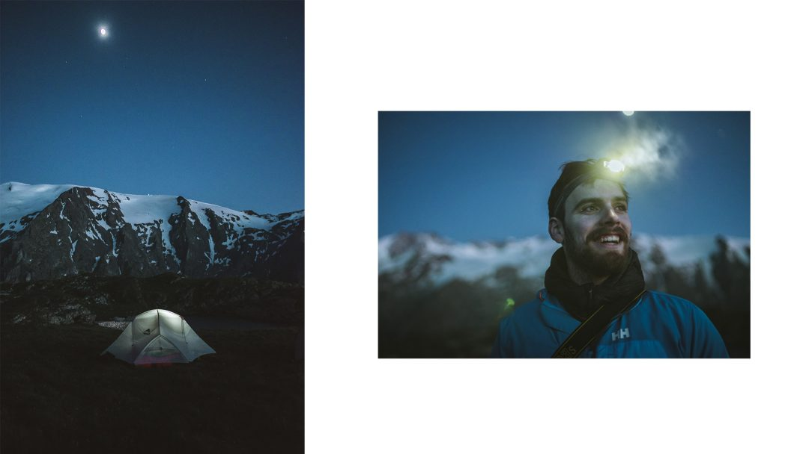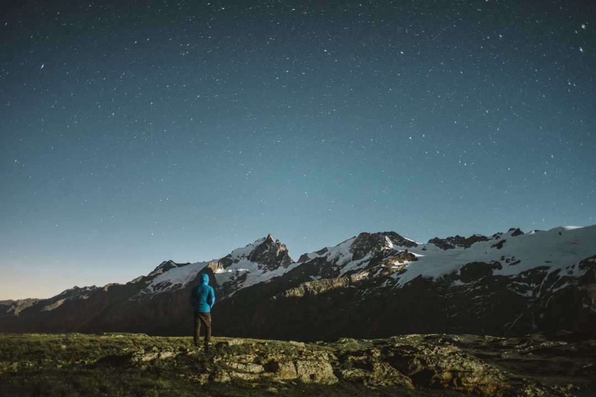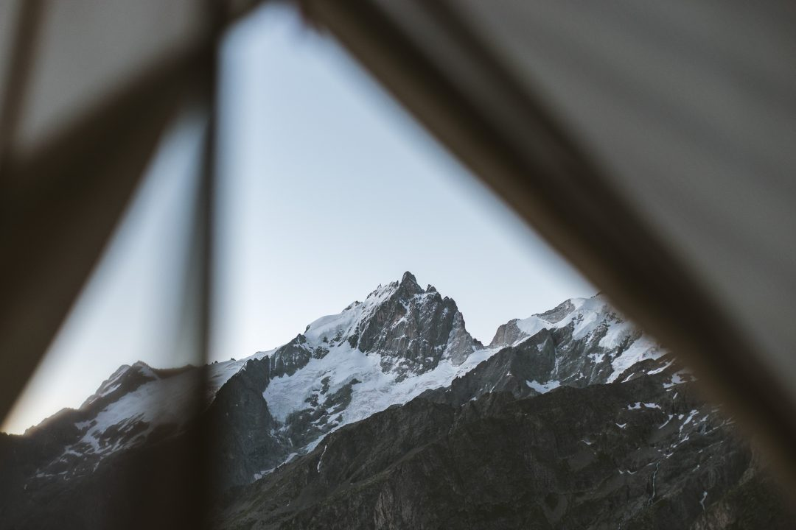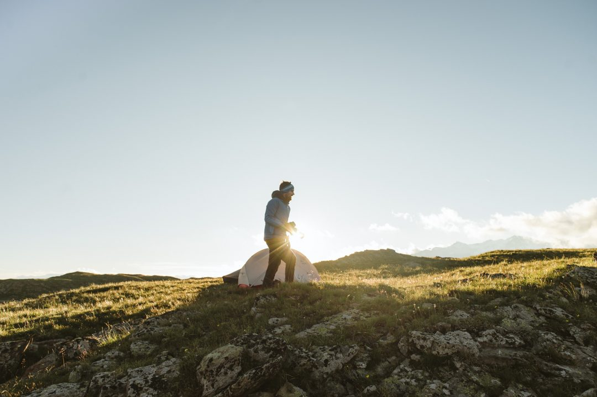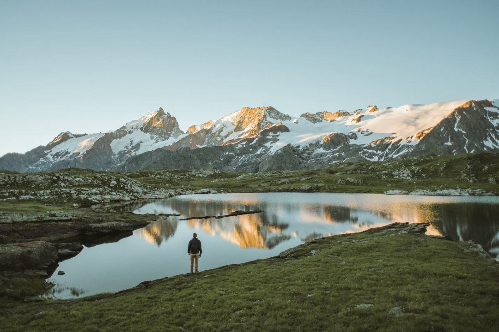

Quand on donne l'assaut final, on se faufile, on se prend à rêver, on s'accroche, on pose les mains, on oublie qu'on est fatigué, on se reposera plus tard quand on sera vieux, on fait taper le cardio, on fait crisser les roches fuyantes sous la semelle des chaussures, on fait voler la poussière, on se rape le coude contre la roche, on sourit à se déboiter la machoire, on jette un coup d'oeil, à droite, à gauche, pour l'admirer, on continue tout droit, on accélère pour lâcher tout ce qu'on a, on passe de l'ombre au soleil en un claquement de doigt, on prend son pied, on se promet de ne jamais oublier ces petits moments insignifiants, ces petits rien qui font tout. On se sent pousser des ailes sur les sentiers, l'ivresse de la liberté me donne un second souffle, je me prends à rêver d'aller plus haut, toujours plus haut.

On met entre parenthèse cette vie dans la vallée, on regarde ce charognard à l'envergure déconcertante décollé à quelques mètres de là, on est bercé par les sifflements des marmottes, par le frottement des chaussures sur l'herbe grasse, on sent la peau s'assécher sous les rayons d'un soleil de plomb, on profite de l'odeur de la pluie sur la pierre chaude, on écoute le crépitement des flammes sur le bois sec, les poissons sautés hors du lac, on fait chauffer les doigts sur la roche abrasive, on sent la sueur perler le long du visage et la fraicheur nous guetter au passage. On passe un col et on s'envole. À chaque rando, la montagne est mon école, je prends mon sac et mes chaussures, mes yeux en guise de stylo pour ne rien rater. Je me suis promis de continuer à m'émerveiller et ne me lasse jamais de ces sentiments si convoités. Je mets un point d'honneur à rester comme un gosse qui découvre la montagne à chaque nouvelle sortie, je veux apprendre encore, toujours et encore plus, je ne veux pas la dompter je veux la cotôyer, je ne veux pas m'imposer, je veux juste en profiter.

M'émerveiller et me développer, progresser physiquement, techniquement, mentalement, savourer cette quête de la liberté suprême, cette envie et cette idée de pouvoir aller plus haut, apprendre et grandir au fil des expériences en moyenne montagne pour plus tard m'adonner aux joies de la haute montagne et ces paysages encore plus fous, uniques et ennivrant. Ça prendra le temps qu'il faut, les efforts qu'il faudra mais j'y arriverai, il n'y-a pas d'étape à brûler, pas d'idée à faire briller, je viens en montagne non pas pour conquérir des chiffres ni pour concourir, ni pour bouffer du dénivelé, je grimpe pour m'amuser, pour m'émerveiller et photographier. En vérité, je n'aime pas spécialement l'effort de la montée et pourtant j'y reviens encore et encore. Je suis absorbé par ces paysages qui valent leur pesant d'or, par la récompense après l'effort, par ces ambiances, ce son singulier du silence qu'on oublie pas, cette rafale de vent singlante qui claque au creux de l'oreille, ce groupe d'oiseau qui frôle la crête, ce troupeau qui berce la vallée de ses cloches cuivrées, cette solitude qu'on vient chercher, cette parenthèse en altitude à la recherche d'un reflet, d'un rayon, d'un souffle, un contraste qui saute aux yeux et qui fait s'émerveiller.

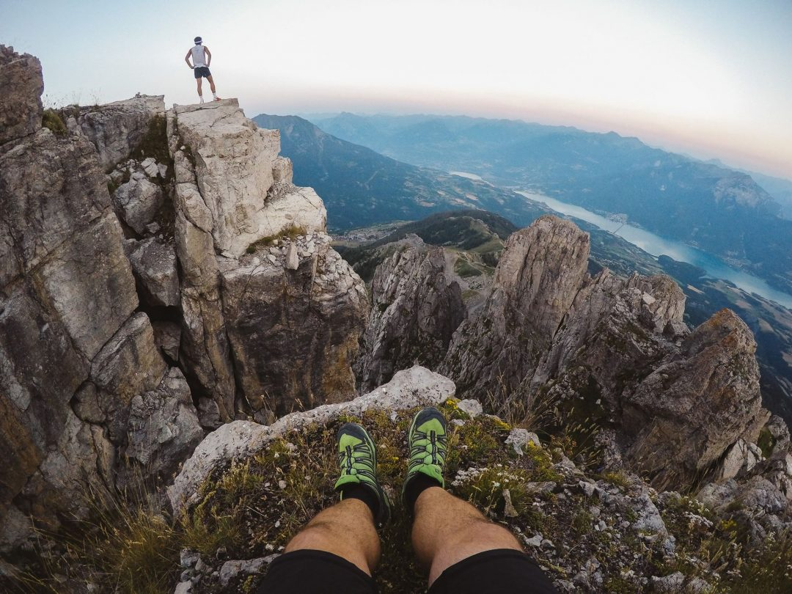 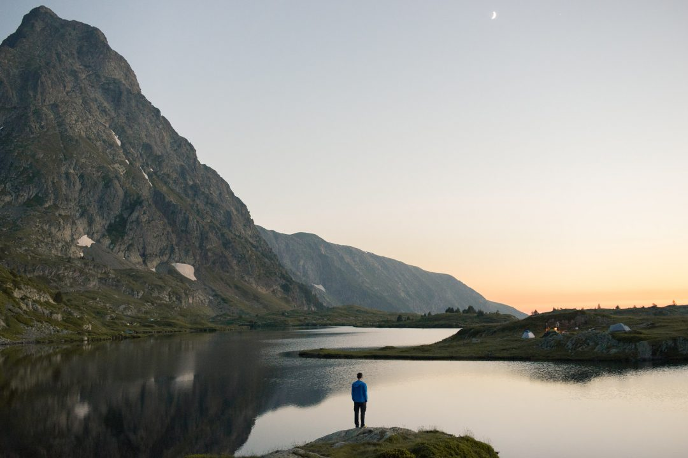 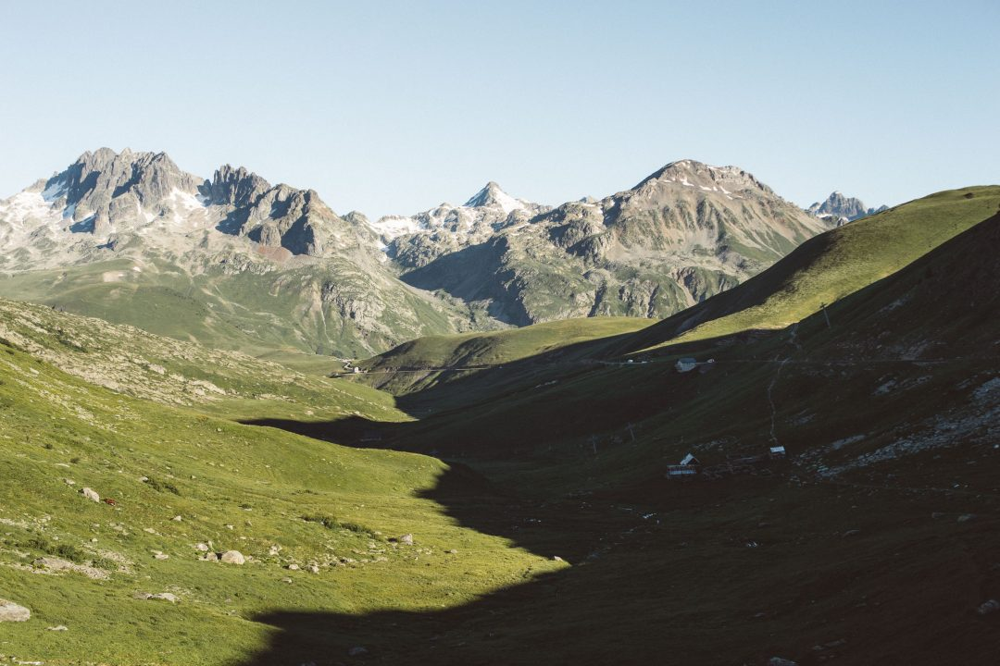 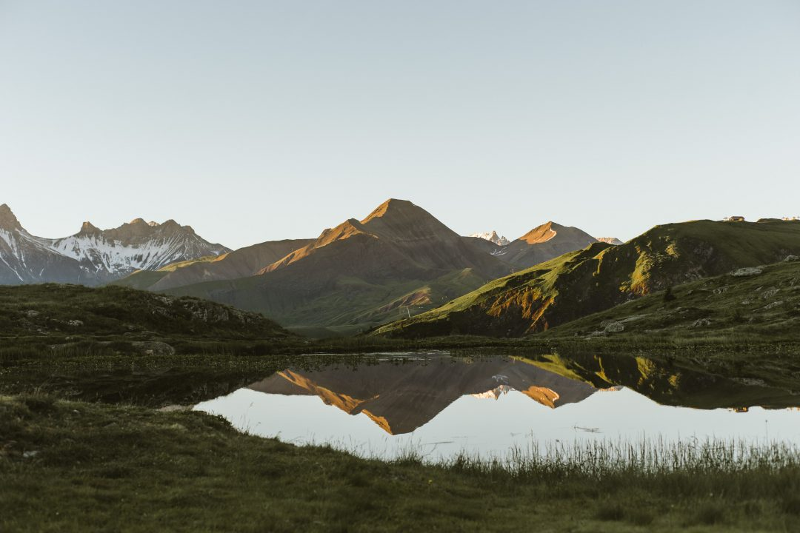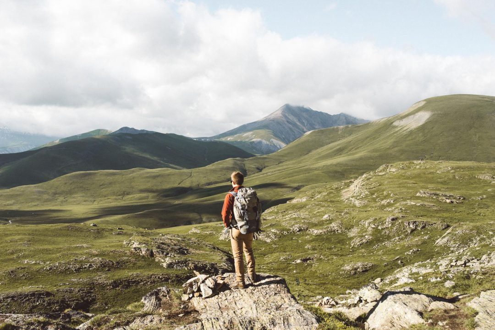 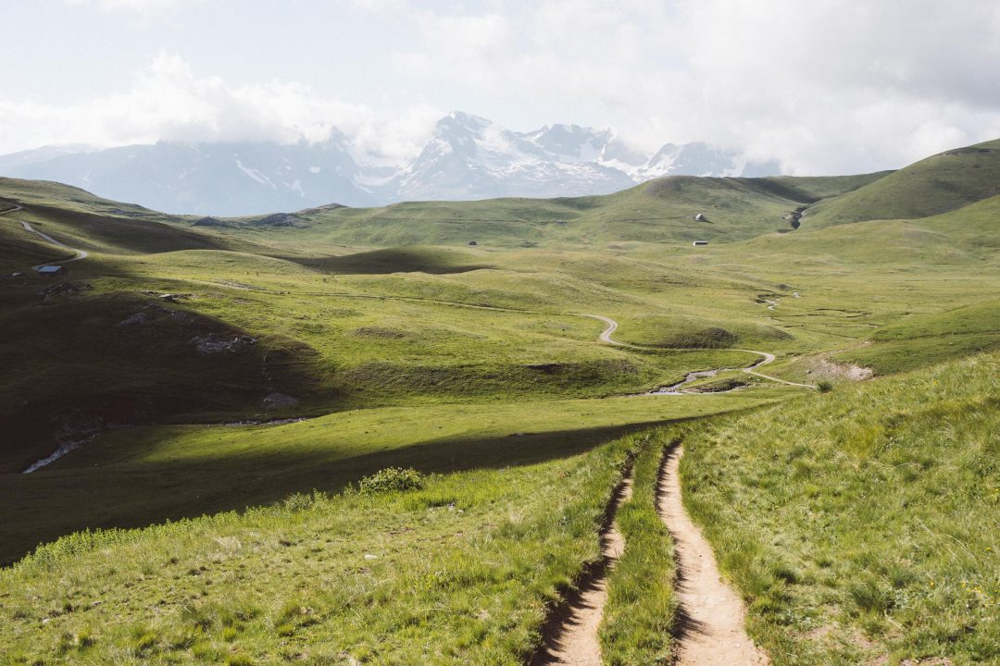 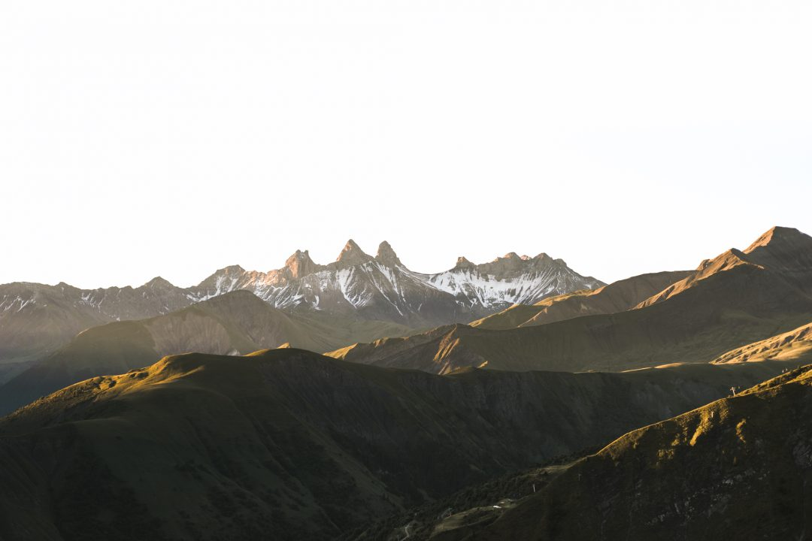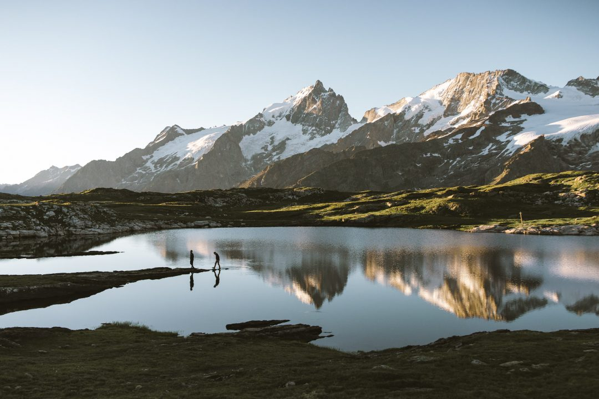

Cet été, j'ai renoué avec tout ça, avec les bivouacs, avec la montagne, j'ai retrouvé cette liberté, cet émerveillement qui m'avait tant manqué. Cet été, la montagne m'a fait suer, rire et vibrer. Ce soir, j'ai fermé les yeux, j'ai esquissé ce sourire niais en repensant à tout ça, senti mon ventre papillonner en ressassant ces idées. Ce soir, même au creux de mon fauteuil, la montagne m'a encore fait rêvé.
