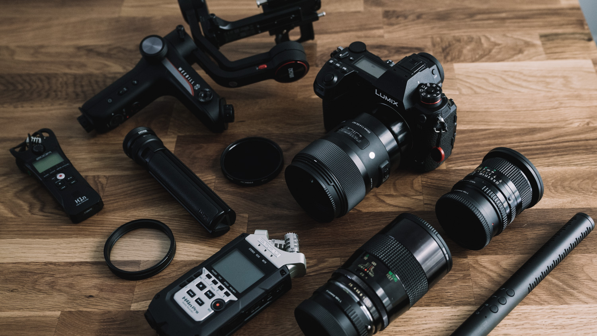
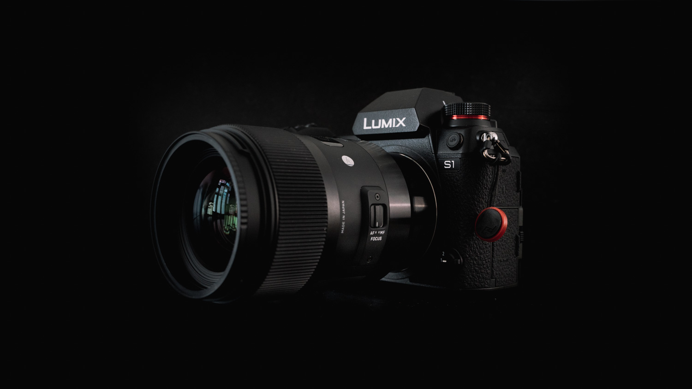
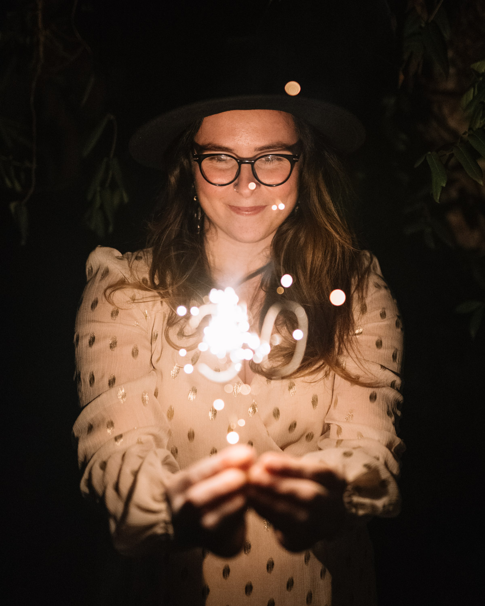
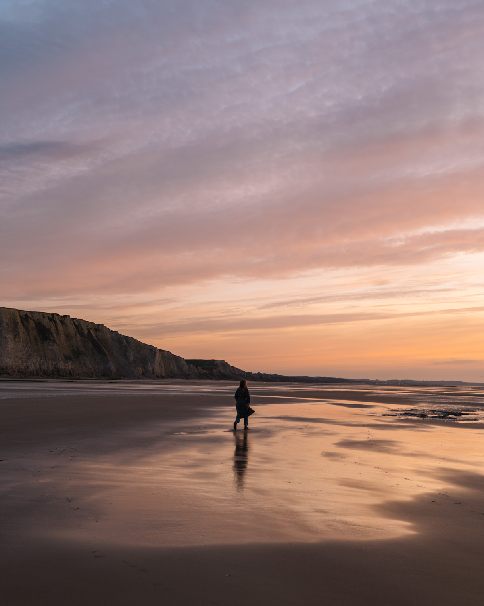
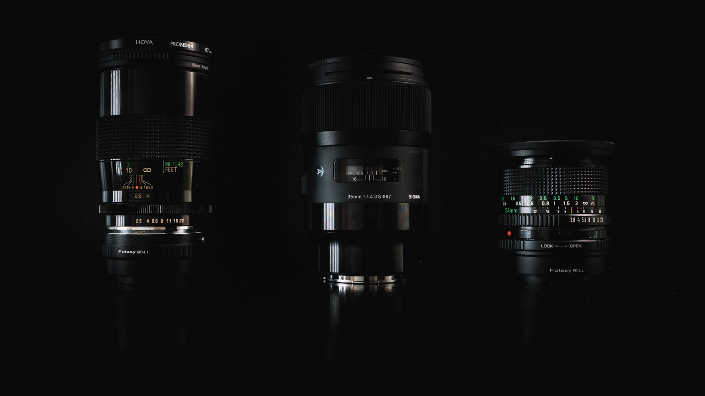
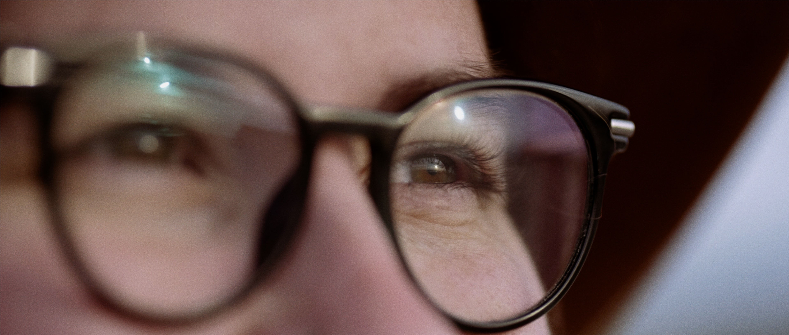
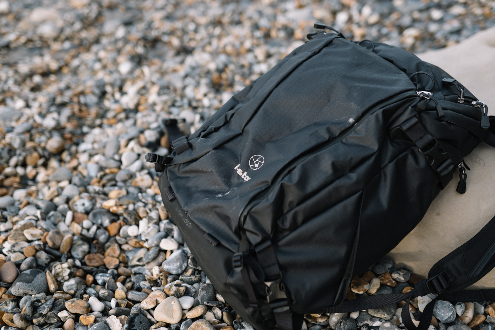
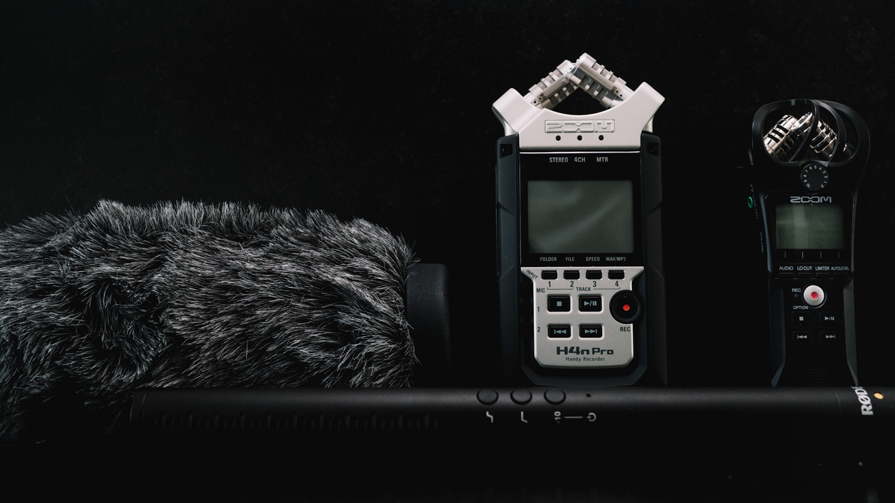

Après 4 boitiers Sony et presque 6 ans cumulés à shooter sur les hybrides Sony, j'ai quitté Sony pour le Panasonic S1. Moi, le pro-Sony depuis le début j'allais passer de l'autre côté pour aller chez Panasonic ? Moi non plus je n'y croyais pas.

Je tiens à préciser que je ne suis ni payé ni sponsorisé par qui que ce soit. Chaque centime de ce changement de matériel a été choisi et financé par moi. Je ne fais jamais de mise en avant d'un site plus qu'un autre mais j'avoue que le service de [**Digit Photo**](https://www.digit-photo.com/?dpa_id=21) m'a bluffé. C'était la première fois que je commandais chez eux, j'ai passé 5 commandes à ce jour et je vous les recommande chaudement. Je n'ai pas trouvé moins cher ailleurs, la livraison a été aussi rapide qu'Amazon et en plus c'est français. Cocorico. Je sais qu'on est dans une ère où beaucoup de contenus sont sponsorisés, mais je suis juste content de pouvoir parler du service simplement parce que je l'ai aimé, rien de plus. Je fais depuis plusieurs années déjà de l'affiliation sur Amazon pour m'aider à financer les frais liés à ce blog. L'affiliation me permet de toucher une petite commission automatique sur chaque achat fait à partir d'un de mes liens présents sur mon blog. Suite à cette expérience d'achat chez Digit Photo, j'ai décidé aujourd'hui d'aussi vous recommander les produits vers leur site (aussi en affiliation) et mettre en avant leur service qui je pense pourrait vraiment vous plaire aussi. D'ailleurs, j'ai converti Greg à leur site aussi lors de son [switch de matos de Sony vers Fuji](https://gregorymignard.com/equipement/). Voilà, vous savez tout. On peut entrer dans le vif du sujet.

_(La quasi totalité de mon setup pour filmer et bouger facilement, à quelques accessoires près)_

## Pourquoi j'ai quitté Sony pour le Panasonic S1 ?

Principalement pour la vidéo. Après avoir filmé pas mal de projets vidéos en 2019, et en voyant les projets qui s'annonçaient pour 2020, j'ai commencé à vouloir investir dans de nouveaux objectifs : un 35mm et un 100-400mm notamment. Mon Sony a7sII était un super boitier mais je savais aussi que tôt ou tard, j'allais devoir le remplacer. Ce n'était pas encore un problème urgent mais ça le devenait de plus en plus. Au moment de réfléchir aux objectifs, à comparer les options, j'ai aussi élargi mon horizon au niveau des boitiers et le déclic s'est fait. À ce moment là c'était soit l'[a7III](https://www.digit-photo.com/SONY-Alpha-7-III-Boitier-Nu-Noir-rSONYILCE7M3BCEC.html?dpa_id=21) mais qui n'avait pas ce que je recherchais ou bien tout changer.

## Quelles options à la place ?

Mon regard s'est d'abord tourné vers la [**BMPCC 4K**](https://www.digit-photo.com/BLACKMAGIC-DESIGN-Pocket-Cinema-Camera-4K-rBLACKMAGICCINECAMP.html?dpa_id=21) puis la [**BMPCC 6K**](https://www.digit-photo.com/BLACKMAGIC-DESIGN-Pocket-Cinema-Camera-6K-rBLACKMAGICCINECAM6.html?dpa_id=21) en aps-c que j'ai très longtemps envisagée. (Et que j'ai toujours dans un coin de ma tête. Un jour peut-être ?). Cette caméra correspond parfaitement à mes envies mais pas certain qu'elle corresponde entièrement à mes besoins. Ça a été dur à accepter mais c'est la réalité. Je filme une grande partie de mes vidéos seul ou à deux avec Greg, mais chacun avec nos boitiers. On filme beaucoup d'outdoor ou de voyage qui implique de toujours être en mouvement et rapide dans l'exécution. Je voulais aussi garder un boitier à tout faire, à la fois photo et vidéo. Sortant d'un a7sII, il était aussi crucial pour moi d'avoir un boitier qui soit bon en montée en ISO. Je voulais aussi passer à un setup plus lourd que mon Sony car mon envie était de filmer de plus en plus à main levée. Qui dit plus lourd dit moins de micro tremblements donc image plus stable. Le frein principal pour la BMPCC a été le manque de stabilisation du capteur dans l'usage que j'ai d'une caméra. Aucune RED ou Arri n'est stabilisée mais pour les sujets que je traite et 90% du temps à main levée, c'est un luxe dont j'ai du mal à me passer. Par contre, cette avancement vers la BMPCC m'a ouvert les yeux. J'ai appris beaucoup de choses sur les codecs, compression et traitements couleurs d'une caméra... Et aussi le fait que j'étais prêt à ne plus accorder d'importance à l'autofocus en vidéo.

C'est lors d'une virée à noël chez les copains [@uncercle](https://www.instagram.com/uncercle) que j'ai ouvert les yeux sur le [**Panasonic S1**](https://www.digit-photo.com/PANASONIC-Lumix-S1-Boitier-Nu-rPANASONICDCS1EK.html?dpa_id=21). Ils shootent avec depuis plusieurs mois et en voyant les images qu'ils ont ramené d'un récent voyage en Afrique, j'ai pris une claque : tant sur la photo que la vidéo. On en a pas mal discuté et avant même d'être rentrés de notre tournée de noël, c'était acté, j'étais décidé.

Oui, j'aurais pu attendre le Fuji XT-4, le Canon EOS R5 pour comparer mais à toujours attendre un nouveau boitier, on finit par ne jamais rien avoir. De plus au moment de mon choix, les rumeurs étaient quasi nulles sur ces deux appareils et le S1 offrait tout ce dont j'avais envie et besoin.

_(Mon nouveau combo : Panasonic S1 + Sigma 35mm f/1.4 ART)_

## Pourquoi le S1 et pas le S1H ?

Pour faire court, le **Panasonic S1H** est un super boîtier qui vaut son prix, surtout avec la mise à jour qui permet l'enregistrement en RAW via HDMI. Mais le S1 avec la [mise à jour V-LOG](https://www.digit-photo.com/PANASONIC-Mise-a-Jour-DMW-SFU2GU-pour-S1-rPANASONICDMWSFU2G.html?dpa_id=21) m'ouvrait la porte vers les fichiers 10bits, le LOG, que je cherchais tant. De plus, le S1H permet l'enregistrement en 6K illimitée mais je ne fais jamais de rushes longs. Le S1 permet de manière cachée de filmer en 6K grâce à son mode 'PHOTO 6K', qui enregistre en 30fps et avec le son. Je filme souvent à 30fps pour ralentir à 80% l'image et donner un rendu slow mo très léger sur certains rushes donc je peux m'en contenter. Même si j'avoue que je ne cracherais pas sur du 24fps en plus. Je ne compte pas beaucoup utiliser la 6K, ça sera que pour certaines occasions particulières. Au moins, j'ai cette option en bonus et dont je n'avais pas vraiment besoin.

Ensuite, certes le S1H filme en All-Intra mais quand je vois le fichier Long GOP du S1, c'est déjà au delà de mes attentes donc je n'arrivais pas à justifier, pour mon usage, les 1500€ de plus. J'ai donc choisi le [**Panasonic S1**](https://www.digit-photo.com/PANASONIC-Lumix-S1-Boitier-Nu-rPANASONICDCS1EK.html?dpa_id=21) et profité d'une promo qui m'offrait la mise à jour V-LOG et donc également la possibilité d'enregistrer en 4.2.2 10bits dans la plupart des réglages vidéos que j'allais utiliser. Et ça, j'en rêvais et n'allais pas m'assoir dessus. Enfin, bien que Panasonic ne le mette pas en avant, le Dual ISO dont on parle tant pour le S1H, est lui aussi bel et bien existant sur le S1.

Il restait ensuite deux points clés à soulever :

- **Autofocus** Venant de chez Sony, l'interrogation était vraiment sur l'autofocus. Je voulais au moins m'en sortir en AF-S en photo. Pour la vidéo, j'ai fait confiance ces dernières années à l'AF continu sur mon Sony et je trouve que j'ai perdu une part de créativité. Je ne mettais presque plus l'oeil dans le viseur mais visais uniquement par l'écran en faisant confiance à l'AF-C aveuglément. Le constat est que je composais un peu moins mes plans par la même occasion. Peu importe la caméra que j'allais choisir, j'avais la volonté de revenir davantage à une mise au point manuelle pour re-composer de manière plus créative mes images, prendre le temps et être plus en contrôle.
- **Le poids** Clairement, je suis revenu à un boitier de la taille d'un reflex en prenant le S1. Après avoir passé plusieurs années à shooter Sony et donc à avoir un setup vraiment compact et léger, j'ai accepté qu'aucun boitier aujourd'hui ne me permettait de faire tout ce que je veux sans passer à plus gros. D'autre part, je souhaite shooter beaucoup plus à main levée et passer la gimbal au second plan, même pour des plans en déplacement, pour avoir un rendu plus naturel parfois. Alourdir ma caméra était donc indispensable pour enlever les micro-secousses, qui malgré le capteur stabilisé, se ressentaient quand même, avec le faible poids du boitier Sony. Maintenant clairement, il va falloir que je me creuse un peu plus si je repars dans des situations où je dois être vraiment light, comme lors de mon [**trip bikepacking fatbike en Ecosse.**](http://jeremyjanin.com/bikepacking-fatbike-en-ecosse-avec-mon-pere)

 

_(Première photo basse lumière réalisée avec mon Panasonic S1 et le Sigma 35mm f/1.4 ART)_

_(Coucher de soleil sur la Côte d'Opale avec mon Panasonic S1 et le Sigma 35mm f/1.4 ART)_

## Quels objectifs j'ai choisi ?

Ces quelques années sur Sony, m'ont permis d'affiner mes choix d'objectifs et de savoir ce qui me convenait et ne me convenait pas. Mes setups ont toujours été pensé autour d'un objectif 50mm. Je possédais le superbe [55mm f/1.8](https://www.digit-photo.com/SONY-55mm-f-1-8-Monture-Sony-E-rSONYSEL55F18ZAE.html?dpa_id=21) sur mon Sony mais il passait plus de temps sur mon étagère que sur mon boitier, lui préférant mon [28mm f/2](https://amzn.to/2Ttz9Ou). Une vraie pépite. Je m'étais lassé de cette focale du 50mm que je ne trouvais pas assez large et pas assez serrée à la fois. Quelques mois plus tôt, j'avais aussi revendu mon [16-35mm f/4](https://www.digit-photo.com/SONY-Zeiss-16-35mm-f-4-ZA-OSS-Vario-Tessar-T-rSONYSEL1635ZSYX.html?dpa_id=21), je crois que je ne suis définitivement pas quelqu'un qui aime les zooms (sauf en téléobjectif). Je préfère les focales fixes. Même mon [70-200mm f/4](https://amzn.to/2T8EhbZ) qui était très bon, ne me convenait plus. Pour ce nouveau setup, j'allais donc porter mon choix vers principalement des focales fixes et un gros téléobjectif.

Cette fois-ci, j'ai construit mon setup autour d'un 35mm comme objectif à tout faire, autant en photo qu'en vidéo, pour remplacer le 50mm que je n'aimais plus. Je n'ai pas besoin d'ultra grand angle ni de vrai grand angle. Je suis persuadé que je pourrais tout faire au 35mm mais un 24mm serait un bonus non négligeable dans certaines situations. En complément du 24mm et du 35mm, je souhaitais un téléobjectif 100-400mm et je n'ai pour l'instant pas trouvé mon bonheur. À voir si Panasonic en sort un en 2020, sinon mon choix se portera vraisemblablement sur la [bague MC-21](https://www.digit-photo.com/SIGMA-Bague-d-Adaptation-MC-21-pour-Canon-EF-vers-Monture-L-rSIGMA89E969.html?dpa_id=21) (Monture Canon EF vers Monture L) couplé à un [Sigma 100-400mm.](https://www.digit-photo.com/SIGMA-100-400mm-f-5-6-3-DG-OS-HSM-Contemporary-Nikon-rSIGMA729955.html?dpa_id=21) Je perdrais l'AF-C malheureusement. Enfin, je ne photographie pas les petites bêtes, mais un objectif macro avec une focale comprise entre 90mm et 135mm me fait de l'oeil depuis pas mal de temps. Cette fois, j'étais bien décidé à en ajouter un à mon arsenal.

_(De la droite vers la gauche : Canon FD 24mm f/2.8 / Sigma 35mm f/1.4 ART et Vivitar Series 1 - 90mm f/2.5 macro)_

#### 35mm

Mon choix s'est porté pour le [**Sigma 35mm f/1.4 ART**](https://www.digit-photo.com/SIGMA-35mm-f-1-4-DG-HSM-Art-Monture-L-rSIGMA340969.html?dpa_id=21) en monture L. Sigma a sorti une version f/1.2 encore plus compacte sur le S1, mais la différence de coût n'était pas justifiée à mon sens. J'ai toujours vu et entendu que du bon sur cet objectif. Force est de constater que c'est le jour et la nuit depuis que je l'ai, je suis tombé amoureux de cette focale de 35mm et le rendu est vraiment beau avec cet objectif. En revanche, en vidéo, couplé au Panasonic S1, le rendu est un peu trop "chirurgical", j'ai donc décidé de le coupler à un [**filtre de diffusion Tiffen Black Pro Mist 1/4**](https://amzn.to/2I8QmaE), pour me rapprocher de la douceur des objectifs vintage.

Si j'allais construire mon kit autour de ce Sigma 35mm f/1.4 ART, je savais aussi que je voudrais le compléter avec des objectifs vintage pour des optiques secondaires, et ce pour plusieurs raisons :

- Avant tout pour leur rendu doux, crémeux et moins chirurgical que les objectifs modernes
- Leur faculté à avoir du flare facilement
- Leur poids et encombrement minimes comparé à des équivalents modernes de chez Sigma par exemple
- Leur faible coût
- Je savais que ça serait des objectifs secondaires donc que je pourrais m'accommoder du manque d'autofocus pour la photo. En vidéo, pas de souci puisque je shoote en focus manuel.

J'ai tout de suite visé la gamme Canon FD que j'avais possédé puis revendu (grand mal m'en a pris) avant de passer à l'a7sII en 2016. Leur rendu m'avait bluffé et je suis content d'en retrouver dans ma collection. Partir sur un setup entièrement vintage aurait été envisageable mais je sais à quel point le 35mm est un bijou, et je ne crache pas sur le fait que l'objectif principal de mon setup ait l'autofocus pour des photos sur le vif si besoin.

_(Capture de vidéo de Samantha sur la Côte d'Opale - Panasonic S1 avec le Vivitar 90mm f/2.5 macro)_

#### 24mm

En revanche, le 24mm serait lui bel et bien un objectif vintage. Pour le peu de fois où j'allais l'utiliser, je n'ai pas besoin d'un autofocus et encore moins de transporter un objectif de 800g dans mon sac sans être sûr de le sortir. Mon choix s'est porté sur le **Canon FD 24mm f/2.8**, acheté sur Le Bon Coin pour 120€ en état neuf. Avec le crop présent en 4K60 sur le S1, je voulais une focale plus large que le 35mm pour les fois où j'allais utiliser ce mode. Il allait également servir dans certaines situations où je préfèrerais une focale un peu plus large, comme pour du paysage par exemple. Pour l'adapter sur la monture L de mon S1, j'ai acheté un adaptateur monture Canon FD vers L. L'adaptateur reste systématiquement sur l'objectif, comme ça je réduis l'usure et le jeu qui pourrait naitre dans la bague à force de visser / dévisser l'objectif dedans.

#### Macro

J'ai possédé des bagues macro pendant quelques années sur mon Sony et elles étaient géniales. Toutefois, j'avais cette envie de passer à un vrai objectif macro pour shooter du détail et également me servir de cette focale fixe macro plus serrée comme un objectif à portrait / semi-téléobjectif pour compléter mon setup dans les 90mm à 135mm, pour ne pas devoir porter mon téléobjectif systématiquement. J'ai fait beaucoup de recherches et mon choix s'est fait sur un objectif surnommé le 'bokina' et réputé comme l'un des meilleurs objectifs macro jamais conçu. Ne vous fiez pas au nom de la marque qui fait un peu cheap de nos jours. J'ai pris le **Vivitar Series 1 - 90mm f/2.5 macro** en monture Minolta (conçu par Tokina.) Je l'ai trouvé à un prix imbattable sur eBay (220€, normalement vendu autour de 500€ sur eBay). J'ai également acheté une bague d'adaptation monture Minolta vers Monture L.

#### Téléobjectif

Il me restera à investir dans un objectif 100-400mm, je sais que la bague Sigma MC-21 couplée à un Sigma ou Tamron de cette focale fonctionne très bien mais je n'en ai pas un besoin immédiat. J'attends de voir si Panasonic ou Sigma ne nous en sortiront pas un en monture native dans les prochains mois car sur ces focales, l'AF continu peut se révéler pratique en filmant du surf ou des animaux. Wait and see, mon choix se fera en fonction du poids, de la qualité du rendu et du tarif.

Voilà pour ce qui est du coeur du matériel. En réalité, ce changement s'est fait encore plus en profondeur car j'ai quasiment revendu l'intégralité de mon placard photo / vidéo.

_(Sac à dos F-Stop Lotus 32L pour transporter tout mon matos)_

## Le reste du matos ?

#### SAC PHOTO

J'ai changé mon sac photo passant du [Lowepro ProTactic](https://amzn.to/2TAdaFr) au [**F-Stop Lotus 32L**](https://www.digit-photo.com/F-STOP-Sac-a-Dos-Lotus-32L-Anthracite-rFSTOPFSTM13570.html?dpa_id=21) avec un [**insert ICU medium slope**](https://www.digit-photo.com/F-STOP-Fourre-Tout-Insert-Shallow-Icu-Medium-rFSTOPFSTM226.html?dpa_id=21). Le ProTactic était un bon sac mais je devenais frustré par le manque de poches et d'options d'organisation interne, et surtout de pouvoir mettre autre chose que du matos vidéo dans mon sac à dos. Je ne l'ai pas encore assez testé mais je reviendrai faire un retour sur le sac après plusieurs mois d'utilisation. Pour l'heure, je suis très content du look, de la praticité, de la solidité du produit et bonus, il remplacerait peut-être même mon gros sac de randonnée. À voir. Avoir un sac F-Stop, j'en rêvais et il arrive à point nommer dans ma vie de vidéaste.

#### GIMBAL

J'ai revendu à regret mon stabilisateur [DJI Ronin SC](https://amzn.to/2MiPFQg) qui est la meilleure gimbal que j'ai jamais eu mais elle ne tenait pas le poids de mon Panasonic S1 et je n'ai pas voulu m'amuser à jouer avec des contre-poids. À la place, j'ai opté pour le [**Zhiyun Weebill-S**](https://amzn.to/2SNybfV) qui est, certes, un peu moins bien fini que le Ronin SC mais qui a le mérite de tenir mon boitier. C'est tout ce que je lui demande. Elle est aussi plus compacte et légère que le DJI Ronin SC. D'autre part, les possibilités de changer la position du petit trépied s'avèrent super pratiques. J'ai complété la gimbal avec des attaches rapides Zhiyun pour rendre la manoeuvre encore plus rapide.

#### FILTRES

Fatigué de devoir constamment visser et dévisser mes filtres quand je passe de la photo à la vidéo, je suis passé sur le **système XUME** de Manfrotto pour aimanter mes filtres à mes objectifs. J'ai donc un [**adaptateur XUME**](https://www.digit-photo.com/MANFROTTO-XUME-Adaptateur-pour-Objectif-a-Fixation-Rapide-67mm-rMANMFXLA67.html?dpa_id=21) pour chaque objectif et un [**porte filtre**](https://www.digit-photo.com/MANFROTTO-XUME-Porte-Filtre-a-Fixation-Rapide-67mm-rMANMFXFH67.html?dpa_id=21) pour chaque filtre. Ça représente un petit budget quand même mais c'est incroyablement pratique et un gain de temps et d'efficacité énorme. Chaque objectif est stocké avec un filtre aimanté sur lui pour être prêt à être utilisé tout en protégeant en même temps la lentille de l'objectif. Mon plus gros diamètre de filtre d'objectif est de 67mm, j'ai donc pris des adaptateurs ([step up rings](https://amzn.to/32zxTh0)) pour convertir chaque objectif à un diamètre de filtre de 67mm, pour m'assurer de pouvoir passer d'un filtre à l'autre, sans réfléchir.

**Filtres ND**

Pour le filtre ND, je suis passé à 2 filtres ND fixes plutôt qu'un variable, malgré le très bon [Tiffen ND Variable](https://amzn.to/2PAvttd) que je possédais et ai revendu. J'en avais marre de l'impact du fameux "X" ou le vignettage causé parfois par les ND variables. J'ai donc choisi deux ND fixes : le [**HOYA PRO ND8**](https://www.digit-photo.com/HOYA-Filtre-Gris-Neutre-Pro-ND8-D67mm-rHOYAPROND867.html?dpa_id=21) et [**HOYA PRO ND64**](https://www.digit-photo.com/HOYA-Filtre-Gris-Neutre-Pro-ND64-D67mm-rHOYAPROND6467.html?dpa_id=21), que je peux aimanter, superposer ou enlever à ma guise, grâce au système XUME.

**Filtre UV**

J'ai aussi acheté un [**filtre UV HOYA**](https://amzn.to/3chfVnZ) pour protéger la lentille de mon objectif lorsque je n'ai pas de filtre ND dessus, si je fais que de la photo ou si je fais face à des projectifs comme des embruns en mer.

**Filtre de diffusion**

Enfin, j'ai investi dans un [**filtre de diffusion Tiffen Black Pro Mist 1/4**](https://amzn.to/2I8QmaE) pour amener un rendu plus doux à mes images en général et adoucir l'image un peu chirurgicale de mon Sigma 35mm f/1.4 en vidéo.

#### BATTERIES

Ayant déjà eu une bonne expérience avec la marque Patona en sous marque de batterie, précédemment avec Sony, j'ai décidé de leur refaire confiance en achetant [**2x batteries Patona**](https://www.digit-photo.com/PATONA-Batterie-Panasonic-DMW-BLJ31-rPATONA1319.html?dpa_id=21) également pour mon nouveau boitier.

#### STOCKAGE

En complément de mes cartes SD [**SanDisk Extreme Pro 64Go**](http://amzn.to/2fPx1ge), j'ai inauguré les nouvelles cartes mémoires [**Manfrotto Pro Rugged 64Go**](https://www.manfrotto.com/global/pro-rugged-64gb-uhs-ii-v90-u3-280mb-s-sdxc-memory-card-manprosd64/) en bénéficiant de la promo de lancement. À voir avec le temps ce qu'elles donnent. Pour l'instant, RAS.

#### SON

Pour la partie son, je continue à utiliser mon enregistreur [**ZOOM H4n Pro**](https://www.digit-photo.com/ZOOM-Enregistreur-H4n-Pro-Silver-rZOOMH4NPRO.html?dpa_id=21) couplé à l'excellent micro [**Rode NTG4+**](https://www.digit-photo.com/RODE-Microphone-NTG4-Noir-rRODE100256.html?dpa_id=21). J'ai également un **[Rode VideoMic Pro](http://amzn.to/2eUJUGG)** et un enregistreur [**ZOOM H1n**](https://www.digit-photo.com/ZOOM-Enregistreur-H1n-rZOOMH1N.html?dpa_id=21) en complément.

## Pourquoi j'ai quitté Sony pour le Panasonic S1 ?

Il me tarde désormais que l'hiver se termine pour que la pluie s'arrête un peu et trouver quelques projets à tourner pour tester mon Panasonic S1 au maximum de ses capacités. En attendant, voici un premier test filmé très vite fait un vendredi après le travail en s'évadant sur la côté, voir le coucher de soleil. Je n'avais même pas encore reçu ma mise à jour V-LOG, c'est donc filmé en CineD et en 8bits.

https://youtu.be/s2Crgyx0j\_0

Au final, tout ce switch matos ne m'aura rien coûté car j'aurais pu tout financer grâce à la revente de mon matériel précédent. Seul le téléobjectif sortira de ce budget mais j'estime m'en être plutôt bien sorti, et j'ai surtout la sensation d'avoir enfin un setup qui me plait et me convient. Il ne me reste plus qu'à retourner shooter. Chaque nouvelle pièce a trouvé sa place dans ma station de charge dans mon placard photo, fabriqué à partir de pièces IKEA. Que du bonheur. Pour une version plus succincte de la liste de mon matériel, vous pouvez regarder ma [**page équipement**](http://jeremyjanin.com/equipement).

Je pourrais parler des heures et des heures de matos mais comme le dit l'adage le matos ne fait pas tout. Mais bon, c'est chouette de geeker un peu malgré tout. Si vous avez des questions, n'hésitez pas. :)
