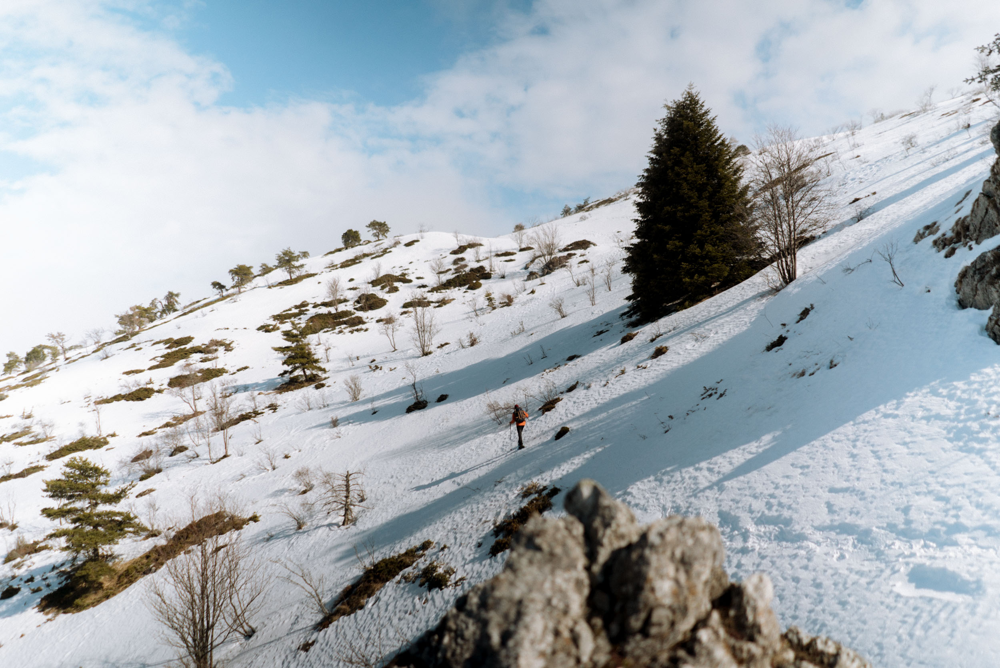

_"Et si je partais vivre une petite aventure dans une cabane non gardée en hiver dans le Vercors ?"_

On est début février, je rentre de 2 semaines au soleil au Cambodge et n'ai plus vraiment la tête à l'hiver. Pourtant, quand je regarde par la fenêtre, il pleut des cordes à Lyon et les flocons de neige s'abattent sur une bonne partie des massifs montagneux français. Je n'ai pas encore skié cette saison, la perspective d'essayer mes nouveaux skis me faisait de l'oeil, mais j'avais plus le coeur à porter des shorts et ranger les manteaux. Ce qui me trottait dans la tête c'était avant tout repartir en [**bivouac**](http://jeremyjanin.com/les-bivouacs), passer la nuit dehors et profiter du grand air sur tout un week-end.



_Vidéo filmée avec un Sony a7sII et [Sony a7rII](https://amzn.to/2Vvcn93) + [GoPro HERO7 Black](https://amzn.to/2P47pxx)_

_Objectifs : [28mm f/2](https://amzn.to/2OPOR3O) et [55mm f/1.8](https://amzn.to/2TUDOHv)._

_Édité avec FCPX. Musique : [Artlist](http://bit.ly/ArtlistCaptainYvon)._

#### **LES PRÉPARATIFS**

Je m'étais promis à l'automne dernier de vivre une micro aventure hivernale, histoire de ne pas mettre le nez dehors que quand il fait beau et chaud. Ce soir là, j'étais en train de planifier l'un des projets qui me prend le plus aux trippes depuis bien longtemps pour fin avril. À force de lire mes sites préférés de bikepacking tout l'hiver et de me mettre à rêver de vivre à mon tour un périple sur les deux roues de mon fatbike, je me suis mis à songer à une idée de micro-aventure hivernale, le temps d'un week-end. Le temps allait me manquer pour faire plus et pour une première, autant commencer accessible pour ne pas se dégouter. Je commence à coucher quelques idées de destinations sur le papier et à laisser l'idée germer.

Hasard total ou coup de pouce du karma, je partais le lendemain pour Londres pour le travail. Dans l'avion, je me retrouve à côté d'un anglais qui travaille pour la Sky et qui me voit regarder un film de bikepacking. On sympatise très vite et on passera tout le vol à discuter. Michael rentrait de 5 jours d'un "_hut-to-hut trip_" dans le Vercors. Il a traversé les Hauts Plateaux du Vercors en raquettes en dormant dans des cabanes non gardées. Je le remercie pour l'échange et nos chemins se séparent au niveau du tapis bagage. Mais l'idée est là et ne me quittera plus : et si je partais passer le week-end dans le Vercors avec mon fatbike et dormir dans l'une de ces cabanes ?

L'idée était lancée, j'ai passé plusieurs soirées à faire des recherches sur internet. J'ai commencé à [préparer ma randonnée bivouac](http://jeremyjanin.com/conseils-preparer-partir-en-randonnee-bivouac) tout en sachant que ça serait en hiver, et qu'un , j'ai découvert l'univers de Xavier ['The Other Life"](https://youtu.be/lUXBYQSTogg) sur YouTube, qui a fait la même chose mais en rando et en été. Mon projet se peaufine mais plus j'avance, plus je me dis que ça serait chouette de le partager avec mon pote d'aventure et l'autre moitié de Captain Yvon : [Greg](http://gregorymignard.com). Je lui lance l'idée, il est immédiatement emballé. On bloque le premier week-end de mars et l'organisation commence et on a bien en tête de documenter ça dans une vidéo. _(Que vous pouvez voir tout en bas de l'article)_

Finalement une problématique logistique va nous faire reconsidérer cette aventure, laisser les fatbikes derrière et les troquer pour les raquettes pour cette fois. Dommage pour le fatbike, ça sera pour une prochaine fois, ce ne sont pas les idées qui manquent.

#### LA MICROAVENTURE

Nous sommes vendredi après-midi, je viens de finir ma journée de travail, on charge la voiture et on prend la route direction le Vercors pour passer 2 jours et 2 nuits dans une cabane non gardée (et non chauffée) dans le Vercors.

2h de route plus tard, après un arrêt à la fromagerie du coin pour , nous voilà fins prêts, sacs sur le dos, raquettes accrochées au sac et bâtons de rando réglés pour aller trouver notre cabane avant la tombée de la nuit. On grimpe hors sentier, la montée est un peu raide mais pas très longue. Après avoir un peu galérés à avancer en se disant que ça passait sans raquettes et qu'on arrivait bientôt, on aura finalement laissé un peu d'énergie à chaque trou où l'on s'enfonçait jusqu'à la cuisse dans cette neige de printemps bien mouillée par les récentes averses.

Finalement, c'est Greg qui apercevra le premier notre toit pour les deux prochaines nuits. Chcrouic. Chcrouic. La nuit commence à tomber en même temps que la température chute pour créer une croute plus dure sur la neige. On arrive enfin devant la porte, prêts à l'ouvrir, mais avec la petite appréhension que la cabane soit pleine et que nous n'ayons pas la place de poser nos matelas. On met fin au suspens et nos espoirs s'estompent en découvrant l'intérieur de la cabane vide et prêt à nous accueillir. On prend nos marques, on s'étale un peu, on gonfle les matelas de rando, on déroule les sacs de couchage et on attaque avec un petit apéro à base de produit locaux : saucisson au beaufort et tranches de beaufort. Que c'est bon d'être là !

On fait quelques plans pour le lendemain en se disant qu'on va laisser surtout nos envies et la météo nous porter. Après un plat lyophilisé avalé, on finit par se faire happer par morphée, malgré les -2°c dans la cabane et l'absence de poële pour la réchauffer.

03:12. Je suis réveillé par le bruit des rongeurs qui semblent faire une nuit blanche dans le plancher de la cabane. Inquiet qu'ils ne viennent s'en prendre à nos vivres pour le week-end, je tape avec mes chaussures sur le sol en bois pour les disperser un peu. On touche pas au beaufort, c'est sacré ! Oh ! Ce geste aura pour conséquence de réveiller Greg qui dort sur la plateforme en bois de l'autre côté. La tête un peu endormie mais les narines gelées par la fraicheur de l'air qui circule dans la cabane, on est finalement vite réveillés et sans aucune envie de se rendormir. On allume quelques bougies pour avoir un peu de lumière et on papotera jusqu'au petit matin, en attendant l'heure bleue et le lever du soleil. On passe le nez par la fenêtre après avoir pas mal discuté, la brume enveloppe tous les alentours de la cabane et on sera privé du spectacle du soleil qui sort derrière le Mont Aiguille, l'un des sommets emblématiques du coin. Tant pis, on re-tentera demain.

Un petit dej' pour réchauffer les coeurs et on commence notre journée par ranger un peu notre matos dans un coin de la cabane pour partir un peu plus léger faire une petite balade en raquettes dans les bois alentours pour s'aérer un peu. La pente s'élève, il n'y-a pas de trace hormis celles de quelques animaux et une vieille trace de passages de ski de rando. Ça devient très raide par passage et on est à la limite de ce qu'on peut faire avec les raquettes. On râle un peu mais on est content d'être ici. Qu'est-ce que c'est beau ! (Mais qu'est-ce que c'est bouché.)

L'excitation monte au fur et à mesure où la pente se raidit. Finalement, sans trop s'en rendre compte, on se retrouve aux trois quarts de l'ascension vers les crêtes qu'on visait plutôt pour le lendemain au lever du soleil. On se décide donc à continuer et d'y aller. Quitte à être là, autant aller jusqu'en haut. On sort du nuage d'un coup et le soleil se met à percer, le ciel et bleu et on découvre enfin ce majestueux Mont Aiguille. C'est beau et on commence déjà à en prendre plein les yeux alors qu'on est encore dans la montée finale. On se décide à faire une pause pour faire quelques images avant de poursuivre notre itinéraire hors sentier, droit dans la pente.

Le soleil ne nous quittera pas jusqu'aux crêtes. Il y-a une ambiance très minimaliste, très douce. Le ciel est bleu profond sans l'ombre d'un nuage, la neige au blanc immaculé renvoie le lumière du soleil pour une carte postale digne d'un film de ski tourné au Japon... Et pourtant, on est dans le Vercors, à deux heures de chez moi. C'est dingue !

On arrive finalement sur les crêtes avec un panorama de dingue sur la chaîne du Vercors, le Mont Aiguille et un paquet de sommets dont j'ignore le nom. On prend une vraie claque face à cette vue et cette météo qu'on ne soupçonnait pas ! C'est beau mais ça caille. Le vent nous claque dans les oreilles et le froid nous force à ne pas trainer trop longtemps là haut. On savoure une dernière fois la vue sur cette ligne de crête et reprenons le chemin de la cabane pour une descente dans une ambiance apocalyptique. La météo a tourné en l'espace de 5 minutes, le ciel est devenu orageux et on se retrouve sous une tempête de neige en peu de temps. On se fait glisser sur les fesses pour accélérer la descente (et se marrer un peu !) avant de retrouver notre bivouac de luxe, entouré par la brume.

En rentrant à la cabane, je reçois une avalanche de notifications WhatsApp de Samantha qui m'annonce une nouvelle incroyable pour nous et qui va mettre un terme plus tôt que prévu à cette micro-aventure. On discute longtemps des options qu'on a entre rester ou rentrer mais on opte pour le deuxième choix, même si on est triste d'abandonner le projet en cours de route. Mais au moins, on aura vécu ce qu'on voulait, simplement en plus court que prévu. C'est là qu'on se dit qu'on a bien fait de pousser jusqu'au sommet ce matin là quand on était en raquettes, sinon la frustration n'aurait pas été la même. Le karma est bien fait quand même. On refait les sacs, réunis notre matos, on avale un petit truc, on passe un dernier coup de balayette dans la cabane avant de la saluer et de voir nos silhouettes disparaître dans la descente qui allait nous ramener à la civilisation. Un peu triste d'avorter le projet, mais tellement heureux pour ce qui se trame à côté, je me sens surtout mal vis à vis de Greg de devoir écourter l'un des rares week-ends qu'il s'octroie chaque année en montagne. Finalement, quelques jours plus tard nous réaliserons que c'était clairement le bon choix d'avoir écourtée cette micro-aventure. Mais ça, je vous en reparlerai très bientôt car ce n'est pas le sujet du jour. :)

On rentre quand même avec des souvenirs plein la tête, l'impression d'avoir cassé notre routine en partant moins de 24h. Tout ça en faisant un peu de raquettes, en passant la nuit dehors et en se motivant à simplement faire ce qui nous faisait envie. On s'est laissé tenter par un coin qu'on ne connaissait pas, pour se laisser aller à la découverte d'un nouveau coin de la France. Qu'est-ce que c'était beau, qu'est-ce que c'était bien.

Je crois que ça nous a encore plus motivé à découvrir de nouveaux coins en France, à vivre encore plus de petites aventures comme celles-ci. Si on rêve devant des expéditions au long court, la sensation d'aventure et l'excitation qui va avec se fait, elle, ressentir dès lors qu'on sort de son quotidien en faisant quelque chose de différent et en passant la nuit ailleurs que dans son lit.

Allez, à charge de revanche, Greg et vivement la prochaine !

* * *

_Note : Nous ne divulguons pas volontairement le nom et la géolocalisation de cette cabane. Nous avons croisé des locaux et on sent que ce n'est pas la plus connue du coin, nous décidons donc de la respecter et de la préserver. Ce n'est pas par snobisme mais bien dans un souci de préservation des lieux. Si nous l'avons trouvé après quelques heures de recherche, vous pouvez sûrement aussi, mais autant préserver un maximum ces petits joyaux que sont les cabanes en libre accès. J'espère que vous comprendrez. :)_
