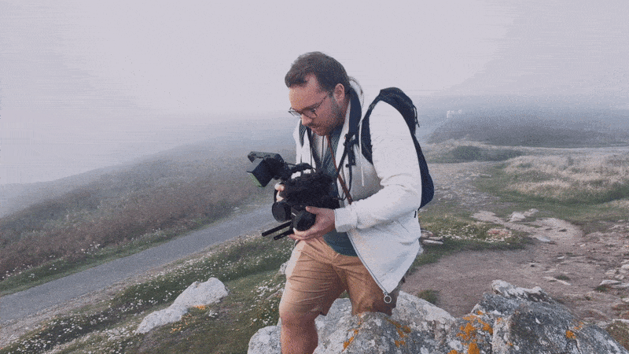
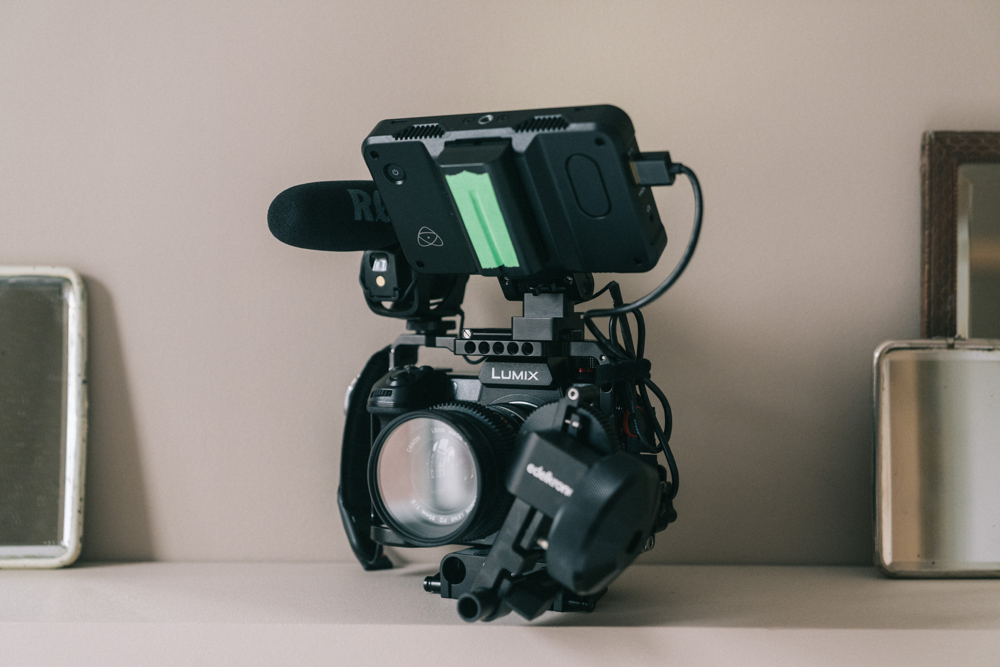
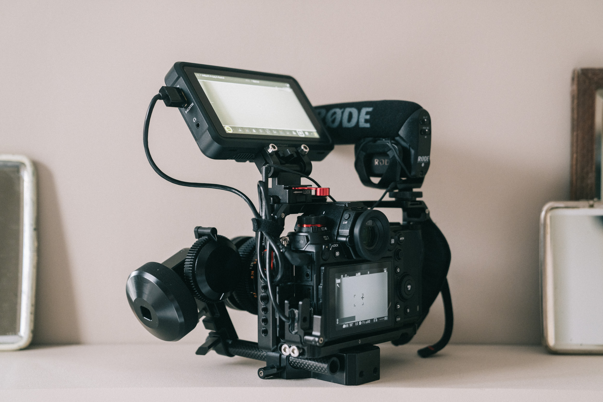
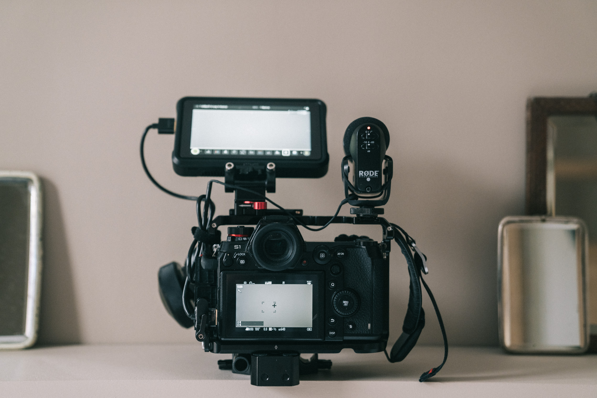
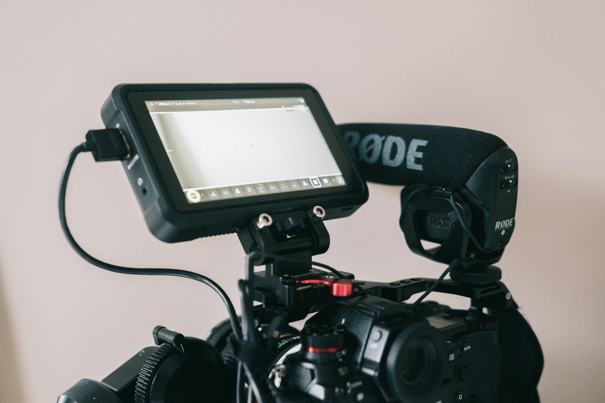

Aujourd'hui, je vais rentrer dans le détail du setup vidéo que j'utilise pour filmer des documentaires et vidéos avec mon [**Panasonic S1**](https://www.digit-photo.com/PANASONIC-Lumix-S1-Boitier-Nu-rPANASONICDCS1EK.html?dpa_id=21). Depuis que [je suis passé au Panasonic S1 après avoir été chez Sony](https://jeremyjanin.com/matos-photo-video-pourquoi-jai-quitte-sony-pour-le-panasonic-s1/), j'ai petit à petit amélioré mon setup vidéo pour qu'il convienne à ma façon de filmer plutôt run and gun, notamment en documentaire.

En 2020, on a produit avec Greg notre premier documentaire de 52 minutes "IMMERSION, 7 vies inspirées par la mer" et nous avons eu ce besoin d'améliorer le setup pour être réactif tout en filmant des images de qualité. En parallèle, je travaille sur un documentaire personnel depuis 1 an et demi pour lequel je filme près de 2 semaines par mois. Même si comme je le disais dans mon article, j'ai longtemps considéré une BMPCC 6K, avoir un appareil photo qui filme bien semble être la meilleure option pour moi. Je reviendrais dans un article plus détaillé sur ce que j'aime avec le S1 mais aujourd'hui, je voulais m'attarder sur le setup que j'ai construit autour de ce boitier. Tout ce que je décris dans cet article est applicable au LUMIX S1, S1H ou S5 de Panasonic (sauf peut-être la cage qui diffèrera avec le S5) sinon tout est adaptable à ces boitiers LUMIX, si vous chercher à utiliser certaines pièces que j'utilise.

# Panasonic LUMIX S1 : mon setup vidéo run and gun pour du documentaire

## Mes critères pour ce setup vidéo

Je n'ai pas construit ce setup vidéo pour qu'il fasse "cinéma" ou juste qu'il soit cool sur Instagram mais pour qu'il réponde vraiment à mes besoins assez "run and gun" de tournage en documentaire, en solo ou à deux avec Greg pour nos prods Captain Yvon. À savoir :

- Améliorer la prise en main
- Augmenter la polyvalence du setup
- Pouvoir s'assembler et se démonter de manière rapide et avec le moins d'outils possibles
- Rester relativement compact pour se ranger facilement dans un sac à dos classique
- Pouvoir capter le son et la vidéo quand je filme seul
- Améliorer la visibilité de mes compositions

   

## Le coeur de mon setup vidéo documentaire : Panasonic S1 et optiques Canon FD

Le coeur de ce setup est donc mon [Panasonic LUMIX S1](https://www.digit-photo.com/PANASONIC-Lumix-S1-Boitier-Nu-rPANASONICDCS1EK.html?dpa_id=21). Depuis que [j'ai quitté Sony](https://jeremyjanin.com/matos-photo-video-pourquoi-jai-quitte-sony-pour-le-panasonic-s1/) pour ce boitier, je n'ai aucun regret : il me permet de filmer en 4K (ou 6K suite à la dernière mise à jour), en 4.2.2 10bits : les deux critères principaux qui m'avaient poussé à changer. Les mises à jour apportée au S1 depuis sa sortie ont vraiment boostées les capacités du boitier en vidéo pour se rapprocher non loin d'un S1H. Une belle surprise pour moi dans les mois qui ont suivi l'achat, notamment au niveau de l'expérience utilisateur.

Autour de ce boitier, j'ai mes objectifs préférés — la série Canon FD : **24mm f/2.8 nFD**, **35mm f/2 SSC**, **55mm f/1.2 SSC**, **85mm f/1.8 SSC** et **135mm f/2.8 nFD**.

Ils ont un caractère que j'adore, le *flare* est incroyable, notamment sur le 24mm f/2.8 et j'aime ce rendu moins chirurgical comparés aux objectifs modernes. Pour monter ces objectifs vintages sur l'appareil, il est important de [choisir le bon adaptateur](https://jeremyjanin.com/quel-adaptateur-dobjectif-pour-monture-l-panasonic-s1/) pour le Panasonic S1 en fonction de vos objectifs. J'en ai utilisé de différentes marques et clairement ils ne se valent pas tous. J'utilise les [**adaptateurs URTH FD vers L**](https://amzn.to/3ovljuF). C'est LA marque que je recommande tant la qualité de construction de tenue de l'objectif est meilleure que les autres.

Niveau stockage des données, j'utilise les cartes CFexpress Type B, que je trouve nettement plus rapides que les SD, plus fiable et le temps de transfert une fois rentré à la maison pour la [sauvegarde via mon Mac mini](https://jeremyjanin.com/utiliser-un-mac-mini-pour-le-montage-video-2020/) est vraiment plus rapide qu'une SD. J'ai investi dans un [lecteur de carte mémoire Pro Grade](https://amzn.to/3Dlq8N7) et je n'ai aucun regret vu la rapidité des transferts, surtout que je sauvegarde très souvent avec ces différents projets. Un vrai gain de temps.

## Les indispensables de mon setup vidéo documentaire

Moniteur, cage, accessoires, batteries, follow focus... tous les indispensables à mon setup vidéo run and gun.

### Moniteur externe & son

L'un des gros facteurs de décision de construire ce setup a été la volonté d'ajouter un moniteur externe à mon setup vidéo. J'ai choisi l'[**Atomos Shinobi**](https://www.digit-photo.com/ATOMOS-Shinobi-Moniteur-5-4k-HDMI-HDR-rATOMOSATOMSHBH01.html?dpa_id=21) qui me permet de mieux voir ma mise au point, cadrer de manière plus confortable à tous les angles, et m'apporte un vrai confort d'utilisation avec ces différentes options (peaking, masks,...). Je n'ai pas besoin de l'enregistrement externe en ProRes, c'est pour ça que je n'ai pas pris l'Atomos Ninja V et que je suis resté sur le Shinobi. Je peux utiliser le Shinobi dans toutes les situations : plein soleil, en intérieur, dans des angles pas possibles et ça a été une vraie révélation depuis son arrivée. J'ai hésité des années avant de passer à un moniteur externe, aujourd'hui, je ne pourrais plus m'en passer.

Pour le son, pour la plupart des captations sur le vif, j'utilise le [Rode VideoMic Pro](https://www.digit-photo.com/RODE-Microphone-VideoMic-Pro-Rycote-rRODE100262.html?dpa_id=21). Si besoin, j'ai un zoom h1n avec micro-cravate pour une interview imprévue. Pour la captation d'interview posée, j'opte pour le [**Rode NTG4+**](https://www.digit-photo.com/RODE-Microphone-NTG4-Noir-rRODE100256.html?dpa_id=21) avec le ZOOM H4N Pro. Mais la majeur partie de mon temps est passée avec le VideoMic Pro pour capteur le son sur le vif.

### Cage et accessoires

Pour pouvoir fixer plusieurs accessoires à mon LUMIX S1, il m'est indispensable d'avoir une cage. Elle me permet d'avoir mon moniteur externe, un micro et un follow focus, comme kit de base, mais aussi de pouvoir l'étendre avec des tiges de 15mm pour installer une batterie V-Mount, ou ajouter une poignée sur le dessus. J'ai opté pour plusieurs accessoires SmallRig, Nitze et Tilta pour construire ce setup vidéo autour de mon Panasonic S1. J'ai souhaité installer un maximum de d'accessoires sur des rails Nato pour ne pas avoir  besoin d'outils pour sortir le boitier ou démonter le setup vidéo. Les rails nato, sont des sortes d'attaches rapides qui permettent d'ajouter ou retirer un accessoire en une seconde.

- La [**cage SmallRig pour le S1 / S1H**](https://amzn.to/3IrFNxA)
- Une [**courroie Peak Design**](https://www.digit-photo.com/PEAK-DESIGN-Courroie-de-Poignet-CLUTCH-CL3-rPEAKDESIGNCL3.html?dpa_id=21) pour sécuriser le boitier autour de ma main droite et aider à la prise en main
- [**Poignée 'top handle' de Nitze**](https://amzn.to/3GCX1GH), la plus compacte et confortable que j'ai testé
- 1x [**rail nato SmallRig de 70mm**](https://amzn.to/3lI8xs7) sur le dessus de la cage pour fixer la poignée ou le moniteur si je n'utilise pas la poignée
- 1x [**rail nato de 70mm**](https://amzn.to/3ovWHTJ) sur la poignée pour installer le moniteur  lorsque j'utilise la 'top handle'
- Une [**pince pour maintenir la prise HDMI**](https://amzn.to/3px61Go) et ne pas risquer l'arrachement
- Un [**cable HDMI Smallrig ultra Slim 4K**](https://www.digit-photo.com/SMALLRIG-2956-Cable-HDMI-Ultra-Slim-4k-35cm-rSMALLRIGD187221.html?dpa_id=21) pour relier le moniteur au boitier

Optionnel quand je veux passer à la rig complète avec plus d'autonomie et d'ergonomie :

- [**Baseplate avec fixation pour tubes de 15mm**](https://amzn.to/3ov9uFW)
- [**Tiges de 15mm Smallrig**](https://amzn.to/3osyuh3) pour supporter la fixation de la batterie V-MOUNT et le Follow focus
- [**Support Tilta Mini V-Mount**](https://amzn.to/31twkFu) pour fixer à l'horizontal ou vertical la batterie V-Mount
- [**Batterie Baxxtar Pro II V-Mount V95**](https://amzn.to/3pBLqkc) hyper compact, je la préfère aux V-Mount classiques car elle permet de réduire l'encombrement.
- [**Follow Focus Edelkrone One**](https://edelkrone-eu.com/products/focusone) Je préfère un follow focus manuel à un électronique pour réduire ma dépendance aux batteries, et éliminer tout risque de bug ou de perte de temps d'appairage.

   

## Mon setup à l'usage

J'ai utilisé ce setup en partie sur le tournage d'[IMMERSION](https://www.immersion-lefilm.fr/) puis  sur celui de [*Slow Is Beautiful*](https://vimeo.com/625382741), et je l'ai développé encore ces dernières semaines. J'aime vraiment le confort qu'il m'apporte.

Je l'utilise dans différentes configurations et l'une des plus réactives et faciles est celle avec la cage, le moniteur et le micro. Le follow focus est intéressant mais je ne l'utilise pas systématiquement. Dans cette config minimaliste, je peux transporter le boitier dans un petit sac à dos, l'avoir sans être trop intrusif ou sans que ça ne soit trop imposant au point d'intimider les personnes que je filme. Le setup n'est pas léger mais il permet aussi des mouvements plus naturels, pour éviter les micro-secousses, même si la stabilisation du capteur du S1 est incroyable pour ça. Mais j'essaie aussi de la désactiver pour un rendu parfois plus naturel pour éviter les "accoups du capteur" en marchant ou en me déplaçant. C'est dans cette config la plus minimaliste que je préfère l'utiliser mais chaque config a son avantage et je peux très facilement rajouter ou enlever une pièce en fonction des besoins du moment.

Envie d’échanger sur le sujet avec moi ? [Rejoins-moi sur Twitter](https://twitter.com/jeremyjanin) ou sur [Discord](https://discord.gg/rvk5DTwT8H) !
