Partir 1 an à l'étranger, faire un break et partir voyager pour une longue durée a toujours été quelque chose que je voyais comme négatif pour ma « carrière » quand j’étais ado. Finalement, 10 ans et 2 PVT plus tard, je crois que faire ces breaks ont été la meilleure chose qui ait pu m’arriver. Depuis mon retour d’Australie, je suis aujourd’hui un fervent défenseur de l’idée que chacun devient une meilleure personne après ce genre d’expérience à l’étranger, seul avec lui même à se débrouiller dans les bons comme dans les mauvais moments. Partir 1 an à l’étranger ou même quelques mois n’est pas rose tous les jours, mais en regardant en arrière quelques années après, les moments plus difficiles sont aujourd’hui de bonnes anecdotes à raconter et les beaux souvenirs sont pléthores.

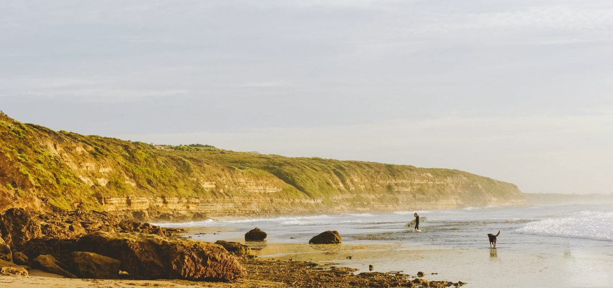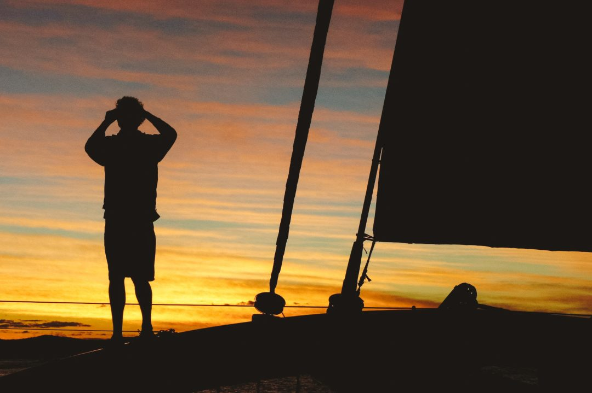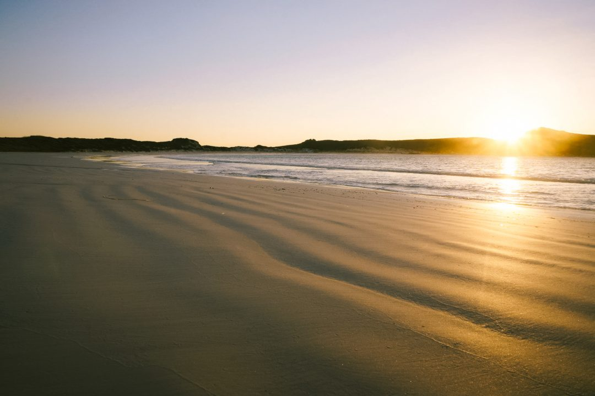

> ### **Partir 1 an à l'étranger : mon expérience en Australie et au Canada**

En 2011, je suis parti en Australie pour 6 mois de PVT. Au départ mon choix était sur le Canada et puis finalement, j'ai eu envie de chaleur et ai opté pour l'Australie. Lors de ma réflexion avant le départ, mon but était, plus que la destination, réussir mon pari avec moi même et partir 1 an à l'étranger. Je m’étais toujours trouvé comme pas très débrouillard et c’était un beau challenge que je me fixais et que je voulais réaliser. Je m’étais mis en tête de boucler mon année et avoir mon diplôme et partir dans la foulée. C’est ce que j’ai fait. Je suis parti avec une amie, on a atterri à Sydney des projets plein la tête et des envies plein les idées mais finalement, 3 semaines après avoir acheté un van ensemble, nous ne nous entendions plus. Elle m’a déposé quelques milliers de kilomètres plus loin à Adélaide en Australie du Sud, on s’est rendu nos parts du van et avons pris des chemins différents. C’est à ce moment précis que je me suis retrouvé seul, au bout du monde, sac sur le dos et planche de surf sous le bras avec pour ainsi dire : 0 plan. Du haut de mes 21 ans, je me retrouvais pour l’une des premières fois de ma vie à devoir me débrouiller tout seul et à être libre de faire ce que je voulais et de décider pleinement de ce qui allait se passer pour moi les semaines et mois qui suivraient.

Par chance, je me débrouillais bien en anglais et n’ai pas eu de mal à sympathiser rapidement ni n’ai trop galéré à trouver du travail quand il a fallu re-remplir un peu mon compte bancaire. Je pense que sans un bon niveau d’anglais, les choses se compliquent vraiment et on serait vite réduit à devoir prendre les jobs que personne ne veut et qui ne paient pas très bien pendant un PVT. Bon nombre de personnes dans mon entourage sont parties en Australie depuis que je suis rentré et tout ceux qui s’en sont sortis financièrement et dans leur quête de jobs étaient ceux qui avaient un bon niveau d’anglais. Si votre anglais pêche, l’immersion à l’étranger est à mon sens hyper importante pour vraiment progresser. Et pour ça rien de mieux qu’un voyage longue durée où on est livré à soi même pour se débrouiller. Je pense que la langue est primordiale pour ne pas être frustré et pouvoir se sortir de toutes les situations et profiter d’avantage de cette aventure. Pour ma part, en arrivant à l’auberge de jeunesse après m’être retrouvé tout seul à Adelaide, j’ai parcouru Gumtree, le Bon Coin local et ai trouvé en quelques heures de nouvelles têtes dont certaines m’auront suivies jusqu’à la fin de mon périple de plus de 15 000km autour du pays des kangourous. J’ai donc appris à connaître mes nouveaux compagnons de voyages (3 allemands, 1 hollandais) et quelques jours plus tard, nous n’avions d’autre choix que l’anglais pour communiquer et ça nous a tous permis de progresser pendant ce séjour.

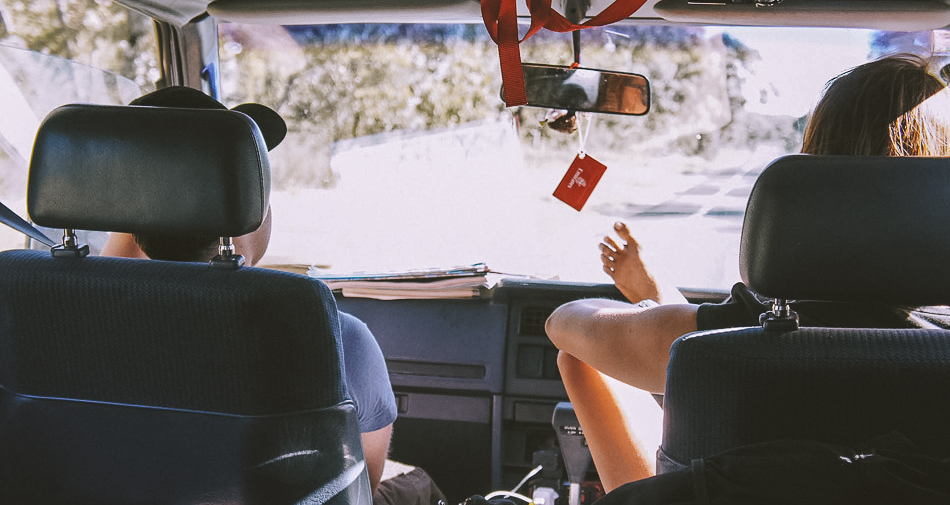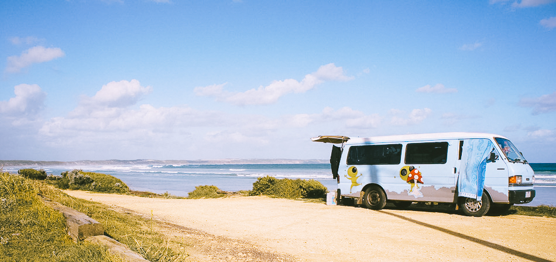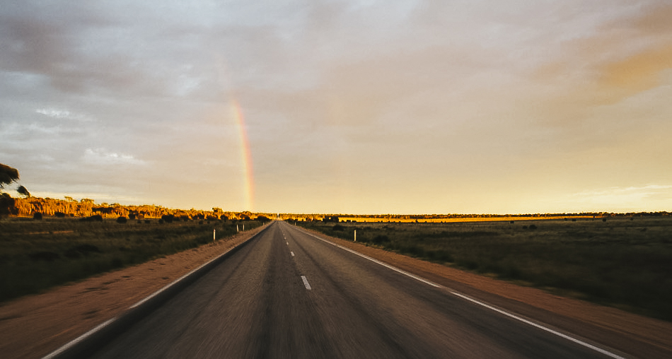

On a acheté une voiture ensemble et avons taillé la route :  à l’Ouest toute. 6 ans plus tard, mon travail implique une communication quotidienne quasi exclusive en anglais, et même si j’avais des pré-dispositions en anglais avant mon départ, sans cette expérience en Australie, je ne suis pas sûr que j’aurais acquis un niveau suffisant pour en avoir un usage professionnel aujourd’hui. Mais au delà des langues ce voyage, m’a fait grandir, m’a fait ouvrir les yeux sur ce qui m’entourait et sur ce que je voulais être et ne pas être. J’ai lâché prise après 20 ans à vouloir tout contrôlé, à être timide et ça m’a transformé. Ce sentiment de liberté, j’y ai gouté sans m’en rendre compte au début de ce voyage. Je m’y suis fait et en ai fait un leitmotiv pour toute la suite de mon séjour. Si tout a été parfait 5 mois durant, le retour à la réalité et à la solitude lorsque les visas de mes compagnons de route ont expiré et pas le mien, a été assez dur à digérer. J’avais fait des plans sur la comète, ce voyage en Australie était mon premier hors Europe et ne devait être qu’un entrainement avant un PVT en Nouvelle Zélande et un retour en France par la terre depuis la Thaïlande. J’avais appelé ce projet de 2 ans et demi : « mon demi-tour du monde ».

Finalement, tout a été balayé, en 1 semaine lorsque j’ai dit au revoir à mes camarades qui eux rentraient en Europe. J’ai adoré ces 6 mois en Australie, mais la claque du retour à la réalité, le compte en banque vide et devoir me remettre à travailler en étant exploité pour 6$ de l’heure, faute d’être dans un endroit paumé avec peu de possibilités, j’étais pas prêt à ce moment là. J’ai avalé les 2500km de route qui séparaient Cairns dans le Queensland de Sydney dans le New South Wales, avec la ferme intention de rentrer en France au plus vite. J’ai mis en vente ma voiture et l’ai vendu par chance un jour de juillet 2011. Ca faisait 20 jours que j’étais dans « Victoria Street », j'étais l’un des doyens de cette rue où tous les backpackers vendaient leur voiture. J’avais tout tenté, jusqu’à ne plus afficher de prix pour la voiture et juste une pancarte « Payez mon billet d’avion et elle est à vous. ». Ce jour là, un homme d’une trentaine d’années venait de tomber en panne à l’entrée de Sydney et se mariait quelques heures plus tard à 4h au sud de Sydney. Par chance, j’étais la première voiture de la rue au moment où il est arrivé, il m’a payé la voiture et est parti aussi vite qu’il est arrivé. 2 jours plus tard, j’étais de retour en France.

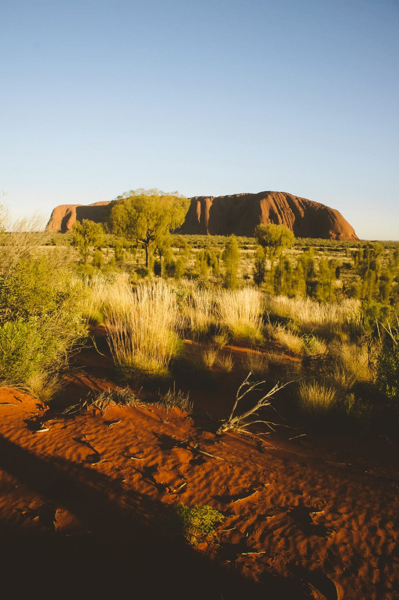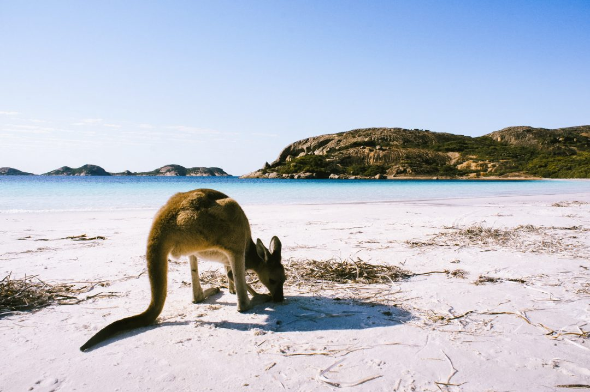

Ce périple a été incroyable, j’ai vu des paysages magnifiques, j’ai des souvenirs insouciants et magiques ancrés dans ma mémoire depuis ce PVT en Australie et c’est assurément « l’aventure » qui a changé ma vie. En 6 mois, j’ai plongé avec les grands requins blancs, me suis débrouillé à réparer mon van sur le bord de la route en plein milieu du désert, j’ai surfé sur plus de plages que dans toute ma vie, j’ai vécu un rêve éveillé à l’époque, une liberté totale, et rien ne me pouvais m’arrêter. Les bons moments et les péripéties font et défont un voyage, et c’est ce qui m’a permis de grandir et devenir un meilleur moi. Je n’ai pas de honte à le dire aujourd’hui, j’en suis fier. Ce n’était pas gagné en ce jour de juillet 2010, 1 an avant le départ, quand je me suis dit « et pourquoi pas ? » et finalement, presque 7 ans plus tard, je constate le chemin parcouru et ne peux qu’être heureux de voir où ça m’a mené.

Rentré un peu dépité de cette dernière semaine de galère australienne, j’ai vite retrouvé du travail en France pour refaire mon compte en banque. J’ai finalement mis de côté et économisé avec en tête de prendre ma revanche et réussir à repartir un jour en PVT et tenir une année entière. J’avais besoin de me le prouver. Depuis mon retour d’Australie, moi le récalcitrant à l’idée de quitter le confort de mon quotidien et de mettre en péril ma « carrière », ai complètement changé de point de vue. Le plaisir de vivre et de profiter des bons moments, vivre des expériences en France comme à l’étranger, est devenu mon leitmotiv et m’ont fait relégué mes voeux de carrière bien loin. Ne nous y trompons pas, j’adore mon job et je suis heureux de pouvoir gagner ma vie et subvenir à mes besoins, mais disons simplement que mes priorités ne sont plus aujourd’hui celles qu’elles étaient en sortant de mes études.

Depuis ce retour, j'ai aussi décider à nouveau de partir 1 an à l'étranger mais cette fois outre Atlantique, à Montréal où la langue n’était donc pas un problème. Je suis intimement persuadé qu’une expérience de plusieurs mois, dans un pays lointain, où papa maman ne peuvent pas aider, est une expérience que chaque personne devrait pouvoir vivre un jour. C’est un test incroyable sur soi même, le PVT permet de faciliter tout ça au niveau des démarches administratives et se passent dans des pays « safe » et où il est relativement facile de voyager. Lâcher prise et se retrouver livré à soi même sans pouvoir compter sur ses proches a été assurément la meilleure décision et expérience de vie qui pouvait m’arriver à ce moment là. Je peux allègrement dire qu’il y-a eu un Jeremy avant l’Australie et un Jeremy après l’Australie. Adieu la timidité, la non-débrouillardise, aujourd’hui, je me sens d’avantage épanoui, affirmé et capable de faire des choses. Ces 2 PVT ont renforcé quelque chose dont je manquais cruellement à l’époque : de la confiance en moi. Alors, à tous ceux qui en ont l’envie : « et pourquoi pas toi ? ».

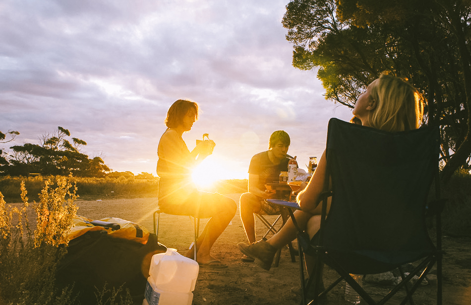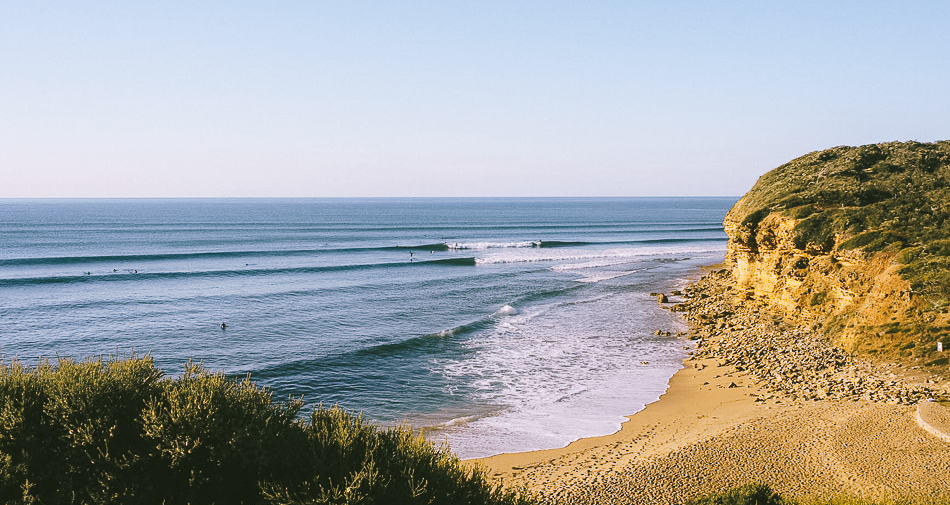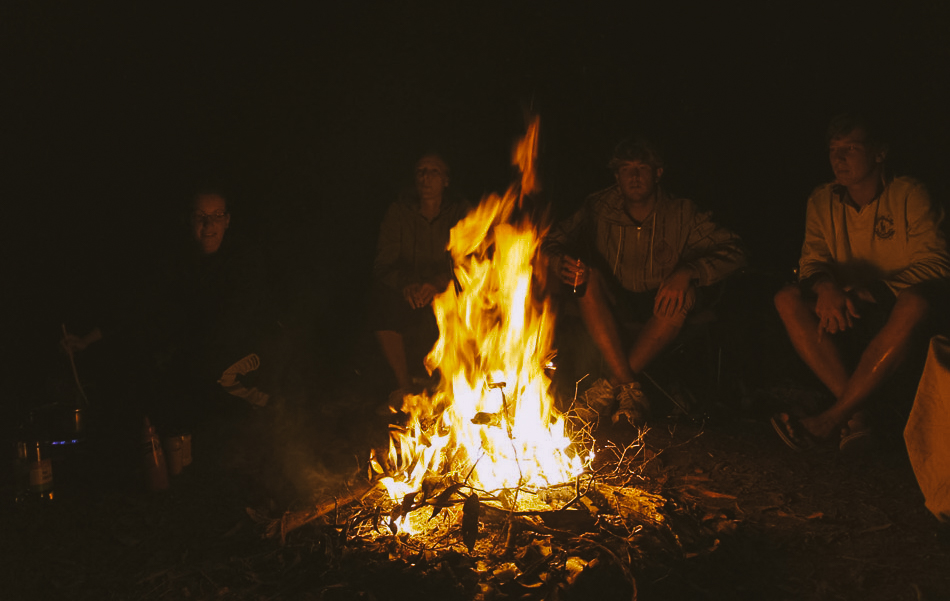

> ### **Partir 1 an à l'étranger, en conclusion : et pourquoi pas toi ?**

Trouver un petit boulot, économiser et partir 1 an à l'étranger au bout du monde pour vivre de belles expériences, forger son caractère et découvrir de nouvelles choses. Mes deux PVT ont été très différents : l’Australie a été la plus libre, le cliché total (assumé) du roadtrip van / surf à l’Australienne tandis que le second à Montréal a été plus urbain et plus calme mais à un moment clé de ma vie avec Samantha. Ces deux expériences ont été incroyables, inoubliables et au combien primordiales pour définir un peu plus la personne que je suis aujourd’hui. La plus marquante reste forcément celle de l’Australie, j’ai eu l’impression d’une deuxième naissance et à l’époque, de partir pour l’expédition de ma vie comme si aujourd’hui je partais gravir l’Everest. Avec du recul, c’était vraiment facile de voyage en Australie, mais c’est justement pour ça, pour avancer, apprendre, se découvrir et découvrir les autres que ce voyage à l’école de la vie m’a été bénéfique.

Il n’y-a pas de petites ou grosses aventures, chaque expérience est bonne à prendre. Parfois elles ratent comme mon projet de demi tour du monde, parfois elles fonctionnent à l’image de ma revanche en réussissant à partir 1 an à l'étranger : en PVT à Montréal. Dans tous les cas, ce sont ces expériences qui nous font et nous défont, et construisent la personne que je suis aujourd’hui. Je prône haut et fort ma conviction qu’il est aujourd’hui plus facile que jamais de pouvoir partir et que c’est quelque chose à vivre au moins une fois. Je ne suis pas à l’inverse à recommander de tout plaquer, ne pas finir ses études ou tout lâcher sur un coup de tête, je pense qu’une telle décision doit être un minimum réfléchie pour éviter qu’elle ne tourne au fiasco complet.

Cette décision de partir 1 an à l'étranger reste et restera l’une des meilleures de ma vie, j’ai vécu des hauts et des bas, mais partir loin et longtemps m’a permis de grandir et me découvrir pour mieux revenir.

P.S : pardon pour les photos, elles datent d'il y-a 6 ans, soyez indulgents. 😅
