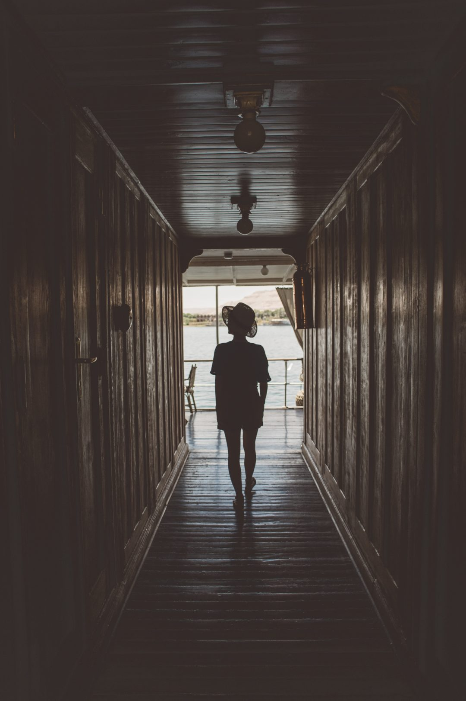

En juin dernier, j'ai pu partir en voyage en croisière en Egypte, un rêve de gosse longtemps repoussé. Durant toute mon adolescence, mon métier rêvé n'était ni pompier ni acteur ou encore moins chanteur mais bel et bien égyptologue. Je rêvais d'aller gratter la pierre avec mon pinceau, je caressais l'espoir de découvrir des restes de cette civilisation fascinante du bout de ma brosse à dent, je connaissais par coeur les noms des dieux égyptiens et collectionnaient les heures passées à regarder des documentaires ou lire des livres à ce sujet.

Lorsque **[_Voyageurs du Monde_](http://www.voyageursdumonde.fr/voyage-sur-mesure)** m'a invité à partir avec eux et une bande de copains eux aussi blogueurs, l'hésitation n'a pas été longue pour donner ma réponse, ce serait un grand oui. Nous avons passé quelques jours à longer le Nil à bord du mythique _Steam Ship Sudan_, lieu prépondérant de l'histoire d'Agatha Christie : [_Mort sur le Nil_](http://amzn.to/2huvOeM) et surtout le dernier bateau à vapeur en activité sur le Nil. Le coup de coeur pour ce bateau a été tel que j'ai décidé d'en faire un article dédié. Au fil des kilomètres, les noms de temples, villes et dieux énoncés par notre guide et sur les panneaux allaient piocher loin dans ma mémoire de jeune passionné d'égyptologie, tout était là, intact, le tiroir ne demandait qu'à être ré-ouvert, prêt à s'émerveiller dans cette contrée si longtemps rêvée. Avec cette dose de magie qui englobait le voyage, venait inévitablement se frotter les questions de la sécurité sur place, de l'impact du tourisme de masse... Après ce voyage, voici mes informations et remarques de ce que j'ai vu et ressenti sur place en attendant le récit de voyage plus détaillé pour vous permettre de préparer votre voyage en croisière en Egypte.

**La croisière sur le Steam Ship Sudan**

J'ai toujours été du côté des "_anti-croisière_", trouvant ça un peu trop ringard et davantage pour les personnes retraitées que pour les jeunes. Dans mon esprit en partant en croisière, on arrivait par vagues de 300 à un monument qu'on prenait d'assaut ambiance chaussette-sandale / banane autour de la taille et on perdait le côté intimiste de ce genre de voyage unique. En posant les pieds à Louxor pour mettre les voiles à bord du dernier bateau à vapeur en activité sur le Nil, force est de constater que j'ai du balayer d'un revers de la main tous mes a priori. Véritable bijou flottant, le _Steam Ship Sudan_ a été la révélation de ce voyage. Le bateau regorge de trésors qu'on ne se lasse pas de découvrir même au bout de plusieurs jours à bord. Si tôt partis pour visiter le matin que mon esprit pensait déjà à vouloir refouler le parquet craquant de notre vaisseau fluvial, laisser glisser ma main sur la rambarde fraichement cirée, me laisser bercer au rythme des clapotis du fleuve sur la coque de ce vieux briscard. Détrompez vous, j'ai adorer découvrir ce pays et cette civilisation mythique mais les moments sur le bateau font partis de mes meilleurs souvenirs.

Il faisait chaud, très chaud à cette période et on alternait entre repos au soleil avec les copains à refaire le monde, à se laisser aller au fil de l'eau en contemplant les rives du Nil défiler à nos chambres climatisées pour retrouver un peu de fraicheur de temps en temps. C'est une parenthèse hors du temps que chacun de nous aurait aimé ne jamais refermer, un moment de détente, un vrai break comme on ne l'aurait pas imaginé. C'est la première fois depuis longtemps qu'un voyage m'a autant fait du bien et reposé. Plus je prends de l'âge plus je me rends compte que j'aime voyager de la façon dont je le fais mais j'aime à me faire surprendre par un voyage parenthèse qui nous coupe de tout, loin de la circulation et des transports en commun pour retrouver un peu de quiétude, de silence et donc de repos. Je crois que ce voyage en croisière en Egypte m'aura appris à vouloir aussi voyager parfois pour lever le pied.

En plus de nos longs moments de calme avant d'accoster au prochain port d'attache, nous en avons profité aussi pour plonger dans les entrailles du bateau, découvrir un peu plus comment il fonctionne, la salle des machines pour faire tourner cette bête à vapeur qu'il faut huiler à la main toute les demie-heure pour éviter que les pistons s'enrayent mais aussi le quotidien du capitaine et des hommes qui nous chouchoutent à bord.

Dernière croisière de la saison oblige avant 2 mois de cale sèche pour l'entretien et pour laisser passer la saison la plus chaude de l'année, nous étions seuls. Nous avions notre microcosme sur ce bateau sur lequel on se sentait comme à la maison. Certains diront certainement qu'on a eu des traitements de faveurs en étant blogueurs, peut-être, mais la sincérité et le bonheur des hommes qui travaillaient sur le bateau était belle et surtout sincère. On ressent une vraie fierté qu'ils ont pour le métier qu'ils exercent et le fait de voyager tous ensemble sur un espace réduit rend l'expérience forcément plus intimiste qu'un séjour dans un hotel.

On passe d'un bord à l'autre pour voir la vie s'activer sur les rives, on s'affaire pour voir le soleil se coucher derrière les dunes de palmiers, on laisse les pieds pendre dans le vide à la proue du bateau, on se laisse bercer. La musique de la coque en bois qui fend les eaux s'improvise comme la mélodie de ce voyage intemporel. On se sent comme sur un nuage coupé de tout, l'envie de rien si ce n'est de profiter de l'instant, oublier l'heure et se laisser aller à la vitesse de croisière de notre maison flottante.

Évidemment un voyage d'exception comme celui-ci à un coût. Ce voyage en croisière en Egypte sur le Steam Ship Sudan commence avec un tarif à partir de _[2000€ par personne](http://www.voyageursdumonde.fr/voyage-sur-mesure/recherche-voyage-tag/voyage-steam-ship-sudan)_ pour 9 jours de voyages. Après ces quelques jours hors du temps, la conclusion était claire et à l'unanimité parmi notre groupe, nous étions prêts à économiser à nouveau pour y retourner tous ensemble tellement le voyage en vaut la peine. Le coup de coeur fut unanime, l'émerveillement fut plus que présent. Oh oui, nous sommes tous tombés sous le charme de ce bateau et de son équipage, une chose est sûr nous lui avons dit au revoir mais pas adieu, un jour viendra, nous nous réunirons à nouveau pour un nouveau séjour à bord au fil de l'eau.

 

Nous passons chaque nuit sur ce mythique fleuve avant de nous lever aux aurores pour profiter de la fraicheur relative des premières heures de la journée pour aller visiter des lieux et temples mythiques : **_Edfou, Vallée des Rois, Karnak, Philae, Louxor, Assouan_**... la magie opère et le voile se lève sur cette civilisation incroyable. Entre histoire de dieux, rebellion coptes et mégalomanie de pharaons, on en découvre chaque jour davantage au grès des hiéroglyphes inscrits sur les colonnes et les pierres millénaires qui nous entourent. Le dépaysement est total et l'émerveillement ne désemplit pas face à ces lieux chargés d'histoire quasiment vidés de ces touristes depuis quelques années suite au printemps arabe. Aucun doute, en ce moment est la meilleure période depuis bien longtemps pour aller découvrir l'Egypte, loin des foules et des queues interminables pour entrer dans les lieux les plus incontournables.

## **Préparer et partir en voyage en croisière en Egypte**

_Prêt à sauter le pas et partir en voyage en croisière en Egypte ? Voici quelques informations pratiques pour se préparer._

_**Sécurité**_

Avec une partie du pays qui revient souvent en titre aux infos, un avion qui se crash 10 jours avant notre départ, la question de la sécurité était au centre de notre attention quant au bon déroulement de ce voyage. Lors de mon arrivée sur place, la crainte a très vite été effacée. Si bien sûr il ne faut pas négliger où on se trouve, la partie dangereuse du pays à l'heure où j'écris ces lignes se trouve du côté du Sinaï et non de la Vallée du Nil. On voit des gardes un peu partout et même un service de sécurité (très discret) à bord du bateau. On se sent rassurés et presque invulnérable et j'avoue même avoir complètement oublié la question de la sécurité au bout de quelques heures sur place. Je suis toujours vigilant avec mon matériel en voyage donc c'est la seule chose où mon attention restait vraiment, je ne négligeais pas ma sécurité mais je me sentais bien et n'ai jamais ressenti la moindre insécurité en découvrant le pays. On a beaucoup échangé avec Voyageurs du Monde en amont du voyage et ils nous ont énormément rassuré sur la situation sur place, on leur a fait confiance et grand bien nous en a pris.

**Voyager seul ou accompagné ?**

Je recommande vivement de partir accompagné, soit par une agence de voyages soit avec un guide local. Tout dépend de votre façon de voyager, j'aime habituellement me débrouiller seul pour mes voyages, mais je dois avouer que vu la complexité de l'histoire du pays et sans expérience avec la culture locale, voyager seul ne m'aurait pas apporté autant de satisfaction dans la quietude de ce voyage et dans la découverte de la culture Égyptienne. Si vous voulez partir en voyage en croisière en Egypte sur le Steam Ship Sudan, c'est Voyageurs du Monde, propriétaire du bateau, qui propose les voyages à son bord et le guide que nous avons eu tout a long de ce voyage a été vraiment incroyable.

_À noter : Je suis entièrement libre de ce que je raconte ici et si quelque chose ne m'avait pas plu à bord du Steam Ship, je vous l'aurais dit et je n'ai aucune obligation à faire l'éloge de ce voyage ni de son organisation mais compte tenu de la qualité de mon expérience, je n'hésite pas une seconde à vous les recommander._

**Formalités**

En tant que français, on peut voyager en Egypte avec un **passeport ou une carte d'identité valable 6 mois après le retour**. Si vous voyagez avec une carte d'identité c'est possible mais je vous invite à vous rapprocher de l'ambassade pour vérifier quelle pièce fournir si besoin est.

Un visa est obligatoire pour les français, suisses et belges voyageant en Egypte. Il est à demander directement auprès de l'ambassade d'Egypte en France ou à prendre sur place pour 25$ environ. Je vous conseille de le prendre à l'avance pour être tranquille et serein au moment du passage de frontière.

**Vols & Décalage horaire**

Le temps de vol depuis Paris, comptez **4h30 jusqu'au Caire** et **5h jusqu'à Louxor**, les deux aéroports principaux d'arrivée/départ pour les français.

En été, il n'y-a pas décalage horaire avec la France et il y-a 1h de plus en hiver.

**Monnaie**

La monnaie locale est la **livre égyptienne** et le taux de change est 1 EGP = 0.057€ environ en décembre 2016.

En attendant de partir, voici un avant goût avec ma vidéo tournée lors de mon périple sur le Nil à bord du majestueux **Steam Ship Sudan.**

https://www.facebook.com/djisupertramp/videos/1172685599443656/?t=0

 

Ce voyage en croisière en Egypte nous en aura mis plein les yeux du début à la fin, et pour clore la carte postale quoi de mieux que passer voir et visiter les pyramides du Caire et saluer le Sphynx avant de remonter dans l'avion ? Les chaussures pleines de sables, le teint halé et les souvenirs qui se bousculent de cette parenthèse intemporelle au pays des pharaons dont je rêvais mais que je repoussais encore et toujours. Finalement, ce fut le meilleur moment et certainement la meilleure façon de faire de ce périple, une réussite totale.

_Rendez-vous très vite pour la suite du carnet de voyage en Egypte. En attendant vous pouvez lire les récits de ceux qui m'ont accompagné : [Anne](http://le-chien-a-taches.com/category/categories/prendre-lair/egypte/), [Alice](http://www.tippy.fr/categorie/destinations/egypte/), Samantha, [May](http://www.vie-de-miettes.fr/), [Juliette](http://www.jenesaispaschoisir.com/category/voyages/egypte/) et [Laetitia](http://www.eleusis-megara.fr/)._
