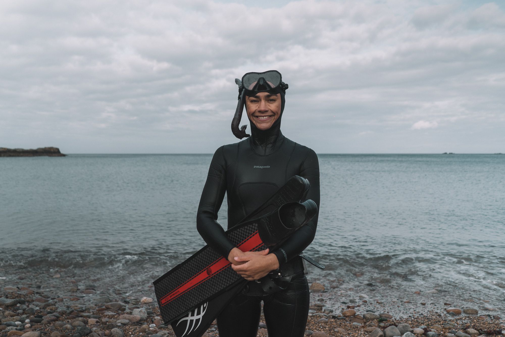
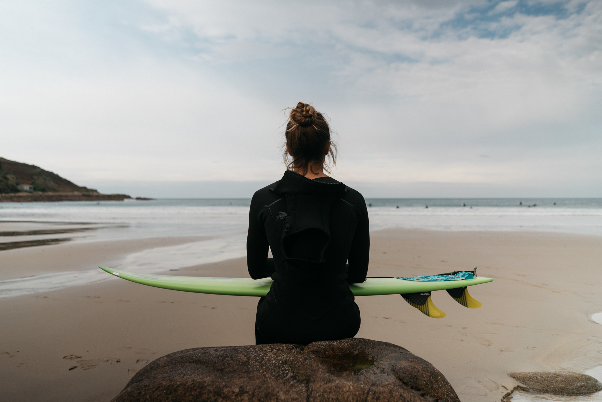
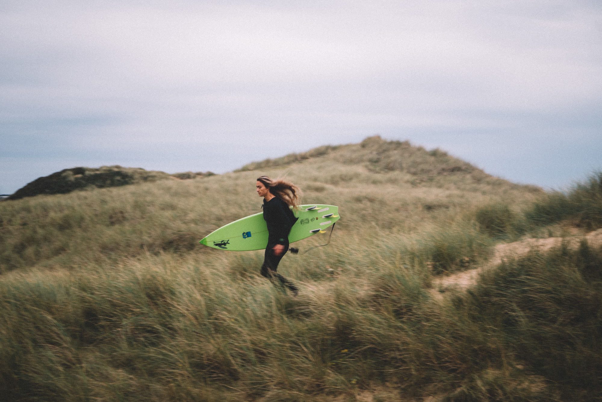
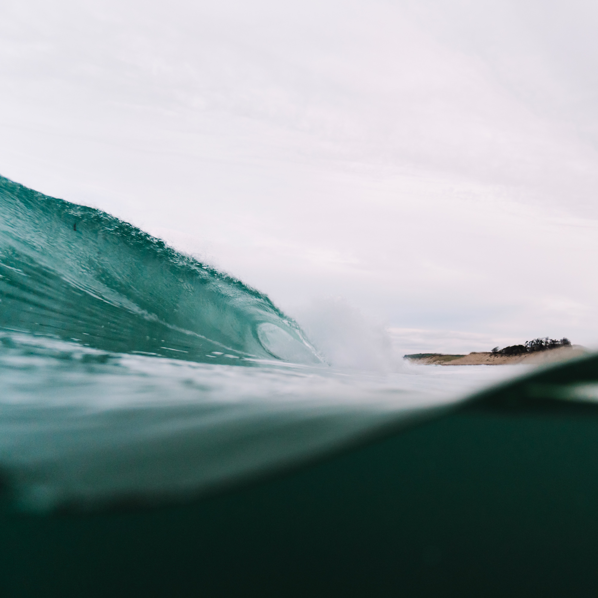
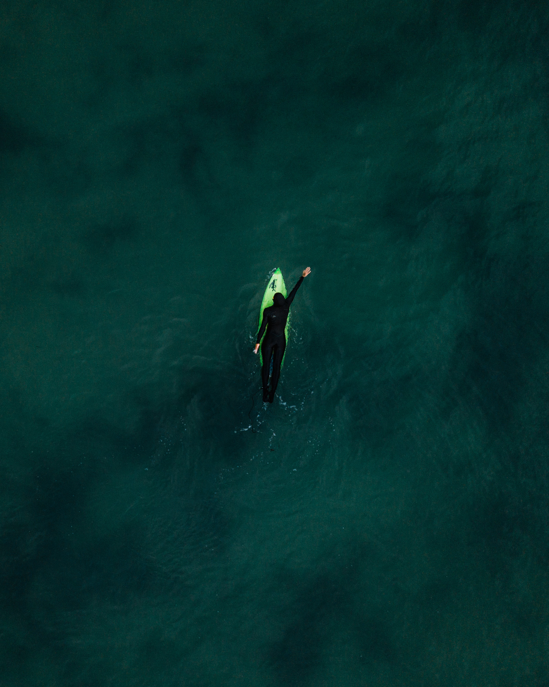
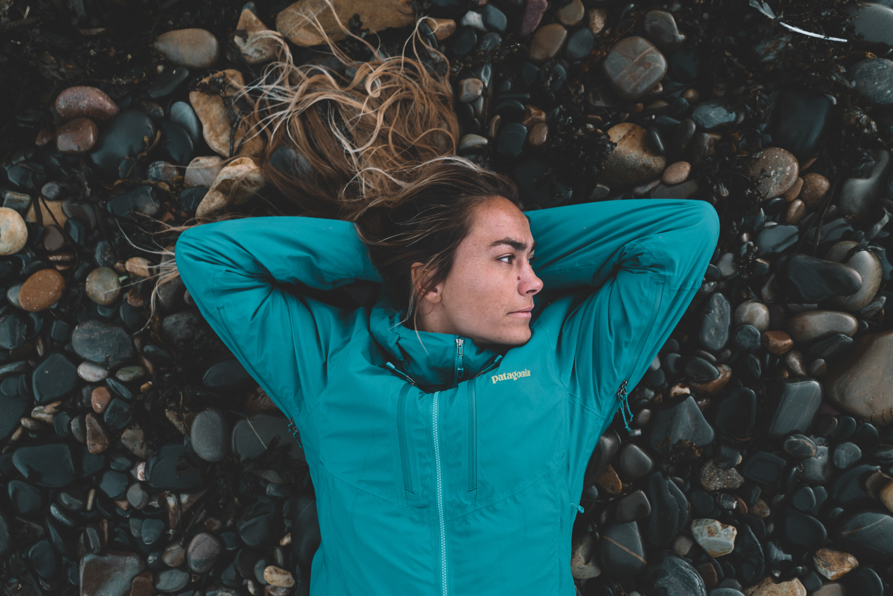
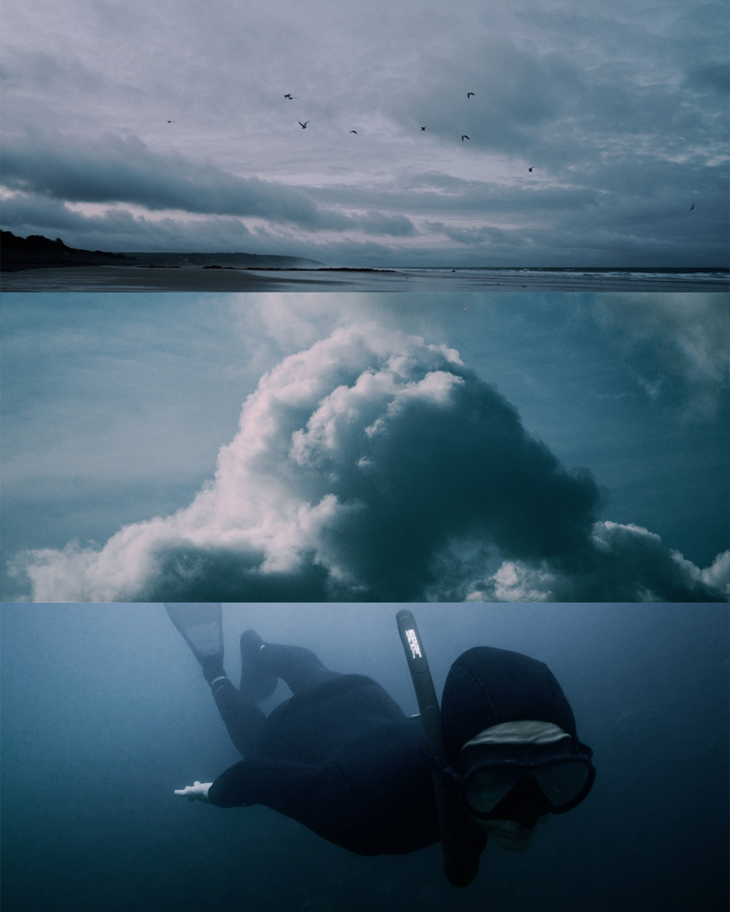
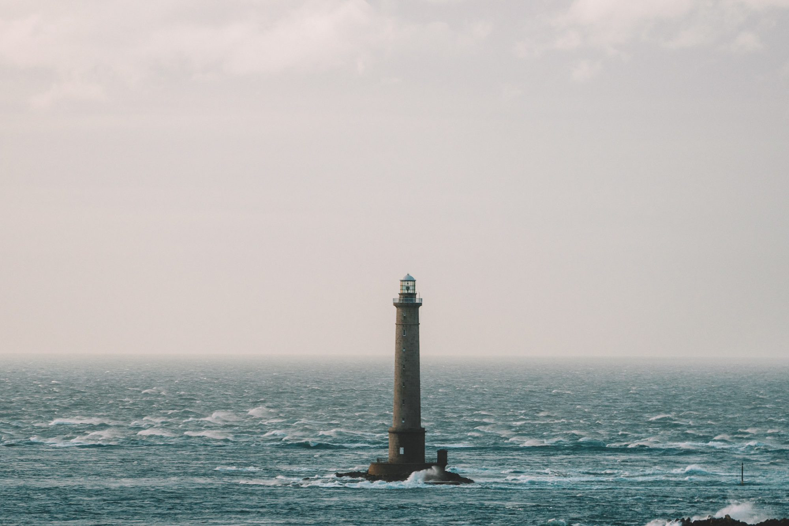
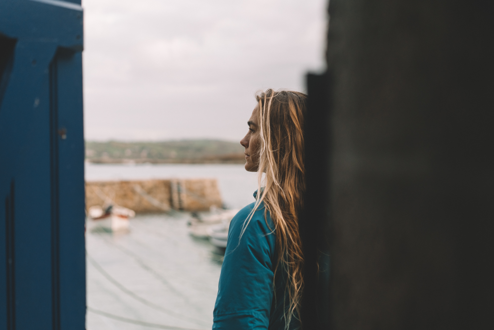
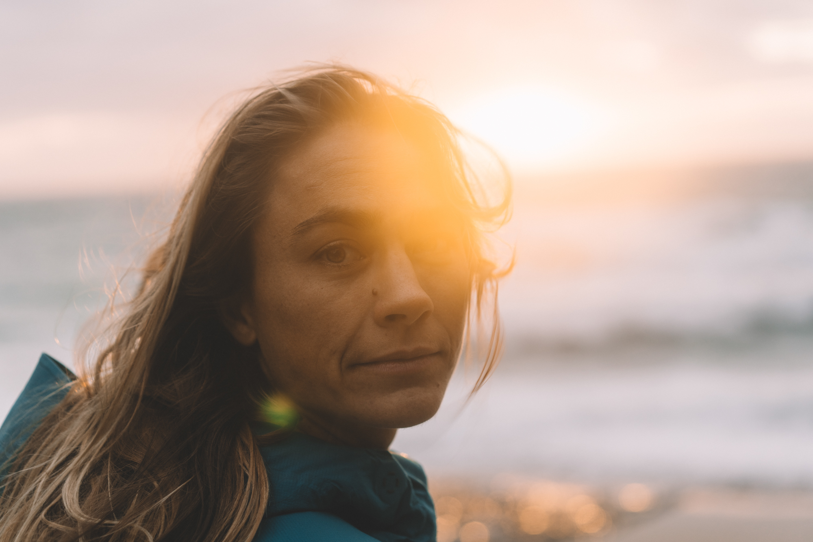

Comme vous le savez sûrement, j'ai co-fondé [Captain Yvon Studio](http://captainyvon.fr) avec mon compère de toujours, [Greg](https://gregorymignard.com/). Notre but est de donner envie de sortir en pleine nature, la protéger et y vivre des expériences uniques. Nous nous sommes toujours sentis proches de ces valeurs alors quand Latitude Manche, avec qui nous collaborons depuis plusieurs années, nous a proposé de réaliser un portrait de Léa Brassy, surfeuse, apnéiste et activiste... Il ne nous a pas fallu longtemps pour accepter ce projet de film. La vidéo est à voir en fin d'article.

Léa est une fille humble, passionnée et passionnante. On connait son nom depuis longtemps et l'idée de faire un projet avec elle nous trottait dans la tête depuis longtemps. On ne savait pas comment exactement, mais clairement on en parlait entre nous. Alors quand l'opportunité s'est présentée, on savait que c'était l'occasion à ne pas rater. Fin octobre, on est donc partis quelques jours dans la Manche où on a retrouvé Léa pour ce tournage.

Même si les conditions de surf n'étaient pas idéales, on était survoltés à l'idée de donner le meilleur de nous même dans le temps imparti dans le but de réaliser un portrait à la hauteur des attentes de Latitude Manche, mais surtout des nôtres. On se fixait la barre un peu haute mais on était motivés et d'attaques.

On est donc partis pour 3 jours de vanlife tous les 3, à rencontrer des locaux pour nous aider à avoir les bonnes conditions de surf et les meilleures opportunités pour notre film. On s'est vite décidé à filmer ce projet dans le Cotentin, notre coin préféré dans le département, pour ses paysages bruts et sauvages et la quiétude qui y règne. Les éléments étaient déchainés et mère nature nous a offert un sacré spectacle.

J'espère qu'elle vous plaira, de notre côté on en est fiers et il nous tarde de voir de quoi demain sera fait pour remettre ça un jour peut-être ?



Filmé avec :

Sony a7sII / Sony a7rII / [Sony a6300](https://amzn.to/2ZfXbli) [DJI Ronin SC](https://amzn.to/2MiPFQg) [Sony 28mm f/2](https://amzn.to/2s88oFh) [Sony 55mm f/1.8](https://amzn.to/2YqLYLJ) [Sony 70-200mm f/4](http://amzn.to/2kZ7zKM) [Rode NTG4+](https://amzn.to/3653O9A) [ZOOM H4n Pro](https://amzn.to/2E5EW5T)

Je vous laisse vous faire votre avis, n'hésitez pas à le partager en commentaire.

_Photos aquatiques : Greg Mignard_
