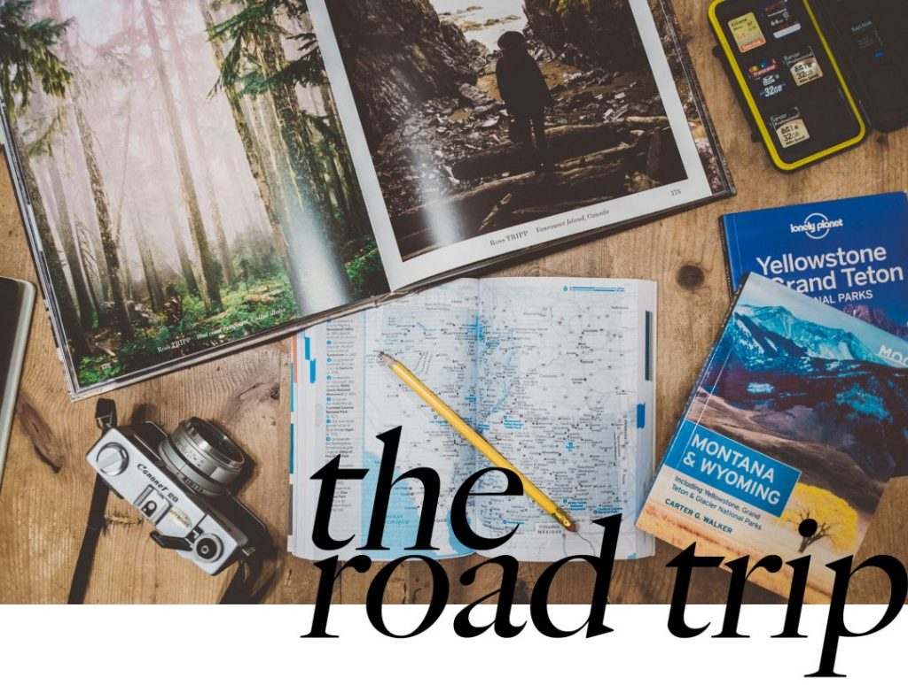

Préparer et partir en road trip aux USA c'est s'apprêter à être émerveillé par les paysages à chaque nouveau virage. Un road trip aux USA c'est goûter au plaisir de la route et découvrir un pays dont on entend tant parler et qui regorge de lieux incroyables qui vont vous éblouir. Après avoir passé 6 mois à parcourir l'Australie en van, je me suis laissé tenté par les USA pour poursuivre ma passion pour les road trips. Après plus de 15 000 miles cumulés sur les routes américaines que ce soit en longeant la côte Ouest de [Seattle](http://jeremyjanin.com/roadtrip-1-3-jours-a-seattle) à la [Californie](http://jeremyjanin.com/roadtrip-6-coup-de-coeur-pour-crater-lake), en découvrant les états du [Washington](http://jeremyjanin.com/roadtrip-us-de-retour-dans-le-washington-north-cascades-national-park) et de l'[Oregon](http://jeremyjanin.com/roadtrip-5-the-oregon-coast-direction-le-sud), ou en roulant à travers le Montana, l'Idaho, et le Wyoming. Aujourd'hui, j'ai décidé de partager mes conseils et mon retour d'expérience pour bien se préparer et partir en road trip aux USA. C'est depuis devenu mon mode de voyage préféré, chaque nouveau départ, la même excitation. Prendre le temps de rouler sans but, s'arrêter sur le bord de la route pour admirer le paysage, faire des photos et toucher du bout du doigt le mot liberté, à l'américaine !

_On a vu des [orques](http://jeremyjanin.com/roadtrip-2-voir-les-orques-a-san-juan-island), [dormi dans une cabane triangulaire dans le Washington](http://jeremyjanin.com/dormir-dans-une-cabane-dans-la-foret-des-central-cascades-usa/), suivi la Salmon river et poursuivi les ghosts town de la grande époque des USA et bien d'autres choses. Voici quelques conseils accumulés au fil des miles, mon expérience de la route pour vous aider à préparer votre prochain road trip._

**SOMMAIRE**

_L'article étant assez long, voici un sommaire pour aller directement vers la partie qui vous intéresse._

**PREPARER LE ROAD TRIP**

- [Comment planifier son itinéraire et son voyage aux USA ?](#ancre1)
- [Où louer sa voiture ou van de location pour un road trip aux Etats Unis ? Quelle assurance choisir ?](#ancre2)

**SE DEBROUILLER SUR PLACE**

- [Comment aménager une voiture de location pour dormir dedans ?](#ancre3)
- [Où et comment dormir pendant un road trip aux USA ?](#ancre4)
- [Conseils pour vivre en autonomie pendant quelques jours](#ancre5)

**INFOS PRATIQUES INDISPENSABLES**

- [3G, WiFi... comment accéder à internet pendant le voyage ?](#ancre6)
- [Road trip aux Etats Unis : les apps smartphones indispensables !](#ancre7)
- [Quel budget prévoir pour partir en road trip aux USA ?](#ancre8)

 

* * *

### **PARTIR EN ROAD TRIP AUX USA : COMMENT PLANIFIER SON VOYAGE ET SON ITINERAIRE ?**

 

* * *

**_L'itinéraire_**

Si vous avez envie de partir en road trip, il est probable que vous ayez déjà une idée de la destination suite à des images vues ou des échos d'autres voyageurs. Pour planifier mes roadtrips, en général, j'ai déjà l'idée de la région à cibler. Je suis fan du nord ouest américain pour ses forêts épaisses, l'ambiance mystique de la brume au petit matin, la diversité des paysages autour de la montagne, pour ses nombreuses rivières et lacs, mais je dois avouer l'aridité de l'Arizona, la côte californienne et plus généralement l'ensemble des USA me font de l'oeil. Pour se décider, les images jouent un grand rôle dans ma décision, que ce soit, [**Instagram**](http://instagram.com/djisupertramp), les vidéos ou encore Pinterest par exemple. Une fois la région ciblée, j'essaie de tracer une itinéraire approximatif sur **Google Maps** pour avoir un ordre d'idée de la distance et du temps de route qu'il impliquerait.

À partir de là, un guide voyage peut être top pour donner des infos sur des coins à voir, **[Roadtrippers](https://roadtrippers.com/)** est aussi un site vraiment pratique pour planifier ce type de voyage. On trace son trajet et le site se charge de nous renseigner à propos des lieux à voir autour d'un certain périmètre de notre trajet. Il permet aussi d'évaluer le temps de trajet global et par étape, et la consommation estimée d'essence. Très pratique pour estimer le budget carburant à l'avance et si l'itinéraire qu'on a en tête est réalisable dans le temps que l'on a sur place, attention à ne pas prévoir trop de temps de conduite quand même pour avoir le temps de profiter sur place et ne pas vous retrouver à avoir été trop gourmands et être frustrés de ne pas pouvoir plus en profiter.

À noter que les détours occupent une grande partie des voyages et ne doivent pas être négligés pendant les préparatifs. L'itinéraire s'affinera au fur et à mesure que les préparatifs avanceront et préparez-vous à le chambouler sur la route. Néanmoins, il est d'usage pendant les préparatifs de toujours rajouter une marge à la distance estimée, pour tomber dans la bonne fourchette. Les petits détours de quelques kilomètres se transforment vite en grandes distances. Par exemple, lors qu'on prévoit un road trip d'environ 3000km sur Roadtrippers ou Google Maps, je rajoute d'office 1000km au budget à ce qu'on a en tête. Ça c'est toujours confirmé jusqu'à présent puisque toutes nos estimations avec la marge ont systématiquement été proches de la réalité. Ça peut paraître beaucoup, mais finalement ça va très vite !

**_Les billets d'avion_**

Une fois qu'on a ciblé la région, on peut s'atteler à la réservation des billets d'avion. N'hésitez pas à comparer les tarifs d'un aéroport à l'autre, souvent un road trip peut être fait dans un sens mais aussi dans l'autre et si la différence de tarif est vraiment importante, ça peut valoir le coup de le re-penser légèrement. Par exemple, pour nos voyages dans le Nord Ouest américain, on a souvent comparé les tarifs entre l'arrivée d'un vol vers Seattle, San Francisco et même Vancouver (Canada), Vancouver étant à seulement 150km de Seattle. Finalement, pour chacun de nos périples, Seattle s'est toujours avéré être le moins cher mais, n'hésitez pas à comparer.

**_Les formalités d'entrée_**

En plus de l'habituel passeport en cours de validité, pour avoir le droit d'entrer sur le territoire américain, il vous faut également l'ESTA. C'est un formulaire à remplir en ligne qui délivre un visa valable 3 ans à partir de la date de demande. Il coûte 14$ et permet de rester 90 jours maximum par voyage sur le sol américain.

Attention aux arnaques, de nombreux sites cherchent à escroquer pour gagner de l'argent en facturant plus cher, voici le [site officiel du gouvernement de l'ESTA](http://esta.cbp.dhs.gov/esta/).

* * *

### **PARTIR EN ROAD TRIP AUX USA : LOUER SA VOITURE / VAN DE LOCATION**

 

* * *

Partir en road trip aux USA, c'est toucher du bout du doigt le rêve américain, goûter à la liberté qu'offre la route, s'arrêter où on veut, aller là où bon nous semble, être libre de voyager comme on l'entend. Voyager en voiture / van et dormir dedans ajoute une dimension supplémentaire au voyage et permet de dormir face à des vues incroyables, se garer à la lumière des phrares et découvrir le paysage au petit matin au petit déjeuner au lever du soleil, assis dans le coffre du van. Ah et la bonne nouvelle, c'est que l'essence n'est pas chère aux USA.

**_Louer une voiture / van_**

Ça y-est, l'excitation monte, vous avez pris vos billets et donc la date du voyage est fixée ! L'étape suivant consiste à réserver la voiture ou le van de location. Tout d'abord, sachez que le coût ne sera pas le même si vous prenez la voiture dans une agence d'une ville A et la rendez dans une ville B.Vérifiez les conditions d'une compagnie de location à l'autre, les écarts peuvent être décisifs dans un choix final. Par ailleurs, une agence ne peut jamais s'engager sur un modèle exact, c'est toujours pour une catégorie de véhicule, quoi qu'il en soit, assurez-vous d'opter pour un kilométrage illimité, c'est très souvent le cas, mais pensez à vérifier que c'est bien le cas sur le contrat de location. Pour la location de voiture, prenez le temps de comparer les tarifs chez tous les loueurs, les différences peuvent être assez hallucinantes parfois. Les plus répandus aux USA sont _Alamo, National, Avis, Hertz, Dollar ou encore Budget_, vous pouvez comparer sur leurs sites mais souvent les meilleurs tarifs se trouvent sur les comparateurs de voitures de location.

**Pour le type de voiture, plusieurs choix s'offrent à vous :**

- **Voiture de location (type compacte / berline)** **et nuit en motel / tente ou en louant chez l'habitant**.

L'avantage est que le coût de la location est inférieur au 2 options suivantes en revanche, le coût de l'hébergement en motel ou via location chez l'habitant se retrouve plus élevé. Si vous prévoyez de dormir en tente en plein été, ça peut être le bon plan économique en dormant dans les parcs nationaux et state parks.

- **Voiture de location (type familiale / van) et nuit dans la voiture.**

C'est ce que nous faisons à chaque fois en voyage. La location coute un peu plus cher qu'une compacte ou berline, en revanche, on bénéficie du confort de la grosse voiture familiale américaine type Chrysler Town & Country ou Dodge Grand Caravan pour conduire mais aussi, pour son côté spacieux pour le rangement et la nuit. La Town & Country et la Grand Caravan sont les deux mêmes modèles avec simplement une carrosserie et une marque différente, sinon ce sont les même chassis et les mêmes intérieurs. Leur grand avantage est qu'on peut coucher les sièges arrières pour qu'ils s'enfoncent dans le plancher de la voiture et ainsi être à plat pour dormir. Toutefois, il faudra s'équiper d'un matelas et sac de couchage pour dormir, mais pas de panique, c'est bien moins compliqué que ça n'y parait. Je détaille tout juste en dessous.

 

- **Van de location tout équipé / camping cars**.

Certaines sociétés proposent une offre toute inclus avec des vans ou camping cars de location qui intègrent le van, avec un lit déjà aménagé à l'arrière et une petite cuisine et quelques accessoires pour le road trip. La solution est plus onéreuse mais a le mérite d'être pratique et de ne pas avoir à se soucier de la logistique pour s'installer et dormir dans sa voiture.

Peu importe la solution, la saison à laquelle vous allez voyager sera cruciale pour savoir à quel point dormir dans la voiture sera ou non une bonne expérience. Pour une première fois, je vous conseille de privilégier les beaux jours pour ne pas avoir froid la nuit. Juin à septembre ne devrait pas poser de problème, mais encore une fois, les USA étant un pays vaste, pensez à vérifier les températures à la période où vous voyagerez. Quoi qu'il en soit opter pour une ou quelques nuits en motel, n'est pas très onéreux, est un plus pour un petit break confort avec une vraie douche et un vrai lit de temps en temps au milieu d'un road trip.

Si vous ne vous sentez pas de dormir en van / voiture, ça ne veut pas dire que le road trip ne vous convient pas. Au contraire, on trouve pléthore de motel / hotel sur la route, pour quand même profiter de la liberté qu'apporte la voiture mais avec le confort d'un bon lit la nuit.

**Quelles options choisir et refuser à la location?**

Une fois que vous avez choisi votre voiture, vient la proposition de toutes les options possibles et imaginables, que ce soit directement au comptoir de l'agence ou sur les sites internets. Assurance, GPS, plein du véhicule, siège auto, etc....

**L'Assurance**

Les mots sont un peu barbares mais ce n'est pas si compliqué. Les deux première sont obligatoires :

**CDW / LDW - Collision Damage Waiver / Loss Damage Waiver** : il s'agit de l'assurance collision et dommages sur le véhicule. Elle est indispensable, même si on croit qu'il nous arrivera rien, un demi tour un peu précipité en pleine nuit sur une petite route et le phare arrière qui vient embrasser le muret en pierre est très vite arrivé. Je ne l'avais pas prise et bien, bye bye les 150€.

**LI / TPL - Liability Insurance / Third Party Liability** : c'est la responsabilité civile de chez nous pour faire court. Pensez à vérifier le plafond de la couverture sinon une option est proposée pour augmenter - je vous la recommande chaudement. En cas d'accident avec des blessés ou en cas de passage devant la justice, les frais deviennent astronomiques et c'est cette assurance qui couvrirait.

Les autres assurances sont plus optionnelles et pour la plupart pour la protection de vos effets personnels en cas de vol par exemple. Pensez à vérifier aussi les détails de la couverture de votre carte bancaire si vous possédez une carte premium type VISA Premier ou Mastercard Gold. Je l'utilise énormément et c'est mon assurance de choix en voyage. Pour ma part, elle couvre une vaste majorité de mes besoins. Toutefois, je conseille quand même l'option du rachat de franchise au moment de la location, car souvent le coût de la franchise est divisé par 3 voire 5 grâce à cette option selon les loueurs et c'est non négligeable en cas de besoin de réparation du véhicule.

**Option second conducteur**

On est tenté d'en noter qu'un seul comme conducteur principal et de laisser le volant à l'autre de temps en temps, mais je vous recommande vraiment d'ajouter un deuxième conducteur sur le contrat de location. Les miles défilent vite sur un road trip et un coup de fatigue peut vite arriver, c'est toujours appréciable de pouvoir se partager la conduite. C'est à vous de voir.

**Rendre la voiture de location avec le réservoir vide ou plein ?**

D’un point de vue économique, préférez la rendre réservoir plein. Que vous louiez en centre ville ou à l'aéroport, on trouve très souvent des stations services autour de ces lieux, il est donc très facile de s'arrêter 5 / 10 minutes avant de rendre la voiture pour faire le plein. L’option réservoir vide est assez chère par rapport au prix du carburant dans une station service normale mais permet de ne pas se soucier de l’essence le dernier jour (quoi qu’il faille essayer d’arriver avec le réservoir le plus vide possible, ce qui n’est pas évident). Je vous conseille vivement de la rendre le réservoir plein, ça ne vous prendra que 5 minutes avant de la rendre mais vous ferez des économies par rapport à l'option.

* * *

  **R o a d** _**B o o k**_

_(Infos en vrac pour préparer et partir en road trip aux USA au volant d'une voiture)_

_Si vous voulez voyager entre deux pays - exemple : USA et Canada, pensez à vérifier que le contrat de location vous permet de faire entrer la voiture dans l'autre pays._

\-

_La nuit, peu importe la température, laissez un demi centimètre de fenêtre ouverte pour que l'air se renouvèle dans la voiture pour assurer une bonne circulation de l'air mais n'ouvrez pas trop, pour éviter toute visite incongrue pendant la nuit._

\-

_Arrivé à la pompe, vous ne savez pas si vous devez mettre du Unleaded ou du Diesel. La plupart des voitures de locations (même les grosses) sont en Unleaded (l'équivalent du Sans Plomb de chez nous), mais dans le doute, pensez à demander à l'agence de location avant de prendre la route. Sinon, l'info est souvent écrite dans la trappe à essence._

\-

_Dans certains états comme l'Oregon, on ne fait pas le plein soi même, on doit attendre qu'une personne vienne le faire pour nous. C'est la loi, ne cherchez pas à le faire vous même, la personne vous demandera si vous voulez faire le plein "fill up the tank" ou si vous voulez mettre un certain montant._

\-

_Conduire aux USA, c'est facile. Respectez les limitations et suivez votre bon sens, mais il n'y-a pas de difficulté particulière. En plus, la quasi totalité des véhicules de location sont équipés d'une boite automatique et du "cruise control" (limitateur de vitesse) : idéal pour conduire zen sur les longues lignes droites des highways._

 

* * *

### **PARTIR EN ROAD TRIP AUX USA : AMÉNAGER UNE VOITURE DE LOCATION POUR DORMIR DEDANS**

 

* * *

Si certains voyageurs aménagent un van avec toutes les commodités pour voyager avec à l'année, cette option ne convient pas pour une majorité d'entre nous puisque ça implique d'acheter le van.

Voici donc quelques conseils pour aménager facilement et à moindre frais une voiture de location sans faire de changement qui vous couterait la caution de la location. Evidemment quand on fait le choix de ce type de voyage, il en faut pas s'attendre au confort d'un vrai lit, mais on arrive tout de même à trouver son petit confort et surtout la liberté qu'apporte le fait de dormir où on le souhaite, fait bien vite oublier le confort sommaire d'une nuit en voiture.

Tout commence dès le départ, où il est préférable de partir avec des bagages souples type sacs à dos ou [Duffle Bags](https://www.amazon.fr/s/ref=as_li_ss_tl?_encoding=UTF8&camp=1642&creative=19458&field-keywords=duffle%20bags&linkCode=ur2&rh=i%3Aaps%2Ck%3Aduffle%20bags&tag=djisupe-21) plutôt que des valises qui seront rigides et occuperont beaucoup de place dans la voiture. Comme on l'a vu plus haut, pour prétendre pouvoir dormir dans une voiture de location sans devoir tout démonter, il faut privilégier une grande voiture familiale. Nous sommes toujours partis avec une _Chrysler Town & Country ou une Dodge Grand Caravan_. La surface intérieure du "lit" fait environ 1,25m de large par 1,80m de long (entre le coffre et les sièges arrières non repliables.) dans ces modèles.

Ce n'est pas assez large pour mettre un matelas pneumatique double et trop large pour un matelas pneumatique simple qui fait généralement 90cm de large. L'idéal serait donc un matelas pneumatique d'1m20 de large qui assurerait un confort optimal avec souvent plus de 15cm d'épaisseur et un vrai confort. Le revers de la médaille, c'est qu'il sera un peu plus encombrant et plus lourd qu'un matelas de randonnée, mais le confort sera nécessairement meilleur. Autre solution : les matelas de randonnée ! C'est ce que nous avons fait pendant 2 semaines dans le Montana et l'Idaho. Ils ont l'avantage d'être légers (< 500g) et très compacts et donc n'impactent en rien le poids limite de votre bagage en soute avec la compagnie aérienne. Ils sont très faciles à transporter en avion et c'est un vrai plus, la contrepartie, c'est un confort un peu plus spartiate comparé à un matelas pneumatique. Il faudra voir ce que vous préférez : portabilité et poids ou le confort.

**_A noter : Si vous mesurez plus d'1,80m, il faudra en revanche, envisager une taille de voiture au dessus, ou démonter la première rangée de sièges arrières (quelques boulons à dévisser, rien de très compliqué) qui ne peuvent pas se ranger dans le sol, pour les plaquer le plus possible contre les sièges avant et ainsi gagner facilement 20 à 30cm. Si vous le faites, pensez à les re-fixer avant de rendre la voiture à l'agence de location._**

En dehors de la première rangée de sièges arrières, qui eux se replient sur eux mêmes mais ne s'enfoncent pas dans le plancher, les autres rangées de sièges se replient et s'enfoncent dans le plancher pour former un sol complètement plat sur lequel on pourra venir installer le lit pour le voyage. On dispose d'abord une couverture toute simple ou couverture de survie comme couche isolante (les deux sont très faciles à trouver dans des magasins comme Walmart ou Target et ne coûtent presque rien.) sur laquelle on viendra ensuite installer le(s) matelas. Une fois les matelas installés et gonflés, on déroule les sacs de couchage, on préfèrera chacun dormir dans son sac de couchage si les températures sont fraîches ou alors les zipper ensemble pour les températures plus douces si vous êtes deux.

_Plus que les courses et... en route !_

Les sacs sont chargés dans la voiture, et vous avez déjà sommairement installé votre espace intérieur. Avant de tailler la route et vivre votre rêve, une première pause s'impose ! **Votre mission ? Faire des courses !** Eh oui, vivre sur la route, c'est aussi tâcher d'être autonome sur l'eau et la nourriture au maximum. Même si on aimerait s'arrêter goûter un burger chez Dusty's ou faire un break dans un petit resto de bord de route de temps en temps, avoir de quoi manger plusieurs repas et de l'eau est primordial. Pour faire les courses, les plus grands supermarchés aux États Unis sont **_Walmart, Target et Safeway._** On trouve toujours au moins l'un des trois dans une ville de taille moyenne. Et sinon de nombreux commerçants indépendants ou enseignes plus petites sont présentes le long de la route quand vous croiserez une petite ville ou une station service.

Pour l'eau, on vous conseille de [**prendre un bidon d'eau rétractable de 5L**](http://amzn.to/2tbxVZ6) qui est très compact et léger à emmener mais hyper pratique ! Et de **remplir des gourdes pendant le trajet.** Les gourdes ont l'avantage de tenir dans les portes gobelets de la voiture et d'être moins risquées qu'une bouteille avec le bouchon ouvert ou qu'une tasse. Il est primordial de toujours, **toujours avoir de l'eau**, c'est une denrée qui devient vite rare si on commence à se perdre ou si on veut rester un peu plus longtemps que prévu dans un endroit comme un parc national.

Pour la nourriture, **optez pour des produits qui se conserven**t bien sans être mis au frais. Notre repas type quand on veut se préparer nous, en road trip, ce sont des _miettes de thon en conserve, du maïs, des galettes de blé / maïs pour faire des fajitas par exemple et des tomates cerises._ Globalement, achetez ce que vous voulez mais qui se conserve bien à température ambiante. **Voici quelques exemples :** tomates cerises, conserves de thon, céréales, biscuits secs, pâtes, noodles, thé, lait en poudre (pas si mauvais finalement) et du cacao pour se faire du chocolat chaud grâce au réchaud : le petit luxe qui passe bien ! Et si vous voulez être plus local : **essayez le beef jerky** et les saucisses fumées séchées : une tuerie !

Pas besoin de faire un gros plein de courses, mais avoir de quoi couvrir quelques repas s'avère nécessaire. Globalement, **vous croiserez quasi toujours un endroit où acheter de la nourriture**, au pire il y-a les stations services. Mais si vous décidez de passer plusieurs jours dans un parc national par exemple, pensez à planifier la nourriture en amont car vous n' aurez pas un énorme _Walmart_ au milieu de **Yellowstone ou Glacier National Park.** (Et heureusement !)

Pensez aussi à acheter quelques petites babioles comme un briquet, une bonbonne de gaz pour le réchaud (car vous ne pourrez pas prendre l'avion avec l'une des vôtres), des lingettes pour se laver les mains, se débarbouiller, etc... De toute façon, si vous oubliez quelque chose, vous vous en rendrez très vite compte et vous trouverez toujours un endroit pour acheter ce qu'il vous manque aux États Unis.

* * *

### **PARTIR EN ROAD TRIP AUX USA : OÙ ET COMMENT DORMIR ?**

* * *

**_Pour une expérience insolite..._**

Dormir dans une cabane A-Frame au fin fond de la forêt du Washington ou dans un lieu unique, AirBnb et autres sites en regorgent si on cherche bien. Je vous invite à lire mon article ici pour trouver toutes les infos pour savoir où et comment [**dormir dans une cabane aux USA.**](http://jeremyjanin.com/dormir-dans-une-cabane-dans-la-foret-des-central-cascades-usa)

**_En motels et hotels..._**

Lorsqu'on s'arrête dormir en motel, on fonctionne souvent par rapport à la proximité de là où on se trouve. Si on est vraiment fatigués et qu'on ne sait pas où aller, on utilisera un comparateur d'hotel pour trouver l'hébergement qui nous convient. Mais il y-a des motels de partout aux USA, des plus ou moins glauques, mais c'est aussi ça qui fait le charme des USA.

**_En voiture..._**

Ça y-est la voiture est aménagée dans les grandes lignes, vous avez fait les courses : **que le road trip commence !**

Mettez le cap vers votre première destination, si vous avez opté pour un motel ou hotel, dans ce cas c'est simple, vous n'avez qu'à y aller :) Si vous avez opté pour le camping ou de dormir en voiture, que vous ayez déjà repéré un lieu où dormir à l'avance ou que vous y alliez au feeling, on finit toujours par trouver un endroit où dormir ! Si vous optez pour l'option dormir dans un parc type state park ou national park, n'oubliez pas de **prévoir du cash** au cas où la CB ne soit pas acceptée, même si c'est rare, ça peut arriver dans les petits parcs. Pour **une nuit en state park comptez de 10$ à 20$ la nuit** en moyenne, selon l'emplacement et la saison à laquelle vous voyagez. Pour les parcs nationaux, les tarifs fluctuent vraiment, le mieux étant d'anticiper et de regarder les tarifs sur le [site des parcs américains](https://www.nps.gov/index.htm).

Si un soir vous vous retrouvez à proximité d'une ville et n'avez pas de solution pour dormir, les parkings des supermarchés Walmart sont ouverts 24h / 24 et acceptent qu'on passe la nuit. Ce n'est pas le spot de parking rêvé mais si vous ne voulez pas dormir en hotel / motel, c'est une bonne solution à connaître.

En plus des State Parks et National Parks, il y-a aussi des espaces pour pouvoir dormir en pleine nature, [**freecampsites**](https://freecampsites.net/) est un bon site pour repérer ces endroits gratuits mais pas toujours à jour, donc prévoyez d'en repérer plusieurs dans un même périmètre. [Hipcamp](https://www.hipcamp.com/) est aussi une très bonne ressource - type AirBnb du camping, pour des lieux un peu plus insolites pour dormir en cabane dans les arbres par exemple ou trouver des spots de campings dans des lieux privés ou publics.

Vous avez trouvé votre spot de rêve pour établir votre camp pour la nuit ? Génial, vous êtes sur le point de goûter au bonheur de dormir dans un endroit reculé et pas dans une ville ou dans un hotel. La **LI-BER-TÉ** je vous dis !

**Assurez vous que la voiture est bien à plat.** Ca peut paraitre bête, mais il n'y-a rien de plus désagréable que de sentir que la voiture est en pente ou en dévers. **Petite astuce :** **téléchargez une app avec un niveau à bulle** dans votre smartphone, comme celle-ci. Utilisez un support téléphone qui se fixe sur une grille d'aération, placez-y votre smartphone avec l'app de niveau à bulle d'allumée et déplacez la voiture jusqu'à ce que vous soyez le plus à plat possible. Ça ne prend que 2 minutes, mais **ça changera beaucoup dans votre confort pour la nuit !**

Une fois que vous coupez le contact, profitez de votre dîner en regardant les orques le long de la côte ou admirez du coucher de soleil sur le lac face à vous. Vous devez être exténués de votre journée de voyage et il est tant d'aller au lit ! Votre plancher est bien à plat et le lit déjà sommairement installé, il ne reste plus qu'à vous mettre au lit. Le petit rituel du soir et du matin se met très vite en place, une fois qu'on a trouvé un endroit où dormir, on prépare l'arrière de la voiture en basculant les sacs sur les sièges avant pour libérer l'espace arrière, en ne gardant à l'arrière que le nécessaire pour la nuit et le petit matin, et tout ça avant qu'il fasse nuit. Ne laissez pas vos chaussures dehors même en plein été, et surtout ne laissez pas de nourriture à l'extérieur de la voiture, sans quoi ça sera la visite assurée de plus ou moins gros animaux pendant la nuit.

* * *

 _**L ' A N E C D O T E**_

_Je reverrais toujours la tête de Samantha en allumant la frontale et en voyant un raton laveur en train de faire du toboggan sur le pare brise de la voiture en pleine nuit avec un sac de nourriture oublié sur le toit de notre voiture dans un state park du Washington. :) Ce n'est pas bien méchant, mais il aurait pu abimer la voiture de location par exemple !_

_En version, grosse frayeur, en Australie, avec cette erreur de l'un de mes compagnons de voyage, d'avoir laissé trainé des épis de maïs dehors, un alligator s'est fait un plaisir de venir les déguster pendant 30min en début de nuit : coup de stress ! Donc ne laissez pas de nourriture à l'extérieur de la voiture !_

* * *

Pendant la nuit, **gardez toujours les clés de la voiture vers vous**, pensez à la fermer à clé, cachez au maximum les objets de valeurs. Coincez votre serviette de toilette dans le joint autour du pare-brise arrière ou sur les vitres latérales pour vous protéger des éventuels regards extérieurs et du soleil au petit matin.

**Au réveil, on ouvre tout en grand pour aérer** la voiture et se débarrasser de la condensation. C'est l'occasion de prendre son petit dej' et de faire un brin de rangement, re-remplir les bouteilles d'eau, basculer les sacs de l'avant vers l'arrière et mettre les voiles pour une nouvelle journée sur la route. **On the road again !**

Si vous vous réveillez sous la pluie, entrouvrez légèrement les fenêtres et faites tourner la ventilation à fond pendant quelques minutes. Pensez à aérer la voiture dès que la pluie se sera arrêtée.

* * *

### **PARTIR EN ROAD TRIP AUX USA : VIVRE EN AUTONOMIE PENDANT QUELQUES JOURS**

 

* * *

L'un des autres avantages de partir en voyage en voiture est qu'on a jamais à porter toutes ses affaires, sauf à l'aéroport. Partant du principe, où je voyage avec un drone et pas mal de matériel photo, c'est un vrai plus d'avoir un sac dédié à ce matériel **pour tout garder organisé**. Il faut aussi **prévoir de quoi charger sur la route et être autonome au niveau courant.** On évitera à tout prix de charger des appareils sur la batterie de la voiture quand celle-ci n'est pas en marche. Outre les très connus chargeurs allume-cigare, nous avons opté pour une solution très efficace pour garder tous les appareils chargés : un **convertisseur électrique**. C'est un appareil qu'on branche sur la prise allume cigare de la voiture et qui convertit le courant électrique et offre une ou plusieurs sorties en prise de courant normale et souvent quelques ports USB. On l'utilisera uniquement quand la voiture est en marche et on pensera à l'éteindre à chaque fois qu'on gare la voiture pour éviter de pomper la batterie.

Pour ma part, je pars systématiquement avec ce convertisseur de courant, **un adaptateur de prise USA > France et une multiprises** pour charger plusieurs appareils à la fois. Optez pour un convertisseur assez puissant et **évitez les 100W** par exemple qui n'auront pas la capacité de charger plusieurs appareils de manière performante. On a opté pour **un 450W, il me permet de charger en roulant : mon iPhone, une batterie de drone et mes batteries de reflex.** En plus de ça, j'ai toujours une b**atterie externe USB avec une grande autonomie** (7 cycles de charges) qui me permet de charger mon téléphone, mes batteries de reflex / GoPro et globalement, tout ce qui peut se charger via un cable USB, si, on a peu roulé pendant une journée et quand même avoir de la batterie.

Outre le courant électrique, avoir des vivres pour plusieurs repas est primordial comme je l'ai expliqué plus haut. Avoir 5L d'eau et de la nourriture n'est pas un luxe, c'est juste nécessaire car vous ne saurez jamais ce que vous trouverez plus loin. Si la route que vous prévoyiez de prendre est fermée et déviée ou si finalement la ville que vous attendiez s'avère beaucoup plus petite que ce que vous attendiez, vous devez pouvoir faire face à la situation. Ça ne veut pas dire, trop prévoir, je pense que **le bon sens l'emporte toujours dans ce genre de situation.**

Si vous dormez en motel ou hotel, vous n'aurez pas de problème de douche. Toutefois si vous dormez dans des parcs, souvent **vous aurez accès aux sanitaires douche / wc des parcs** mais selon les endroits, il peut ne pas en avoir. Ce n'est pas rare en roadtrip de se retrouver à ne pas pouvoir se laver pendant 2 jours de suite, mais ça fait partie de l'aventure n'est-ce pas ? Et puis ça renforce un couple ! :) Quand vous ne trouvez pas de douche car vous avez dormi dans un endroit qui n'en possédait pas, pensez à **demander aux piscines municipales, en l'échange de quelques dollars, vous pourrez très souvent prendre votre douche dans les douches de la piscine.** Sinon posez la question à la réception d'un motel, ou du prochain State Park que vous croiserez.

Quand vous croisez un supermarché comme _Safeway, Walmart ou Target_, ils ont tous des toilettes et vous pouvez très aisément y rentrer même sans acheter de produit pour aller aux toilettes.

* * *

### **PARTIR EN ROAD TRIP AUX USA : CARTE 3G, WiFi PUBLICS... COMMENT ACCÉDER À INTERNET PENDANT LE VOYAGE ?**

 

* * *

**Le WiFi gratuit est partout aux USA** : _Starbucks, McDo, Target, Walmart, Safeway_ et j'en passe. Si pour notre premier roadtrip, on avait décidé d'acheter une carte sim 3G, on s'est très vite aperçus qu'elle ne captait pas souvent hors des villes et que finalement on utilisant plus souvent les WiFi publics des grandes enseignes. Pour les autres voyages, on a décidé de n'utiliser que ces réseaux WiFi et ça fonctionne très bien. En dormant en motel, pensez à vérifier qu'il possède une connexion WiFi et le tour est joué. Au delà, des mails et réseaux sociaux, **la connexion WiFi est relativement indispensable pour planifier tous les 2 ou 3 jours,** les jours qui suivent sur le road trip. Vérifier que les routes sont toujours ouvertes si vous voyagez hors saison, la météo, etc... En novembre 2015, alors que nous prévoyions d'aller passer quelques jours à Yellowstone National Park et Grand Teton NP, nous avons appris dans un visitor center de l'Idaho, que les routes menants aux deux parcs étaient fermées. On a pu vérifié l'info quelques heures plus tard dans un motel du Montana et trouver une solution pour re-planifier la suite de notre itinéraire.

    

* * *

### **PARTIR EN ROAD TRIP AUX USA : LES APPS SMARTPHONES ET LES INDISPENSABLES POUR LE VOYAGE**

 

* * *

**INFOS EN VRAC**

- [**Roadtrippers**](https://roadtrippers.com/) est un incontournable pour préparer et partir en road trip aux USA, on peut tracer son itinéraire dans les grandes lignes, suivre son itinéraire pendant le voyage depuis son smartphone, faire des modifications et profiter de son côté guide de voyage intégré hyper pratique.
- [**HERE**](https://wego.here.com) c'est une application comme _Google Maps_ mais qui permet de synchroniser des itinéraires en hors ligne si vous n'avez pas de connexion internet 3G.
- [**Gas Buddy**](https://www.gasbuddy.com/) pour trouver les tarifs d'essence les moins chers.
- [**Star Walk 2**](http://vitotechnology.com/star-walk.html) pour se repérer dans le ciel étoilé, retrouver les constellations, la voie lactée et bien d'autres, pour cadrer ses photos de nuit correctement au milieu de l'arrière pays américain.

 

**MATÉRIEL À PRÉVOIR** _(en plus de vos affaires habituelles)_

- **Lampe frontale,** [comme celle ci](http://www.amazon.fr/gp/product/B00UAJ2CXO/ref=as_li_tl?ie=UTF8&camp=1642&creative=19458&creativeASIN=B00UAJ2CXO&linkCode=as2&tag=djisupe-21) par exemple, qui a une très bonne autonomie, est abordable et très pratique à transporter partout. C'est indispensable d'en avoir une ne serait-ce que pour s'éclairer pour aller aux toilettes en pleine nuit, fouiller dans un coin de la voiture parce qu'on a perdu les clés sous le siège.... On peut aussi l'accrocher à la poignée au plafond au dessus des vitres pour la transformer en petite lumière d'intérieure le soir.

 

- [**Support téléphone grille d'aération**](http://amzn.to/2tKO3CI) + cable jack pour la playlist, le GPS interne, la musique. J'avais d'ailleurs fait une [**playlist Spotify**](https://open.spotify.com/user/iforgotzemayo/playlist/1yNKJQpGkKzWDCh3JUjlGZ) dédiée aux road trips.

 

- Serviettes microfibres, elles sont très compactes et sèchent très rapidement, c'est un must quand on a pas la possibilité de les étendre pendant des heures comme à la maison. Elles sont abordables et se trouvent dans n'importe quel magasin de sport. Très utiles aussi pour se cacher des regards extérieurs pour la nuit dans la voiture.

 

- **Convertisseur électrique**, [comme ce modèle](http://www.amazon.fr/gp/product/B00GINASFA/ref=as_li_tl?ie=UTF8&camp=1642&creative=19458&creativeASIN=B00GINASFA&linkCode=as2&tag=djisupe-21) par exemple. Celui c'est un MUST. On a opté depuis plus de 2 ans maintenant pour un convertisseur électrique et ça nous change la vie. Le convertisseur permet de transformer le courant qui arrive par la prise allume cigare pour le réguler à la bonne puissance pour vos appareils électriques le tout avec une sortie en prise classique. Dès qu'on décide de préparer et partir en road trip aux USA, c'est le premier accessoire qu'on ajoute à notre liste. Il nous permet de charger nos smartphones, ordinateurs portables, drone, appareils photos et tout les appareils électriques pendant qu'on roule. On en trouve à tous les prix mais il vaut mieux prévoir une puissance assez élevée (évitez les 100W qui ne chargeront pas grand chose en dehors de vos téléphones). On a opté pour un 400W et je n'ai aucun problème pour charger mon ordinateur portable en même temps que mon drone et mon appareil photo. Aujourd'hui, la plupart arrête de consommer de l'énergie de la voiture dès que le moteur est coupé mais dans le doute, assurez vous de bien le débrancher quand vous éteigner le contact pour éviter de vous retrouver avec une batterie de voiture à plat.

 

- **GPS** : Celui là aussi est un _must_. On est fans de cartes papiers mais malgré tout, je ne me vois plus partir sans le GPS. Les apps smartphones peuvent fonctionner suivant où vous êtes mais je préfère le confort d'un GPS, on est assuré qu'il captera un signal de partout et de nous amener à destination. Le GPS me parait indispensable en ville d'ailleurs. Les routes américaines en ville peuvent être un vrai labyrinthe, on tend toujours à avoir un petit stress à la sortie de l'agence de location pour vite s'évader et sortir de la ville et pouvoir compter sur le GPS pour ça c'est vraiment top. En dehors des villes, pour trouver une station service ou un supermarché aux alentours, ça aide aussi. Bref, je recommande vivement d'en acheter un avant le départ avec une carte amérique du nord intégrée (vous pourrez toujours acheter les cartes européennes à votre retour pour l'utiliser en France et en Europe. De mon côté, j'utilise un [TomTom avec un écran 5"](https://www.amazon.fr/TomTom-Pouces-Cartographie-Trafic-1FA5-002-52/dp/B00XHFV8VK/ref=sr_1_2?ie=UTF8&qid=1463258023&sr=8-2&keywords=gps+carte+usa) pour un vrai confort de lecture sur la route. C'est un investissement avant le départ mais quand on voit que les agences de locations facturent autour de 70$ la semaine de location de GPS, le calcul est vite fait, on part rarement moins de 10 jours / 2 semaines en road trip aux USA donc le calcul est très vite fait.

 

N'oubliez pas de charger de la musique dans votre smartphone ou d'utiliser un service de streaming de musique hors ligne, bouclez votre ceinture, gardez l'appareil photo à portée de main, les pieds sur le tableau de bord et _on the road again!_

   

* * *

### **PARTIR EN ROAD TRIP AUX USA : QUEL BUDGET ?**

 

* * *

Établir un budget au moment de préparer et partir en road trip aux USA n'est pas toujours simple, tout dépend le type de voyage pour lequel vous optez et votre niveau d'exigence en terme de confort et restauration. Voici une fourchette par activités / prestations / produits pratiqués aux USA pour vous aider à préparer votre budget.

**Transport**

**Voiture de location** : comptez minimum 30$ / jour de location pour une voiture compacte, si vous optez pour un véhicule type familiale comme décrit plus haut pour dormir dedans, comptez plutôt autour de 70$ par jour.

**Essence** : 150$ environ pour 2000 km avec une voiture familiale.

**Hébergement**

**Camping (voiture de location / tente)** : en moyenne **20$ / nuit** dans les State Parks, **40$ / nuit** dans les Parcs Nationaux en général. Vous pouvez vérifier les tarifs sur le [site du gouvernement des National Parks et State Parks](https://www.nps.gov/index.htm).

**Motel :** 60 $ la chambre par nuit environ.

**Hotel :** + de 100$ la chambre par nuit

**Nourriture**

**Burger / Fast foods :** Menu autour de 8 / 10$ (burger / frites / boissons)

**Plats préparés aux supermarchés :** 10$ environ _(Souvent de la nourriture asiatique. Gros coup de coeur pour le "Shanghai Meal" (beignets, riz cantonnais, nems, boeuf,....) de Safeway qui coûte 9,90$ et on peut manger à 3 ou 4 personnes dessus.)_

**Brasserie / auberge :** 20 / 30$ par personne

**_Budget total sur place : compter un budget minimum de 70$ / jour / personne et plutôt autour de 120$ / 130$ / jour / personne pour être un peu plus libre pour la nourriture, loisirs, entrées dans les parcs, etc..._**

**ON THE ROAD NOW!**
