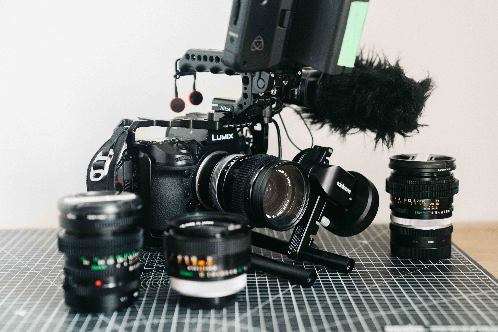
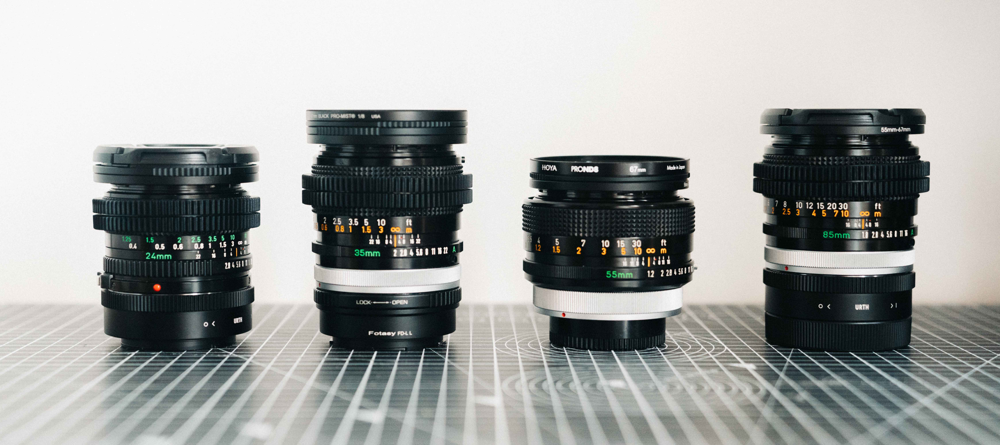
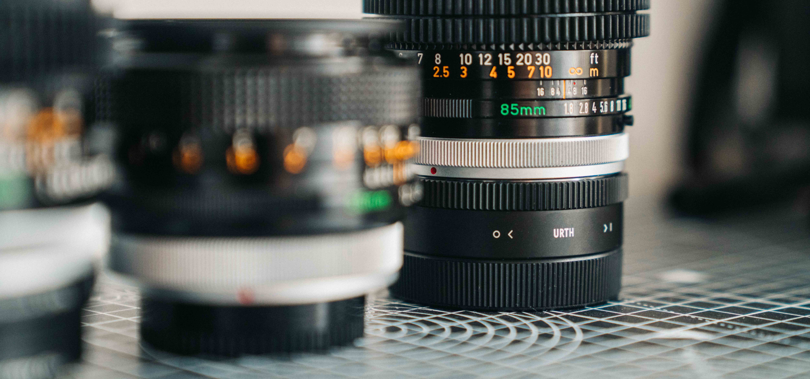
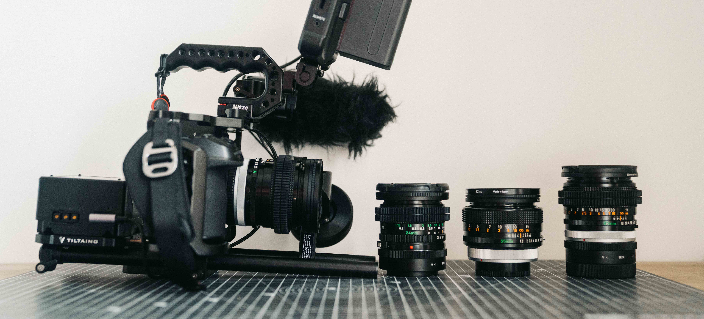

Trouver le bon adaptateur d'objectif pour monture L à monter sur les boitiers Panasonic LUMIX S1, S1R, S1H et S5 ainsi que le Sigma FP et Leica SL n'est pas toujours évident. On trouve tout et son contraire et parfois les différences sont minces entre les adaptateurs pour monture L. La confusion se crée avec notamment les autres noms comme S/LT, T, Leica M... Au fil de mes recherches, j'ai fini par trouver pas mal de réponses et j'ai décidé de compiler tout ça dans cet article d'abord comme une liste pour moi si un jour j'ai besoin de commander, la recherche sera faite. Je me suis dit que ça pouvait être chouette de la partager avec tout le monde si ça peut rendre service à la communauté, vu comme j'ai parfois galéré à trouver les bons adaptateurs pour monture L.

À savoir : il y-a des bagues avec connexion électronique comme la [Sigma MC-21](https://amzn.to/30Nwns6), qui permettent d'utiliser l'ouverture et l'autofocus, toute fois elles ne permettent pas de garder l'autofocus continu. Le seul moyen d'avoir l'autofocus est d'investir dans des objectifs natifs Panasonic ou Leica en monture L.

### Comment bien choisir un adaptateur pour objectif en monture L ?

Attention aussi à ne pas confondre la monture Leica L pour les Panasonic S1 / S5, Leica SL et Sigma FP avec la monture Leica M qui elle est prévue pour les appareils photos argentiques Leica. Pour les différencier, quand vous commandez un adapteur d'objectifs pour monture L, assurez vous bien que c'est bien stipulé vers monture Leica L ou qu'il y-a écrit vers SL/T. Dans ce cas là, ça sera compatible. En revanche, n'achetez jamais un adaptateur d'objectifs où il y-aurait écrit "Leica M L/M" car ceux là ne sont pas compatibles avec la monture L, mais uniquement avec la monture M. Croyez moi, j'ai testé.

### Quel adapteur d'objectif pour monture L j'utilise sur mon Panasonic S1 ?

Pour ma part, depuis que [j'ai quitté Sony pour Panasonic](http://jeremyjanin.com/matos-photo-video-pourquoi-jai-quitte-sony-pour-le-panasonic-s1/), j'utilise essentiellement des objectifs Canon FD sur mon [LUMIX S1](https://www.digit-photo.com/PANASONIC-Lumix-S1-Boitier-Nu-rPANASONICDCS1EK.html?dpa_id=21), j'ai essayé plusieurs bagues, je suis très satisfait de la marque URTH. J'utilise aussi l'adaptateur d'objectif pour monture L de marque Fotasy mais qui n'est presque plus trouvable sur eBay avec livraison en France. J'ai aussi essayé plusieurs autres marques pour d'autres montures comme Fotasy, Fotodiox et autres. J'ai longtemps été adepte de la marque "Gobe" aujourd'hui renommée "Urth" pour leurs filtres UV et ND avec en bonus leur engagement pour la planète. J'ai depuis découvert qu'ils font aussi des adaptateurs d'objectifs pour monture L. Elles sont vraiment de bonne facture et je ne sens aucun jeu une fois montée sur mes objectifs Canon FD, M42 ou Nikon F.

Par chance, ils conçoivent cette bague pour énormément de monture et c'est pour ça que vous les retrouverez souvent dans ce tableau ci-dessous. Je vous conseille d'éviter les bagues sans marques, j'ai eu quelques mauvaises expériences et pas mal de jeu. Celles pour lesquelles je peux attester de leur bon rapport qualité / prix sont listées ci-dessous :

### Adaptateur d'objectif pour monture L pour Panasonic S1, S1H, S5...

- <a href="https://amzn.to/30Nwns6" target="_blank" rel="noopener">Canon EF vers Monture L — Sigma MC-21 sur Amazon</a> / <a href="https://www.digit-photo.com/SIGMA-Bague-d-Adaptation-MC-21-pour-Canon-EF-vers-Monture-L-rSIGMA89E969.html?dpa_id=21" target="_blank" rel="noopener">Digit Photo</a>
- <a href="https://amzn.to/3iJat2I" target="_blank" rel="noopener">Canon FD vers Monture L — URTH</a>
- <a href="https://amzn.to/2TYRp6k" target="_blank" rel="noopener">Contax CY vers Monture L — URTH</a> / <a href="https://amzn.to/3iIt9Qj" target="_blank" rel="noopener">Fotodiox</a>
- <a href="https://amzn.to/3pYPXNs" target="_blank" rel="noopener">Leica M vers Monture L — URTH&nbsp;</a>
- <a href="https://amzn.to/35p7mVO" target="_blank" rel="noopener">Leica R vers Monture L — URTH</a>
- <a href="https://amzn.to/3gqoTDz" target="_blank" rel="noopener">M39 vers Monture L — URTH</a>
- <a href="https://amzn.to/35mqsMn" target="_blank" rel="noopener">M42 vers Monture L — URTH</a> / <a href="https://amzn.to/3gCBP7Z" target="_blank" rel="noopener">AMOPOFO</a>
- <a href="https://amzn.to/3gzvv1b" target="_blank" rel="noopener">Minolta MD vers Monture L — URTH</a> / <a href="https://amzn.to/30M1HHE" target="_blank" rel="noopener">AMOPOFO</a>
- <a href="https://amzn.to/3cIQcXp" target="_blank" rel="noopener">Nikon F vers Monture L — URTH&nbsp;</a>
- <a href="https://amzn.to/3vvOwH7" target="_blank" rel="noopener">Pentax K vers Monture L — URTH</a>
- <a href="https://www.ebay.com/itm/PL-mount-lens-to-L-mount-Sigma-FP-Panasonic-S1H-Leica-SL2-adapter-c7adapters/252322326925?_trkparms=aid%3D111001%26algo%3DREC.SEED%26ao%3D1%26asc%3D225085%26meid%3D16e35b30e07a4913ab5af7af39a4be76%26pid%3D100667%26rk%3D1%26rkt%3D4%26mehot%3Dpp%26sd%3D252322326925%26itm%3D252322326925%26pmt%3D0%26noa%3D1%26pg%3D2334524&amp;_trksid=p2334524.c100667.m2042&amp;LH_ItemCondition=33" target="_blank" rel="noopener">Monture PL vers Monture L — C7 adapters sur eBay</a>

Pour prolonger la lecture, je vous invite à lire mon article sur les [filtres Tiffen Black Pro Mist](http://jeremyjanin.com/filtre-tiffen-black-pro-mist-lequel-choisir/) que j'utilise énormément sur mes objectifs.
