Samedi dernier, j'ai fait une journée marathon express à Grenoble pour partir en randonnée avec la talentueuse [Lisebery](http://lisebery.com). Je me suis réveillé aux aurores pour attraper le premier train direction Grenoble. A peine arrivé, Elise m'attend à la gare et on file vers les montagnes pour notre objectif du jour. On a profité de cette dernière journée avant qu'elle ne déménage pour de bon à Paris pour se retrouver et partir dans un endroit où on aime se reposer : la montagne.

Plutôt habitué aux paysages du massif du Mont Blanc et des aiguilles rouges, j'ai sauté sur l'occasion pour foncer avoir un aperçu du massif de la Chartreuse avec ma guide d'un jour. On a embarqué nos appareils photos et le pic nic, direction le Col de l'Alpe.



Pour sa dernière randonnée, je savais qu'elle tenait à voir le drone voler. J'ai donc embarqué mes 5kg de matériel de drone avec en tête de tourner une vidéo pour qu'elle garde un souvenir intacte de ses montagnes où elle vient si souvent. On a avalé les mètres de dénivelé pour en boucler près de 800 et arriver en haut sous un météo de dingue face à un paysage grandiose. J'ai lancé le timelapse le temps de manger, on a admiré les nuages sortir des sommets en face de nous, on a fait des photos et surtout on s'est bien marrés. Je vous laisse avec les images de notre périple d'un jour au coeur du parc de la Haute Chartreuse.

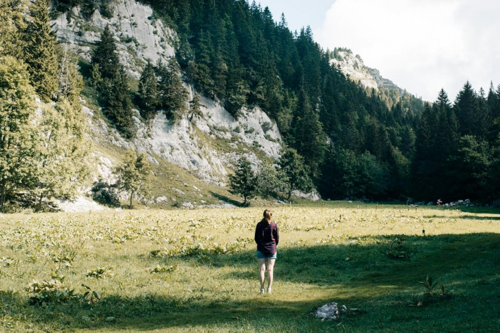 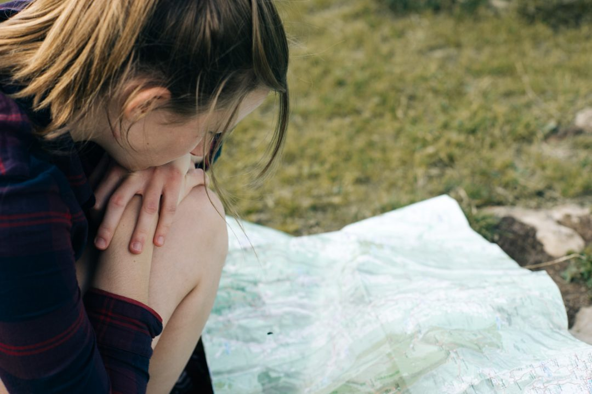 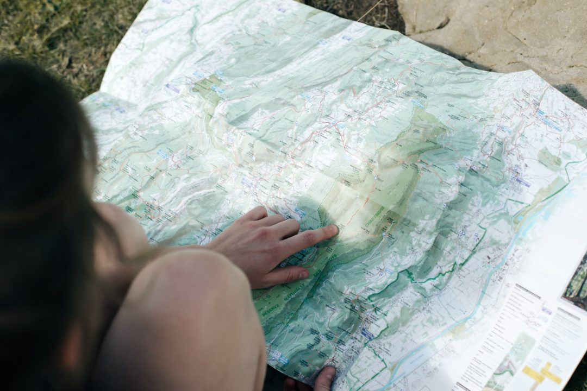 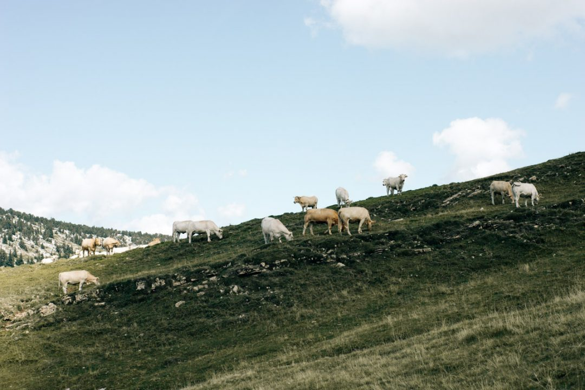 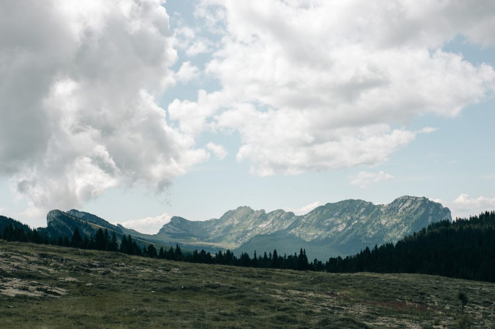 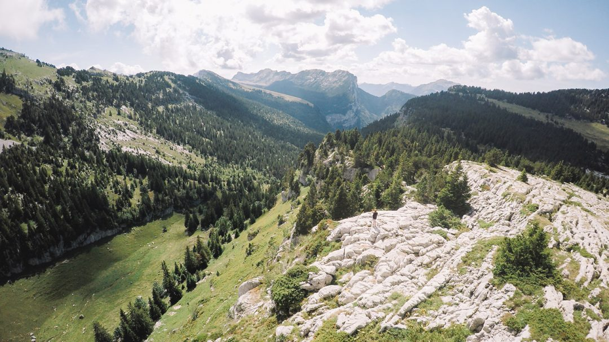 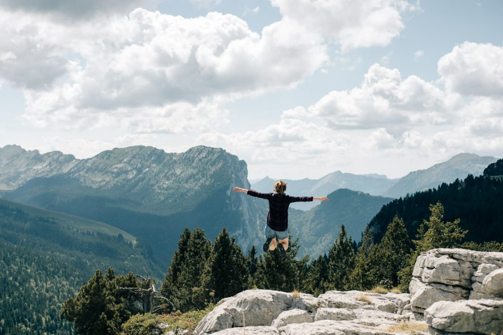 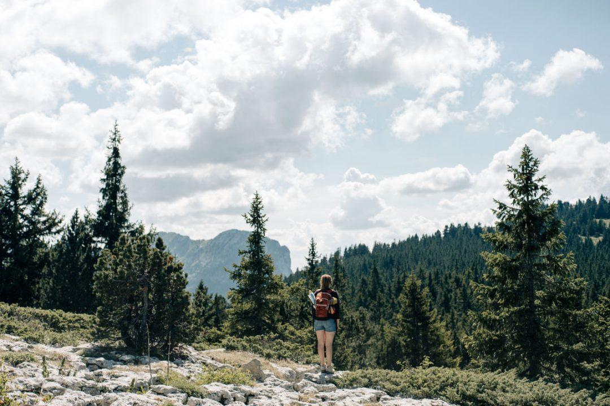 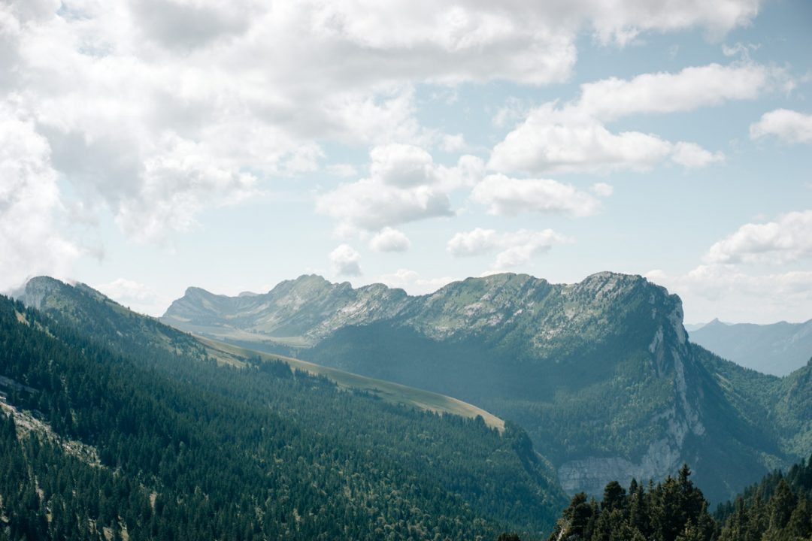 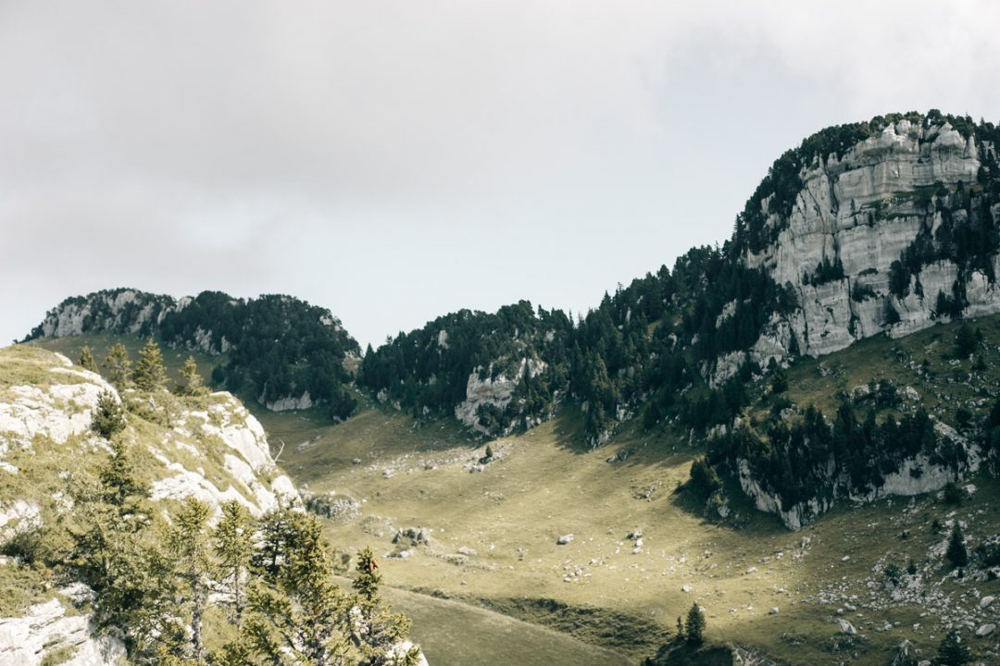 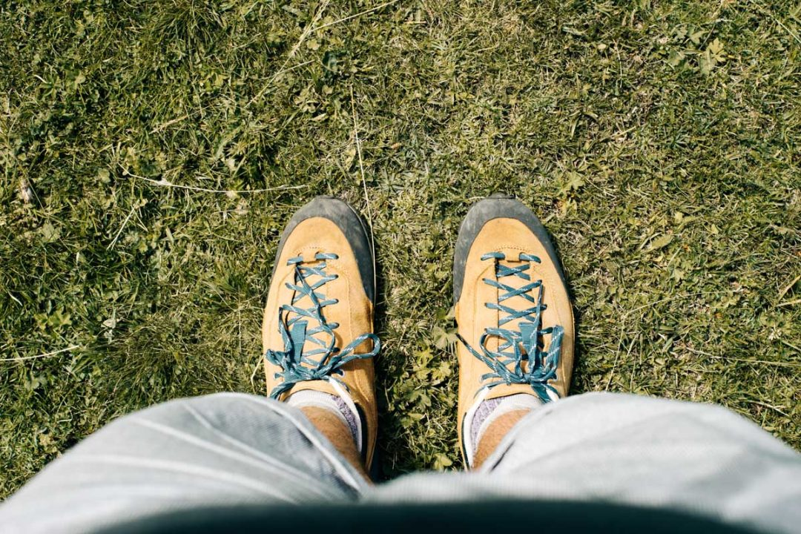 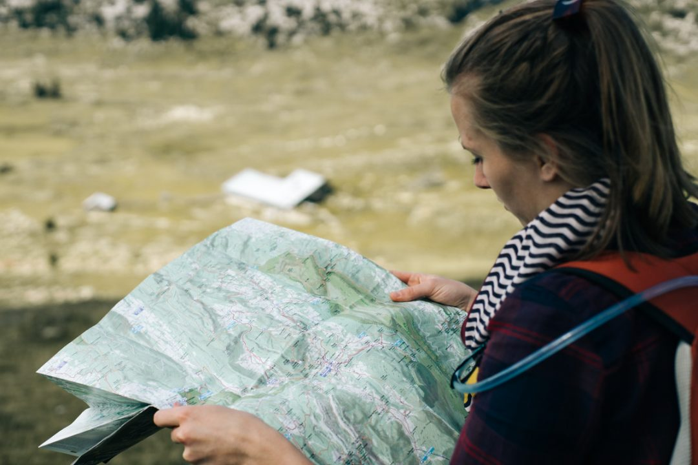 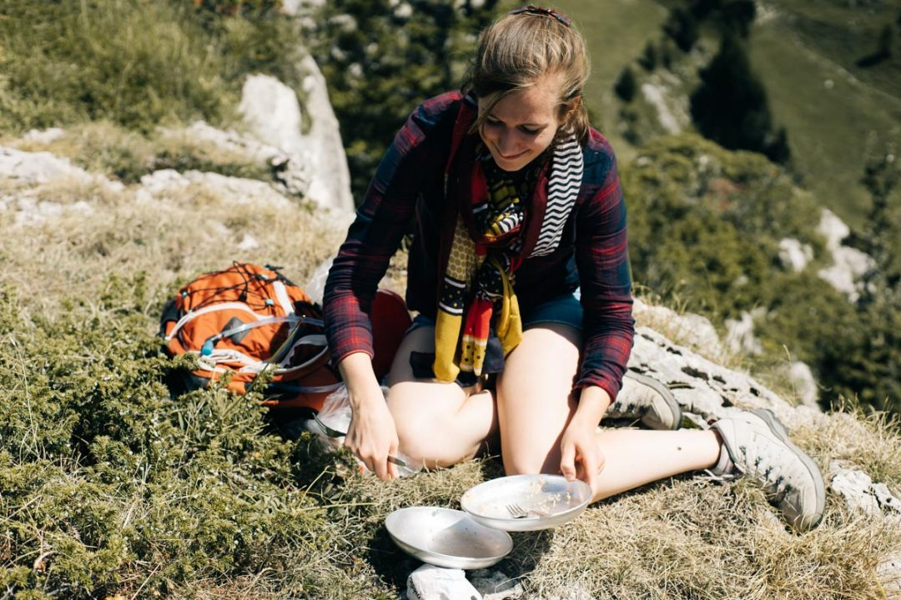 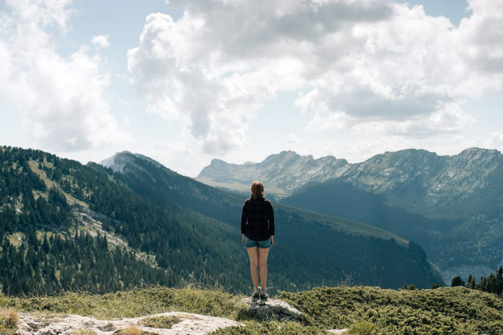 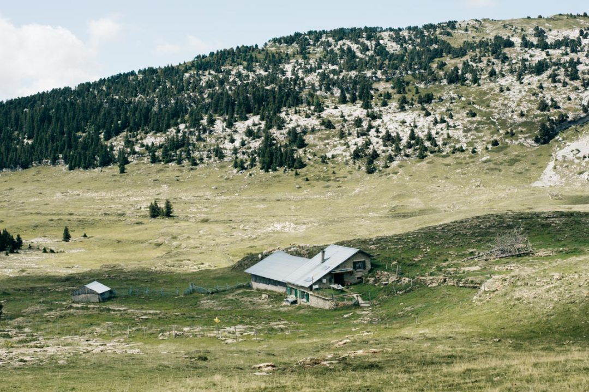

Merci pour cette chouette journée Elise. Je vous conseille aussi de jeter un coup d'oeil à son [blog](http://lisebery.com) et à garder un oeil sur nos Instagram pour plus de photos : [instagram.com/lisebery](http://instagram.com/lisebery) et [instagram.com/djisupertramp](http://instagram.com/djisupertramp).
