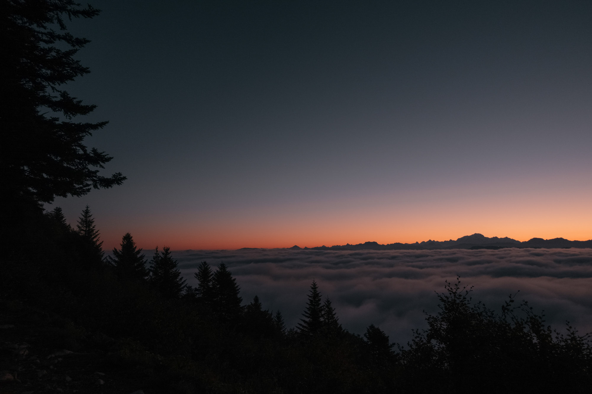

Chaque hiver, c'est le même refrain. Les jours raccourcissent, le gros des projets est derrière moi et puis l'envie d'insuffler un peu d'air frais dans ma pratique photo et vidéo. Le besoin d'une sorte de reset. L'envie de minimalisme qui revient. L'occasion de tout poser sur la table. De réfléchir. De prendre du recul. Greg n'est jamais bien loin. À portée de message. Un mot, une réflexion et on se rend vite compte que l'autre est dans le même état à 700km de là.

Cet article, j'avais prévu qu'il soit un constat après une année à photographier exclusivement à l'argentique. Et puis en commençant à le rédiger, je me suis aperçu que c'était un état des lieux beaucoup plus profond que j'écrivais. On dirait bien que comme chaque année, ce ménage de *print—hiver* m'aura fait le plus grand bien. Après un an passé à ne photographier qu'à l'argentique, j'ai besoin de faire un break et de regarder en arrière. Je trie mes négatifs, je range mes scans, et je fais le point sur ce qui vient de s'écouler durant cette année. Depuis un récent photoshoot pro où j'ai ressorti l'appareil photo numérique, j'ai cette petite voix dans ma tête qui me dit "ressors-moi plus souvent". Cette petite arrière pensée motivante qui ne s'en va pas. Je commence à tirer les premières conclusions de cette année d'argentique. Je calcule le coût et vois que Kodak envisage de ré-augmenter encore une fois les tarifs pour 2022. Voilà une nouvelle qui ne va pas vraiment dans le sens du porte-feuille mais qui va nourrir cette envie de faire un peu plus de numérique. Shooter sur une pellicule m'a appris à ralentir, à réfléchir, à me poser davantage sur mes réglages mais aussi sur mes cadrages. Moins shooter pour mieux photographier. Ce n'est pas un secret, ce que je préfère c'est documenter. Mais j'aime aussi cet aspect de création qui va dans le travail de certains cinéastes ou photographes. Le fait de contrôler sa lumière, son ambiance et la mise en scène. Ça m'a toujours fasciné et pourtant je ne me suis jamais senti à ma place pour m'y essayer. Moi, Jeremy, ce que je suis, c'est un mec qui photographie à la lumière naturelle et en pleine nature. Oui. Mais. Et s'il y-avait un "Mais" ? Et si ce "Mais" était une étiquette que je me mettais, une barrière que je m'imposais ?

   
   

Je suis on ne peut plus heureux depuis qu'on a déménagé à Lille, conquis mais avec une pensée qui va toujours vers ma vie d'avant "Oui mais maintenant je suis loin de la montagne". Comme si une petite voie appelée "Instagram" me parlait. À l'époque, mes meilleures photos étaient dans les Alpes. Enfin je croyais. Elles faisaient plus de "Likes" car elles suivaient les codes de la plateforme. Je m'épanouissais dans la prise de vue mais aussi de voir que mes photos plaisaient. Il n'y-a rien de mal à ça et tout artiste aime partager ce qu'il crée, mais depuis quelques années, j'ai ouvert les yeux sur l'impact que ça pouvait avoir dans ma vision de la photographie. Il y-a eu cette période à chercher le *banger* à tout pris, à "envier" toute proportion gardée des photographes qui passaient leur vie sur la route, quand je passais la mienne à bosser derrière un écran. À essayer de vivre des choses qu'on ne vit pas. Parce qu'on est pas comme eux. Parce qu'on a pas la même vie. Mais surtout parce que ce n'est pas nous. J'ai fini par réussi à m'affranchir de cette pression des réseaux sociaux. Mais malgré tout, je m'étais perdu à essayer de reproduire un mode de vie "proche de la montagne", en habitant dans le Nord. Là où le seul relief c'est le beffroi de Lille et les terrils. Je ne suis pas vraiment fan de la campagne du Nord et je m'enfonce(ais) donc dans cet état des lieux que je ne vivais pas au bon endroit photographiquement parlant. Car personnellement, je suis ravi de ce changement de vie.

   

Et puis, la pandémie est arrivée et nous a poussé à faire différemment. J'ai réussi à être créatif. À faire des vidéos pour rigoler et qui m'ont fait du bien. Et heureusement, il y-a eu la préparation pour notre documentaire "IMMERSION" qui nous aura tenu en haleine, sinon dans quel état aurions nous été avec Greg ?
Je pense aussi qu'IMMERSION nous a mis dans cette ambiance "documentaire" et 100% vidéo. Entre ça et le fait qu'on cherchait à s'affranchir de la pression d'Instagram, ça nous a fait oublier la photo. Je nous revois dans le van avec Greg, ou même sur WhatsApp en train de nous dire "de toute façon, on est pas des photographes". Et pourtant, je crois que je ne me suis pas autant éclaté en photo qu'en ce moment. Je ne dis pas forcément en ce moment là tout de suite. Mais cette année l'argentique m'a fait du bien. Ça m'a fait ralentir, ça m'a fait revenir à la photo aussi. Et ça m'a ouvert les yeux. Ça m'a fait expérimenter. Je me concentrais sur le medium plutôt que sur le fond. Parce que je fais de l'argentique, mes photos seront nécessairement bonnes. Parce que je shoote sur une pellicule, mon image sera meilleure. L'argentique m'aura permis de ralentir et c'est en ça où je veux poursuivre. J'adore l'objet, l'idée d'encrer une photo sur une pellicule, le charme de la bobine, l'attente de tes photos du labo. Mais je me rends compte aussi que je ne shootais plus aux heures dorées ou bleues car j'aime moins le rendu à l'argentique. Je photographiais moins aussi. J'attendais de vivre des trucs de fou pour faire des photos. Mais j'aimais aussi cette idée de documenter mes proches sur ce médium noble. Garder une trace physique pas seulement au fond d'un disque dur. Imaginer mes petits enfants tomber sur un carton poussiéreux quand je ne serai plus là, dans le grenier, et revivre nos vies d'aujourd'hui à travers ces images imprimées sur une bobine. Documenter pour mieux transmettre et ce souvenir. C'est aussi pour ça que j'aime tant l'argentique. Combler un manque aussi de manque de documentation de la part de ma propre famille de toute cette époque de leur jeunesse que j'aurais aimé aujourd'hui re-découvrir.

   

Et finalement, depuis cet automne 2021, comme chaque année, ce nouveau cycle de grand ménage est ré-apparu naturellement. Le constat de cette année qui va bientôt s'achever, le bon et le moins bon, le besoin de simplifier, trier et repenser. Des discussions de ces dernières semaines et jours. Le fait que Samantha me fasse remarquer que je shootais des choses "inutiles" à la Super 8. La vidéo de Jonathan. Et plein d'autres choses qui se mélangent et mènent à la réflexion. Ça chamboule, ça fait se questionner. Un peu comme chaque année. Mais c'est sain tout ça. Je parais un peu perdu mais j'ai l'impression que tout s'éclaircit en même temps. Ça donne envie de gratter. De creuser. De tester des choses. De remettre en question ma pratique. Ça ne veut pas dire faire de la photo studio du _light painting_ car ça n'est pas ce qui m'attire, mais varier l'approche. Tenter des choses. Ça marche, ça ne marche pas, c'est pas grave, ça fait grandir. La preuve, fin septembre je suis parti photographier la fête foraine de Lille avec une Cinestill 800T. Je ne ferais pas ça toute l'année, mais ça m'a ouvert l'esprit.

   
   

Là où je cherchais les *bangers only* avant. La photo grand angle, le paysage qui va bien avec la pose qui permet de faire du like. Finalement, je revenais toujours au paysage en oubliant les détails si importants pour raconter les histoires. Aujourd'hui, je photographie beaucoup plus de vie. C'est ce que j'ai vraiment changé ces dernières années. Je suis nul en portrait mais j'aime photographier les gens qui m'entourent, documenter ce qu'on fait ensemble. L'expérience, le moment. Le fond avant la forme. Car au final, ce sont les photos que je regarde avec le plus de nostalgie et dont je suis le plus fier.

   

Et si c'était comme tout dans la vie ? Une question d'équilibre. Pas besoin de tout l'un ou tout l'autre. Pas besoin d'être 100% argentique ni 100% numérique. J'adore la vidéo et j'avais délaissé la photo. Alors qu'en choisissant, les deux peuvent cohabiter, mais pas en même temps. Je fonctionne vraiment par phase, mais mettre la photo de côté n'a pas été la solution. On peut très bien faire de la vidéo et de la photo après tout, il faut juste trouver l'équilibre. Poser les choses, ne pas tout faire à la fois, mais plutôt se concentrer à faire une chose bien que deux choses mal. Au final, ça me motive à essayer de shooter d'avantage de détails. Et quand je dis détails, c'est aussi le quotidien. L'ordinaire de mon quotidien. Ce n'est pas toujours incroyable mais ça permet de rester curieux, d'aiguiser le regard, de continuer à s'épanouir à faire des images sans être désespéré de ne pas avoir fait un truc de fou depuis 3 semaines. Pour ça j'ai mon Olympus Mju II à l'argentique, mais j'ai aussi opté pour un Sony RX100V que je puisse attraper et glisser dans la poche pour une simple virée au restaurant, une balade en ville, un week-end en famille. Pour m'aider à penser à photographier mon quotidien, tant pis pour le f/1.4 et le gros bokeh.

   

Je crois que c'est ça mon axe de progression pour cet hiver et 2022. Me ré-approprier la photographie, ré-aiguiser mon oeil et documenter, en détail comme en plan large. En numérique comme à l'argentique. Le proche comme le lointain. La passion comme métronome. L'appareil toujours à portée de main.

Envie d’échanger sur le sujet avec moi ? [Rejoins-moi sur Twitter](http://twitter.com/jeremyjanin) ou sur [Discord](https://discord.gg/rvk5DTwT8H) !
