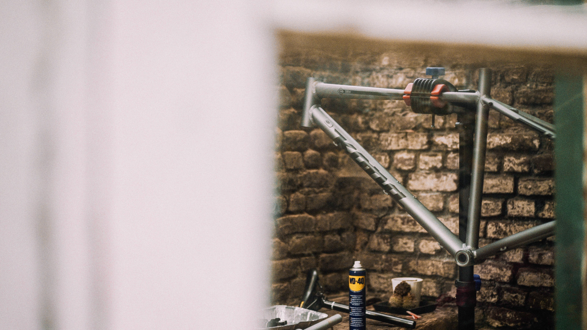
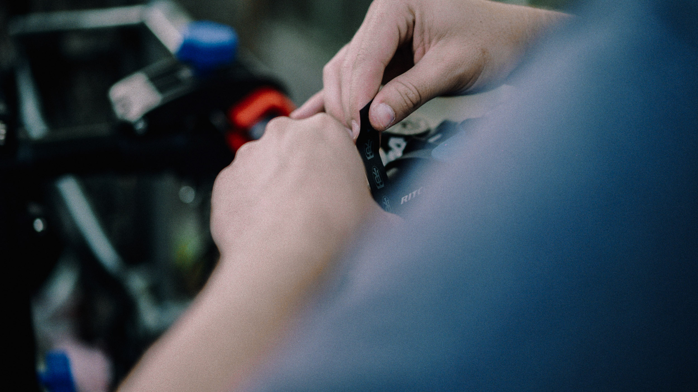

Il y-a quelques semaines, je me suis décidé à remonter un vélo gravel de mes propres mains dans le but d'en faire une utilisation en bikepacking et en sortie à la journée. J'ai décidé de documenter tout le processus en vidéos et relater mon expérience par ici.

### Remonter un vélo gravel oui, mais lequel ?

Je pratique le vélo depuis aussi longtemps que je m'en souvienne mais ai toujours été d'avantage tourné vers le VTT, bikepark et enduro principalement. Je n'ai absolument jamais été attiré par la route, mais notre récent déménagement à Lille, mon éloignement des montagnes m'a ouvert de nouveaux horizons. L'envie de rouler plus loin, plus longtemps, de planter la tente au milieu m'ont fait découvrir le bikepacking il y-a maintenant près de deux ans. Je suis parti en fatbike en Ecosse avec mon père au printemps avec tout notre matos de bikepacking et ce fut incroyable ! (Je bosse sur la vidéo et les photos et vous partage ça bientôt.) L'envie de remettre ça plus souvent ne m'a depuis plus quitté. Si j'ai toujours le fatbike au garage, un vélo typé gravel me semblait être le parfait compagnon à mon fidèle vélo à pneus (très) large.

J'ai acheté l'an dernier un vélo urbain Kona Dew, un vélo correct mais entrée de gamme. Le but était de pouvoir me déplacer en ville sans avoir peur de me faire voler mon fatbike et surtout de me faire un peu moins remarquer qu'avec le gros vélo et d'aller plus vite et plus loin. Très vite, j'ai eu en tête de l'upgrader. Si vous voulez voir à quoi il ressemble d'origine, [_il est là_](http://2018.konaworld.com/dew.cfm). Mais est-ce que ça valait le coup de mettre 1000€ d'upgrade matériel dans un vélo acheté 450€ ? Au delà de ça, moi qui ai toujours eu des VTT à la position bien assise et des guidons larges et plats... Comment allais-je m'habituer à une nouvelle position sur le gravel ?

Solution de facilité, l'attrait d'avoir un nouveau vélo et après avoir passé des heures à baver sur des sites ou magazines, je m'étais convaincu de revendre mon Kona Dew et d'investir dans un "vrai gravel". J'ai très vite retenu le Sonder Camino Al pour son look, sa transmission Sram Apex et la possibilité de monter des pneus larges. J'étais presque décidé à cliquer sur commander mais quelque chose n'y était pas.

J'ai donc continué à écumer les sites, j'ai lorgné un temps sur le _Cannondale Topstone_, le _Kona Rove_ et d'autres qui dépassaient mon budget ainsi que l'un des freins les plus recurrents entre tous les vélos que j'ai repéré : l'impossibilité de monter plus que du 700x40 comme pneus. Finalement, c'est en regardant la géométrie du Kona Rove et en la comparant avec le mien que j'ai remarqué que les deux cadres étaient très proches. Et si je gardais mon cadre que j'avais presque déjà vendu dans ma tête et que j'en faisais un gravel unique, un modèle que personne d'autre n'a ? L'idée a fait son chemin et je me suis vite retrouvé à y voir les points positifs. Ma seule crainte était : est-ce qu'une fois fini le rendu n'allait pas être bizarre voire cheap ? Evidemment, le look d'un vélo n'est pas sa fonction première (demandez à Samantha, elle ne comprend toujours pas l'intérêt d'un "beau vélo".) mais ça me tenait à coeur d'avoir quelque chose qui me plait. Je suis un nostalgique des vélos en acier Reynolds et pas très fan des nouveaux vélos de gravel assez typé route. _Le colant pipette, ce n'est pas tellement pour moi !_ J'aime l'idée de mixer l'univers du VTT, du bikepacking et du gravel, voilà pourquoi je me suis décidé à mélanger des pièces de ces deux univers.

### Remonter un vélo gravel de mes propres mains

Je ne suis pas mécano vélo, mais quand j'étais étudiant, je passais mes étés comme vendeur cycle chez Décathlon, j'avais donc quelques bases en mécanique. Au point de savoir de monter mon propre vélo de A à Z ? Je ne pense pas. Mais le challenge me plaisait, j'étais excité comme un gosse à noël. J'ai pris quelques jours pour digérer l'idée et me confirmer que c'était le bon choix avant de faire chauffer la CB.

Ça y-est, j'avais fait mon choix de pièces et commandé ma transmission, mes roues, guidon, guidoline et j'en passe. J'allais relevé ce challenge, sans vraiment savoir où j'allais, mais j'y allais. Quitte à remonter le vélo moi même, et connaissant ma passion pour l'image, je me suis rajouté la tâche de filmer le process tout au long du remontage. Bien inspiré par les vidéos "Dream Build" VTT de Gee Milner. Les questions vélo et vidéos se mélangaient dans ma tête : comment j'allais filmer ça avec les doigts plein de graisse ? Comment varier suffisamment les angles alors que je suis tout seul et qu'avec un trépied ? Quelles pédales je prends ? Est-ce que je vais réussir à régler les vitesses ?

Mais s'il y-avait bien une chose à laquelle je ne voulais pas renoncer, c'est bien de le faire moi. D'abord pour la fierté de l'avoir fait de mes propres mains. Ok c'est pas une voiture mais l'idée me plaisait vraiment. Surtout, mon but en démontant et remontant mon vélo moi même était que j'allais acquérir des connaissances nouvelles, et donc être en mesure à l'avenir de faire l'entretien complet de mon vélo. Ce n'était pas le leitmotiv principal, mais en cumulant tout ça, j'allais aussi réalisé de belles économies.

### Remonter un vélo gravel, quel matos j'ai choisi

J'avais plusieurs critères en remontant mon Kona Dew : passer sur un cintre gravel, en mono-plateau et 11 vitesses à l'arrière, pouvoir monter une section de pneus large et améliorer le freinage.

J'ai passé un nombre d'heures incroyable sur internet à regarder mes possibilités de montage. J'aimais le fait que j'étais totalement libre ou presque. J'ai donc décidé de passer en mono-plateau et 11 vitesses. Je roule en 1x10 en VTT et fatbike depuis des années et sur mon Kona, je me suis aperçu que j'étais tout le temps sur le plateau du milieu en 38 dents et que je n'allais jamais sur le plus gros ou le plus petit, et que je changeais tout le temps les vitesses mais qu'un 11-36 derrière manquait de polyvalence hors ville. J'avoue aussi que je préfèrerais le look du mono-plateau et j'allais gagner un peu en poids en retirant le derrailleur avant et la manette qui lui est liée. J'ai donc décidé de reprendre un plateau de 38 avec lequel je me sens bien (même si je sais que la plupart roulent en 40, 42 voire 44, le 38 correspond bien à ma façon de rouler) et une cassette 11 vitesses en 11-42. J'ai donc porté mon choix sur une transmission complète SRAM Apex.

Quand on entreprend de grosses modifications sur un vélo, la compatibilité entre les pièces est un élément crucial. Quelques échanges par email avec le SAV Kona _(merci Kona pour les précieux conseils !)_ et j'avais la confirmation que je pouvais bien monter un boitier de pédalier GXP Sram / Truvativ. Parfait. J'avais commandé un pédalier Sram Apex en 42 dents mais j'ai vite déchanté en m'apercevant que mon cadre m'oblige à avoir un pédalier de VTT, sans quoi les manivelles route comme l'Apex viennent taper contre les bases arrière du cadre. Grosse désillusion, je ne l'ai pas vu venir. J'ai appelé Pro Bike Shop (là où j'avais commandé mon vélo quelques mois plus tôt), et encore une fois le service client a été d'une aide précieuse. Plusieurs personnes chez eux séchaient à ne pas comprendre pourquoi ça buttait dans le cadre. Mais finalement, l'un d'eux me rappelle avec la solution. La différence de Q Factor (déport) entre une manivelle VTT et route peut être suffisamment conséquent pour faire la différence. J'ai donc commandé un pédalier route compatible avec mon boitier de pédalier, mon choix s'est donc porté sur un Sram NX malheureusement livré en 32 dents. J'ai donc pris en complément un plateau Stronglight (made in France. Cocorico !) en 38 dents. Et miracle, la solution était donc là !

J'ai opté pour une paire de roues HUNT 4 season gravel disc en 700. J'ai longtemps hésité avec les MASON x HUNT en 650b. Le 650 était un avantage pour moi étant petit et l'idée de mettre des pneus larges me séduisait. En revanche, compte tenu du terrain relativement roulant sur lequel je vais principalement utiliser ce vélo, le 700 semblait être le plus logique pour ne pas être trop à la peine sur la route et les sentiers roulants. Je ne pensais pas autant être bluffé par un changement de roues mais là je suis scotché. Ce qui me plaisait c'était aussi la possibilité de rouler aujourd'hui en axe rapide de 9mm et si demain je change de cadre et de fourche, de pouvoir facilement passer en axe traversant.

Si j'adore mon KONA Dew, l'une des choses qui ne m'a jamais mise en confiance, c'est bien le freinage. Les Tektro mécaniques d'origine sont peut-être bien, mais habitué à rouler en VTT avec des freins hydrauliques relativement hauts de gamme en 180mm ou 200mm depuis pas mal d'années, je ne me sens absolument pas en sécurité avec ces freins à disques mécaniques. Même si l'investissement allait être supérieur, il était clair que je partirais sur les freins Sram Apex hydrauliques. Le tout sera monté sur un cintre Ritchey VentureMax Comp en 44cm.

Etant petit, l'une des plus grosses contraintes venait de la potence. Mon cadre est déjà en 48 et la potence d'origine en 60mm m'éloignait trop des cocottes. J'ai donc opté pour une potence VTT, une Answer Atac en 31mm... Difficile de faire plus court ! Je verrai ensuite avec le temps comment peaufiner ma position. Mais je laisse le temps au temps, mes futures sorties seront le meilleur moyen d'ajuster ma position. Je sens déjà une nette amélioration en étant passé sur une potence ultra courte comme celle-ci.

Pour résumer... je n'ai pas gardé grand chose du vélo d'origine. J'ai donc conservé le cadre, la fourche, le collier de selle, la tige de selle, les disques de frein et le jeu de direction. J'avais déjà monté les pneus _Schwalbe G-One All Around en 35mm_ et ai décidé de les conserver tant qu'ils ne sont pas usés, je les remplacerai par une section plus large type _Panaracer Gravel King SK 43_. Le JDD va être changé prochainement pour un plus qualitatif, mais tout le reste a été remplacé. J'ai été agréablement surpris de tomber à un poids de 10,6kg, gagnant plus de 2kg par rapport au poids du vélo d'origine.

Voici la liste du matériel monté sur mon Kona Dew:

Cintre **[Ritchey VentureMax Comp 44cm](https://amzn.to/2ApYccb)** Guidoline [**Ritchey WCS Pave**](https://amzn.to/2Qf9b33) Potence **[Answer Atac 31mm](https://www.probikeshop.fr/potence-answer-atac-ame-noir/121786.html)** Manettes **[Sram Apex hydro 1x11](https://amzn.to/2At0ebK)** Derrailleur arrière **[Sram Apex 11v - chape longue](https://amzn.to/31wljOm)** Cassette **[Sram 11-42](https://amzn.to/2QhFVsp)** Chaine [**Sram 11 vitesses**](https://amzn.to/2Ax2j6d) Pédalier **[Sram NX](https://amzn.to/2NoVlsr)** Plateau [**Stronglight 38T**](https://www.probikeshop.fr/plateau-mono-stronglight-sram-x01-11v-4-trous-104-mm/123357.html) Pédales **[CrankBrothers Candy 3](https://amzn.to/31rxR9A)** Roues **[HUNT 4-season gravel disc](https://www.huntbikewheels.cc/products/4season-gravel-disc-road-cx-wheelset-1589g-24deep-24wide)** Selle **[Ergon SMC-4 M](https://www.probikeshop.fr/selle-ergon-smc4/114822.html)** _(que j'avais sur mon fatbike)_ Pneus **[Schwalbe G-One All Around 35mm](https://amzn.to/31vtIBt)**

### Remonter un vélo gravel, comment je m'y suis pris et ce que j'ai appris

Après avoir commandé un pied d'atelier, mon kit d'outils manquants, j'allais pouvoir attaquer. J'ai commencé par dépouiller tout le vélo de ses pièces d'origine pour le nettoyer de fond en comble et partir d'une base saine et propre. J'ai suivi quelques tutos sur YouTube notamment les chaines de ParkTool (anglais) et ProBikeShop TV (français) pour m'éclairer sur certaines parties que je maitrisais moins. Je ne garantis pas que j'ai fait les gestes qu'un vrai mécano vélo ferait, c'est pourquoi ni cet article ni cette vidéo ne sont des tutos, mais une simple illustration de mon expérience.



J'ai pris mon pied à faire ce projet. J'ai eu la sensation d'apprendre des choses à chaque étape, pour chaque pièce remontée et c'était jouissif d'augmenter mon savoir, de réussir et valider chaque étape pour passer à la suivante. Je pose aussi un regard différent sur mon vélo, l'envie d'en prendre encore plus soin après y avoir mis autant d'heures de recherches et d'énergie. Si c'était à refaire, je referai tout pareil, sans rien changer. J'ai adoré apprendre, tout en mêlant ma passion pour le vélo et l'image. Si cet article peut vous donner des idées alors j'en serais ravi. Je l'ai avant tout écrit pour décrire mon expérience, ayant eu du mal à trouver des personnes ayant fait quelque chose dans cette veine là. J'ai très peu roulé avec depuis la fin du montage, il me tarde de faire une sortie longue avec mais aucun regret pour l'heure et je suis fan du comportement joueur que j'ai réussi à conserver et que je ressentais d'origine avec ce vélo mais en ayant désormais une monture plus véloce, légère et fun à piloter. Pour l'instant je vais continuer avec ce vélo et je verrai dans quelques années lorsque je souhaiterai faire évoluer mon cadre et ma fourche. _Brothers Cycles, I'm looking at you!_

Je reviendrai dans quelques temps sur mon setup bikepacking quand j'aurai fini de le peaufiner. De toute façon, cet article est déjà bien trop long. Bravo si vous êtes arrivés au bout ! En tous cas, moi j'ai pris mon pied sur ce projet, maintenant il reste plus qu'à rouler et s'amuser à découvrir cette nouvelle région qui est désormais mienne.

Edit - 2021 : j'ai finalement revendu ce vélo car je suis définitivement fan de VTT et ne pratique plus le gravel dans lequel je m'ennuie, comparé au VTT.
