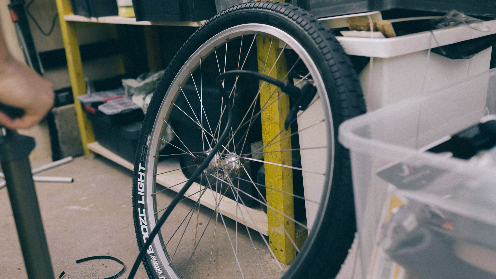

Après avoir [restauré un vélo urbain en gravel](https://jeremyjanin.com/remonter-un-velo-gravel-de-mes-propres-mains/) il y-a quelques années, que j'ai finalement décidé de revendre car je n'aimais pas les cintres drop-bar, j'ai voulu trouver un nouveau projet qui me permettrait de mettre les mains dans la graisse pour me concevoir un nouveau vélo. Au fil de mes recherches, après avoir listé mes envies, poncé le fil [r/xbiking](https://www.reddit.com/r/xbiking/) sur Reddit, et établi le type de vélo que je cherchais... j'ai décidé de restaurer un VTT des années 90. Le challenge n'allait pas être évident car j'avais en tête 2-3 modèles de vélos que je cherchais et étant petit, il allait falloir en plus le trouver en petite taille.

Mon idée était claire : je voulais restaurer un vélo ancien plutôt que céder à la tentation d'un neuf (et j'avoue que je leur trouve plus de caractère que les neufs !), ce vélo aurait pour vocation à être utilisé principalement au quotidien à Lille mais aussi pour des sorties bikepacking dans le coin et m'amuser sur les chemins les plus roulants comme sur les pavés en ville. Je voulais aussi que ce montage soit une ode à la simplicité : singlespeed, panier et fun étaient les maitres mots ; et un homage aux standards vélos aujourd'hui un peu oubliés : cadre acier, boitier de pédalier à axe carré, roues 26 pouces, freins sur jante,...

Je voulais aussi que ce vélo soit l'anti-gravel aérodynamique au possible. J'ai strictement rien contre les gravel car si on y regarde de plus près, ce Specialized en est un, mais je lui préfère le terme de VTC ou *All Terrain Bike*, moins victime des modes inspirées de l'univers de la route, à chasser le moindre gramme ou enchainer les KOM sur Strava. [#TeamKomoot](https://www.komoot.fr/user/739261110267) Ce vélo pour moi serait le retour à une certaine simplicité dans cette pratique. Un vélo pratique, confortable, et beau qui ne cède pas aux nouveautés ou au marketing des équipementiers à chaque nouvelle saison.

*Inspiration: Mike Hayes, Mathias Stridsland, Rio Sawada, Ronnie Romance*

Après quelques semaines à retourner Marketplace et Le Bon Coin, je tombe finalement sur une annonce à l'autre bout de la France pour un Specialized RockHopper déjà bien amoché. J'espérais en trouver un avec une peinture qui me plaise un peu plus mais l'occasion est trop belle et je me vois déjà avec. Problème : la vendeuse refuse de l'expédier. Par chance, elle est à 20 minutes de Chambéry, j'envoie mon pote Jean l'acheter pour moi et me l'expédier en deux colis dans la foulée.

Ce vélo était le vélo de famille utilisé par tous les enfants et petits enfants de la maisonnée, jusqu'à aujourd'hui qu'il prenne la poussière au fond de la grange. On voit tout de suite qu'il a bien été martyrisé avec de nombreux points de rouilles, quelques pocs dans le cadre et pas mal de pièces à prévoir de changer. Ça tombe bien, c'est ce que je voulais. C'est ce qui m'a décidé à me lancer dans cet *Unloved Bike Project*.

Quand j'ai commencé la restauration, j'hésitais à le repeindre ou à le conserver comme à l'origine. Le vélo est donc passé par plusieurs versions et de nombreuses évolutions matérielles.

### *Unloved Bike Project — Specialized RockHopper v0.0*

Le vélo tel que je l'ai reçu, dans son jus, mais avec un potentiel que je décelais derrière ses bosses et ses cicatrices.

   

   

### *Unloved Bike Project — Specialized RockHopper v1.0*

J'ai passé des heures à chercher les pièces que je voulais mettre sur ce vélo, à vérifier la compatibilité et puis à me lancer. J'ai chiné un pédalier Shimano Deore XT pour une bouchée de pain sur Le Bon Coin, craqué sur un guidon style motocross avec un backsweep de 20° qui m'assurerait du confort aux poignets pour rouler toute la journée et un rise de 85mm pour relever la position et être un peu moins la tête dans la potence qu'avec la géométrie d'origine. J'ai retourné eBay pour trouver une paire de Vittoria BOOZE LIGHT dont je suis absolument amoureux tant par leur durée de vie, que leur résistance à la crevaison ou leur look. Malheureusement ils ne sont plus fabriqués donc les trouver a été un beau casse-tête. J'ai commencé avec la paire de roues d'origine mais qui avait déjà bien souffert, et suis très vite passé à une paire de roues en 26 pouces v-brake Mavic Crossride.

La suite, c'était : des poingées ESI en silicone, des leviers de freins Avid Speeddial 7 et des freins Shimano Deore v-brake, changer tous les cables, installer une transmission singlespeed 36 x 16 avec une chaine demi-maillon de BMX pour ne pas avoir à utiliser de tendeur de chaine. J'ai mis un adaptateur 1" vers 1"1/8 pour utiliser une potence moderne, en l'occurence, une potence de BMX Flybikes Volcano. J'ai gardé la tige de selle livrée avec le vélo, et sorti une selle Bontrager et des pédales en plastique de ma *parts bin*. Je voulais me laisser le temps de l'utiliser, l'apprivoiser, trouver ma position avant d'aller potentiellement plus loin dans les upgrades.

Pendant que les pièces arrivaient, j'ai aussi passé du temps à nettoyer, traiter la rouille et polisher le cadre et la rouille pour essayer de lui redonner vie.

   

### *Unloved Bike Project — Specialized RockHopper v1.1*
En cours de route, j'ai upgradé la selle pour Brooks C17 neuve dans l'emballage et une tige de selle Thomson Elite, toutes deux trouvées sur Le Bon Coin. Et vu que c'était l'hiver, j'en ai profité pour ajouter deux gardes-boue.

### *Unloved Bike Project — Specialized RockHopper v2.0*

Après 9 mois d'utilisation et de nombreuses hésitations, je me décide à garder ce côté usage quotidien mais en l'équipant davantage pour des sorties bikepacking. Je commence par trouver un artisan cadreur qui accepte de poser des oeillets dans ma fourche et dans le down tube pour pouvoir visser des portes-bidons, cages, etc... J'aurais pu le faire moi-même en perçant et posant les oeillets, mais je préférais éviter de porter atteinte à la fiabilité structurelle du cadre et de la fourche, et je préférais que les oeillets soient brasés et pas seulement rentrés en force.

   

Une fois fait, j'ai pris le train pour passer quelques jours chez mes parents où mon père possède tout le nécessaire pour sabler et peindre des vélos. Il le fait sur nos vélos depuis des années, et je me suis décidé à le faire sur ce RockHopper finalement. Je décape finalement complètement le cadre et la fourche avec son aérogommeuse avant de lui confier la partie finition : la peinture.

J'ai longtemps hésité sur la couleur et même si je l'adore, j'hésite toujours. Je crois qu'il y-a tellement de choix qu'il me faudrait 3 ou 4 projets vélos comme celui là pour m'amuser avec des couleurs différentes.

   

Une fois repeint, je suis reparti vers Lille où il ne me restait plus qu'à coller les stickers noirs d'origine du vélo et le ré-assembler. J'en ai profité pour apporter quelques évolutions sur certaines pièces tout en rajoutant : mon porte gourde Nalgene et les cages King Cage en titane de chaque côté de la fourche. J'ai craqué pour les leviers *PAUL Love Lever short pull* pour remplacer mes Avid SD7 et si le prix pique un peu, la différence à l'usage et esthétique est incroyable. C'est l'une de mes pièces préférées sur le vélo. J'ai aussi conservé les poignées ESI grips mais cette fois en noir. J'ai remplacé le jeu de direction par la même version en noir, remplacé les pédales par des MKS et retiré les stickers des roues Mavic.

   

J'ai aussi gardé le montage en singlespeed car j'aime cette simplicité et dans le Nord, le mono vitesse passe plutôt bien. C'est une philosophie qui me plait aussi !

### *Unloved Bike Project — Specialized RockHopper v2.1*

Cette v2.1 est une évolution moins majeure mais néanmoins importante de la version précédente. Si je n'ai pas touché à l'aspect cosmétique du cadre, j'ai remplacé le pédalier par un MiddleBurn RS7 avec un plateau de 36 dents, ajouté un derailleur arrière Shimano Deore en 1x10 vitesses trouvé sur Le Bon Coin en vue du trip bikepacking en Bretagne qui s'annonçait. J'ai longtemps voulu le faire en singlespeed, mais a fortiori, j'ai pris la bonne décision en le passant en 1x10. J'ai ajouté une cassette Sunrace 10-40 et la manette Shimano Deore qui venait avec. Je n'avais pas besoin de 12 vitesses sur ce vélo, le 1x10 est amplement suffisant, j'ai même longtemps hésité à le passer en 1x7 ou 1x8 car étant habitué au singlespeed, j'ai surtout besoin de passer à plus souple quand la pente s'élève et n'ai pas besoin d'un étagement parfait. J'ai aussi ajouté des patins de freins Koolstop pour renforcer la puissance de freinage.

   

Pour l'heure, le vélo reste dans cette version, par flemme de le re-basculer en singlespeed en grande partie et puis m'éviter les nombreux montages / démontages à chaque nouveau trip prévu.

J'ai aussi [cousu une sacoche de cadre sur-mesure](http://instagram.com/fieldpacks) en XPAC VX21 + Dyneema Gridstop + DCF 3.5oz, partiellement fixée en *bolt-on* par les vis de portes-bidons d'origine et par velcro, avec zip étanche de part et d'autres, assorti d'un *Jumbo Stem Bag* qui me permet de ranger une gourde Nalgene ou un petit appareil photo avec mon iPhone.

Après l'avoir testé dans cette version sur 250km en Bretagne, 180km aux Pays Bas et de nombreuses sorties au quotidien, je peux confirmer que c'est le vélo dans lequel j'ai mis le plus d'énergie mais aussi celui qui me met le plus grand sourire sur le visage, peu importe le type de balade que je fais avec. La position est impeccable, son look me plait beaucoup — surtout avec les cages rajoutées sur la fourche et sous le cadre, et le panier.

Est-ce que j'ai rempli mon objectif ? OUI, c'est un grand OUI. Je suis fier de me balader en 26 pouces, avec mon axe carré dans le pédalier, mes freins v-brakes... ça parait stupide, mais oui, j'y pense à chaque sortie. Ce sont des standards qu'on pourrait qualifier de désuets aujourd'hui et pourtant ils fonctionnent. Je suis un amoureux des freins à disque en VTT, mais force est de constater que les v-brakes ça fonctionne hyper bien quand ils sont de qualités et bien réglés.

Dire que je n'ai pas d'autres envies serait mentir, mais je pense que je les réserve pour un autre cadre avec une approche différente d'un point de cosmétique et organisationnel. Maintenant, le tout, c'est de faire de la place dans la cabane au fond du jardin.

### *Unloved Bike Project — Specialized RockHopper v3.0*
(Février 2023)

Force est de constater que finalement, j'ai fait de la place dans la cabane au fond du jardin, mais je ne me suis pas arrêté là dans la rénovation du RockHopper. Mes envies évoluant, ma pratique aussi, j’ai fini par ressentir l’envie de plus de confort au niveau des poignets, surtout en bikepacking ou longues sorties. J’avais aussi envie d’une évolution esthétique du vélo au passage, pour se rapprocher d’un style plus à la cool, plus inspiré par la philosophie de Grant Petersen et Rivendell ou des récents Brother Cycles Mr Wooden ou Singular Peregrine. Cette v3.0 contient donc des évolutions majeures.

J’ai changé le guidon et la potence style BMX pour un Simworks Fun Bar 3 avec plus de back sweep pour plus de confort complété par des poignées OURY V2, la potence est une Velo Orange Faceplate en 110mm de long. L’ensemble de mon kit Shimano Deore moderne a été remplacé par l’iconique Shimano XTR M-951 pour les freins v-brake, toujours avec des patins KoolStop, ainsi que le derailleur arrière, XTR M-951 en Rapid Rise (assez rare, mais à l’indexation inversée. Naturellement, le ressort pousse la cage vers les vitesses les plus souples, à l’inverse des modernes qui ont naturellement tendance à partir vers les plus dures.) . Vous l’aurez compris, j’ai donc revendu mon derailleur arrière Deore ainsi que la cassette 1x10 pour passer au XTR avec une transmission 1x9 vitesses en 11-36 et troqué le shifter moderne pour un shifter à friction Dia Compe ENE non indexé. Quel plaisir de ne plus avoir de bruit de clic à chaque changement de vitesse. Et j’aime ce petit jeu de maîtriser le mouvement de friction pour tomber pile sur la bonne vitesse. J’appréhendais au début et finalement, c’est très naturel et très facile.

J’ai aussi réussi à avoir l’une des dernières étoiles triples vendues par Middleburn pour mon RS7. Mon pédalier est désormais en double plateau mais utilisé comme un mono-plateau. Je n’ai pas de derailleur avant, j’utilise quasiment jamais le petit plateau que j’ai rajouté, mais si je l’ai rajouté c’est bien pour une raison : pouvoir mieux passer les grosses cotes en bikepacking. Je ne suis jamais pressé donc pas besoin du derailleur avant qui viendrait me rajouter de l’encombrement avec un shifter sur le guidon, je peux juste tomber la chaine avec mon talon tout en pédalant pour qu’elle passe sur mon plateau de 24 dents. Et de toute façon, quand j’arrive en haut, j’ai besoin de souffler (ou de faire une photo de la vue), donc j’ai qu’à remonter la chaine avec les doigts sur le plateau de 38 dents. D’ailleurs, je ne me salis plus les doigts avec la chaine. J’ai arrêté l’usage d’une huile qui a tendance à noircir très rapidement. Désormais, j’utilise une cire très facile à appliquer, qui demande moins d’entretien, à laquelle la saleté n’adhère pas et qui garde ma transmission propre. Je revis depuis !

Enfin, et non des moindres, les roues ont également été changées. J’ai assemblé moi-même une paire de roues Ryde Big Bull (initialement prévues pour la descente) en 26 pouces toujours et 36 rayons, et chiné 2 moyeux Shimano XT Parallax M737. J’ai remplacé mes pneus Vittoria Booze Light par des Continental Race King qui m’apportent un peu plus d’accroche sur les chemins et en conditions humides. Et ils font un peu moins BMX sur cette version de ma build qui a une esthétique plus classique désormais. Pour peaufiner le tout, j'ai ajouté un éclairage Supernova Mini Pro 2 compatible dynamo et USB. Je n'ai pas choisi l'option dynamo, je branche directement le phare à une powerbank dédiée. Enfin, point final de cette nouvelle build, j’ai troqué ma selle Brooks Cambium C17 contre une Berthoud Aspin fabriquée à 5km de là où j’ai grandi.

Dire que je suis amoureux de cette nouvelle version serait un euphémisme. À tel point que j'ai revendu tous mes autres vélos et qu'aujourd'hui, je ne roule plus qu'avec celui là. Je tiens une satisfaction incommensurable de ce vélo, il me met un smile grand comme ça, que ce soit pour un aller-retour à la boulangerie ou une balade dans le bois du coin. Je n'ai aucune envie de le faire évoluer à ce jour, rien ne me fait de l'oeil pour son évolution. Je ne garantis pas que ça sera sa dernière version, mais là tout de suite, je le trouve parfait comme ça.
