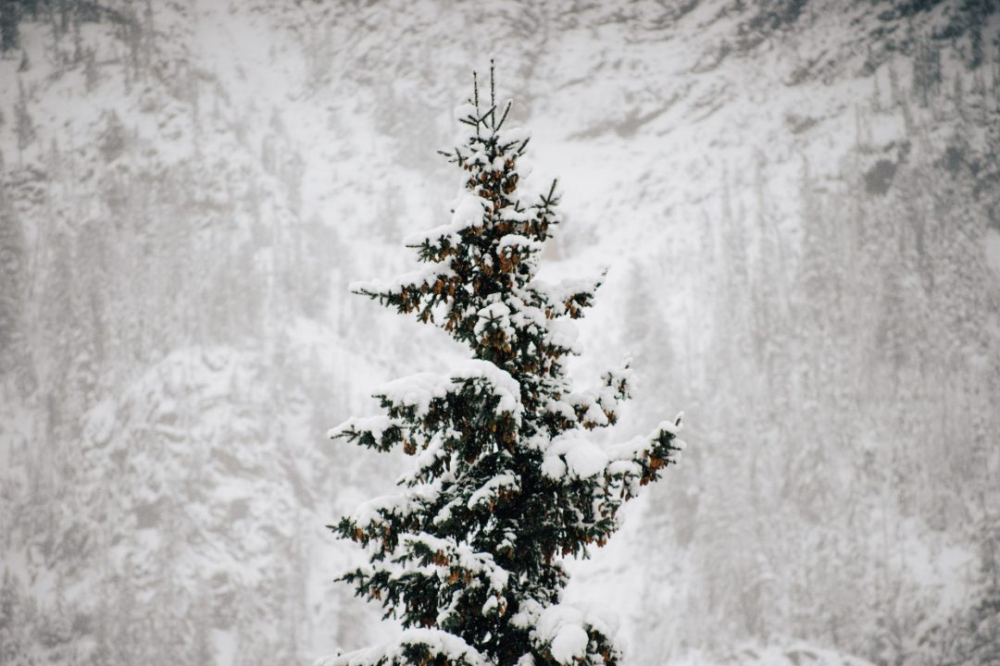
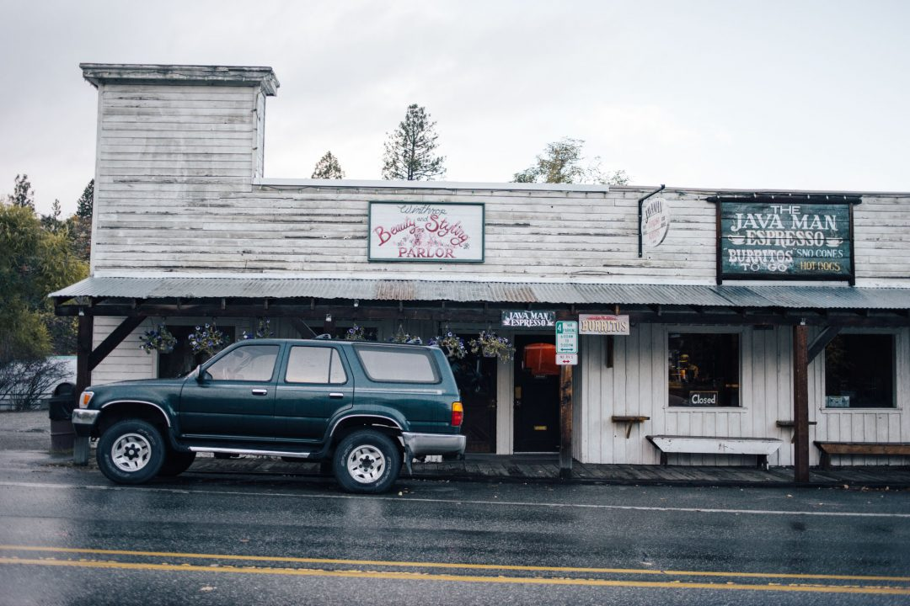

Notre road trip dans le [Washington et l'Oregon](http://jeremyjanin.com/carnet-de-souvenirs-dun-roadtrip-dans-le-pacific-northwest "Carnet de souvenirs d’un roadtrip dans le Pacific Northwest") nous avait transcendé, cette année on a décidé de voir encore plus loin. Pendant 2 semaines, on a conduit 4000kms à travers les paysages du Nord Ouest américain passant de l'automne à l'hiver en un clin d'oeil, profitant de chaque instant après 8 mois séparés par un océan. Fin octobre, j'ai fait un court séjour à Paris avant de prendre l'avion, j'en ai profité pour revoir les amis [Tania](http://www.lesbonnesresolutions.fr/), [Juliette](http://www.jenesaispaschoisir.com/) & [Gaetan](http://gaetan.cc/), boire un verre avec [Voyageurs du Monde](http://www.voyageursdumonde.fr/) qui nous a donné un coup de pouce pour ce roadtrip, manger un burger avec [Tiphaine](https://www.instagram.com/tiphaine.c/) et revoir [Elise](http://lisebery.com/) et il était déjà l'heure de prendre la direction de l'aéroport de Roissy direction Montréal pour retrouver [Samantha](http://instagram.com/vagabondanse) pour un nouveau roadtrip. Ses retrouvailles se faisaient à l'occasion de sa remise de diplôme à son université (moment de fierté!) avant de nous envoler le lendemain pour un nouveau roadtrip dans le Pacific Northwest, du Washington au Montana en passant par l'Idaho et le Wyoming.

    

On a récupéré notre voiture de location à l'aéroport de Seattle, dévalisé le Walmart et le Safeway avant de prendre la route vers le nord sous une pluie battante direction **North Cascades National Park**. On passera la nuit dans le van sur un parking un peu glauque sous une pluie torrentielle à une heure de route des North Cascades. Le lendemain matin, le temps d'attraper un chocolat chaud pour nous réchauffer et de se brosser les dents dans les w.c du McDo du coin, on reprend nos habitudes du roadtrip, on rebascule les sacs à l'arrière, l'espace lit redevient notre fourre tout où siègent nos sacs photos, nos matelas / duvet, la nourriture et nos vêtements. Tout ça aussi bien rangé que possible et séparés comme il se doit.

      

C'est sous une brume épaisse que nous avançons déjà le sourire jusqu'aux oreilles de voir encore des couleurs de l'automne malgré la date avancée dans la saison. On est tellement heureux de s'être retrouvés après 8 mois séparés par un océan, si heureux de se retrouver pour un voyage d'exception. Pendant des mois, nous avons, pensé, imaginé ce roadtrip et le voir prendre vie, là sous nos yeux, ensemble a quelque chose magique. La route nous amène finalement à l'entrée du parc où nous nous arrêtons pour le premier d'une longue série d'arrêt photo stupide pour faire des selfies devant les panneaux. Au bout de quelques minutes, une Jeep s'arrête et deux femmes nous préviennent que la route jusqu'à Winthrop est bouchée par la neige 40miles plus loin. Un peu dépités sur le moment, on voulait quand même rouler jusqu'à la neige, justement pour trouver la neige et on aviserait sur le moment si oui ou non, on pourrait passer. Les miles défilent et les pauses photos s'enchainent, le ciel est couvert et ça nous va bien, la lumière est calme et apaisante, un régal pour faire des images.

       

Nous arrivons finalement à Logan Pass puis à Washington Pass et rapidement la brume devient de la pluie qui elle même devient de la neige. Des flocons gros comme mon point tombent sur les North Cascades, et nous comme deux gosses, on se retrouve au milieu de la route à laisser éclater nos rires, notre émerveillement. Comme deux gosses un soir de noël qui voient enfin la neige revenir, ces flocons qui blanchissent à vue d'oeil le paysage et qui l'enroulent dans son nouveau manteau de saison. La neige tient sur la route et les pneus usées de la voiture de location ne nous mettent pas en confiance, on roule tranquillement et déjà les premiers voyant de l'anti-patinage clignotent sur le tableau de bord. Je sens Samantha hyper détendue et heureuse alors que moi je ne fais pas le malin derrière le volant, sentant que la voiture décroche au moindre changement de trajectoire ou à la moindre accélération. La couche de neige s'épaissit de plus en plus sur cette route de montagne, je pense qu'on réussira à passer mais ça fait déjà de nombreux miles qu'on conduit et ça ne s'arrête pas. Quand on franchit enfin Washington Pass, j'oublie tout et suis ébahit, le grand blanc. Il est là, devant nous. Une immensité vierge, sans relief. Du blanc, partout. La tentative de freinage ratée me rappelle vite à la réalité, vu comme ça glisse, il n'y aura pas d'image, mais de la concentration pour réussir à passer sur cette route plus qu'enneigée. Si je m'arrête on ne repart pas. Finalement le relief commence à redescendre légèrement et la route devient plus praticable : we made it !

     

On s'arrête à nouveau contempler la beauté de ce parc, de ces paysages, on s'était dit qu'y passer la journée suffirait car ce n'était pas immense et on avait pas le matériel pour randonner par ce froid. Résultat : on reviendra et on prendra beaucoup plus de temps.  Une journée intense sous les flocons et le sourire grand comme ça, un premier jour de roadtrip bien au delà de mes espérances. Un premier jour qui rien qu'à lui seul, a déjà effacé les heures de vols pour arriver jusque là. En un mot : wow !

Cher Washington, tu n'as pas fini de nous voir sillonner tes routes, cher North Cascades, on reviendra, je te le promets. Pour l'heure, nous faisons route en direction de la région de Skykomish pour dormir dans cette cabane dont on a tant parlé. Bonne nuit.
