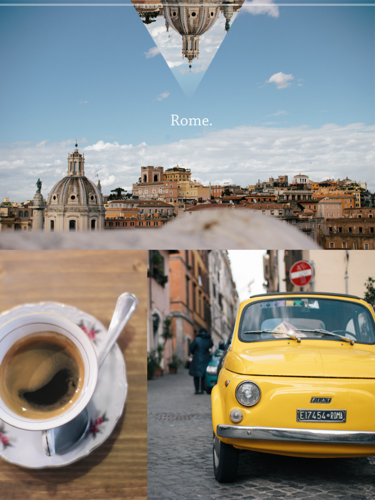
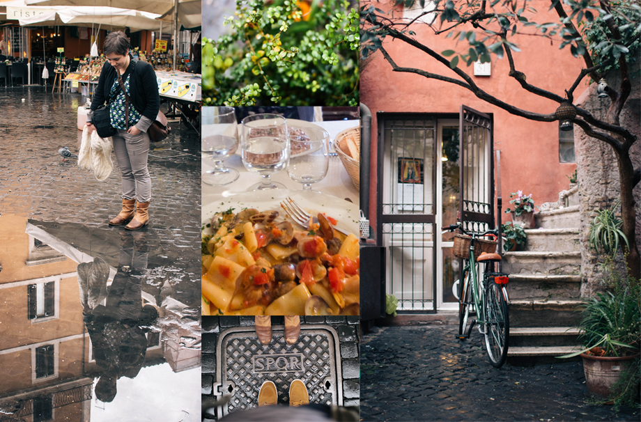
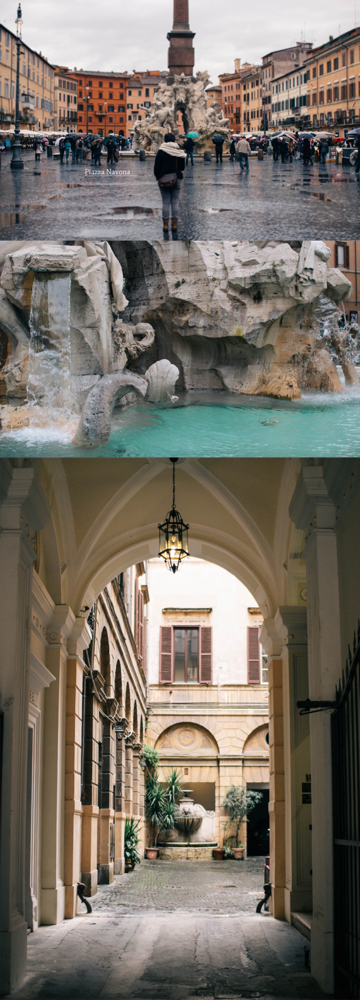
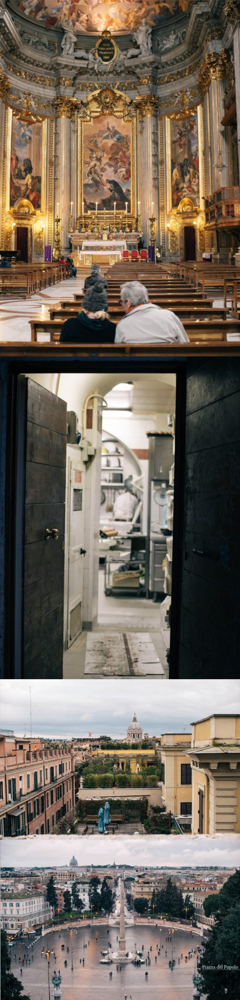
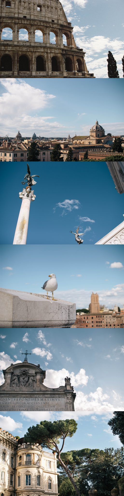
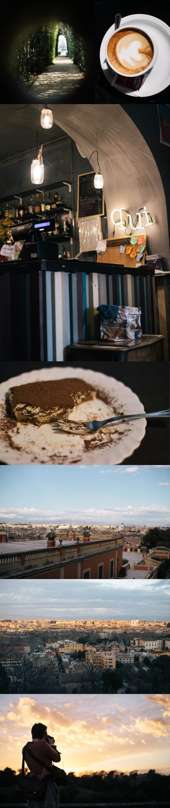

Ah l'Italie, je crois que je ne saurai jamais l'expliquer mais il y a une vraie histoire d'amour avec ce pays, c'est quand même la cinquième fois que je remets les pieds là bas hein ? Ca faisait 8 ans que je n'avais visité **Rome**. C'est cette ville qui m'avait laissé une très belle image de l'Italie et qui m'avait donné envie de revenir (encore et encore). Après Naples et son bassin, la Vallée d'Aoste et Venise, je décidais de retourner à Rome rejoindre une amie pour 3 jours début mars. Pour vérifier si j'aimais toujours cette ville, les pâtes, les pizza, les tiramisu (et les italiennes).

Je l'attendais depuis la fin de l'année dernière ce week-end, on en parlait déjà trop, mais une fois mon vol acheté via un [comparateur](http://www.alibabuy.com/), on ne s'arrêtait plus, enfin l'occasion de se revoir avec Perrine après tant de mois (années?) après la fin du lycée ! Ce week-end s'annonçait prometteur. Je ne savais pas ce que j'allais penser de Rome, si j'allais avoir oublié ce que j'avais aimé ou alors m'en souvenir comme si c'était hier. Je dois avouer, qu'à 23 ans, dire "ça faisait 8 ans que..." ça fait mal. J'ai l'impression d'avoir vécu la moitié de ma vie depuis ce voyage "Ah d'mon temps, c'était pas la même mon petit gars". Bref, il n'en est rien, ce week-end était parfait.

J'arrivais de nuit et sous la pluie à Fiumicino - pas de bagages à récupérer - je suis l'un des premiers à récupérer le bus qui m'amènera jusqu'à la gare de Termini_._ Prenez votre billet directement auprès de la petite dame qui attend à l'entrée des bus, j'ai pris Terravision à l'aller et la TAM au retour, ils se valent tous, il faut compter 5€ l'aller simple pour 45 minutes de bus environ (pas cher, premier bon point).  Retrouvailles faites à Termini, c'est l'heure d'aller passer une première soirée au calme, quartier Monti, on refait le monde assis sur le bord d'une fontaine au milieu de la piazza. Demain, grosse journée. C'était sans compter sur la pluie, résultat on décide d'aller s'enterrer au Vatican (sans jeu de mot hein?) mais évidemment c'était LA mauvaise idée, à 3 jours du conclave, pas futé Jérémy. On est trempé et la file d'attente s'enroule tout autour de la Place Saint Pierre. Tant pis pour cette fois, on arnaque se jette sur un vendeur de parapluie, 5€ quand même, le bout de k-way sur une tige qui menace de se casser à la moindre rafale de vent. Du coup on ruse, on sort des pièces grisées, dorées et cuivrées au préalable, genre fond de poche : "_scusi-ho-solo-doué-éouro-e-tutti-quanti_" avec la moue de caliméro qui grelotte. 20 secondes plus tard, on repartait abrités. 'sont pas difficiles en affaire.

On arpente les rues, sans carte, sans but du coup on tourne beaucoup en rond, mais on trouve aussi des coins sympas, on pousse des portes, en referment d'autres. On rentre dans des cours intérieures, en regarde d'autres de plus loin. On traverse le Tibre dans un sens, puis dans l'autre. La pluie ne s'arrête vraiment pas. GRRAOU BROUWH (<-- c'était le bruit de nos estomacs), du coup, on décide d'aller manger au restaurant, parce que tourner autour de la _**piazza Navona**_ pendant 20 minutes sans trouver l'entrée, on se sent vraiment ridicule. On va reprendre des forces, et se sécher un peu, on ira après. Au menu : **Paccheri alle vongole**. Les Paccheri se sont des grosses pâtes un peu épaisses et juste délicieuses accompagnées de palourdes, c'est une tuerie messieurs dames. On a pris le temps de manger histoire d'attendre une éclaircie, cette fois pas question de rater l'entrée de la **_Piazza Navona_**, et bien sûr on l'a trouvé en 23 secondes et demi cette fois-ci. On ne s'attarde pas, la place est très belle, mais on préfère de loin, aller se perdre dans les rues parallèles. (c'est qu'on y avait pris goût le matin!). On s'arrête devant les Vespa, les friperies, les portes-tarabiscotées. On remonte vers la **Piazza di Spagna** pour observer les gens se prendre en photo avec des sourires forcés admirer les perspectives sur la ville. On remonte encore un peu, le long de la _**Villa Borghese**_ pour avoir un joli point de vue pour le coucher de soleil qui, ce soir, a la tête dans les nuages. On s'arrête juste au dessus de la **Piazza del Popolo** pour profiter de la vue sur toute la ville. Rome sous la pluie c'est quand même trop beau. Tous les toits sont utilisés : terrasses, jardins, piscines... c'est une ville sur la ville. Tout est coloré. On dit que les toits de Paris sont jolis, c'est rien comparé à ceux de Rome, vraiment.

Bon là c'était gris, mais c'est chouette quand même non ? Et bien, maintenant ça va être tout bleu. Le temps de passer une soirée et de tester l'_aperitivo_ romain au _**San Lorenzo Caffé**_. L'aperitivo, c'est un concept né à Naples et qui est venu à Rome par la suite. On paie sa boisson en arrivant dans un bar, comptez 7€ et après vous avez accès au buffet à volonté. Pâtes, toasts, Pâtes, spécialités asiatiques (!), pizza, pâtes... tout y est, de quoi (largement) manger à sa faim tout est étant déjà dans le bar dans lequel vous allez passer la soirée. La soirée se prolonge au bar, puis un deuxième et un troisième. Il est 2h30, on croise des démarches pas très droites, des têtes pas très fraiches, des mots pas très nets... on rentre ? Petit arrêt par la Boulangerie _**Dolce Notte**_, ouverte uniquement la nuit, où je mangerais certainement le meilleur croissant de ma vie : tartiné au nutella, mais surtout à la texture d'un pain au lait (très) gras. MAGIQUE.

 Le réveil pique, grande journée ensoleillée, ce soir, on vise le coucher de soleil depuis l'une des collines qui surplombe la ville. Le contraste entre la veille et ce jour, est incroyable. La météo est super agréable, les lunettes de soleil sont même de sorties. On passe devant le Colisée, le Forum, on fait un détour par le Capitole pour profiter d'un nouveau point de vue. On prend le temps, on se perd dans les rues, se retrouvent. On traverse le Tibre, direction le quartier de _**Trastevere**_, moins connu des guides touristiques, c'est un quartier bourré de charme, plein de ruelles colorées, de fontaines, c'est très animé, les façades et les terrasses sont à tomber. La glace stracciatella aussi. On se balade, prend des photos, bref, la journée suit son court sous un soleil radieux et un ciel _mamma-mia-y-en-a-pas-des-comme-ça-à-Nantes._ La luminosité commençant à baisser, on décide de monter au point de vue pour attendre le coucher de soleil, direction _**Il Gianicolo**._ Les pieds dans le vide, le regard qui balaie la ville, le Panthéon à droite, la Basilique Saint Pierre à Gauche, l'Eglise Orthodoxe de l'autre côté, le bâtiment Vittorio Emmanuele... une vraie carte postale. Le tout gratifié d'un superbe coucher de soleil.



Et si on rentrait ? Les jambes sont lourdes, le problème à Rome c'est que les transports en commun, il y en a aussi souvent que des trams à Nantes à 2h du matin. Pas d'horaires, pas de panneaux d'affichage, du coup, mieux vaut ne pas avoir rendez-vous. Finalement, après 45minutes d'attente, le bus est finalement venu nous ramasser au crépuscule. Ce soir, c'est pizzeria et pour faire original : une bonne vieille 4 fromages... _buonissimo_. Un tiramisu pour le dessert (on a beaucoup marché alors on peut!). Le tiramisu c'est la vie. C'est tout.

 Dernier réveil, ça file à toute vitesse. Le soleil tape à la place de la pluie annoncée. Ni une ni deux, on descend en bas de l'immeuble à la _**Panella**_ pour un petit dej' cappucino + croissant au nutella. Le combo gagnant. On part se balader dans un marché vintage, des ruelles à quelques encablures du forum, on monte au célèbre point de vue du _trou-de-la-serrure_. Il faudra faire la queue, 1 ou 2 minutes derrière la porte ou des abrutis gens regardent à travers un trou. Oui ok, j'ai fait pareil, on était là pour ça en même temps. On redescend prendre un verre dans un café super sympa : le _**2 periodico cafè**_. Le cadre est vraiment chouette. Un dernier capuccino romain avant de partir. Le midi c'est gnocchi. L'après-midi, c'est fini.

Le départ, sous une pluie diluvienne qui ne tardera pas à se transformer en grêle, comme un signe, comme une ambiance de coup de blues du dimanche soir. Ce week-end était parfait. 8 ans après, j'aime toujours cette ville, les pâtes, les pizza, les tiramisu (et les italiennes).

_(liens partiellement sponsorisés)_
