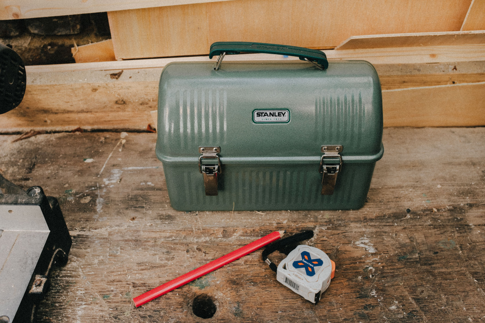
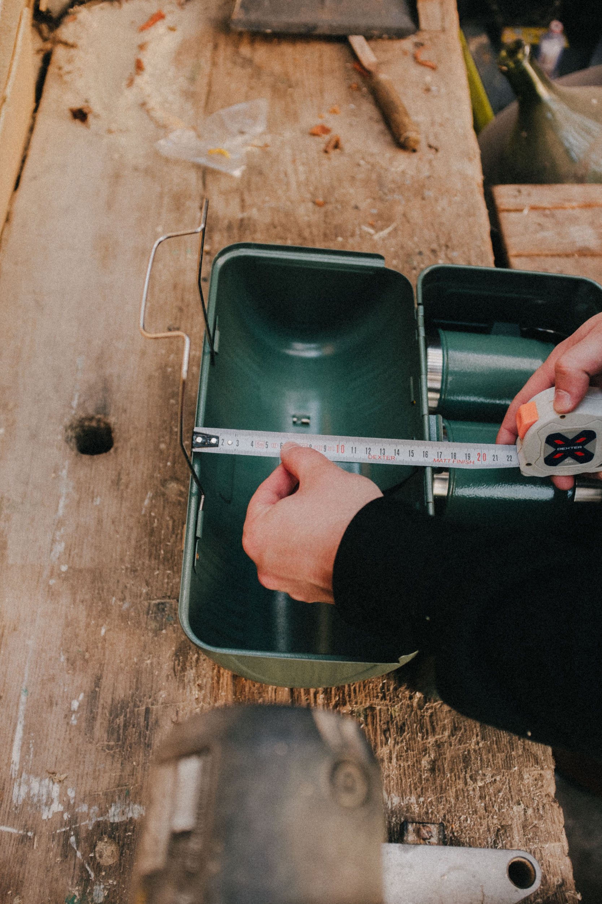
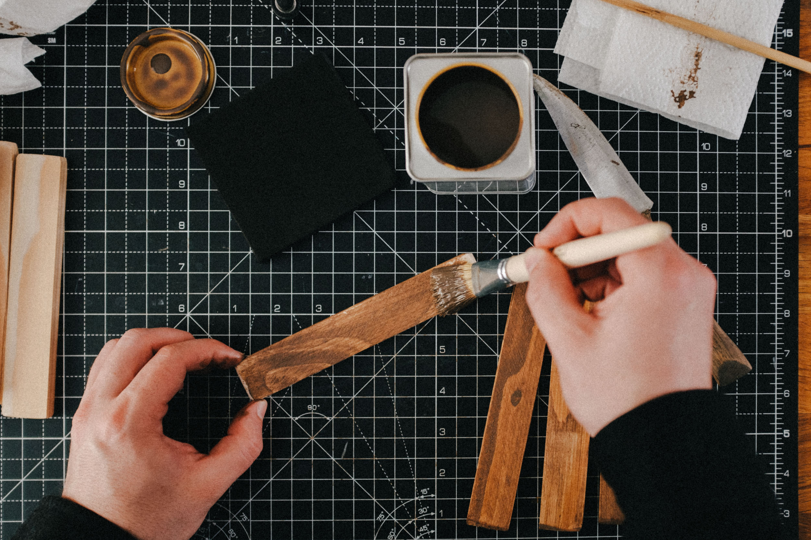
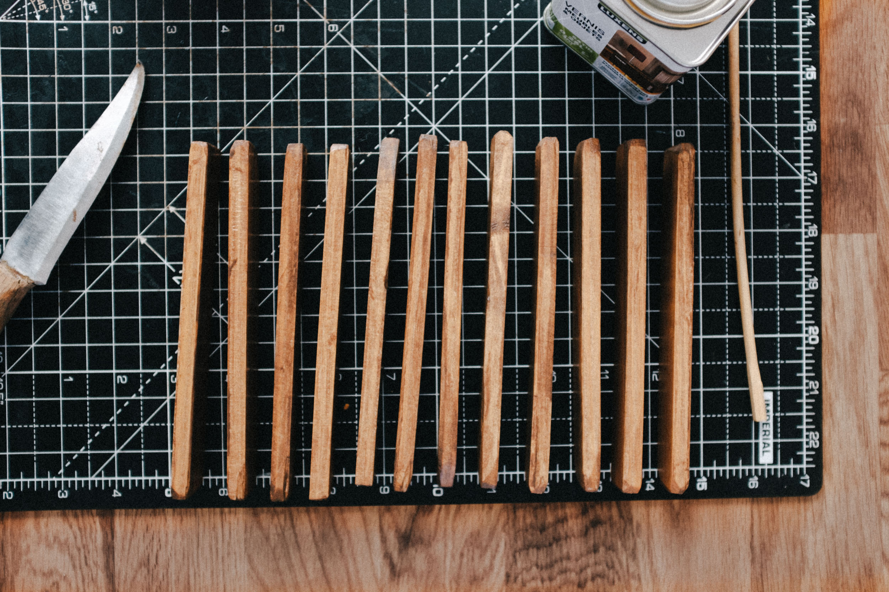
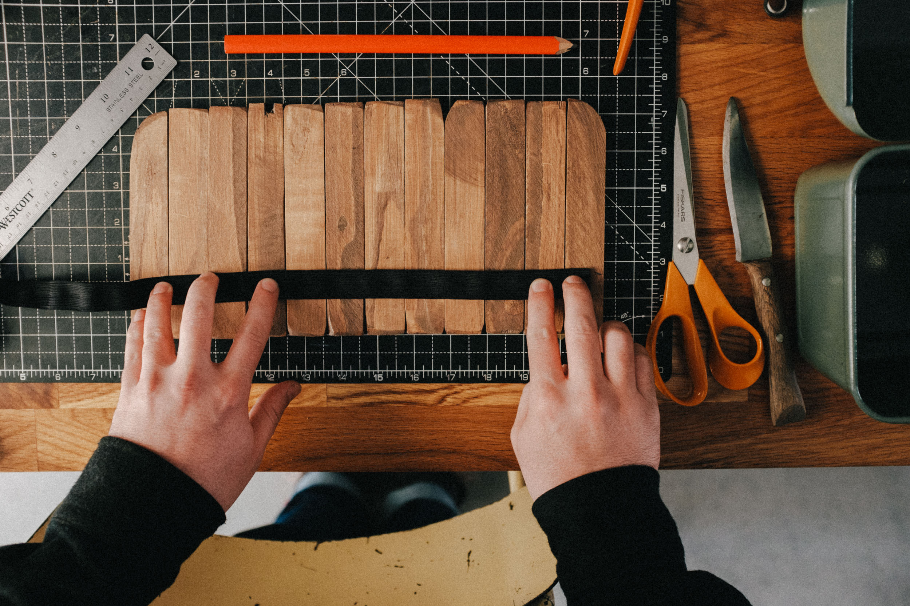
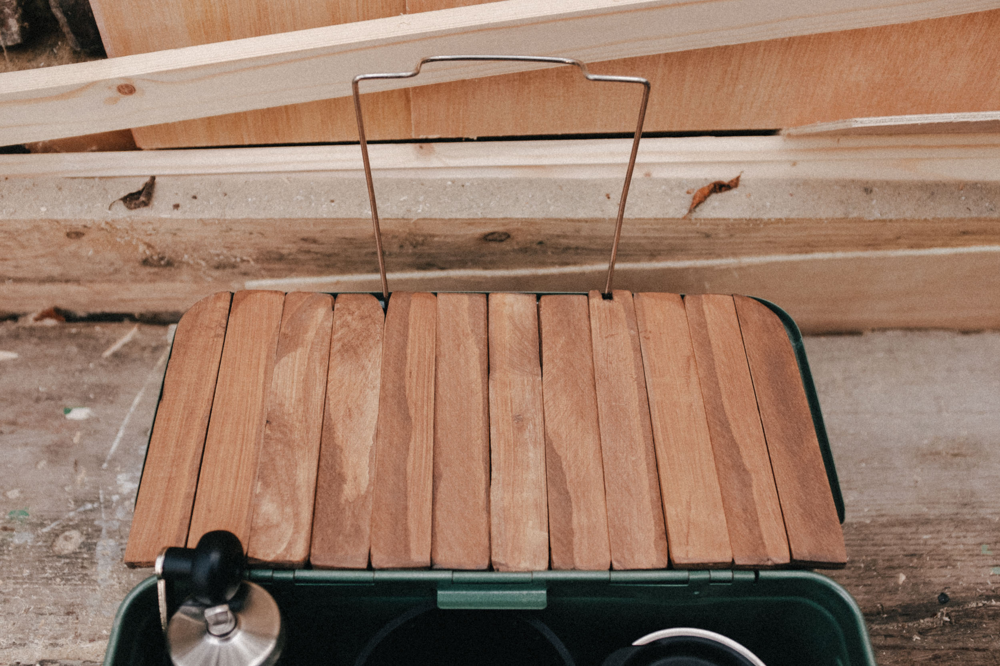
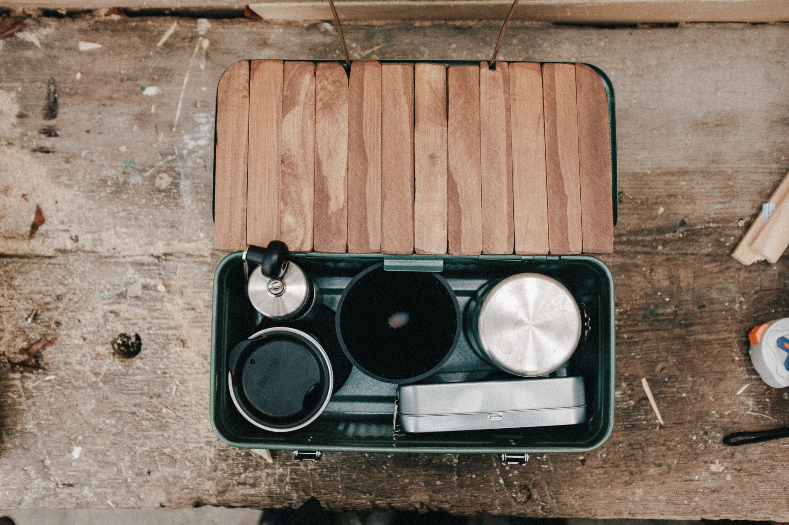
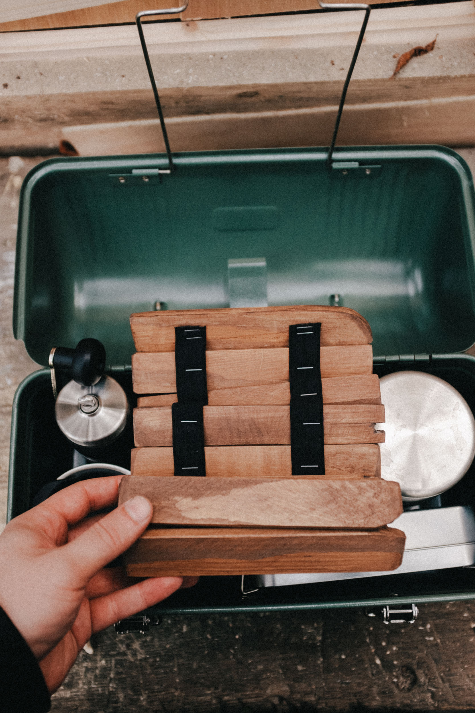
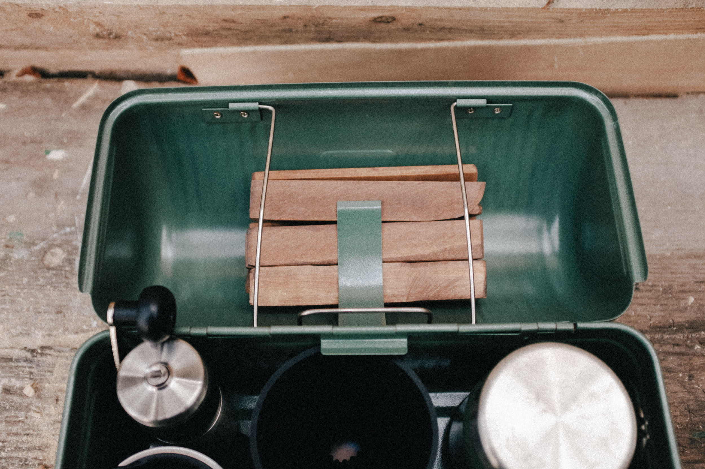
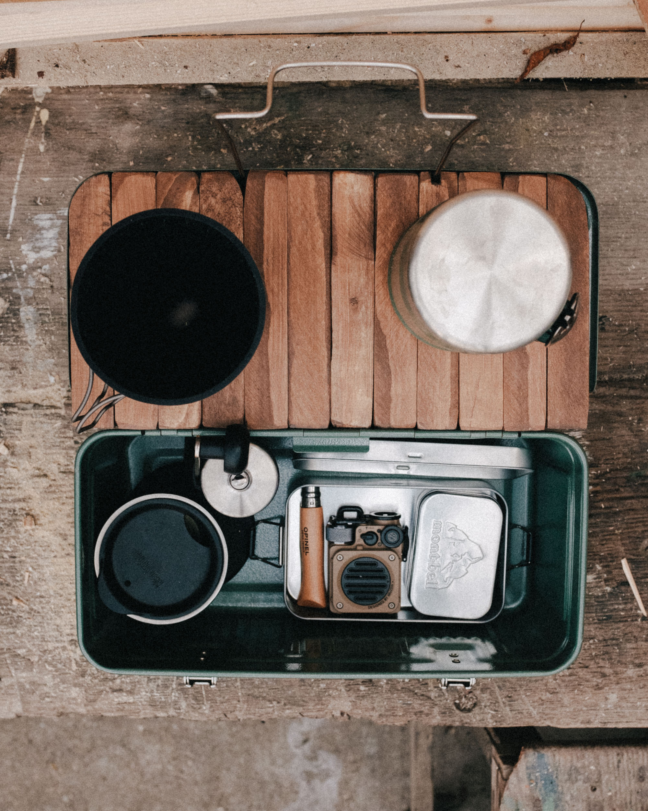

Avec l’arrivée du printemps, ma rééducation du genou qui commence à porter ses fruits et les prémices de notre nouveau petit projet [Slow Is Beautiful](http://slowisbeautiful.cool), j’ai clairement l’esprit occupé à planifier mes prochaines sorties. Après m’être découvert un goût inattendu pour le café à l’automne dernier, je prends un vrai plaisir à prendre le temps de moudre mes grains et me préparer un café filtre dans ma chemex. Le soleil commençant à repointer le bout de son nez, je songe déjà à nos prochaines sorties pique-nique ou juste pour prendre un café dehors. Ces dernières semaines, j’ai commencé à réfléchir à comment améliorer certaines parties de mon setup. Je suis fan de ma [lunch box Stanley](https://amzn.to/3MqZbPH), qu’on emmène avec nous en pique-nique. 

En tombant par hasard sur une vidéo sur internet, j’ai vu que des tablettes sur-mesure pour le couvercle de la lunch box existaient. J’aurais pu l’acheter, mais j’aimais bien l’idée de le faire moi, de travailler le bois et d’avoir un rendu un peu plus imparfait et rustique. J’ai utilisé un tasseau pas trop épais que j’ai découpé en sections de 17cm, réalisé quelques encoches et arrondi les angles quand nécessaire et agrafé le tout sur deux bandes élastiques de 20mm pour pouvoir facilement l’enrouler sur lui-même et le stocker dans le couvercle de la Stanley. Je l’ai teint et j’ai fabriqué une cire pour renforcer la resistance à l’eau, à base de paraffine et cire végétale.

   

   

Une fois installée dans le couvercle de la Stanley Lunch Box, cette tablette me sert de petite étagère pour pouvoir poser mon setup café, des verres et autres accessoires qui ont besoin d’être stables et surélevés du sol, lors de nos futurs piques-nique.

Au final, c’était un chouette petit projet à faire. Ça m’a donné envie d’envisager plus de projets en bois à l’avenir, et renforcé mon attrait pour le fait de créer des choses de mes mains, comme j’aime déjà tellement le faire avec la [couture outdoor](https://instagram.com/fieldpacks).

Je vous laisse avec la version vidéo sans prétention pour tester les capacités de mon Fuji X100F pour filmer ce genre de petit projet tout simple :


