Depuis mars et mon retour en France, j'ai repris activement les sorties en montagne et les bivouacs. Cette fois-ci, j'ai décidé de m'alléger et d'upgrader mon matériel pour partir plus léger et avec du matériel de qualité. La priorité a été le sac de couchage car j'avais uniquement des sacs de couchage d'été avec une lumite de confort à 8°c donc clairement inutile pour des nuitées à 2500m en fin d'hiver / début printemps et finalement même l'été. Je voulais un sac de couchage avec trois critères : léger, chaud pour descendre à des nuits à -2°c au moins et avec un prix exhorbitant. Au fil de mes recherches, je trouvais ce qu'il me fallait mais à plus de 400 ou 500€, largement hors budget. Un ami m'a parlé de la marque Cumulus, une marque polonaise pas très connue mais aux sacs performants. Lui a opté pour le Liteline 400 pour son trip en Islande, dont vous pouvez voir les photos ici, après avoir comparé avec le modèle juste au dessus, mon choix s'est finalement porté sur le [Panyam 450](http://sacsdecouchage.fr/it/categories/sac-de-couchage/panyam-450?gid=44&vid=6).

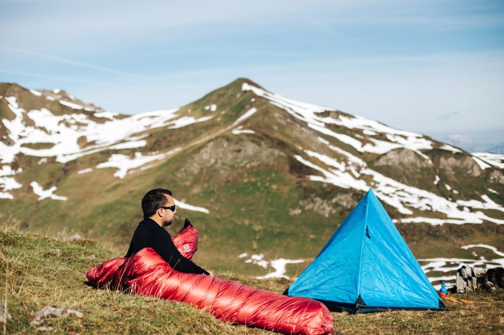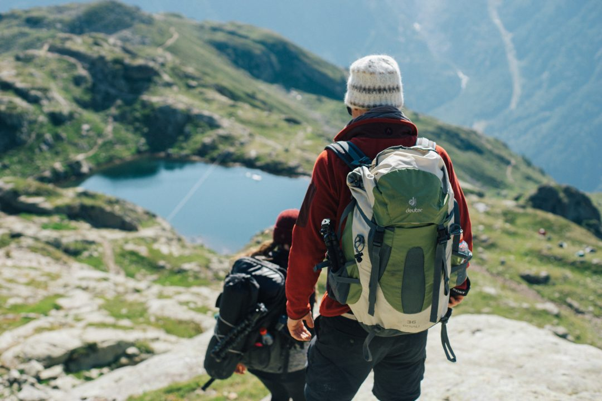

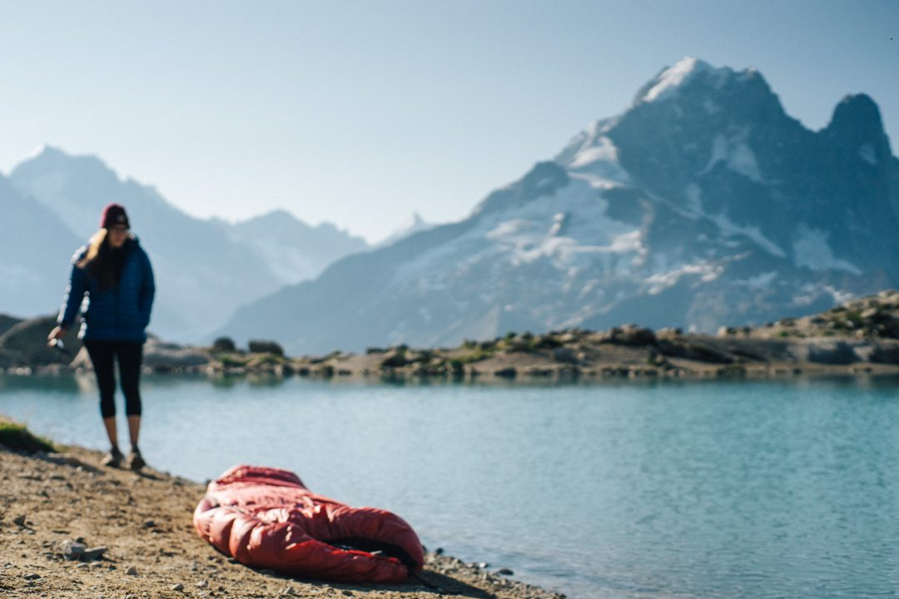

Le Panyam 450 est l'un des deux modèles de la série Panyam de la marque. L'autre est le 600 qui contient 600g de duvet pour un poids d'1kg. J'ai préféré grapiller quelques grammes en optant pour le Panyam 450. Ce dernier contient 450g de duvet pour un poids total de 835g. Il est ultra compact, on le stock dans un sac de stockage et en rando, on le met dans un sac de compression. Échauffements assurés au moment de le rouler dans le sac de compression avant le partir. Le sac est très bouffant, ce qui est top mais pas toujours facile de le faire rentrer dans le sac de compression, mais ça finit toujours par rentrer. J'ai reçu mon Panyam 450 quelques jours avant de partir en bivouac fin avril dans le Beaufortain à 2300m d'altitude pour un premier verdict et l'ai repris avec moi en bivouac à Chamonix à 2400m. Avec une température de confort à 0°c, il permet de dormir au chaud quasiment pendant 3 saisons complètes : printemps - été - automne.

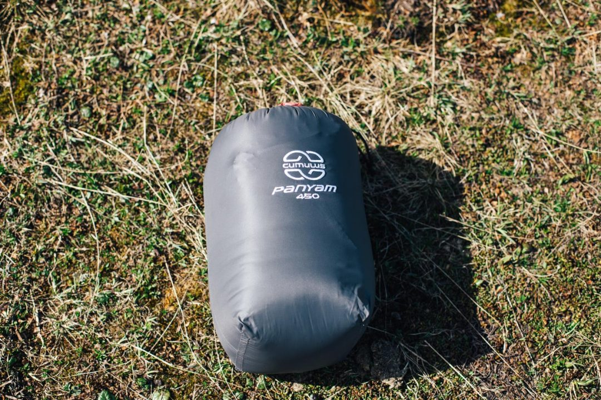

Une fois compressé, le sac a un volume d’environ 6,6 litres et lorsqu'on le déroule dans la tente, son gonflage de 450 grammes de plume est impressionnant. Le duvet est un duvet d'oie en 850 cuin de qualité. Passons aux choses plus pratiques, le tissu tout d'abord, il semble fragile, on fait attention à ne pas l'accrocher dans la fermeture éclaire et finalement malgré quelques accrochages et blocages de fermetures, le tissu tient le coup. Étant donné que c'est un sac en duvet et non un synthétique, il est davantage sensible à l'humidité, il faut faire attention à réduire un maximum la condensation et le contact avec une zone humide. Toutefois, je me suis déjà réveillé avec une tente pleine de condensation et le sac vraiment mouillé, un séchage à l'air libre quelques minutes et il est redevenu comme avant.

Le gonflant du sac est un must au niveau du confort du sac, on a l'impression de se rouler dans une grosse couette bouffante, c'est super agréable et je dois dire que ces deux nuits en bivouac dans des conditions vraiment différentes : températures négatives pour l'un, avec neige et gel sur la tente au petit matin et nuit douce en bord de lac pour l'autre, ont été de loin mes meilleures nuits. Je réussis enfin à dormir d'une traite sans être réveillé par un courant d'air ou un soudain coup de froid en bivouac et ça joue énormément sur la forme du lendemain. Je me surprends même à avoir du mal à sortir du lit quand le réveil sonne pour voir les premiers rayons du soleil, tellement je dors confortablement. Alors plus que jamais, celui là ou un autre, un bon sac de couchage est vraiment primordial.

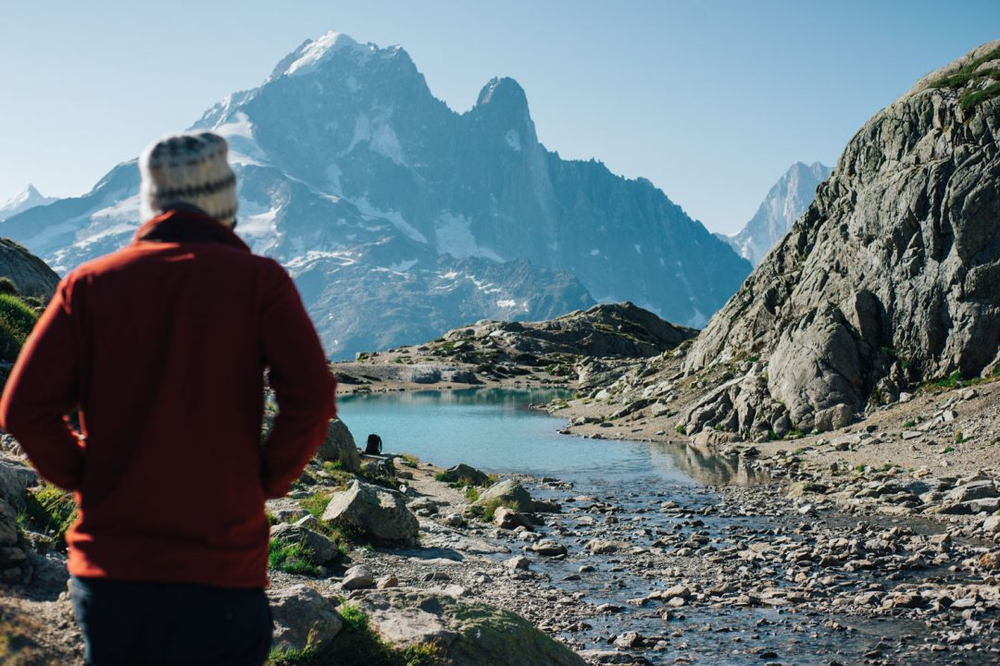 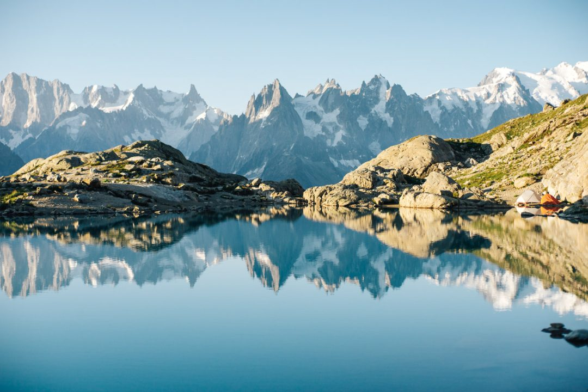 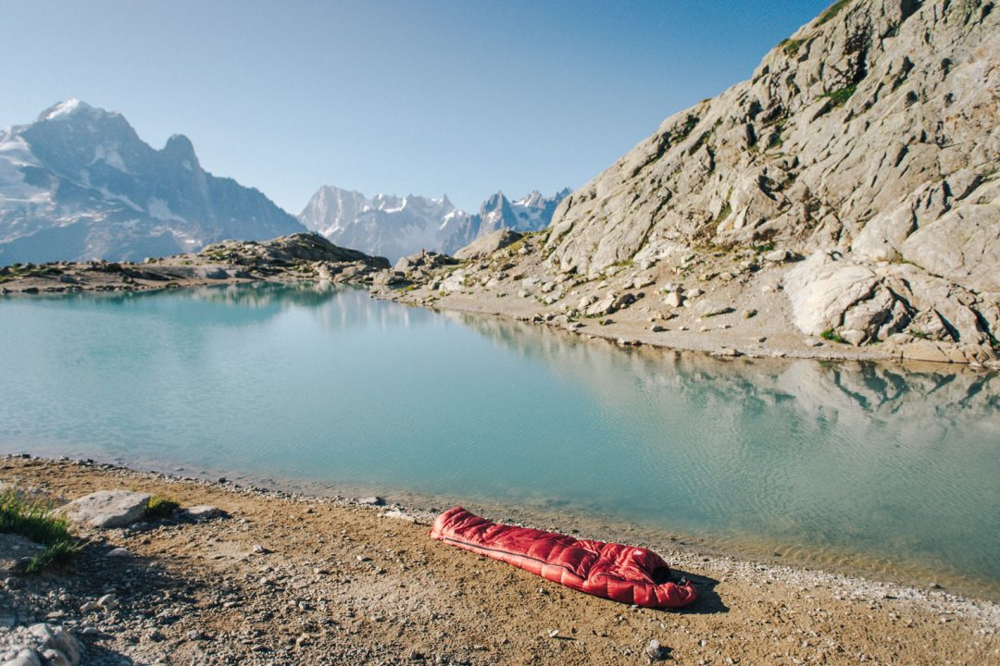

La nuit à Chamonix a été beaucoup plus chaude, autour des 4 ou 5°c, j'ai dormi dans un endroit avec peu de place et impossible de planter les sardines pour tendre la tente, les cailloux ont tenu mais un montage loin d'être idéal, à quelques centimètres d'un cours d'eau qui alimente un lac. Un courant d'air s'est faufilé dans la nuit dans la tente alors que je dormais avec le zip ouvert, j'ai simplement fermé le zip et ajusté la colerette anti-froid et me suis rendormi sans souci jusqu'au lendemain. Avant, dans des conditions similaires, je dormais systématiquement avec des sous vêtements thermiques, désormais je dors normalement dans le drap de soie à l'intérieur du sac. La coupe du sac est ajustée mais pas trop étroite, parfait pour pouvoir bouger un peu dedans et la capuche est vraiment chouette. Elle reste bien sous la tête même si on bouge, un vrai bon point.

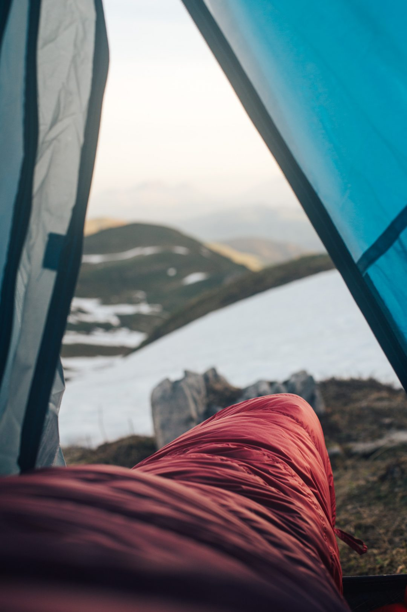 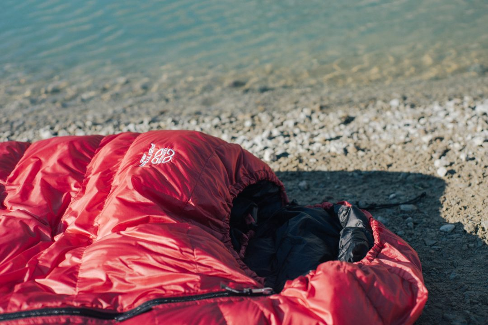 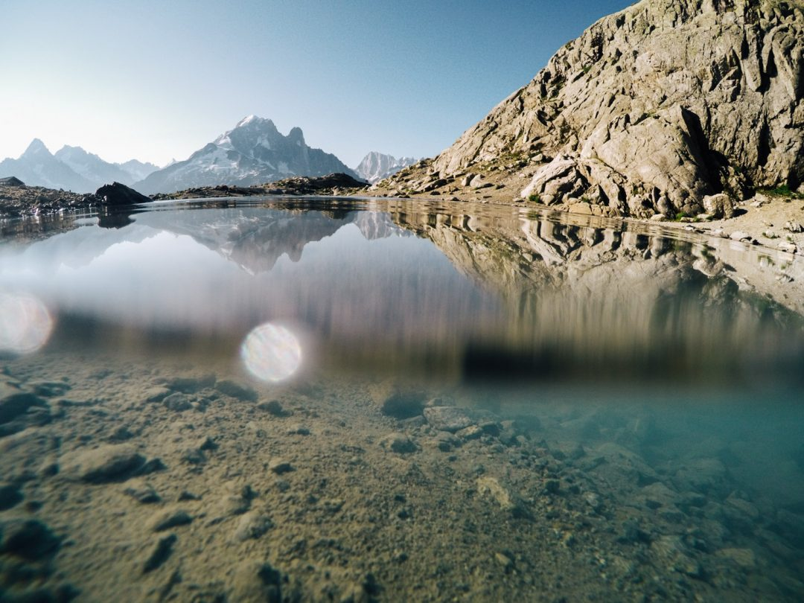 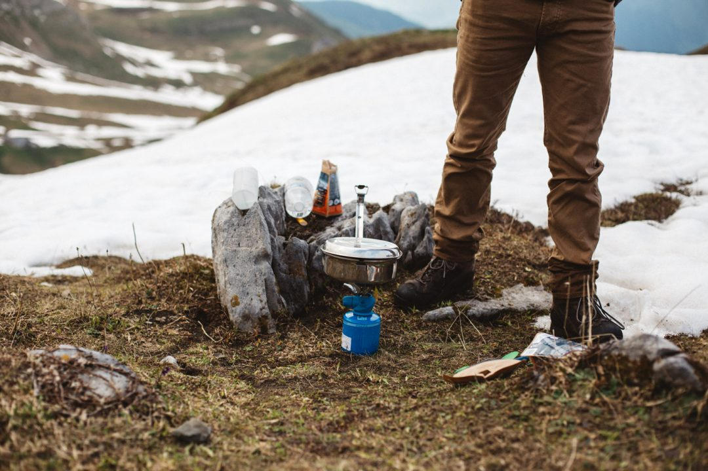 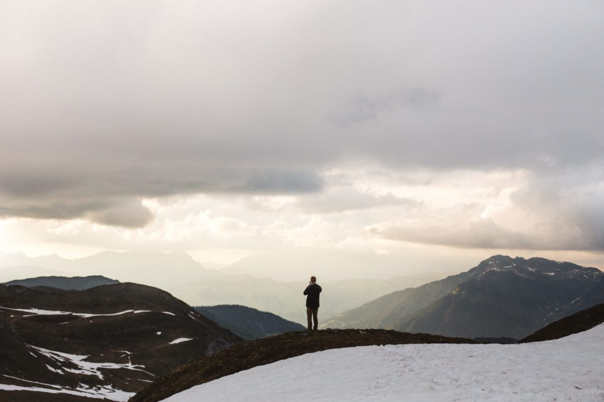

Avec ma petite taille, je cherchais aussi un sac pas trop grand, le mien mesure 175cm de long ce qui est parfait sur mon matelas de 180cm, je n'ai pas l'impression de nager dedans non plus et l'isolation au bout au niveau des pieds est vraiment agréable. Le rapport qualité / prix est vraiment bluffant comparé à la concurrence, certes 260€ pour un sac de couchage reste un investissement, mais encore une fois si c'est juste pour aller camper l'été entre amis ce n'est pas ce que vous recherchez ici, parcontre pour quelqu'un qui souhaite randonner aussi au printemps et à l'automne et qui cherche un sac 3 saisons, c'est une option vraiment intéressante. [Cumulus](http://sacsdecouchage.fr/) gagne vraiment à être connu, l'équipe est en plus vraiment sympa et vous avez des tonnes d'options au moment de la commande, vous pouvez demander plus de plumes, ajuster la longueur du sac, changer la couleur etc... Je pense avoir couvert déjà pas mal de points mais si vous avez des questions, n'hésitez pas, je détaillerai dans un prochain article le contenu de mon sac quand je pars bivouaquer. En tous cas, désormais je ne pars plus sans mon Panyam 450, j'étais mal équipé en terme de couchage jusqu'à présent au point de ne presque pas dormir en bivouac et aujourd'hui, je me réveille reposé et sans aucune sensation de froid dans des conditions météos où il n'est pas toujours facile de dormir correctement tout ça pour un poids assez léger et un encombrement minimal, pile tout ce que je recherchais dans un sac de couchage.

_Merci à Cumulus pour m'avoir permis de faire ce test._
