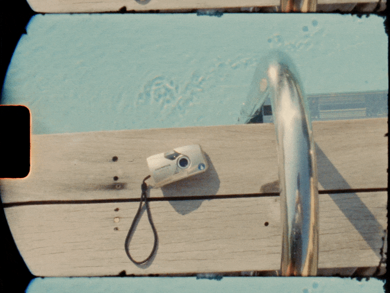
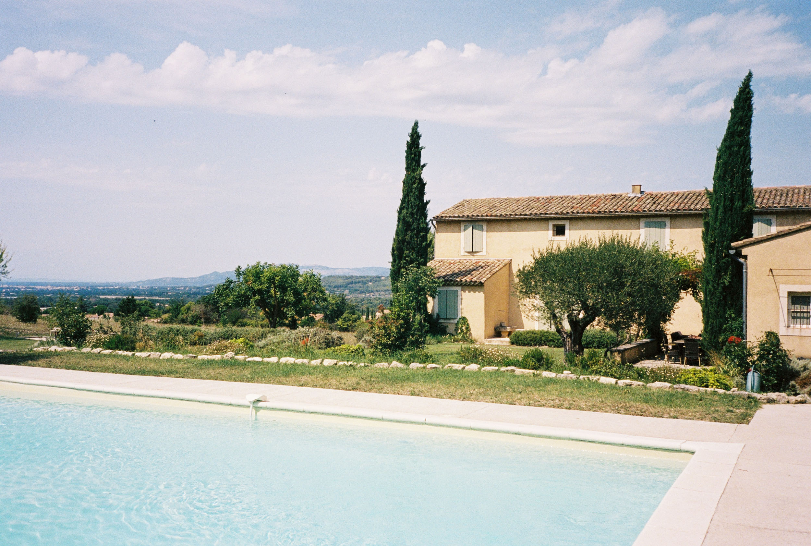
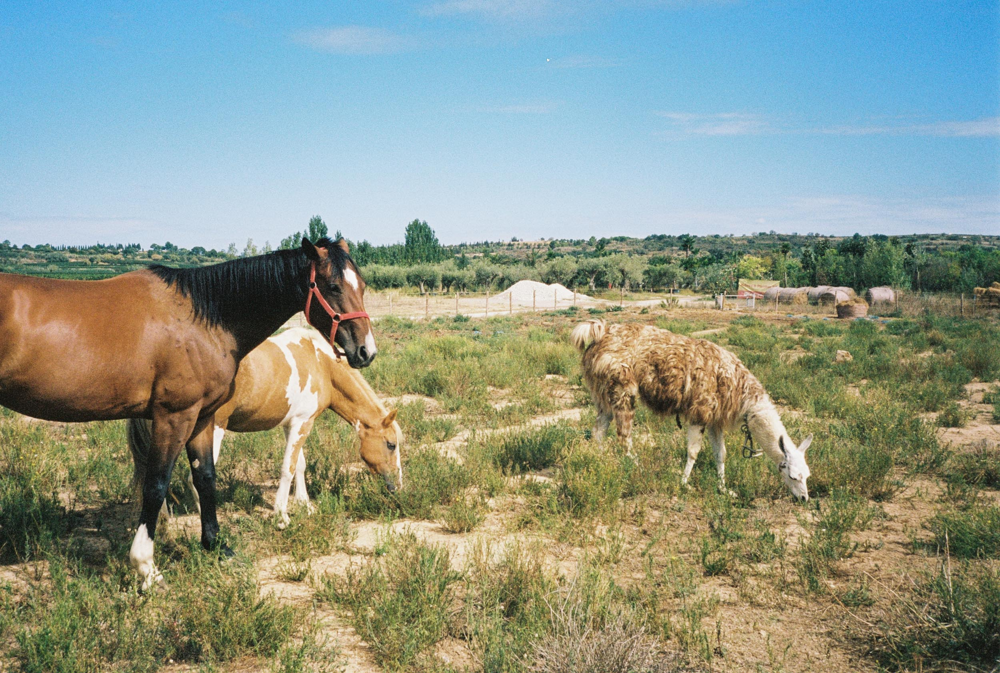
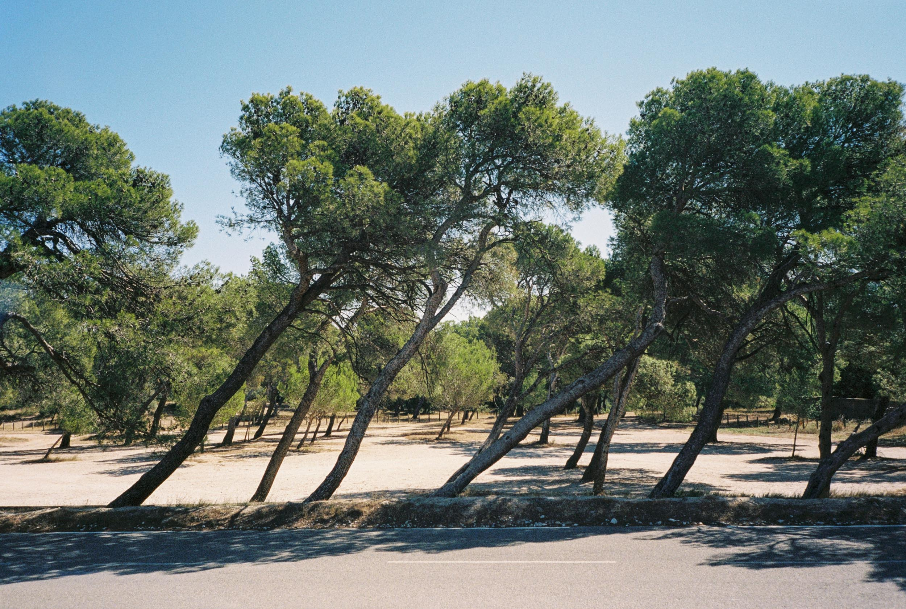
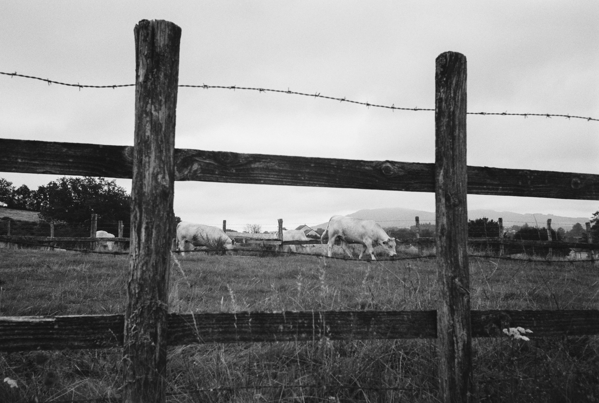
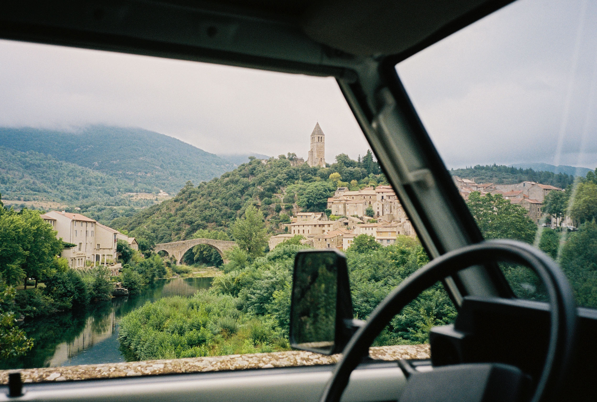
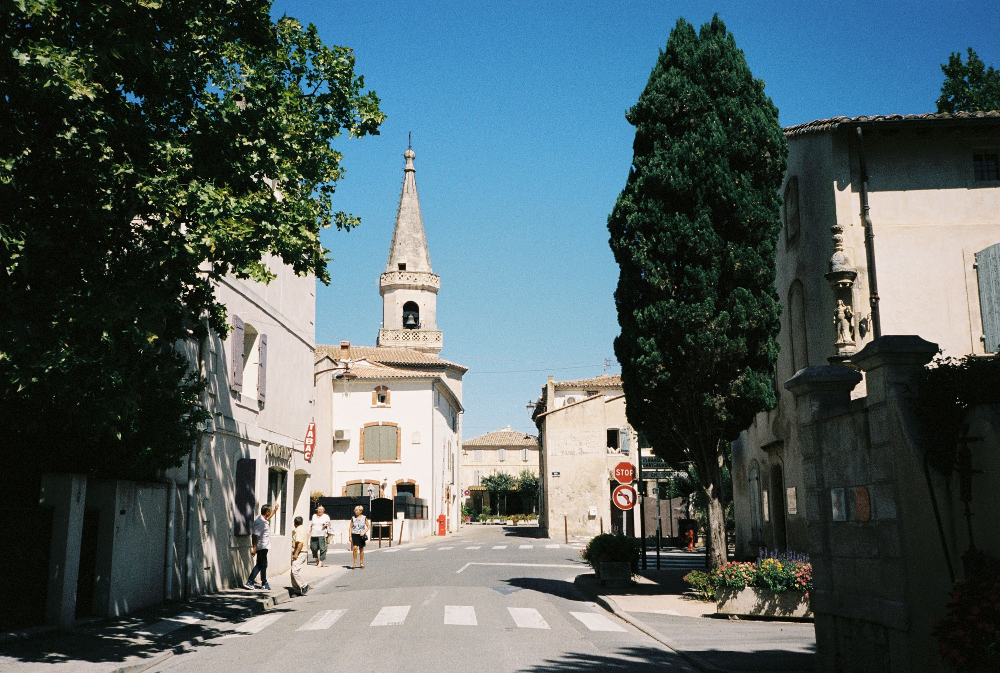
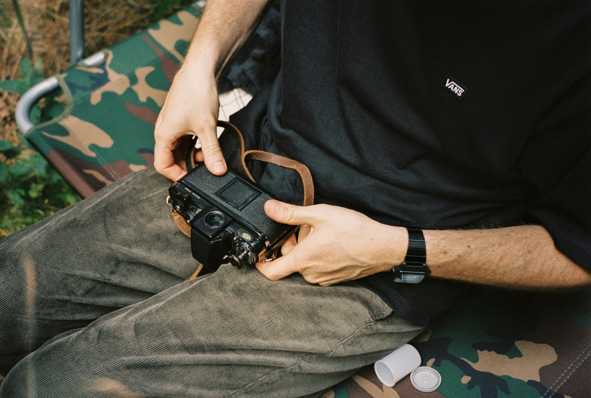
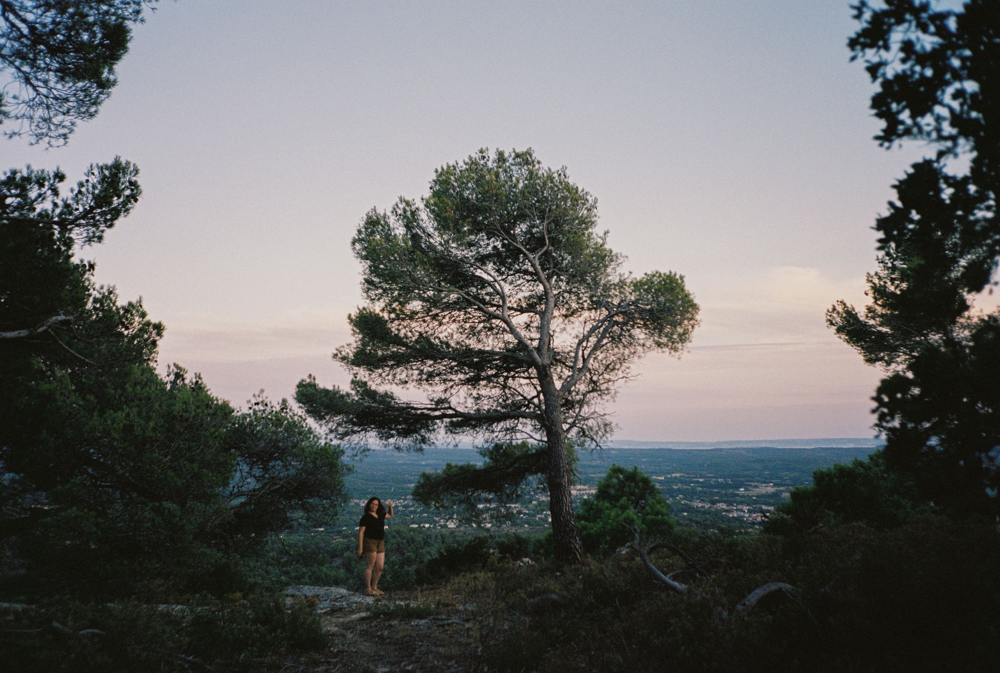
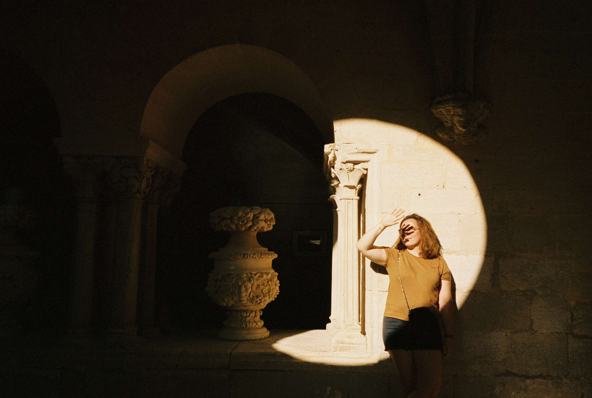

Un appareil photo argentique plein format avec un objectif 35mm lumineux et contrasté, avec réglages automatiques, léger, qui tient dans la poche... Ça fait rêver ? **L'Olympus Mju II l'a fait.**

_Olympus Mju II filmé à la Super 8_

Ça fait bientôt une année que je suis passé à photographier quasi exclusivement à l'argentique dans un usage perso. Je me suis équipé de plusieurs appareils dont un Olympus XA que je comptais emmener partout. Bien que j'ai adoré cet appareil, je me suis rendu compte que je cherchais à l'utiliser comme un _point and shoot_, alors qu'il n'en est pas un. Ce que j'attends d'un petit compact argentique comme ça, c'est presque de le transformer en un iPhone version argentique : autofocus, réglages automatiques... de la photo simple et sans chichi. Or, même si le XA est un super appareil, j'ai été déçu de quelques pellicules notamment au niveau de l'excès de vignettage, du rendu de certaines images et finalement, je ne le prenais pas partout comme mon iPhone. _Enter the Olympus Mju II._

   

Après un séjour breton chez [Greg](https://gregorymignard.com) et pas mal de discussions (comme d'habitude) dans le van, l'idée a commencé à faire son chemin par un beau soir d'été en quête d'une soirée pizza - coucher de soleil - photo au phare du Minou. On a commencé à se poser la question "Si t'avais budget illimité, t'achètes quoi comme caméra pour la vidéo ?" ou alors "Si tu ne devais garder qu'un seul appareil argentique, ça serait lequel ?" etc... Et finalement, on a atterri sur le sujet des points and shoots. On avait tous les deux la même idée à ce sujet mais on ne le savait pas encore et elle germait. On trouvait que l'Olympus Mju II était attrayant mais trop "hype" (un peu comme le Contax T2). C'est pour ça qu'on ne s'y était jamais vraiment intéressés. Et puis, l'idée a fait son chemin et la décision était prise. On a revendu nos XA pour s'acheter un Mju II. Le timing était parfait, je m'apprétais à partir pour 1 mois de vadrouille traditionnelle estivale en semi-télétravail / semi-vacances et j'allais pouvoir tester cet appareil directement en conditions de vacances. Il n'y-avait pas meilleur moment pour apprendre à le prendre en main et voir ce dont il était capable. J'ai mis une pile 3V de type [**CR123A**](https://amzn.to/3j139iC) dans l'Olympus Mju II, chargé une pellicule, puis deux, puis trois et la magie n'a pas tardé à opérer.

   

Fidèle aux racines du XA, l'Olympus Mju II est selon moi encore plus ergonomique et réactif. Cette ouverture par clapet coulissant qui allume l'appareil est un vrai bonheur. On est prêt en un clin d'oeil à déclencher. Là où j'avais peur que le flash se déclenche systématiquement si j'oubliais de le désactiver, ça s'est avéré bien moins gênant en réalité en shootant des pellicules à 400ASA comme la [Portra 400](https://www.digit-photo.com/KODAK-Portra-400-135-36-Poses-X5-rKFILM386.html?dpa_id=21) ou l'[UltraMax 400](https://www.digit-photo.com/KODAK-Ultramax-400-135-36-Poses-X3-rKODAK41024389.html?dpa_id=21). La prise en main était un bonheur, je ne pouvais très vite plus m'en passer. Je le prenais partout, tout le temps, pour la moindre occasion... Même la plus banale.

   

Avec sa taille compact et son poids léger (près de 150g), je me suis vite rendu compte qu'en taille, l'Olympus Mju II est très proche d'un Sony RX100 numérique. Cette proximité de mensurations a été d'une grande aide au moment de choisir une housse pour le protéger et le transporter. J'ai testé plusieurs housses pour le Mju II pour qu'il soit facile à prendre partout avec moi, dont une en néoprène, mais Greg m'a convaincu de finalement retourner mes premières options et d'opter pour la [**Lowepro Dashpoint 10**](https://www.digit-photo.com/LOWEPRO-Etui-Dashpoint-10-Gris-rLOWEPROLP364380WW.html?dpa_id=21). Et je ne regrette pas depuis, elle ne tient pas dans une poche de jean, mais elle peut s'accrocher à une ceinture, une bretelle de sac à dos ou se porter en bandoulière. Elle protège extrêmement bien le Mju II, et j'ai même la place de glisser une [**pile CR123A pour le Mju II**](https://amzn.to/3j139iC) en rab d'une micro poche intérieure.

Le Mju m'a donné le goût de faire des photos du quotidien. Ces petits moments bénins qui font finalement des supers souvenirs. Bien sûr il y-a quelques erreurs d'autofocus parfois (au même titre que je faisais beaucoup d'erreurs de mise au point avec le télémétrique du XA); mais pour les quelques photos floues, la grande majorité sont nettes et ont un rendu au delà de mes attentes pour un si petit appareil. Avec l'expérience, je me rends compte que pour l'autofocus, j'ai plus de déchet lorsque la scène est très fournie, comme en sous bois par exemple. L'appareil doit avoir plus de mal à savoir sur quel sujet s'accrocher.

   

Le format de l'Olympus Mju II est encore plus confortable à transporter partout. On le glisse facilement dans une poche de short ou d'un sac à dos. Je l'ai emmené à l'accrobranche accroché par un mousqueton à mon beaudrier, en montagne dans la brume, en pique nique sur le bord de la rivière et j'en passe. Et ça n'a été que du bonheur. Bien plus que ce que je ne l'imaginais puisque je me retrouvais à faire des photos que je ne faisais même pas avec mon iPhone. L'Olympus Mju II a beau être un compact argentique tout auto, je trouve qu'il gère très bien les différentes conditions de lumière tant d'un point de vue exposition que d'un point de vue autofocus, autant en plein jour qu'en conditions difficiles (brouillard qui pourrait induire la cellule en erreur, contre-jour etc...). J'apprécie aussi de pouvoir utiliser la fonction "spot" lorsque je prends une photo à travers un cadre pour que la mise au point et l'exposition se fasse au centre du cadre.

Ce que j'ai apprécié aussi c'était de pouvoir compter sur mon Mju II pour immortaliser des moments soudains ou imprévus, mais aussi des photos plus réfléchies si j'en avais l'opportunité et que je n'avais pas pris mon Canon A1 avec moi. Tout y-est donc passé cet été : portraits, paysages, moments de vie, souvenirs, famille... et quel plaisir que de voir ces images sur un négatif et avec le charme d'une belle pellicule saupoudré d'un peu de grain.

Ces photos argentiques ne sont pas les plus incroyables, mais elles signifient beaucoup et me rappellent à des moments que j'ai vécu non pas pour faire des photos, mais bel et bien pour moi et le Mju était là prêt à les immortaliser pour ne jamais les oublier. Beaucoup de tirades d'éloges sans vraiment d'ombre au tableau, si ce n'est son prix qui s'envole et une trappe à pile cassée bêtement sur mon premier Mju II. Premier oui, car j'en suis à mon second, après avoir fait tomber dans l'eau de la mer du Nord, mais qu'importe, l'essentiel est ce que je peux capturer avec et pour ça, la mission est plus que réussie.

Les photos de cet article ont été prises avec l'Olympus Mju II et de la [**Portra 400**](https://www.digit-photo.com/KODAK-Portra-400-135-36-Poses-X5-rKFILM386.html?dpa_id=21) / [**UltraMax 400**](https://www.digit-photo.com/KODAK-Ultramax-400-135-36-Poses-X3-rKODAK41024389.html?dpa_id=21) / [**T-Max 400**](https://www.digit-photo.com/KODAK-T-Max-135-400asa-36-Poses-rFNBK3841038.html?dpa_id=21) / [**Ilford HP5+**](https://www.digit-photo.com/ILFORD-HP5-135-400asa-36-Poses-rFNBI1574577.html?dpa_id=21)

Envie d’échanger sur le sujet avec moi ? [Rejoins-moi sur Twitter](http://twitter.com/jeremy.janin) ou sur [Discord](https://discord.gg/rvk5DTwT8H) 🐥 !
