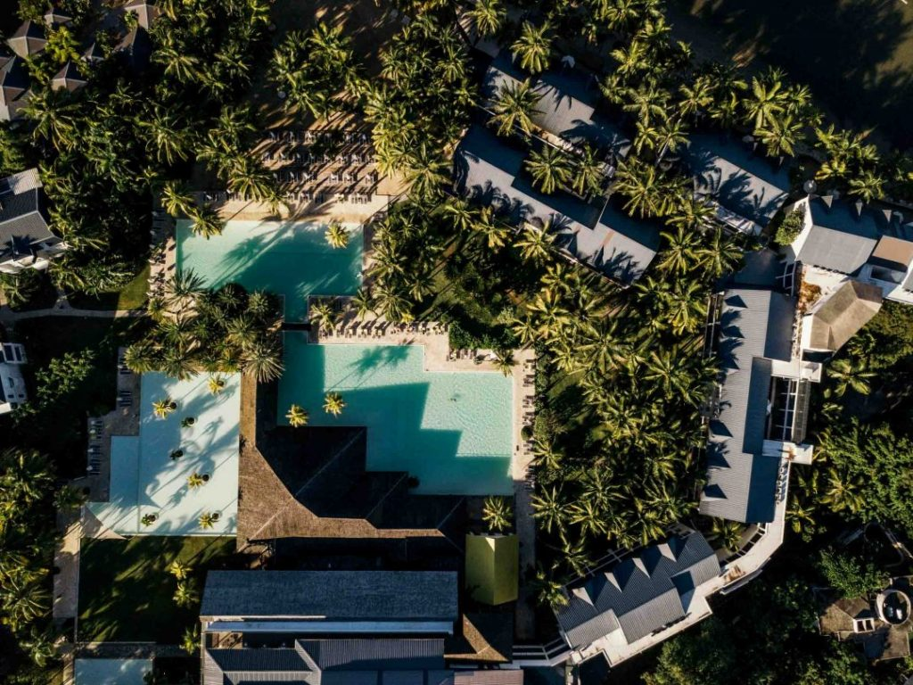

Il y-a quelques semaines, je me suis envolé pour un petit coin de paradis au bout du monde… Une semaine à l’île Maurice. J’étais invité aux côtés de [Samantha](http://paris-tu-paris.fr/), [Céline](http://mercipourlechocolat.fr/), [Morgane](http://morganours.com/) et [Stéphanie](http://www.haveafashionbreak.com/) par les [Hotels Attitude](http://hotels-attitude.com/) pour découvrir la destination à travers des expériences authentiques et différentes de ce qu’on peut trouver dans un resort « classique ». J’avais la double casquette car j’étais aussi en charge de tourner des vidéos sur place pour l’hotel. On a donc paqueté nos affaires dans nos bagages, on a ressorti les maillots de bain et la crème solaire en cette sortie d’hiver pour aller faire une cure de vitamine à base de fruits, de soleil et de paysages qui s’annoncent paradisiaques.

Avant de vous en dire plus, voici la vidéo de ce voyage avec les clips que j’ai pu capturé à côté du tournage, pour moi et pour vous :



Ca a commencé par un "Welcome aboard this Air Mauritius flight bound for Mauritius. » et 11h de vol plus tard, on atterrissait de l’autre côté du globe, dans l’hémisphère sud. Et juste comme ça, c'était parti pour une semaine à l’île Maurice. J’avais un peu l’impression de retourner en Namibie, sauf que cette fois on partait plus à l’Est, au coeur de l’océan Indien. Salué par un lever de soleil comme seule l’île Maurice en a le secret, notre première journée sera placé sous le signe de la détente. On a posé les bagages au Ravenala Hotel et son hall d’accueil comment dire… à couper le souffle. On a pris un petit dej’ avant de poursuivre direction la plage, le paddle, un petit massage entre deux activités et quelques plats tous meilleurs les uns que les autres. On avait pas besoin de penser, juste de se laisser aller… Qu’est-ce que c’était bon. On était là sans vraiment réaliser qu’en quelques heures nous étions passés de l’hiver à l’été, alors on a savouré, on a profité jusqu’à tard le soir, bien après les derniers rayons du soleil.

On a appris à se connaître, on a rigolé, les jours ont défilé au rythme de nos différentes expériences. Tantôt une virée en catamaran vers le majestueux Coin de Mire, tantôt une balade street food dans les rues de la capitale, Port Louis, en passant par des balades à vélo, des baignades… beaucoup de baignades, des heures à passer du bon temps, à savourer chaque instant, des premières aux dernières lueurs. Qu’est-ce que c’était bon, qu’est-ce que c’était bien.

Finalement c’était si simple mais si agréable de passer une semaine à l’île Maurice. Chaque jour nous révélait une nouvelle facette de cette île paradisiaque. Du Zilwa au Tropical, en passant par le Ravenala ou le Coin de Mire, on a eu la chance de changer d’hotels pour profiter de différents coins de l’île, différentes plages et paysages. Ce qui était chouette avec ces hotels c’est qu’on ne baignait pas dans le luxe, c’était confortable, super beau et tout était fait pour qu’on profite de chaque instant mais sans être dans le bling bling, ça restait authentique et ça, c’était chouette. On a même passé une soirée chez Rani, une membre du staff de l’hotel pour cuisiner et manger avec sa famille. Je craignais une activité où on se retrouve à 20 là bas, et que ça fasse un peu « zoo » et que ce soit malsain, mais pas du tout. On sent que Rani et sa famille accueillent leurs hôtes, sincèrement et sont vraiment heureux de partager leur culture hindou avec nous. Un vrai beau moment de partage dont on est tous repartis de là avec une sacrée claque, comme l’envie de ne pas partir et un sourire grand comme ça. Une pause intemporelle dans cette parenthèse extraordinaire.

Il y-a aussi eu cette sortie matinale, ouverture des rideaux alors que la nuit était encore noire et le soleil éclairait encore l’autre partie de la planète. On a marché jusqu’au bout du ponton du Zilwa, quand soudain deux pêcheurs sont sortis de la pénombre pour nous accueillir dans leur barque de pêche pour nous conduire au large admirer le lever du soleil. Ce sont ce genre de moments simples que j’aime tant en voyage. On se lance parfois dans des choses compliquées et c’est bon de simplement admirer la beauté qui nous entoure, d’un moment aussi simple mais tellement beau à la fois.

Ah et puis, on a aussi passé la journée sur un catamaran pour s’approcher du Coin de Mire (une vue dont je ne me suis JAMAIS lassé pendant ce voyage) avant de terminer la journée dans le calme du lagon, à rigoler, à sauter du bateau, à se laisser aller et tout oublier. Un vrai moment de détente, un vrai instant à part.

Des moments forts pendant ce voyage, il y-en a eu beaucoup et plus encore en une semaine à l’île Maurice. Il y-a eu cette balade à vélo où on est tombés par hasard sur deux tortues centenaires, cette soirée magique au Zilwa Attitude, ces couchers de soleil plus incroyables les uns que les autres, tous ces plats typiques qu’on a dégusté jusqu’à la dernière fourchette, cette balade dans le très photogénique jardin pamplemousses, ce circuit à pied guidé par l’application [**Otentik Discovery**](http://www.otentik-attitude.com/discovery.php), d’un stand de street food à un marché en passant par un marchand de jus de fruits frais dans les rues de Port Louis et tant d’autres. Ce séjour de rêve était fait de déconnexion, d’eau turquoise et de beaux souvenirs récoltés au gré des balades. Je rêvais d’aller un jour dans une destination aussi paradisiaque mais j’appréhendais aussi de vite m’ennuyer… car faire la crêpe sur la plage, c’est pas vraiment mon truc. Et bien, je peux vous dire qu’en repartant après une semaine à l’île Maurice, je n’avais qu’une envie c’était y retourner, pour explorer tout ce que je n’ai pas vu, notamment toutes ces montagnes aux formes complètement dingues et plus encore. Je pense que j’aurais facilement pu y rester 1 semaine de plus tant il y-avait d’autres choses à voir et à faire. Ce voyage d’une semaine à l’île Maurice fut une encore plus belle surprise que prévu, tant au niveau images, qu’au niveau expérience. Une parenthèse tropicale, paradisiaque. Une parenthèse de déconnexion où on se sent bien loin de chez soi, on se fiche de ce qui se passe ailleurs, on se laisse aller, happé par le dépaysement et la gentillesse des locaux. Le genre de moments et de parenthèse qu’on est pas prêt d’oublier. ❤

* * *

**INFOS PRATIQUES**

* * *

**VOLS** Vols directs au départ de Paris assurés par Air Mauritius (compter 11h de vol). L’aéroport se situe au Sud Est de l’île, il faut compter 1h de route pour rallier le nord de l’île pour arriver au Ravenala Hotel où nous séjournions le premier jour

**CAPITALE DE L'ÎLE MAURICE** Port Louis

**POPULATION** 1,2 million d'habitants

**MONNAIE** 1€ = 40 Roupies Mauriciens env.

**LANGUES PARLÉES** Français, Créole

**LES HEBERGEMENTS ATTITUDE HOTELS OÙ J’AI SÉJOURNÉ**

[**Hotel The Ravenala Attitude**](https://hotels-attitude.com/fr/the-ravenala-attitude/)

[**Hotel Tropical Attitude**](https://hotels-attitude.com/fr/tropical-attitude/)

[**Hotel Coin de Mire Attitude**](https://hotels-attitude.com/fr/coin-de-mire-attitude/)

[**Hotel Zilwa Attitude**](https://hotels-attitude.com/fr/zilwa-attitude/)

Toutes les expériences que j’ai décrite ci-dessus (balade vélo, catamaran, dîners Otentik… sont disponibles et uniques aux hotels Attitude. Pour en découvrir plus sur les hotels, je vous invite à lire l'article de Samantha : [**une semaine à l'île Maurice, où dormir ?**](http://paris-tu-paris.fr/2018/05/une-semaine-a-lile-maurice-ou-dormir/)

Pour en découvrir plus sur les hotels, je vous invite à lire l'article de Samantha : [**une semaine à l'île Maurice, où dormir ?**](http://paris-tu-paris.fr/2018/05/une-semaine-a-lile-maurice-ou-dormir/)

* * *

Merci à [**Attitude Hotel**](https://hotels-attitude.com/) et [**We Like Travel**](http://we-like-travel.com) et la team #JeanMichel d’avoir fait de ce voyage un si bon moment.
