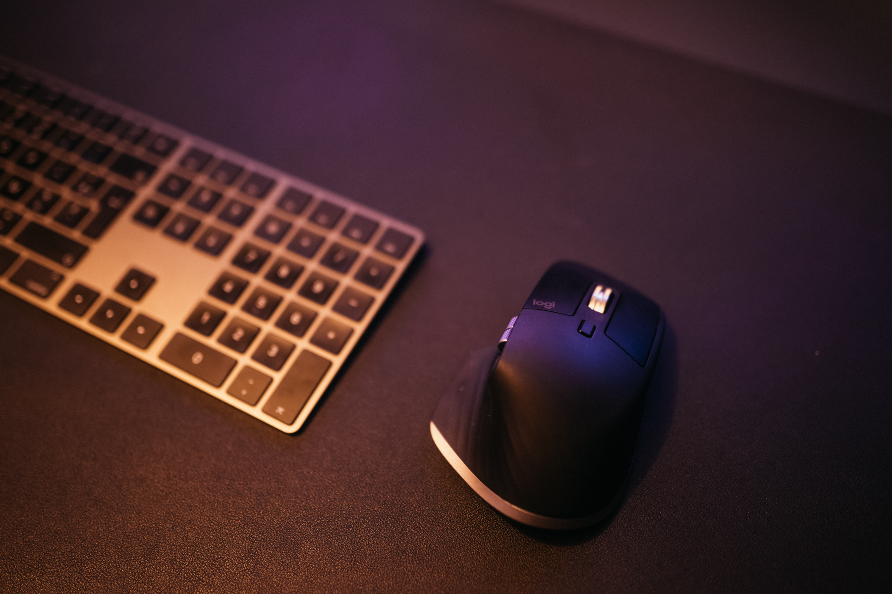

Oui, j'ai décidé d'utiliser un Mac mini pour le montage vidéo, je vous explique pourquoi, quel est mon usage et quel matériel j'ai décidé d'acheter pour remplacer mon iMac 5K 2017 que j'utilisais jusqu'alors.

_Disclaimer : Cet article contient des liens affiliés Amazon, qui ne vous coûtent pas plus cher mais me permettent de toucher une commission si vous achetez l'un des produits mentionnés dans l'article. Je participe au Programme Partenaires d’Amazon EU, un programme d’affiliation conçu pour permettre à des sites de percevoir une rémunération grâce à la création de liens vers Amazon.fr_

## Mon usage et ce que je recherche

J'utilise Final Cut Pro X pour le montage. J'édite des vidéos qui vont d'1 minute pour les réseaux sociaux à des documentaires de 52 minutes, je ne cherche pas à faire de transition avec After Effects, mes montages restent relativement simples mais avec une gros focus sur l'étalonnage, donc je peux vite me retrouver avec plusieurs effets couleurs appliqués, du grain, Filmconvert... et si je n'ai pas besoin d'une ressource pour faire de la 3D ou des animations After Effects, j'aime pouvoir éditer mes images filmées en 4K et en 10bits sans trop galérer et avoir un playback fluide quand j'édite.

L'iMac 5K 2017 m'a convenu parfaitement, j'adore cette machine, mais depuis que [j'ai quitté Sony pour Panasonic en matériel vidéo](http://jeremyjanin.com/matos-photo-video-pourquoi-jai-quitte-sony-pour-le-panasonic-s1) et que j'édite des images filmées en 4K et en 10bits, j'ai noté un vrai ralentissement des performances dans FCPX. J'allais être limité en terme d'upgrade dans l'iMac et cherchais donc à changer. Un iMac Pro et un Mac Pro étaient clairement hors budget et l'idée de passer à un setup avec 2 écrans me séduisait. Je voulais aussi une bonne connectique USB-C et Thunderbolt 3, puisque la quasi totalité de mes périphériques sont compatibles.

### Point historique :

Avant d'acheter mon iMac 5K 2017, j'avais tenté l'expérience de repasser sur une config maison en construisant un PC avec une grosse config, attiré par la possibilité de customisation qu'offrait les PC à moindre coût comparé au Mac. Finalement, au bout de quelques mois, je ne me m'y faisais pas et l'écosystème Apple et MacOS me manquait. Je ne suis pas du genre à débattre PC vs. MAC, je pars du principe que chacun utilise ce qu'il veut pour des raisons qui leurs sont personnelles. Après 2 ans sur l'iMac, j'ai eu envie de gagner en performance mais aussi en possibilité de customisation de mon setup (relative pour un mac). J'ai donc décidé d'utiliser un Mac mini pour le montage vidéo.

## Mon setup Mac mini 2020 pour le montage vidéo

J'ai opté pour le modèle early-2020 qui permet d'avoir un SSD 256Go de base sans option mais j'ai upgradé d'office pour avoir le meilleur processeur disponible pour le Mac mini (Core i7 3,2Ghz avec turboboost jusqu'à 4,6GHz) et construit mon setup autour de ça. J'ai pris la version de base en 8Go de ram, puisque je possédais déjà 2 barrettes de ram DDR4 en 32Go compatibles avec le Mac mini. J'allais donc faire l'upgrade ram moi-même.

J'ai acheté ce Mac mini quelques jours avant la sortie des nouveaux M1 mais ai décidé de ne pas renvoyer le mien car j'avais besoin des 4 ports Thunderbolt, et que je préfèrais laisser passer la première génération de M1, pour voir ce qu'Apple nous concocte aussi pour sa gamme à l'avenir. J'ai aussi une config qui aujourd'hui tourne parfaitement et qui tournera parfaitement pendant un bon petit moment.

Je me suis ensuite lancé dans la manipulation d'upgrader la ram, avec le toolkit iFixit que je ne regrette pas d'avoir acheté car il a été hyper pratique tout au long du processus. J'ai suivi ce tuto pas à pas que je trouve très clair et hyper complet.

Comme je l'ai dit plus haut, je souhaitais aussi passer à un setup double moniteur, avec comme choix principal de ne pas dépasser le 25" pour garantir une bonne uniformité de couleurs et une dalle homogène, des bords ultra fins pour une question d'esthétique et une dalle IPS. Je ne souhaitais pas un écran ultravide, qui sont certes esthétiques, mais dont j'ai plus de doutes sur l'homogénéité de la dalle et les couleurs. J'ai donc comparé les différentes options et mon budget, et j'ai fini par prendre 2 moniteurs [DELL U2520D](https://amzn.to/37iphOE), qui me semblent être le bon compromis.

Pour faire tourner ces 2 moniteurs de manière fluide et booster les performances du Mac mini pour le montage vidéo, j'ai ajouté un eGPU. J'ai opté pour l'eGPU [RAZER CORE X](https://amzn.to/35O5VQI) que j'ai couplé à une carte graphique [ZAPPHIRE RADEON 580 RX 8Go](https://amzn.to/35Wtoiu). L'avantage c'est qu'à terme, je pourrai upgrader la carte graphique si à terme j'en ressens le besoin.

Pour les périphériques, j'ai opté pour le clavier Apple avec pad numérique en gris sidéral et pour la souris, j'ai eu un énorme coup de coeur pour la très célèbre Logitech MX MASTER 3 pour mac. J'ai toujours utilisé les Magic Mouse que je trouve très minimaliste et sublime, toutefois, j'ai décidé de tenter la [MX MASTER 3](https://amzn.to/3mFAaQD) après l'avoir vu utilisée de partout sur internet. Quel coup de coeur. Je ne pensais pas pouvoir dire ça d'une souris un jour, mais c'est assurément l'un de mes meilleurs achats tech depuis des années.

Enfin, j'ai complété le setup avec des lampes Philips Hue Play, non pas pour transformer mon bureau en discothèque à coups de couleurs néons horribles mais juste pour jouer avec les teintes de blancs derrière l'écran et au plafond, pour ajuster la luminosité au fil de la journée et réduire la fatigue des yeux.

## Ma config Mac mini pour le montage vidéo en bref

[**Apple Mac mini 2020** ](https://amzn.to/3mEu5nu) Core i7 3,2 GHz (Tubo Boost jusqu'à 4,6 GHz) / SSD 256Go / 32Go de RAM ([Crucial DDR4 32Go 2666MT/s](https://amzn.to/37o0LM3)) **Ecrans** [Dell U2520D](https://amzn.to/37iphOE) **eGPU** [Razor Core X](https://amzn.to/35O5VQI) **Carte graphique** [SAPPHIRE RADEON RX 580 8Go](https://amzn.to/35Wtoiu) **Clavier** [Apple numérique Gris Sidéral](https://amzn.to/3mKYWyX) **Souris** [Logitech MX Master 3 pour Mac](https://amzn.to/3mFAaQD) **Casque** [SONY MDR-7506](https://amzn.to/2Gh5ohm) **Enceinte de monitoring** [Mackie CR](https://amzn.to/3oLCWWq)

## Mon coin bureau

Cette nouvelle config est venue avec le fait aussi que je souhaitais entièrement repenser mon coin bureau. Je travaille toute l'année depuis bientôt 10 ans de chez moi, donc aménager cet espace est primordial pour moi. Je voulais une peinture sombre pour être plus immergé dans l'editing et que ça soit plus reposant et agréable que la peinture blanche. L a peinture blanche reflétait aussi la couleur des différentes sources de lumières qui m'entourent et me faussait ce que je voyais à l'écran comme couleur. On a donc opté pour une peinture "Down Pipe" de chez _Farrow & Ball,_ qui se marie hyper bien à mon bureau _Ikea Linnmon_ et ses pieds TipToe. Cette ambiance gris foncé / sombre correspond vraiment à ce que je recherchais. La peinture étant matte et donc sujette aux traces, j'ai découpé une planche de medium de la hauteur et largeur de bureau, que j'ai peinte avec la même peinture que le mur et que j'ai plaqué entre mon bureau et le mur. Ça me permet d'éviter d'abimer la peinture du mur si je mets des coups de pieds dedans en changeant de position sur la chaise par exemple. Si c'est le cas, je toucherais alors la planche à laquelle je ne tiens pas, contrairement au mur.

Je voulais mettre un pied double moniteur, mais j'ai découvert comment était fait mon plateau de bureau Ikea et tout le monde déconseille donc je vais rester avec les deux pieds d'origine. C'est un petit peu moins minimaliste que je l'espérais mais je m'y suis fait et moins, je n'ai rien à craindre. C'est un peu serré sur la longueur puisque mes enceintes de monitoring rentrent pile poil à côté des écrans. Les anneaux verts n'ont jamais été à mon goût sur ces enceintes, je vais vraisemblablement les ouvrir pour sortir les anneaux et les repeindre en noir. J'ai également mis un switch audio scratché sur le côté de l'enceinte pour pouvoir contrôler en un bouton si je veux que le son sorte sur mes enceintes ou sur mon casque. nfin, sur mon enceinte droite, j'ai placé un chargeur sans fil pour mon iPhone que je n'ai qu'à poser dessus pour qu'il se charge. Ça me fait un cable en moins qui traine sur le bureau et ça tient mon téléphone légèrement à l'écart de mon champ de vision, pour ne pas être tenter de le regarder trop souvent ni de réagir à la moindre notification.

J'avais peur que les [Philips Hue Play](https://amzn.to/2VjUg7d) posée derrière mes écrans soient un peu gadget, c'est en fait devenu indispensable pour moi et m'aide à réduire la fatigue des yeux. Le fait de pouvoir ajuster la luminosité est en fait quelque chose que je fais tous les jours et dont je ne pourrais plus me passer.

L'énorme avantage aussi de mon bureau c'est que la porte à ma droite renferme un placard dans lequel sont stockés tout mon matos vidéo / outdoor / box internet / NAS et eGPU. J'ai donc percé la cloison pour faire passer les cables du mac mini vers l'eGPU qui est renfermé dedans et les cables pour les écrans. Ça me permet de ne pas avoir l'eGPU dans les pattes quand je suis à mon bureau. J'ai utilisé un [cable Thunderbolt 3 CHOETECH actif de 2m](https://amzn.to/3fTL3Mm) qui me permet d'assurer le débit de 40Gbps sur toute la longueur.

## Le cable management

En parlant de cable, je m'étais vraiment challengé pour le _cable management_, je souhaitais quelque chose de vraiment propre où rien ne dépasse. J'ai tendance à vite m'éparpiller sur mon bureau en commençant à poser des disques durs par ci et par là, donc je savais qu'avec ce nouveau setup, je voulais que tout soit organisé pour que ça n'arrive plus. Aujourd'hui, je suis content d'annoncer que ça fonctionne parfaitement car tout est à sa place et je n'ai donc rien à poser n'importe où. J'ai aussi ajouté un chargeur sans fil pour mon iPhone, ce que je croyais gadget se révèle en fait être hyper pratique et ça me permet au passage de "ranger" mon téléphone pendant que je travaille.

Voici en détail comment j'ai fonctionné pour le cable management :

J'ai une multiprise parafoudre 6 prises collée au double face sous le bureau où je branche tous mes appareils :

- 1x alimentation du Mac Mini
- 2x alimentations des écrans DELL
- 1x alimentation pour mes enceintes de monitoring
- 1x prise [Aukey USB-C Power Delivery 3.0](https://amzn.to/3qgBHPL) pour assurer les performances maximales du [chargeur sans fil de mon iPhone](https://amzn.to/3lsiarM)
- 1x alimentation pour mes lumières [Philips Hue Play](https://amzn.to/2VjUg7d)

Après l'alimentation, il y-a aussi et surtout la partie connectique. J'ai également guidé tous les cables sous le plateau du bureau avec des passes cables adhésif. Tous mes ports Thunderbolt sont utilisés de façon différentes, et uniquement avec des cables qui assurent le débit maximum des ports Thunderbolt 3, même si tous mes périphériques n'en tirent pas pleinement partie (notamment le SATA qui plafonne à 6Gbps). Pour faire tout mon cable management, j'ai utilisé une goulotte que j'ai collé au pied arrière droit de mon bureau, proche de la cloison de mon placard où tous mes cables passent à la verticale pour remonter sous le bureau, et j'ai également collé 2 dans la longueur sous le bureau pour faire passer tous mes cables :

- 1x [Thunderbolt 3 actif de 2m CHOETECH](https://amzn.to/3fTL3Mm) qui part vers l'eGPU qui lui même alimente avec 2 [cables Display Port](https://amzn.to/36r019H) pour les 2 écrans
- 1x Thunderbolt 3 vers mon lecteur de carte mémoire que j'ai collé avec des 3M Command sur la façade avant de mon bureau
- 1x Thunderbolt 3 vers mon SSD de terrain et de montage SanDisk Extreme, lui aussi placé en façade du bureau
- 1x Thunderbolt 3 vers un [adaptateur SATA pour mes SSD de stockage](https://amzn.to/37rl0bw) quand j'édite des projets
- 1x Ethernet qui part vers mon répéteur WiFi Netgear Orbi situé dans le meuble String à ma gauche

Le matériel qui m'a bien aidé pour le cable management :

[Attaches cables adhésifs](https://amzn.to/37DryEr) [Goulotte adhésive noire](https://amzn.to/3qoMKqj) [Double face 3M](https://amzn.to/39wZIMj) [Languette adhésive 3M Command](https://amzn.to/3qb7NMR) [Serre-cable velcro UGREEN](https://amzn.to/3luUXoR)

## Mon expérience avec le Mac mini 2020 pour le montage vidéo

Après plusieurs semaines d'utilisation, je suis ra-vi. Pour mon workflow, je n'édite pas mes projets directement depuis le SSD interne. J'ai un NAS avec l'ensemble de mes données personnelles dedans, pour le côté pro j'ai un SSD d'archives par projet dans lequel je stock mes rushes. Je monte mes vidéos depuis le SSD SanDisk Extreme 1To (qui est aussi mon disque de terrain) et y copie les rushes dont j'ai besoin pour chaque projet. Quand j'ai fini, je copie mes fichiers projet et exports dans le dossier d'archives comme ça je peux tout retrouver facilement. Editer depuis le SSD Extreme me permet de ne pas saturer le disque interne de mon Mac Mini pour le montage vidéo.

Ma config tourne encore mieux que l'iMac, je peux éditer et lire mes projets 4K dans Final Cut Pro X à pleine résolution et en choisissant la qualité de prévisualisation la plus élevée de manière fluide, sans que ça ne rame ou plante. J'édite des images en 4K 10bits de mon [Panasonic S1](http://jeremyjanin.com/matos-photo-video-pourquoi-jai-quitte-sony-pour-le-panasonic-s1) et du [Fuji XT-3](https://amzn.to/2HUP5Yo) de Greg pour nos projets communs, ainsi que les fichiers 10bits du [Mavic 2 Pro](https://amzn.to/3mrADGq). Tout ça avec des effets de colorimétrie appliqués dessus, comme Filmconvert par exemple. Tout est fluide et terriblement efficace. Un vrai gain de rapidité et de confort d'utilisation. Je n'ai aucun bug lié à l'eGPU comme on peut lire parfois sur internet. Je ne suis pas un expert des benchmarks comme on peut en trouver partout sur YouTube. Mais de mon expérience, ce setup est plus agréable à utiliser que mon iMac puisque je ne subis aucun ralentissement dans mon workflow et c'est bien ça que j'attendais.

Question performance, les 32Go de ram sont un vrai gain en performance et couplé à l'i7 et à l'eGPU, je ne rencontre aucun ralentissement même en étant sur FCPX avec Lightroom, Photoshop et Chrome allumé. Je suis d'ailleurs en train de switcher vers Safari petit à petit, sur les conseils avisés de [Greg](https://gregorymignard.com/), pour la partie internet.

Je suis devenu fan du setup à deux écrans, c'est hyper confortable à utiliser et la dalle matte est vraiment agréable. J'aime leur rendu couleur et cette impression de moins fatiguer des yeux. Avec l'iMac j'avais un écran 5k, avec les DELL je suis passé à du 2K (2560x1440) et si je vois la différence de finesse de détails sur le texte, pour tout le reste je m'y suis totalement habitué sans avoir la moindre impression d'avoir quelque chose de moins bon. Ce choix s'est fait notamment car il n'est pas évident de trouver des écrans 4K en 24", il y-en a, mais tous ne répondaient pas à mes critères. Enfin, mon iMac 5K était en réalité utilisé en 2560x1440 de toute manière donc la différence reste faible. Si je veux regarder en 4K, je peux lire mes vidéos une fois exportée directement sur ma TV 4K et tirer le meilleur de mon image assis depuis mon canapé.

En terme de périphériques, la souris Logitech est officiellement validée et je ne me vois absolument pas revenir en arrière, même pour moi le grand fan de la magic mouse.

C'est article est déjà assez long et je pense qu'il couvre une bonne partie de ma config. J'ai hâte de peaufiner les derniers détails comme la chaise, la déco etc... mais ça prend forme et d'un point de vue config, ça ne bougera pas. Toutefois, si vous avez des questions, n'hésitez pas.
