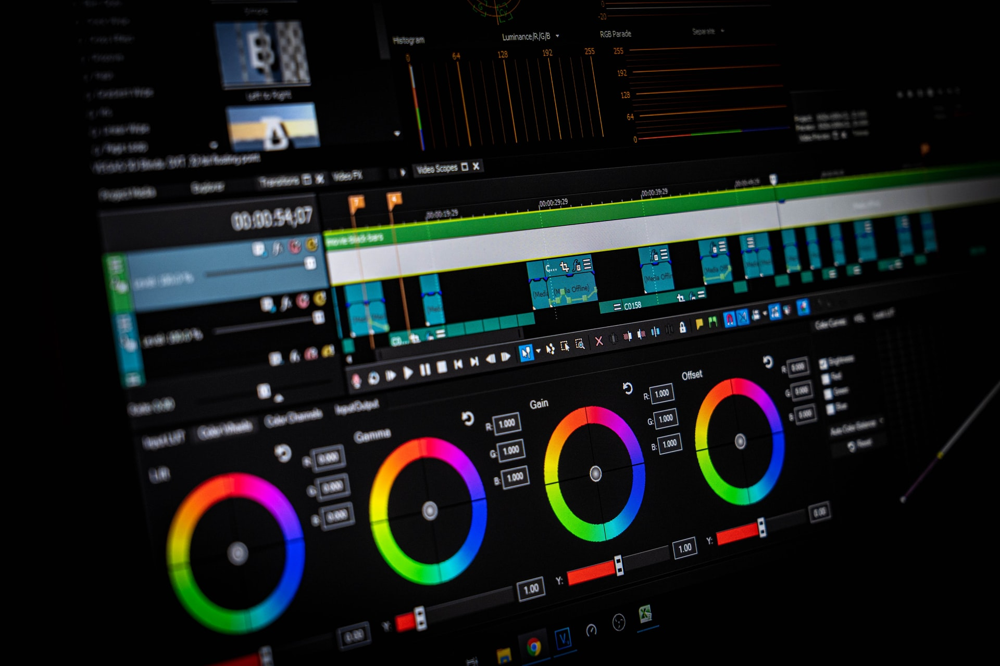
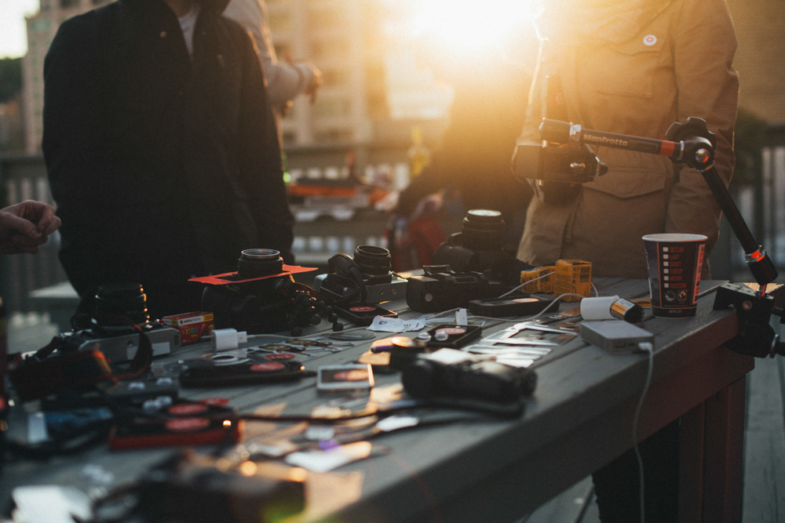
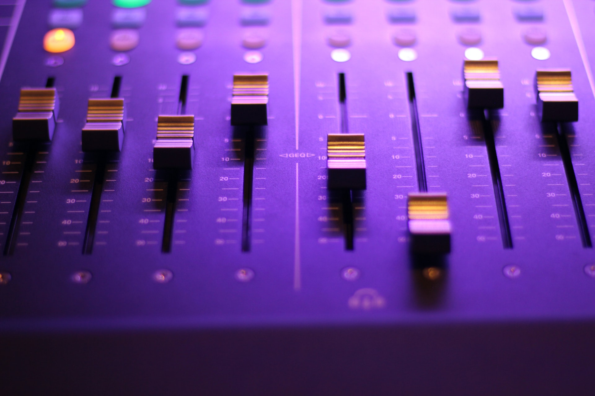

Les copyrights musicaux sur les plateformes vidéos ont amené de nombreuses personnes à se poser la question : **YouTube ou Vimeo ?** Quels sont les risques encourus ? Quelles sont les solutions ? J'ai fait partie de ces personnes là, et j'ai fait mon choix, mais voici un article que je vais tâcher de rendre aussi complet et clair que possible pour expliquer comment fonctionnent les copyrights musicaux sur les deux grandes plateformes vidéos, les différences entre YouTube et Vimeo, les risques encourus et les solutions pour pouvoir continuer à mettre des musiques sur ses vidéos sans devenir hors la loi. J'aborde ici essentiellement dans cet article l'utilisation de musiques pour une vidéo personnelle avec publication sur l'une de ces plateformes vidéos, il va de soi que toute vidéo à but commercial (ou dont on toucherait un revenu grâce à celle-ci) est un autre registre et mérite une compensation financière.

( _A noter : je ne suis pas avocat et les propos que je tiens dans cet article sont uniquement ici à titre d'information et je ne saurais en aucun cas être tenu pour responsable d'un quelconque problème en lien avec les copyrights et ne saurais être considéré comme un quelconque représentant légal. Mes propos sont uniquement le fruit de mes recherches faites sur différents sites pour tenter d'éclaircir le sujet, mais si le moindre questionnement persiste, je recommande de prendre contact directement avec un avocat spécialisé, dont la parole fera foi._ )

### **LES DROITS D'AUTEURS**

Lorsqu'on est vidéaste, la musique et le son occupent une place prépondérante dans le résultat final, aussi, souvent on a tendance à utiliser des musiques qui nous plaisent pour habiller nos images, mais bien souvent ces musiques qui nous plaisent, ne sont pas libres de droits. Que l'on mette une musique d'un film, qui est passée à la radio ou que l'on a découvert au hasard, **la paternité du fichier qu'il soit audio, photo ou vidéo, revient à son créateur**. La paternité musicale revient à l'artiste qui l'a crée. Tout comme un photographe conserve sa paternité sur sa photo puisque c'est lui qui a appuyé sur le déclencheur, ou encore un vidéaste sur ses clips et sa vidéo. Aussi, là où nous serions choqués / déçus / énervés / désabusés (rayez la mention inutile) de voir nos images utilisées sans crédit et sans autorisation préalable, il en va de même pour l'artiste qui a composé sa musique. Alors, pour pouvoir continuer à mettre en ligne et partager nos images tout en étant en règle, voici un petit tour d'horizon de la conception de Copyright chez YouTube et Vimeo.

Dès l'inscription d'un compte sur l'une de ces deux plateformes, on coche une petite case (que souvent on ne lit pas) qui dit "_J'accepte les termes et conditions_" et dans ces fameux "termes et conditions", il est écrit noir sur blanc que quiconque qui mettra en ligne une vidéo ne doit enfreindre aucun copyright, sous peine de sortir des limites de la loi.

**Dans tous les cas, utiliser une musique sur une vidéo sans obtenir l'autorisation écrite de l'artiste, constitue une infraction au copyright et donc place l'utilisateur en faute, vis à vis du créateur.**

Pour savoir en détails en quoi consistent les droits d'auteurs, YouTube y a consacré une page entière très claire qui permet d'élucider bon nombre de questions à ce sujet. ([lien](https://support.google.com/youtube/answer/2797466?hl=fr))

Comme l'explique la plateforme vidéo de Google, une vidéo peut quand même être accusée de non respect des droits d'auteurs, même si vous avez :

- **attribué la paternité de l'œuvre** au titulaire des droits d'auteur ;
- **évité de monétiser** la vidéo incriminée ;
- **trouvé des vidéos similaires** sur YouTube ;
- **acheté le contenu** sur iTunes, ou sous forme de CD ou de DVD ;
- **enregistré le contenu vous-même** à partir d'une diffusion télévisée, cinématographique ou radiophonique ;
- **ajouté une mention de type "toute atteinte aux droits d'auteur n'est pas intentionnelle".**

_[(source)](https://support.google.com/youtube/answer/2797466?hl=fr)_

À NOTER : En aucun cas, le fait d'acheter la chanson sur iTunes ou autre plateforme ne constitue une autorisation d'utilisation du dit morceau. Et en aucun cas, le fait de créditer un artiste dans la vidéo ou en description de vidéo ne donne l'autorisation d'utilisation du morceau. Il faut impérativement un accord écrit de l'artiste.

## LES SOLUTIONS PROPOSÉES PAR YOUTUBE ET VIMEO POUR DÉCELER LES INFRACTIONS DE COPYRIGHT.

### **\+ YouTube**

Votre vidéo peut être supprimée par YouTube s'ils reçoivent une [notice de retrait](https://support.google.com/youtube/answer/6005900) (takedown notice) de la part de l'artiste ou du label, ou de quiconque ayant la paternité sur la musique utilisée et souhaitant la revendiquer et affirmer ne pas avoir donné d'autorisation pour l'utilisation du morceau.

YouTube a également mis un place un outils appelé "Content ID" qui permet aux artistes d'envoyer à YouTube leurs oeuvres que la plateforme vidéo stocke dans une base de donnée et qui analyse les contenus publiées sur le site pour voir s'il y a des résultats correspondants. La base de données contient plus de 3 millions de fichiers (2010). Si un résultat est trouvé, l'artiste est informé et alors plusieurs choix sont possibles :

- Mettre en "muet" la bande son des vidéos qui utilisent ce morceau
            - Bloquer la vidéo
            - Monétiser la vidéo avec des publicités
            - Avoir accès aux statistiques de la vidéo (pour prendre des mesures ensuite)

Pour en savoir plus sur le fonctionnement du _Content ID_, je vous invite le très bon article de YouTube sur le sujet. ([lien](https://support.google.com/youtube/answer/2797370?hl=fr))

### **\+ Vimeo**

Jusqu'à présent Vimeo n'avait pas d'outil spécial pour faire face à l'infraction de Copyright. Il était également écrit dans les régles de la communauté et termes et conditions que chaque utilisateur doit accepter à la création du compte, que l'on ne doit pas utiliser des oeuvres dont l'utilisateur n'a pas l'autorisation d'utiliser ou reproduire.

Depuis peu, au moment où j'écris ces lignes, Vimeo a mis en place un outil qui permet de scanner les vidéos lors de leurs mises en ligne : _Copyright Match_, et d'analyser une immense banque de données, en l'occurence ici, la bibliothèque d'Audible Magic. Ainsi, lorsqu'une vidéo est mise en ligne, Copyright Match scanne une partie de la bande de son de la vidéo, un peu sur le même procédé que Shazam quand on cherche à connaître une chanson, et la compare avec tout le catalogue musical présent dans la bibliothèque, 3 résultats sont alors possibles :

- Si la musique n'est pas reconnue dans la bibliothèque (artiste peu célèbre, etc...) la vidéo pourra tout de même être mise en ligne et ne sera donc pas prise dans les mailles du filet du Copyright Match, néanmoins si vous n'avez pas d'autorisation d'utilisation du morceau, vous courez toujours le risque de recevoir une notice de retrait de la vidéo si l'artiste trouve votre vidéo et affirme ne pas vous avoir autorisé à utiliser le morceau.
- Si le morceau est reconnu par Copyright Match, Vimeo vous demandera alors de fournir une preuve comme quoi l'artiste vous aura fourni une autorisation écrite d'utilisation du morceau sur la vidéo. Si vous n'êtes pas en mesure d'en fournir, vous aurez alors le choix de supprimer la vidéo ou alors de la remettre en ligne avec une nouvelle musique que vous aurez le droit d'utiliser.
- Si Copyright Match reconnait votre bande son dans son catalogue et que vous êtes en mesure de fournir l'autorisation de l'artiste, alors Vimeo vous demandera le document et votre vidéo pourra rester en ligne et être partagée sans craindre aucun risque, puisque l'autorisation de l'artiste fonctionne comme un contrat entre deux parties.

## **QUE DIT LA LOI ? QUELS SONT LES RISQUES ?**

Selon le code de la propriété intellectuelle ( [à lire en entier ici](http://www.legifrance.gouv.fr/affichCode.do?cidTexte=LEGITEXT000006069414&dateTexte=20140629) ) :

**Article L-122-4**

Toute représentation ou reproduction intégrale ou partielle faite sans le consentement de l'auteur ou de ses ayant droit ou ayant cause est illicite. Il en est de même pour la traduction, l'adaptation ou la transformation, l'arrangement ou la reproduction par un art ou un procédé quelconque.

**Article L335-2**

Des peines encourues pour le non respect du droit d'auteur :

Toute édition d'écrits de composition musicales, de dessins, de peinture ou toute autre production imprimée ou gravée en entier ou en partie, au mépris des lois et règlements relatifs à la propriété des auteurs, est une contrefaçon. toute contrefaçon est un délit La contrefaçon en France d'ouvrages publiés en France ou à l étranger est punie de deux ans d'emprisonnement et de 300.000 euros d'amende seront punis des mêmes peines le débit, l'importation et l'exportation d'ouvrages contrefaits

**Article L335-3**

Est également un délit de contrefaçon toute reproduction, représentation, ou diffusion, par quelque moyen que ce soit, d'une oeuvre de l'esprit en violation des droits de l'auteur, tels qu'ils sont définis et réglementés par la loi.

**Article 335-4**

Est punie de deux ans d'emprisonnement et de 300.000 euros d'amende toute fixation, reproduction, communication ou mise à disposition du public, à titre onéreux ou gratuit, ou toute télédiffusion d'une prestation, d'un phonogramme (enregistrement sonore), d'un vidéogramme (oeuvre audiovisuelle) ou d'un programme, réalisée sans l'autorisation, lorsqu'elle est exigée, de l'artiste interprète, du producteur de phonogramme ou de vidéogramme ou de l'entreprise de communication audiovisuelle Est punie des mêmes peines toute importation ou exportation de phonogrammes ou de vidéogrammes réalisée sans l'accord du producteur ou de l'artiste interprète, lorsqu'elle est exigée.

## QUELLES SONT LES SOLUTIONS ?

Pour ne pas avoir de problème lors de la mise en ligne de vidéos sur internet, nous avons toutefois recourt à plusieurs solutions. Tout d'abord, vous pouvez contacter l'artiste qui vous intéresse en lui parlant de votre projet d'utilisation de l'un de ses morceaux pour l'une de vos vidéos personnelles avec une diffusion sur internet, en lui demandant son autorisation écrite. Si l'artiste vous répond (ce qui arrive régulièrement avec des groupes qui n'ont pas encore éclaté au grand jour) dans ce cas, assurez-vous de bien couvrir tous les besoins que vous avez : _autorisation d'utilisation de la musique sur votre vidéo personnelle avec autorisation de diffusion sur une plateforme vidéo telle que YouTube et Vimeo._ Dans le cas où votre vidéo serait à but commercial, il va s'en dire qu'il faudra le stipuler et prévoir une rémunération. Si l'artiste ne répond pas, ou que vous préférez trouver une autre solution, de nombreux sites proposent des bibliothèques de musiques avec licences Creative Commons (vous permettant d'utiliser un morceau sous certaines conditions mais sans frais.) le plus connu en France est certainement [Jamendo](http://www.jamendo.com/fr/).

### * * *

## MA SOLUTION PRÉFÉRÉE : ARTLIST

J'utilise depuis près d'1 an le site **Artlist**, plus fraichement arrivé dans le milieu comparé à Music Bed, mais qui pour moi, est la meilleure option pour l'heure. _The Music Bed_ reste un peu plus haut de gamme en terme de musique pour certains projets mais son prix est lui aussi beaucoup plus élevé. Artlist correspond à 98% de mes besoins en vidéo et c'est celui que j'utilise pour toutes mes productions personnelles, comme pour [Captain Yvon](http://captainyvon.fr). Le concept m'a séduit tout de suite, on paie 199$ / an **(environ 170€ / an)** et on a accès illimité au catalogue en ligne et avec **tous les droits d'utilisation (usage commercial inclus)**. Les musiques sont qualis, il y-en a pour tous les goûts et le site est vraiment bien fait.

Si vous décidez de vous inscrire à ce service (et je ne suis aucunement rémunéré pour dire ça, je ne suis même pas en contact avec Artlist) mais j'ai un code parrainage qui vous offre 2 mois d'inscription gratuite en plus de votre abonnement. Ca vous tente ? Voici le lien pour [**s'abonner à Artlist.**](http://bit.ly/ArtlistCaptainYvon)

### * * *

Vous pouvez également utiliser d'autres banques de musiques en ligne, c'est une somme, mais cela permet aussi de mieux trier les vidéos qu'on va mettre en ligne tout en étant certain de ne pas contourner la loi et donc de ne pas s'exposer à un quelconque risque, car les dégâts seraient beaucoup plus importants que quelques dizaines d'euros en cas de recours en justice.

Il y a assurément de nombreux autres sites comme Music Bed, Epidemic Sound, j'ai néanmoins abordé mes solutions favorites et à mon sens les plus qualitatives en terme de choix / qualité des résultats dans les catalogues des bibliothèques musicales concernées tout en conservant un buget contenu.
